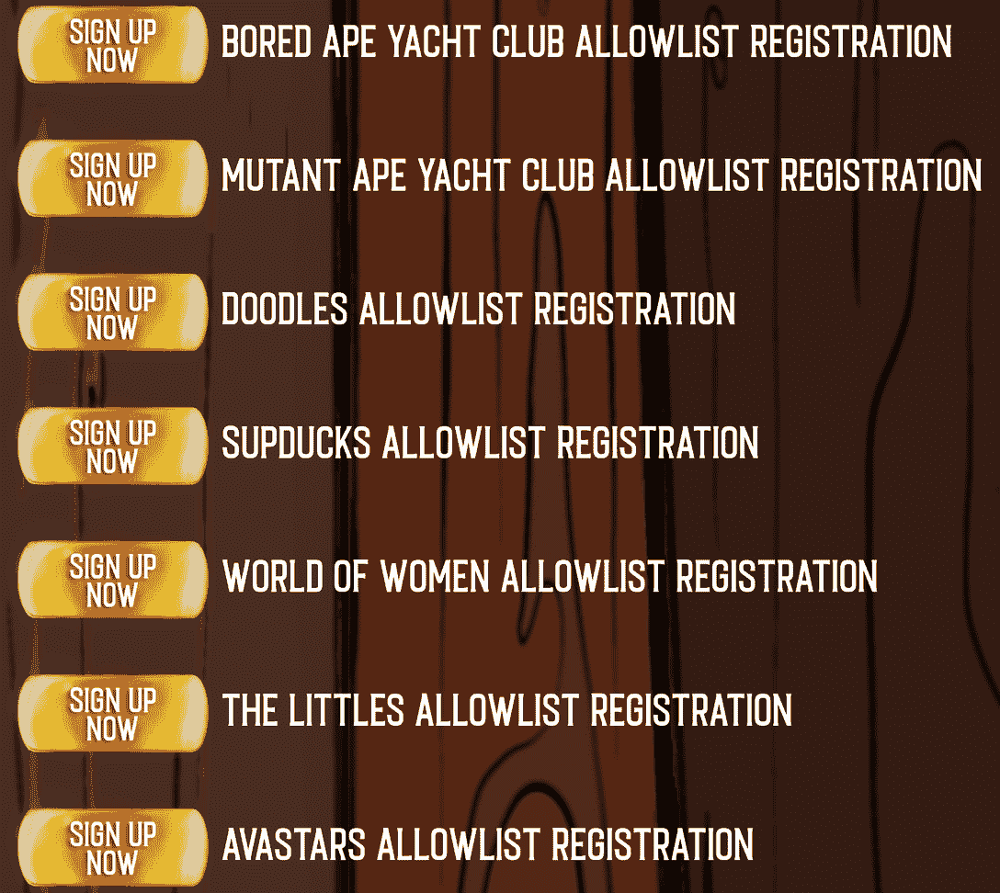

# 熊市推动 BAYC 音乐集团王权推迟首次 NFT 下跌

> 原文：<https://web.archive.org/web/https://dappradar.com/blog/bear-market-pushes-bayc-music-group-kingship-to-delay-first-nft-drop>

## 投放的允许列表仍然开放，但是没有投放日期的细节

**Kingship 于 2021 年 11 月 11 日来到 crypto space，作为第一个由 NFT 人物组成的音乐团体。无聊的猿四重奏产生了很多宣传和兴奋，他们的第一次 NFT 释放应该很快推出。不幸的是，市场的总体状况和强烈的看跌趋势促使 Kingship 推迟了下跌。**

## 总结:

*   Kingship 在推特上宣布他们的第一张 NFT 专辑暂停发行
*   发布的[允许列表注册](https://web.archive.org/web/20220704234700/https://dappradar.com/blog/bear-market-pushes-bayc-music-group-kingship-to-delay-first-nft-drop/#collectors)仍处于开放状态
*   当前的熊市状况是王权决策背后的主要因素

## 王权无限期地暂停了他们的第一次 NFT 空投

第一个 NFT 音乐组合 Kingship 宣布了他们在 NFT 的首张专辑不幸延期发行。该小组由四个钻孔猿 NFT 组成，它们将在即将到来的项目中占据中心位置。

王权是 Bored Ape Yach 俱乐部所有者对知识产权更大胆的运用之一。考虑到对该项目的巨大期望，看到它的第一个产品发布暂停有点令人沮丧。

关于即将到来的 NFT 下降的细节很少，但现在收藏家们甚至没有一个下降日期可以期待。根据官方声明，项目发布日期暂停，没有关于何时可能下降的信息。

从更积极的方面来看，王权也声称已经为衰落做好了充分准备。虽然这是令人鼓舞的，但延迟的主要原因隐藏在加密空间目前正在经历的不利的市场条件中。公告详细说明了王权觉得社区目前还没有准备好接受如此重大的 NFT 下降。希望收藏者将有机会很快看到第一个王权 NFTs，但这主要取决于市场在未来几周和几个月的表现。

## 感兴趣的收藏者仍然可以注册王权 allowlist 的位置

Kingship 已经决定采用 allowlist 方法，当收藏下降时，只让已注册 mint 的钱包使用。虽然《王权 NFT》的发行被推迟了，但感兴趣的收藏者仍然可以在 allowlist 上注册一个位置，这个位置仍然开放。

此外，该组织还为迄今为止一些最受推崇的 NFT 作品的收藏者创建了单独的收藏组。如果你拥有下列收藏中的一件 NFT，你会发现获得一个允许列表的位置更容易。

保持允许列表注册表单开放可能有利于参与，但一些社区成员提出了担忧。一名 Twitter 用户询问，王权如何确保早起的鸟儿比那些因为发布延迟而只能加入 allowlist 的人获得更多额外津贴。该集团尚未解决这些问题，但更多关于新的下降日期，薄荷价格，和其他薄荷机制的细节应该很快就会公布。

## 熊市趋势令 NFT 社区感到恐慌

熊市并不好玩，它代表了传统金融和密码领域的所有方面。不幸的是，NFT 也受到了冲击，尽管其中一些在加密令牌崩溃时被用作可能的对冲选项。

根据 Kingship 的声明，熊市趋势也给整个 NFT 社区带来了负面影响。这促使该集团无限期推迟他们的 NFT 下降。随着收藏者变得越来越害怕，研究小组认为，许多允许收藏者可能无法或可能会停止铸造新的 NFT。这反过来会对整个王权工程产生有害的影响。

王权团体的许多成员对团队的决定表示祝贺，理由是目前市场波动很大。尽管这是一个大胆的举动，但这确实是该项目及其路线图的一个挫折。

DappRadar 将继续监测 NFT 空间，因为看跌趋势席卷了市场的各个方面。但不要绝望；即使在熊市中也有防止损失和最小化风险的方法。看看这些方便的文章，可以更好地帮助你在熊市中导航。此外，你可以在[的 Twitter](https://web.archive.org/web/20220704234700/https://twitter.com/dappradar) 上关注 DappRadar，首先获得最新的 NFT 新闻和更新。

 NewsletterUnsubscribe at any time. [T&Cs](https://web.archive.org/web/20220704234700/https://dappradar.com/terms) and [Privacy Policy](https://web.archive.org/web/20220704234700/https://dappradar.com/privacy-policy)