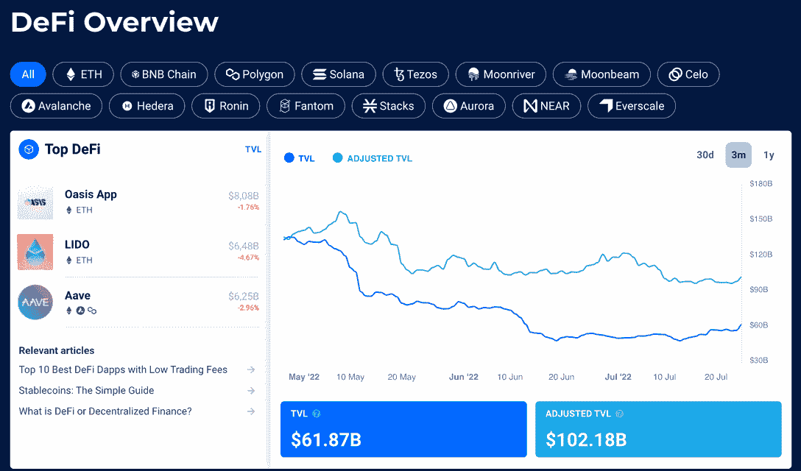

# 什么是 Crypto 中的产量农业？初学者指南

> 原文：<https://web.archive.org/web/https://dappradar.com/blog/beginners-guide-to-yield-farming>

## 了解如何更好地使用加密货币

除非你过去几年一直躲在石头下面，否则你应该听说过“高产农业”这个术语。打击区块链和加密领域的最新炒作泡沫现在闹得沸沸扬扬。但是**什么是产量农业**，人们如何从中受益，真正涉及的风险有多大？这就是这篇文章的全部内容。请继续阅读，了解更多关于 DeFi 策略的信息。

## 什么是产量农业？

收益农业无非是通过赚取投资回报将加密货币资产投入使用。

这种回报是通过所谓的“赌注”过程产生的，加密持有者锁定他们的令牌以获得奖励。这些奖励通常以支付利息或新铸造代币的形式出现。

高产农业和传统投资形式的主要区别在于，高产农民承担额外风险通常会获得高回报。这是因为大多数高产农业机会都在 DeFi 空间，这是众所周知的高度不稳定。

### 什么是 DeFi？

DeFi，或称去中心化金融，是一个建立在区块链基础上的金融协议和应用的不断发展的生态系统。

这些协议和 dapps 提供了广泛的金融服务，这些服务传统上属于中央机构的职权范围，如银行、经纪公司和传统交易所。

[https://web.archive.org/web/20221127150415if_/https://www.youtube.com/embed/Bmo5dXvqYxE?feature=oembed](https://web.archive.org/web/20221127150415if_/https://www.youtube.com/embed/Bmo5dXvqYxE?feature=oembed)

通过使用 DeFi 协议和 dapps，您可以享受与通过中央机构一样的金融服务，而无需信任第三方。

这在实践中意味着，你可以通过去中心化的协议和应用来交易加密货币，获得贷款，并从你的资产中赚取利息。这就是高产农业出现的时候。

## 产量农业是如何运作的？

高产农业的基本过程可以分为四个步骤:

1.  你通过寻找提供高回报的协议找到一个合适的机会；
2.  将您的加密资产存入协议；
3.  获得利息支付或新铸造代币形式的奖励；
4.  退出头寸并收回您的资产。

当然，事情并不总是这么简单。在实践中，为了实现收益最大化，种植者常常不得不在不同的协议中同时兼顾多个位置。

随着 DeFi 领域的不断发展，农民需要变得灵活和适应能力强，以便利用新出现的机会。

## 什么是最好的高产农业协议？

最好的高产农业平台是那些以最小风险提供高回报的平台。不幸的是，不存在无风险的高产农业机会。

有许多“货币市场”和分散交易所(DEX)提供了赚取收益的直接途径。

复合、曲线和 Aave 是一些最先使用和最常用的借贷协议，但具有流动性池的 dex，如 Uniswap 或 [PancakeSwap](https://web.archive.org/web/20221127150415/https://dappradar.com/blog/what-is-pancakeswap-and-how-to-use-it) 上提供的那些，提供了更多的灵活性和更好的收益率。

然而，重要的是要指出，它们也伴随着风险的增加。

## 利用货币市场进行农业生产

[Compound](https://web.archive.org/web/20221127150415/http://compound.finance/) 和 [Aave](https://web.archive.org/web/20221127150415/https://dappradar.com/app/1823/aave) 是 [DeFi 的顶级借贷协议](https://web.archive.org/web/20221127150415/https://dappradar.com/rankings/category/defi)，自 2020 年产量农业首次开始以来，两者都见证了活动的爆炸式增长。

从货币市场借钱是赚取加密货币回报的最简单方式，并且已经被证明是一种受欢迎的方法。

为了参与，用户需要在他们选择的平台上存入稳定的硬币，并立即开始赚取回报。

分散式非托管流动性协议 Aave 为借款人提供了选择稳定利率的能力。而不是可变利率，所以通常能够提供比[复合](https://web.archive.org/web/20221127150415/https://dappradar.com/app/989/compound)更好的利率。

对借款人来说，稳定利率往往高于可变利率，从而增加了贷款人的边际回报。

### 货币市场风险

[DeFi 货币市场](https://web.archive.org/web/20221127150415/https://dappradar.com/rankings/category/defi)通过提供超额抵押来运作。这意味着借款人存放的资产必须比他们的贷款更有价值。

为了计算抵押率，可以使用抵押品价值/贷款价值的等式。

当抵押比率低于某个阈值时，抵押品被清算并偿还给贷款人。这种设置为想要获得杠杆的投机者提供了一个最佳的位置。这也确保了如果借款人违约，贷方不会损失他们的钱。

另一个要考虑的因素是[智能合约黑客](https://web.archive.org/web/20221127150415/https://dappradar.com/blog/25m-taken-in-defi-loan-attack)，但迄今为止，Aave 和 Compound 已经避免了这种风险。

## 使用流动性池

Uniswap 提供了 DeFi 中最好的[流动性池之一。有效地吸引流动性提供者将其资产加入流动性池。需要注意的是，](https://web.archive.org/web/20221127150415/https://dappradar.com/blog/what-is-liquidity-pool-and-liquidity-provider) [Uniswap](https://web.archive.org/web/20221127150415/https://dappradar.com/ethereum/exchanges/uniswap-1) 上的流动性池是在两种资产之间以 50:50 的比例配置的。

每当用户通过 [Uniswap 流动性池](https://web.archive.org/web/20221127150415/http://uniswap.io/)进行交易时，为该池做出贡献的流动性提供商就会因帮助促成交易而获得一定的费用。

过去几年，随着 DEX 交易量大幅增加，Uniswap 池传统上为流动性提供商提供了相当健康的回报。

然而，需要注意的是，优化利润需要投资者考虑非永久性损失的风险。

*   **进一步阅读:** [如何避免在 Crypto 中得到 REKT&DeFi](https://web.archive.org/web/20221127150415/https://dappradar.com/blog/how-to-avoid-getting-rekt-in-crypto-defi)

### 什么是无常的失去？

非永久性损失是为快速升值的资产提供流动性而造成的损失。

在这个行业中，这种事情可能会毫无预兆地发生，而且经常发生。

考虑到这一点很重要，因为它会对流动性养殖的盈利能力产生重大影响。

减轻非永久性损失的关键是仔细选择要汇集在一起的资产。

这可以通过分析资产的历史价格波动性和相关性来实现，以更好地了解哪些资产可以很好地组合在一起。

#### 避免暂时的损失

一个提供流动性池的 dapp 是 [Curve Finance，它通过促进与相同价值挂钩的资产之间的交易来规避非永久性损失。](https://web.archive.org/web/20221127150415/https://beta.curve.fi/?utm_source=DappRadar&utm_content=visit-website)

例如，有一个包含、、戴和 sUSD 的[曲线池:所有钉住美元的稳定曲线](https://web.archive.org/web/20221127150415/https://www.curve.fi/susdv2)。sBTC、RenBTC 和 wBTC 也有一个流动性池:都与 BTC 价格挂钩。因为所有资产的价值都是相同的，所以对用户来说没有不确定的损失。

然而，值得注意的是，交易量将始终低于 Uniswap 等其他流动性池。

总之，曲线融资消除了非永久性损失，但 Uniswap 将导致更高的收费。

### 如何选择加密产量农场？

对于那些厌恶风险、只想从稳定的收入中赚取收益的人来说，货币市场或为曲线融资提供流动性是低风险利息的最佳选择。

对于那些持有大量加密货币并希望将其用于生产用途的人来说，像 [Uniswap](https://web.archive.org/web/20221127150415/https://uniswap.org/) 这样的流动性池是一个不错的选择。

## 产量农业与赌注

收益农业和赌注的主要区别在于，收益农业为分散的交易所提供流动性，而赌注则锁定代币，以帮助验证区块链上的交易。

有了[赌注](https://web.archive.org/web/20221127150415/https://dappradar.com/blog/what-is-crypto-staking-and-how-does-it-benefit-you)，您只需在钱包中放入密码就可以获得奖励，因为您的令牌有助于保护网络。赌注的最大好处是，它是一个相对被动的收入流，因为你不需要做太多，除了把你的密码放在一个支持赌注的钱包里。

另一方面，高产农业要复杂一些。在一天结束时，赌注和产量农业都是用你的密码赚取被动收入的好方法。在你决定哪一个(如果有的话)适合你之前，了解每一个的风险和回报是很重要的。

*   **阅读更多:** [加密领域 5 大最佳被动收入机会](https://web.archive.org/web/20221127150415/https://dappradar.com/blog/top-5-best-passive-income-opportunities-in-crypto)

## 了解更多关于 DappRadar 高产农业的信息

对于任何寻找加密货币机会的人来说，跟上最好的协议和分散的交易所是必不可少的。通过使用 [DappRadar DeFi Overview](https://web.archive.org/web/20221127150415/https://dappradar.com/defi) 工具，您可以查看分散金融行业的排名和分析。在多个链上查找锁定的总价值(TVL)、用户数量和 dapps 的其他关键指标。

在 DappRadar，我们总是报道顶级 DeFi 项目新闻。关注我们的[博客](https://web.archive.org/web/20221127150415/https://dappradar.com/blog/)、 [YouTube](https://web.archive.org/web/20221127150415/https://www.youtube.com/c/DappRadar) 和 [Twitter](https://web.archive.org/web/20221127150415/https://twitter.com/dappradar) ，了解更多信息并在游戏中保持领先。

 NewsletterUnsubscribe at any time. [T&Cs](https://web.archive.org/web/20221127150415/https://dappradar.com/terms) and [Privacy Policy](https://web.archive.org/web/20221127150415/https://dappradar.com/privacy-policy)

## 不是财务建议

***此处提供的信息仅供参考。此信息不作为财务建议，读者理解与 DeFi 和产量农业相关的所有风险由用户自己承担。***