# 行为报告——宏观经济事件加速了加密的采用和监管

> 原文：<https://web.archive.org/web/https://dappradar.com/blog/behavior-report-macroeconomic-events-accelerate-crypto-adoption-and-regulations>

## 随着主流采用的临近，加密用户如何应对最新的宏观事件和市场条件

今年前四个月发生的全球事件为区块链科技呈现了一个独特的场景。俄罗斯对乌克兰的战争造成的全球市场混乱将各种金属和能源商品的价格推高到接近或达到历史最高水平，包括黄金、钯、石油和天然气。地缘政治格局给市场带来了恐惧，导致金融市场的抛售压力，包括加密货币，推动价格下跌。

## 内容

*   [采用和宏观事件加速了加密资产的监管过程](https://web.archive.org/web/20230308141442/https://dappradar.com/blog/behavior-report-macroeconomic-events-accelerate-crypto-adoption-and-regulations/#Adoption-and-macro-events-accelerate-the-regulatory-process-for-crypto-assets-)
*   [DeFi 交易创一年新低，而 NFT 交易数量创历史新高](https://web.archive.org/web/20230308141442/https://dappradar.com/blog/behavior-report-macroeconomic-events-accelerate-crypto-adoption-and-regulations/#DeFi’s-transactions-are-on-a-one-year-low-while-NFTs-and-games-resist)
*   [以太坊外的有机增长](https://web.archive.org/web/20230308141442/https://dappradar.com/blog/behavior-report-macroeconomic-events-accelerate-crypto-adoption-and-regulations/#Organic-growth-outside-Ethereum)
*   全球对 Web3 元宇宙的兴趣持续增长
*   [DappRadar 用户统计数据](https://web.archive.org/web/20230308141442/https://dappradar.com/blog/behavior-report-macroeconomic-events-accelerate-crypto-adoption-and-regulations/#DappRadar-user-demographics)
*   [关闭](https://web.archive.org/web/20230308141442/https://dappradar.com/blog/behavior-report-macroeconomic-events-accelerate-crypto-adoption-and-regulations/#Closing)

## 关键要点

*   乌克兰和俄罗斯在加密采用率较高的国家中排名第一，分别为 12.73%和近 12%。
*   Q1 的 DeFi 交易达到了 2021 年 2 月以来的最低水平，而整个区块链的 1.16 亿 NFT 交易创下了 Q1 2022 年的新纪录。
*   自 2021 年底以来，Avalanche 的交易量翻了一番，而同期以太坊的交易量下降了 8%。
*   基于 Web3 的元宇宙在全球范围内不断增加更多的品牌和爱好者；社会指标证实了全球对这一主题的兴趣。

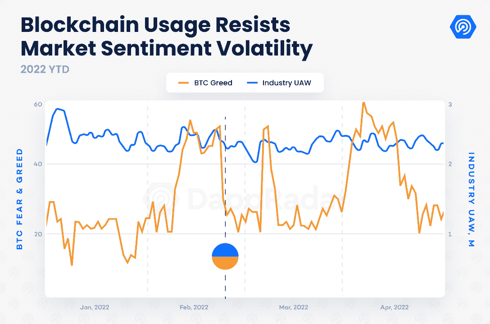

导致理性投资者使用更安全投资工具的恐惧情绪适用于 stablecoins 和比特币等加密货币。因此，BTC 在交易所的主导地位呈上升趋势并不罕见。尽管比特币和其他加密资产仍然高度不稳定，并与资本市场密切相关，但它们提供了一种理想的对冲手段，以应对像 2022 年那样的高通胀时期。Gemini 最近的一项研究显示，通货膨胀率较高的国家最有可能采用加密货币。

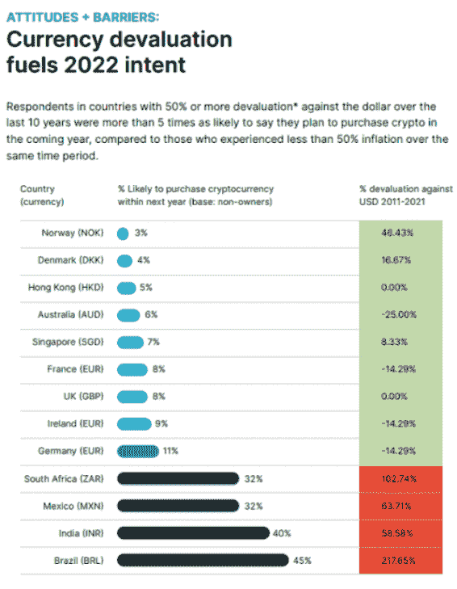

Source: Gemini

由于 Web3 资产的通胀对冲属性和其他优势，尽管全球形势充满挑战，但对区块链应用的需求仍保持稳定。从经济、监管和技术角度来看，对加密资产和 Web3 概念(如元宇宙和即玩即赚)的不可否认的兴趣和需求面临着当今市场的挑战。这份报告基于最新的市场形势剖析了最大的行为趋势。

## 采用和宏观事件加速了加密资产的监管过程

数字资产的采用正在全球蔓延，扩展到 APAC、东南亚和拉丁美洲的不同经济体和地区。

亚洲市场已经经历了高度的数字化，代表了全球人口的 60%。印度是全球最重要的加密市场，拥有 [1 亿加密用户](https://web.archive.org/web/20230308141442/https://triple-a.io/crypto-ownership/)。与此同时，分布在中国 23 个地区[的 12 亿中国人和 7.5 亿活跃用户](https://web.archive.org/web/20230308141442/https://www.china-briefing.com/news/china-launches-digital-yuan-app-what-you-need-to-know/)将开始使用数字 CNY 应用的测试版在电子 CNY 支付日常活动。此外，像菲律宾、越南、泰国和印尼这样的国家仍然是加密应用和区块链游戏活动的领导者。

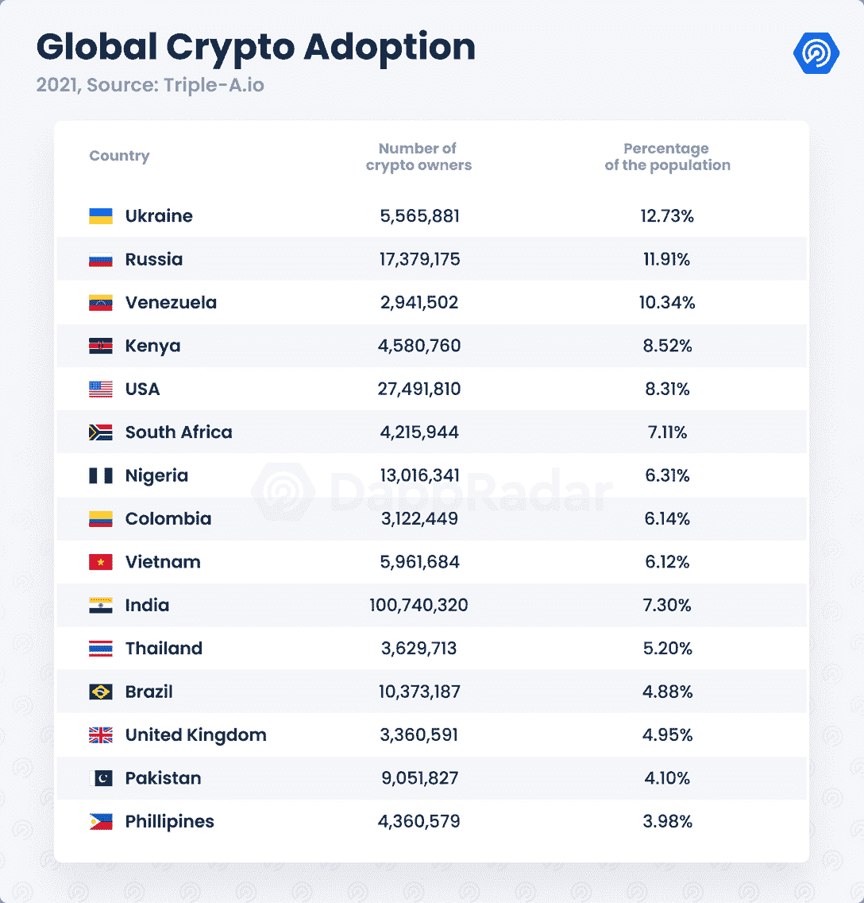

在美洲，美国是第二大加密基地，拥有 2700 万用户。布宜诺斯艾利斯宣布了一项比特币支付税计划，而新兴经济体的采用和监管行动正在增加，包括委内瑞拉、哥伦比亚和巴西。与此同时，英国、葡萄牙、法国和西班牙等欧洲国家对 Web3 的潜力表现出兴趣。但是地缘政治的影响改变了整个局面。

乌克兰是全球加密技术采用率较高的国家之一。即使在战前，乌克兰和俄罗斯也分别以 12.73%和近 12%的比例领先于加密技术采用率较高的国家。然而，当战争开始时，这两个国家的加密活动激增。由于对俄罗斯的制裁，兑换成比特币的卢布数量大幅飙升，而在大多数交易所，BTC/UAH 货币对仍存在溢价。

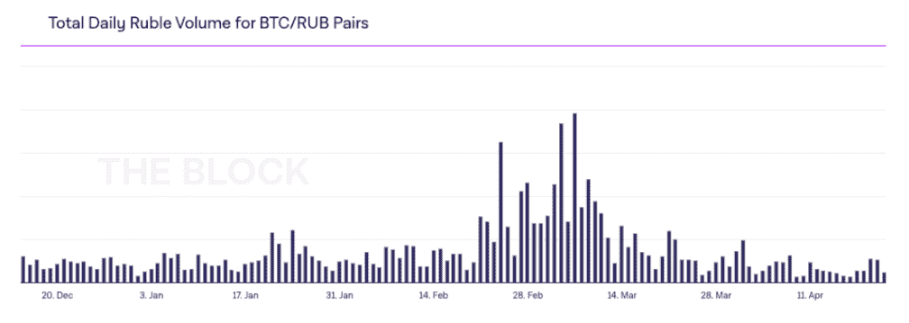

Source: [TheBlock](https://web.archive.org/web/20230308141442/https://www.theblockcrypto.com/data/crypto-markets/spot/total-daily-ruble-volume-for-btc-rub-pairs)

区块链和加密货币的一线希望是它们对社会产生积极影响的潜力。Web3 社区聚集在乌克兰，收集了超过 6000 万美元的加密资产来帮助他们的事业。

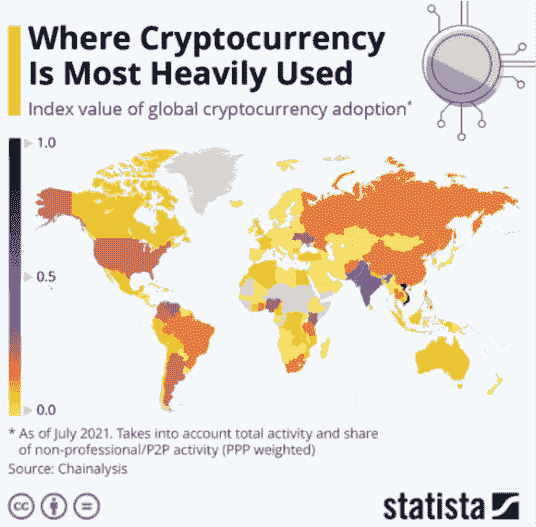

然而，在大规模采用的道路上，加密资产的采用将面临障碍和挑战。不断增长且迫在眉睫的 Web3 人口的技术限制、最近高端加密盗窃的数量，以及俄罗斯或任何其他实体可能使用数字资产来规避法律的可能性，都加速了将数字资产纳入监管范围的需求。

中国央行一向以定期禁止加密资产著称。印度已经修改了现有的加密政策，而美国、英国和欧盟预计将在年底前取得实质性进展。

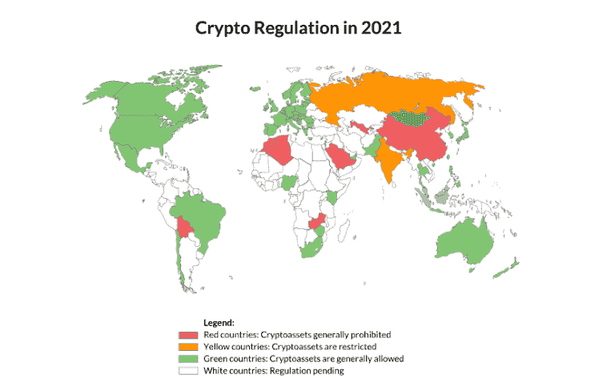

Source: [Elliptic](https://web.archive.org/web/20230308141442/https://www.elliptic.co/blog/a-world-of-crypto-regulation-at-a-glance)

自新冠肺炎以来，最新的宏观经济形势加速了对呈指数增长的数字空间的监管需求。在这一点上，几乎每个国家都至少开始评估使用数字资产的风险和优势。

## DeFi 的交易量处于一年来的最低水平，而 NFTs 和游戏则表现不佳

加密货币价格的波动和不稳定的宏观经济形势影响着整个行业。尽管如此，市场的悲观情绪正以不同的方式冲击着区块链的各个主要类别。

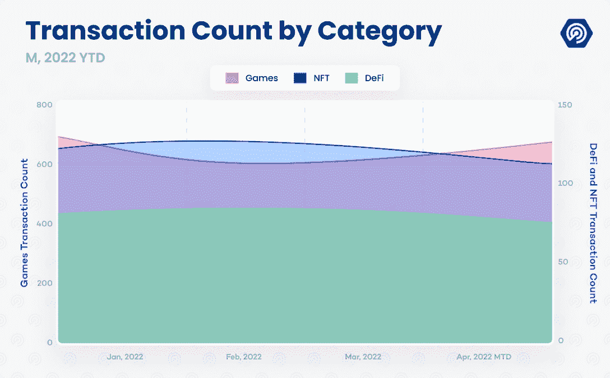

DeFi 是受影响最大的类别。在 Q1 2022 年奥运会上，DeFi 交易数量达到一年来的最低水平，表明人们对这一类别的兴趣与夏季的感觉相去甚远。尽管如此，在 Terra、Solana 和 Avalanche 的整体快速生态系统激增的背后，行业的 TVL 正在复苏。

相反，NFT 市场的有机交易量较 1 月份的创纪录水平有所下降，但 Q1 市场涉及 NFT 的交易数量达到了历史最高水平。仅在 Q1，整个区块链的 NFT dapp 和市场就注册了超过 1.16 亿笔交易，比 2021 年第四季度增长了 22%。

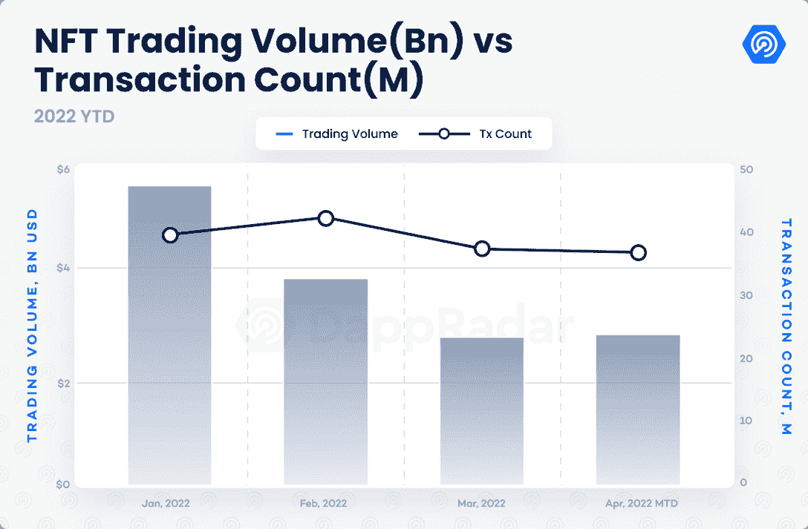

全区块链的 NFT 交易数量也在 Q1 2022 年达到峰值，比去年的 Q1 增长了 153%。随着以太坊 NFT 的需求从 1 月份的创纪录水平稳定下来，NFT 市场在第一层替代品(即 Avalanche 和 Solana)方面的增长起到了支撑作用。

与此同时，区块链奥运会登记了 78%的行业交易，比 Q1 2021 高出 520%。尽管轨迹相反，但这些类别对密码行业的发展仍然至关重要。

## 以太坊外的有机增长

以太坊 2.0 将增强网络的可扩展性和安全性，以及其广泛预期的向利益相关(PoS)的转移。然而，“合并”被推迟到今年第三季度甚至第四季度。同样值得注意的是，ETH 大约有 10%的流通供应量被锁定在以太坊 2.0 赌注合同中。

以太坊改造已经推动 L1 区块链像雪崩或索拉纳作为领先的智能合同网络的既定替代方案。同样，L2 解决方案和 Polygon、Ronin 或 Arbitrum 等侧链也显著增加了用户群。这些网络的特点是天然气费用低，处理时间快，非常适合举办游戏和最大限度地提高非鲸鱼投资者的收益。

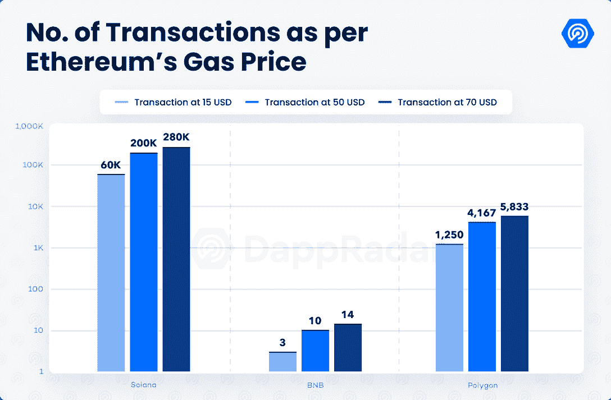

从长远来看，Avalanche 处理的交易比去年 12 月增加了 100%，比一年前增加了 10，500%。Polygon 的交易量比一年前增加了 2000%，Solana 去年在 Q1 的交易量增加了 9700%。另一方面，以太坊正在处理的交易比 Q1 2021 少 58%，尽管其 NFT 交易量和 DeFi 的 TVL 在同期呈指数增长。

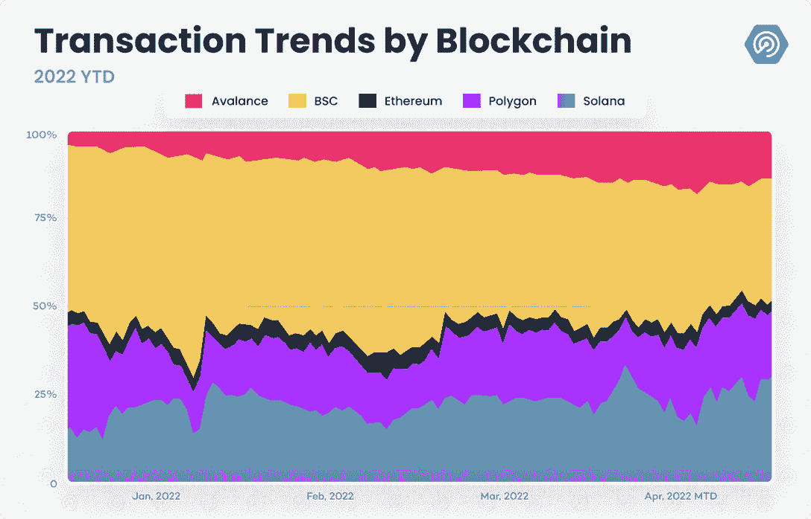

以太坊替代品的增量使用也带来了新的行为趋势。将令牌传入和传出网络的需求比以往任何时候都高。实现跨链转移的平台区块链桥的价值超过 500 亿美元，成为恶意攻击的理想目标。仅在 2022 年，就有近 10 亿美元从资产桥接平台被盗。

此外，以太坊之外对区块链越来越多的关注不仅来自用户，也来自开发者。根据 [Electric Capital](https://web.archive.org/web/20230308141442/https://github.com/electric-capital/developer-reports/blob/master/dev_report_2021.pdf) 的说法，Polkadot、Cosmos 和 Solana 是继以太坊之后拥有更多开发者的区块链。Cosmos、Solana 和 Near 开发者的数量去年增加了两倍，对 Polkadot 生态系统的兴趣也有所体现。

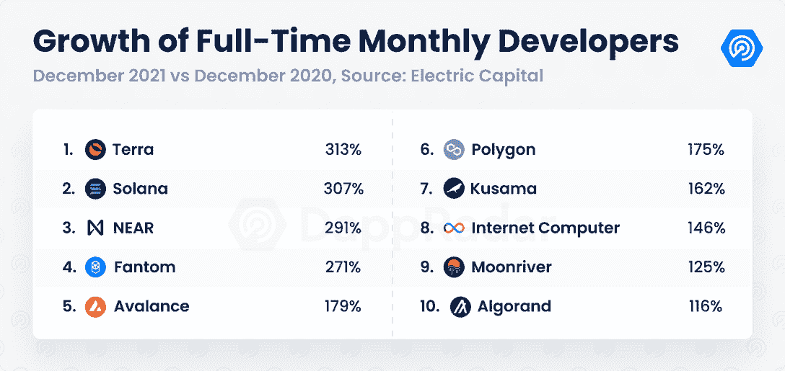

最新的消费者和市场机会趋势显示了有机增长，并预示着这些新兴网络的经济潜力。

## 全球范围内对 Web3 元宇宙的兴趣持续增长

尽管在 10 月下旬 Meta 宣布更名后，人们对元宇宙的兴趣似乎有所降温，但去中心化的区块链或基于 Web3 的元宇宙的概念仍在不断增加。一项衡量 Twitter 提及趋势的社会分析显示，对 Web3 元宇宙的兴趣似乎正在增加。

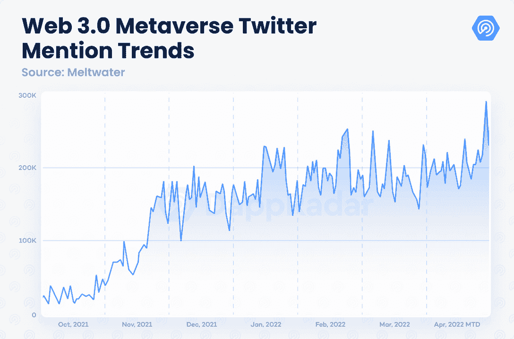

美国、印度尼西亚、印度和土耳其仍然是对这一主题更感兴趣的地区，而菲律宾、越南和尼日利亚等新兴国家出现在图表上。类似地，英国、日本、韩国和法国也在寻求增加对这一故事的曝光。

尽管本质上不是一种行为趋势，但元宇宙最具影响力品牌的曝光率也值得考虑。像古驰、多尔西和博柏利这样的时尚巨头已经推出了 NFT 收藏品，而耐克和阿迪达斯则与 Web3 领先品牌合作。汇丰银行和摩根大通将在沙盒中开设虚拟展位，并分散管理。这样的例子不胜枚举。

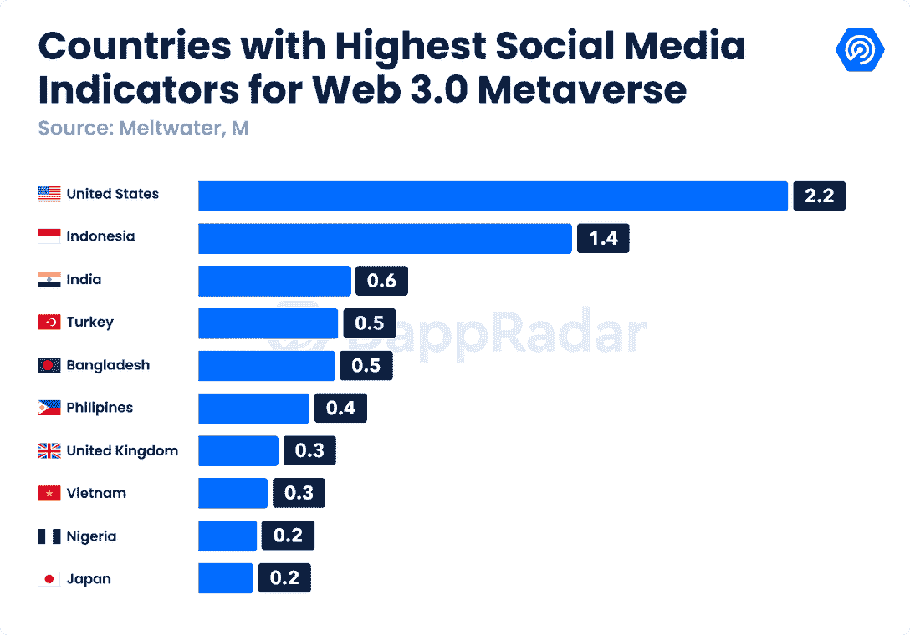

此外，根据 LinkedIn 的数据，2021 年加密服务的数量增长了 400%。随着世界上最大的公司已经清楚地表明了他们在元宇宙的计划，重要的是要确定哪些品牌将倾向于基于 Web3 的元宇宙，哪些品牌试图建立他们的集中虚拟现实。

## DappRadar 用户统计数据

使用 DappRadar 流量分析，我们可以得出过去几个月的高级行为模式。美国仍然是访问量最大的国家。俄罗斯的参与比 2021 年底增加了 10%，证实了战后变得更加明显的全球趋势。

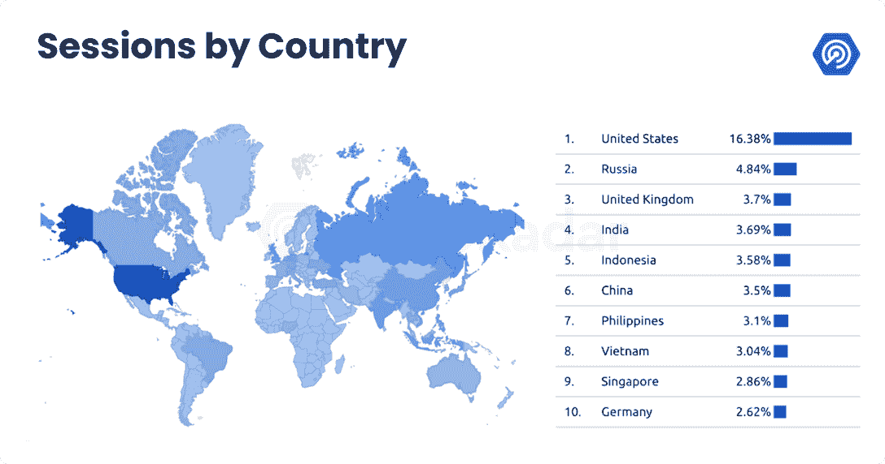

亚洲的足迹仍然引人注目，尽管中国的存在一直在减少，特别是自乌克兰战争以来。同样值得注意的是，中国正在与新的 COVID 锁定进行斗争，这给他们的情况增加了一个不同的变量。来自印度和东南亚等其他亚洲地区的观众也在增长。

其他人口变量与 12 月观察到的趋势略有不同。年龄在 45 岁到 54 岁之间的 X 一代用户增长最为显著，现在几乎占了 DappRadar 流量的 10%。千禧一代和 GenZ 仍然是占主导地位的群体，分别拥有 36%和 27%的流量。尽管如此，看到其他年龄段的人也加入这个行业还是积极的。

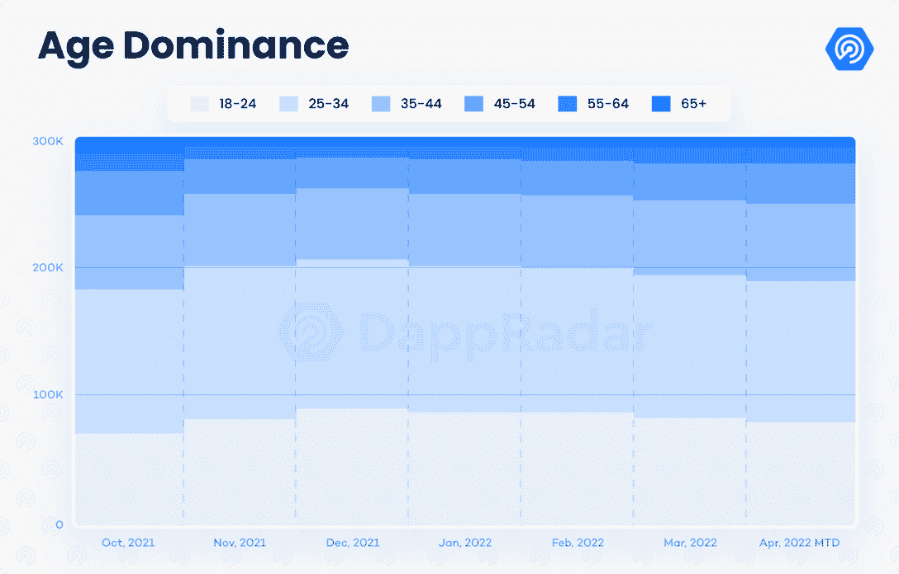

就首选设备而言，台式机的主导地位达到了 53%的历史最高水平。人们普遍预计，随着用户的增加，移动流量将会增加。台式电脑使用量的增加也是因为人们认为台式电脑比手机或平板电脑更安全。此外，Q1 2022 年奥运会期间 dapp 游戏的使用量激增也可能是原因之一，因为大多数区块链游戏都要求用户使用台式电脑进行游戏。

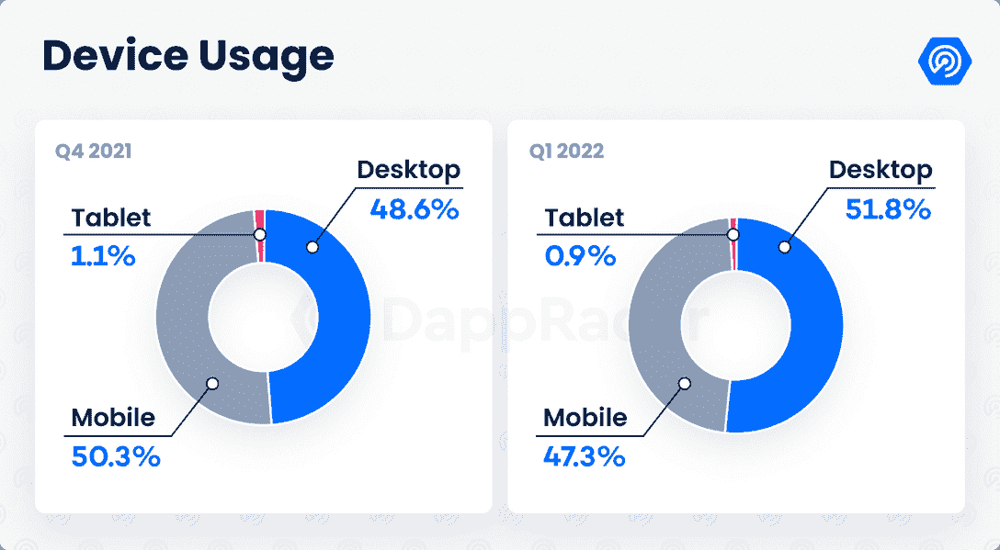

## 关闭

乌克兰战争彻底改变了叙事，从大多数区块链类别的持续有机增长，转变为复杂的宏观情景:通胀飙升，监管迫在眉睫，这些监管可能会根据每个地区的情况，接纳或抑制加密资产。尽管如此，区块链产业继续朝着大规模采用的方向发展。

区块链用户的行为大多遵循市场的恐惧情绪。DeFi 交易数量处于一年来的最低水平，尽管其恢复可能需要更长时间，但多链范式提供了区块链之外的不同选择。类似地，在 Solana、Avalanche 和 Flow 市场，NFT 的激增描绘了一个超越以太坊的看涨信号。从正面来看，对区块链游戏的需求仍然停滞不前，这证实了游戏 dapps 将成为该行业的重要基础。

从全球角度来看，Web3 元宇宙和互操作性等趋势吸引了全球更多的爱好者，这是积极的。亚洲市场、美国和欧盟值得特别关注，因为这些司法管辖区仍在继续其加密监管流程。

总而言之，这个行业在不断成熟。积极的一面是，即使在最近最复杂的地缘政治场景中，也有迹象表明特定类别的有机增长和加密资产在全球的整体采用。

 NewsletterUnsubscribe at any time. [T&Cs](https://web.archive.org/web/20230308141442/https://dappradar.com/terms) and [Privacy Policy](https://web.archive.org/web/20230308141442/https://dappradar.com/privacy-policy)