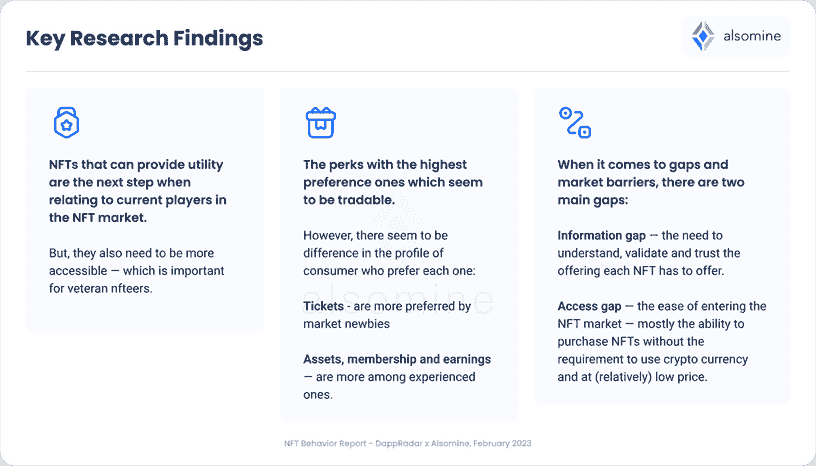
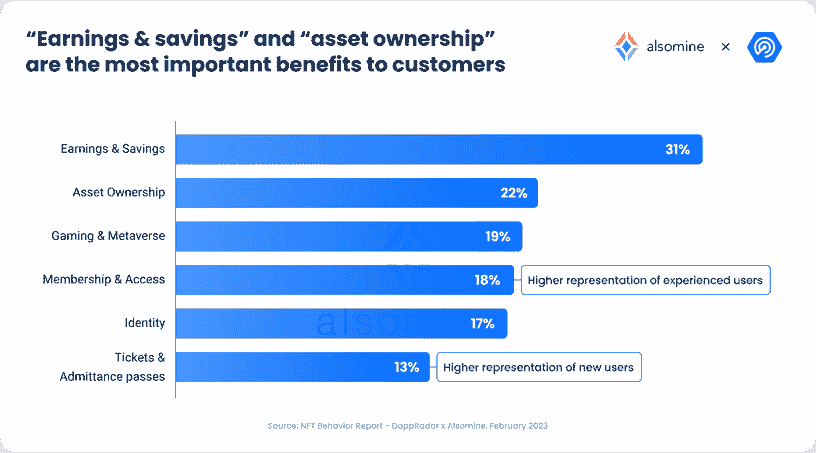
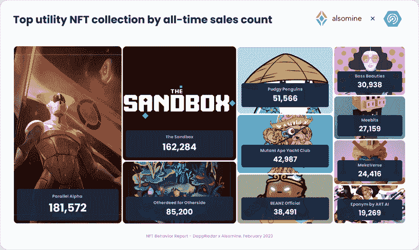
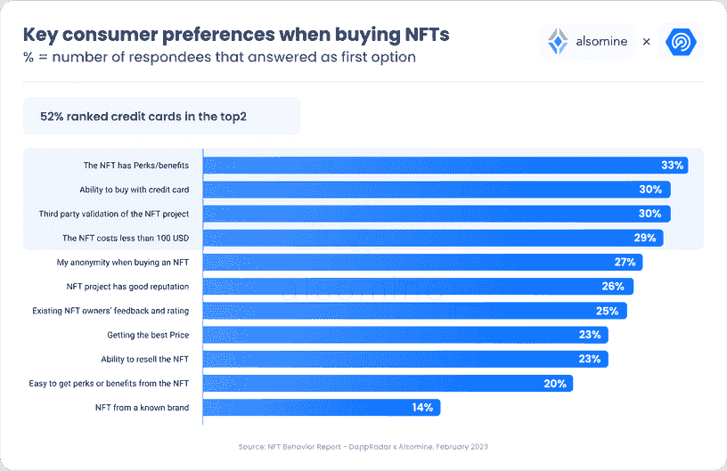
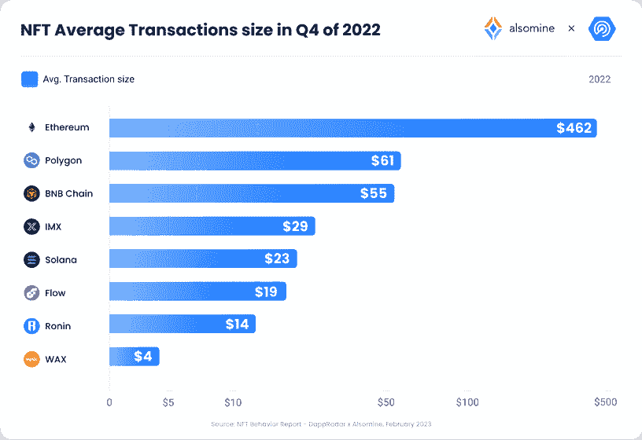

# 行为报告——消费者想从 NFTs 中得到什么？

> 原文：<https://web.archive.org/web/https://dappradar.com/blog/behavior-report-what-do-consumers-want-from-nfts>

## 提示:答案不是用于投机交易的资产

**来自 [DappRadar](https://web.archive.org/web/20230216083123/https://dappradar.com/) 和[als mine](https://web.archive.org/web/20230216083123/https://www.alsomine.com/)的研究表明，消费者希望从 NFT(不可替代的代币)中获得真正的价值、利益和效用。**

虽然看起来像素化的 JPEGs 和大猩猩卡通(如臭名昭著的无聊猿)成为了 NFTs 的典型代表，但人们想要和期望的不仅仅是艺术或投机交易。我们的研究表明，消费者看重真正的好处、效用、价格和交易的便利性(即使用信用卡支付)。

### 2023 年将会是公用事业 NFTs 年吗？

在企业开发更强大的 B2B 技术的同时，web3 和区块链行业继续构建更好的安全和安保基础设施。我们认为这两项发展是大规模采用的关键支柱。为了进一步推动这一趋势，耐克、星巴克和沃尔玛等主要品牌已经采取了第一步，制定了自己的策略，让现有用户和新用户使用 Web3。然而，仍然缺少一些显而易见的东西——对消费者需求、偏好和行为的深刻理解。

重要的问题仍然存在，我们将在本报告中深入探讨。谁是更广泛的 NFT 消费者，他们想从 Web3 中得到什么？但是，他们认为 NFT 在他们的生活中扮演什么角色？哪些公司和品牌在 web3 领域进行创新，推动行业向前发展，同时利用当今消费者需要的 web3 支持技术开发产品和服务？

NFT 已经证明了其彻底改变企业和消费者之间商业关系的潜力，这一新的数字化转型浪潮已经影响到多个行业。商业 NFTs 代表有形的、**可衡量的**价值、商业利益或效用的智能合同——是消费者真正想要的。

[Download PDF](/web/20230216083123/https://dappradar.com/blog/blog/static/f88b85c14d5a975a605e60762710c802/dappradar.com-dappradar.com-behavior-report-feb-2023-compressed.pdf)

## 关键要点

*   尽管 ETH 同比下降 60%，但 2022 年的链上 NFT 交易量与 2021 年相比几乎保持不变，为 247 亿美元，显示了该行业的弹性。2022 年 NFT 的总销售额增长了 67%，达到 1.07 亿，其中基于市场的销售额占 6835 万笔交易。
*   92%的受访者认为拥有非功能性测试有优势，可以为他们带来好处；61%的人提到了选择 NFT 时最重要的两个考虑因素之一(33%最重要)。
*   NFT 市场存在两个主要差距:信息差距和访问差距，消费者需要更容易地进入市场，并能够在不需要使用加密货币的情况下以相对较低的价格购买 NFT。
*   52%的受访者表示，使用信用卡购买非功能性医疗服务的能力是购买非功能性医疗服务时最重要的两个方面之一(30%的受访者认为最重要)。
*   Web2 公司转向 NFTs 是一个重要的趋势，如今已经有超过 100 个一线品牌向他们的消费者提供 NFTs，因为他们寻求为他们的消费者创造独特而有价值的体验。

## 目录

1.  [2022 年 NFT 市场概述:一个有弹性且不断增长的行业](https://web.archive.org/web/20230216083123/https://dappradar.com/blog/behavior-report-what-do-consumers-want-from-nfts/#Chapter-1)
2.  [亦矿 NFT 消费者研究:除了 PFP 和数字艺术，消费者还想要什么？](https://web.archive.org/web/20230216083123/https://dappradar.com/blog/behavior-report-what-do-consumers-want-from-nfts/#Chapter-2)
3.  [消费者对公用事业 NFT 的有形利益越来越感兴趣](https://web.archive.org/web/20230216083123/https://dappradar.com/blog/behavior-report-what-do-consumers-want-from-nfts/#Chapter-3)
4.  [最重要的用途:发现领先的 NFT 项目](https://web.archive.org/web/20230216083123/https://dappradar.com/blog/behavior-report-what-do-consumers-want-from-nfts/#Chapter-4)
5.  信用卡便利:NFT 买家的关键因素？
6.  [影响整个 NFT 市场的公用事业 NFT 定价](https://web.archive.org/web/20230216083123/https://dappradar.com/blog/behavior-report-what-do-consumers-want-from-nfts/#Chapter-6)
7.  [绘制 2022 年 NFT 用户地理分布图](https://web.archive.org/web/20230216083123/https://dappradar.com/blog/behavior-report-what-do-consumers-want-from-nfts/#Chapter-7)
8.  [结论](https://web.archive.org/web/20230216083123/https://dappradar.com/blog/behavior-report-what-do-consumers-want-from-nfts/#Conclusion)

## 1.2022 年 NFT 市场概览:弹性和增长的行业

[DappRadar](https://web.archive.org/web/20230216083123/https://dappradar.com/) 是领先的 dapp 发现和区块链资产管理平台，允许人们跟踪 NFTs 和许多其他加密资产的活动。NFT 销售额是该平台上跟踪的关键指标之一，它突出了在某些区块链和市场上销售的非功能性食品的数量。DappRadar 还跟踪唯一交易者的数量，这代表参与交易 NFT 的唯一钱包的数量。

[NFT 市场](https://web.archive.org/web/20230216083123/https://dappradar.com/nft)2022 年在区块链平台和市场上产生了价值 247 亿美元的有机交易量，仅比 2021 年的 251 亿美元略有下降。考虑到 ETH 价格同比下降 60%,这表明 2022 年 NFT 市场活动的弹性令人印象深刻。这也标志着加密和 NFT 市场的行为变得更加相互独立。

2022 年，NFT 销售额和独立交易商数量都有显著增长。**与去年相比，独立交易商的数量增加了 19.75%，总数达到 690 万。**独特交易者的指数增长表明，NFT 市场已经能够吸引一批新的参与者，这对该行业的未来是一个非常好的迹象。

此外，NFT 的销售额今年增长了 67%，达到 1.07 亿英镑。值得注意的是，其中 3865 万是通过新渠道进行的，而不是通过现有市场。这些交易是通过品牌平台直接完成的，钱包对钱包，由像 Reddit 这样的新玩家完成，有些用 fiat 支付代替了仅加密选项。这表明对使用和获取非森林技术的多样化方式以及越来越多的市场选择的需求显著增加。

此外，2022 年 NFT 市场增长的另一个重要原因是更加关注实用性和可衡量的利益。2022 年推出的 NFTs 专注于为用户提供更多实用功能，这使它们对更广泛的受众更具吸引力。为了进一步发展，NFTs 需要提供更多真实世界的应用，而不仅仅是解锁独家内容或体验。

## 2.NFT 消费者研究:除了 PFPs 和数字艺术，消费者还想要什么？

Alsomine 是一家以色列科技初创公司，推出了第一个[电子商务&分析 B2C 平台](https://web.archive.org/web/20230216083123/https://www.alsomine.com/waitlist)，用于商业 NFT 和具有现实世界效益的数字收藏品，该公司在 2022 年 11 月至 12 月期间调查了 341 人，以更好地了解今天的 NFT 消费者真正想要的是什么。

Alsomine 的研究发现，向消费者提供实际效用和利益的 NFT 是当今 NFT 市场增长的最大驱动力。有必要让老用户和新 NFT 用户更容易获得好处。

这项研究为消费者确定了 NFT 市场的两个主要差距:信息差距和准入差距。消费者需要了解、验证和信任每台 NFT 的产品，但他们没有兴趣花大量时间学习和适应他们的习惯。新一波 NFT 用户需要轻松、顺畅地访问 NFT，包括购买 NFT 而不必被迫单独打开钱包或使用加密货币的能力。当考虑 NFT 的更广泛用途时，单个 NFT 的价格点必须与 Web3 领域之外的类似价值相匹配。

Web2 公司向 NFTs 发展的趋势也很重要，因为他们试图利用 NFTs 为用户提供独特而有价值的体验。蒂芙尼&公司的 NFT 系列是 web2 与 web3 结合的绝佳范例。250 NFTs 系列是一种数字通行证，专为 crypto punk NFT 持有者提供，持有者有权将他们的[crypto punk NFT](https://web.archive.org/web/20230216083123/https://dappradar.com/ethereum/collectibles/cryptopunks)变成一个包含精致宝石和钻石的定制吊坠。这显然是非常高端的产品；然而，它确实符合人们对 NFT 之外类似产品的期望。

## 3.消费者对公用事业 NFT 的实际利益越来越感兴趣

实用工具非功能性令牌是不可替代的令牌，旨在提供特定的实用工具或功能，而不仅仅是可收集的。这种价值存在于 NFT 之外，因此 NFT 上艺术品的存在与否不会影响其价值，不像传统的非艺术作品本身通常是艺术或 PFP(个人资料图片)。

这些 NFT 可用于各种目的，例如授权访问内容或活动、代表所有权或成员资格、解锁游戏内的优势或功能、提供投票权、支持活动门票等等。

品牌需要考虑到，与任何其他产品或服务一样，非功能性营销对不同消费者群体(如年龄、性别、兴趣)的客户有不同的好处，并且不能用链上数据替代。公司还必须根据消费者的 web3“成熟度”来考虑他们的产品——对非功能性测试的理解和先前的经验或缺乏。基于人口统计、web3 成熟度和价值主张等一系列因素，不同的 NFT 优势和体验会吸引不同的受众。

大多数 NFT 消费者(60%)没有听说过公用事业 NFTs，只有少数 10%的人兑现了公用事业 NFT 福利，而绝大多数(92%的受访者)认为拥有一个提供各种福利和公用事业的 NFT 是一种优势。

当谈到提供明显效用和好处的 NFTs 时，新来者和 web3 本地人都对 NFTs 保持乐观和持续的兴趣。

**当被问及他们在即将到来的季度与非功能性交易互动或购买非功能性交易的意向时，57%的受访者表示他们打算购买/销售或兑换非功能性交易的好处。**

在最活跃和最有经验的 Nfteers (NFT 用户)中，意向增长到 80%，明确强调 NFT 创造者提供的福利和津贴的透明度。

就公用事业非物质技术最重要的方面而言，研究发现，人们现在更多地寻求切实的利益。消费者表示，拥有能为他们带来利润(或省钱)的 NFT 是关键。31%的记者认为能为你赚钱或省钱的 NFT 是最重要的。其次是“资产所有权”(22%排名第一)，以及能够玩它(“游戏和元宇宙”，19%)或使用它来参加活动或进入门户网站或俱乐部(“会员和访问”，18%)。所有这些都表明，NFT 不仅仅是好看而已。

到 2022 年底，在使用 NFT(Nfteers)的不太常见的公用事业中，人们有一些有趣的行为差异。新 NFT 用户比 NFT 老用户更倾向于基于 NFT 的门票，NFT 老用户对资产所有权、会员资格和收入表现出更高的赞赏。

## 4.实用性高于一切:发现领先的 NFT 项目

传统品牌和本地 Web3 公司都成功地向客户介绍了公用事业 NFT。实用 NFT 的一个最流行的例子来自去中心化的虚拟世界[沙箱](https://web.archive.org/web/20230216083123/https://dappradar.com/multichain/games/the-sandbox)。在这里，玩家可以购买和拥有虚拟土地，并以独特和创造性的方式开发它。此外，用户可以提前获得 Alpha seasons 或独家 APR 产量以进行沙盘交易等。这是一个很好的例子，说明了如何针对特定的目标受众恰当地使用公用事业 NFTs，而不会吸引不同的受众。

沙盒已经聚集了大量的兴趣和投资，自推出以来已经产生了 4.46 亿美元的总交易量。

当回顾提供公用事业的顶级项目时，数据显示，许多顶级公用事业 NFT 系列，如 [CryptoPunks](https://web.archive.org/web/20230216083123/https://dappradar.com/ethereum/collectibles/cryptopunks) 和 [Bored Ape Yacht Club](https://web.archive.org/web/20230216083123/https://dappradar.com/ethereum/collectibles/bored-ape-yacht-club) ，已经从数万笔销售中产生了数十亿美元的交易量。

从销售额来看，NFT 的顶级公用事业系列中，面向游戏的项目如 [Parallel Alpha](https://web.archive.org/web/20230216083123/https://dappradar.com/ethereum/collectibles/parallel-alpha) 、《沙盒》或[宇迦的另一边](https://web.archive.org/web/20230216083123/https://dappradar.com/ethereum/collectibles/otherdeed-for-otherside)位居榜首。与此同时，[变异猿游艇俱乐部(MAYC)](https://web.archive.org/web/20230216083123/https://dappradar.com/ethereum/collectibles/mutant-ape-yacht-club) 、 [Beanz](https://web.archive.org/web/20230216083123/https://dappradar.com/ethereum/collectibles/beanz-official) 和 [Meebits](https://web.archive.org/web/20230216083123/https://dappradar.com/ethereum/collectibles/meebits) 都被空投下来，作为 NFT 主要生态系统的公用事业的一部分。这些趋势表明，对这些非森林产品的需求可能更多地受到其效用价值的驱动，而不是短期的经济刺激。

尽管交易量和销售额仍然是需求和兴趣的重要指标，但公司必须考虑公用事业非功能性交易的其他关键指标:

*   消费者在没有财务补贴(如赌注)的情况下长期保留非功能性交易
*   向他人推荐的可能性(NPS–净推介值)
*   公用事业转换/赎回率
*   对于具有实际应用的公用事业公司，价格和产品是否比以前的 web2 格式更有吸引力？

## 5.信用卡便利:NFT 买家的关键因素？

根据 Alsomine 的研究，使用信用卡购买 NFT 的能力是人们购买 NFT 的第二大考虑因素。研究表明，30%的受访者认为这是他们的首要任务，强调交易的可及性和便捷性是 NFT 市场发展的关键因素和真正的推动者。

研究发现，许多优先使用信用卡购物的人对加密领域并不陌生，38%的人有数字钱包或之前购买过加密。研究发现，女性更倾向于用信用卡购买非食物疗法，38%的女性受访者表示这是她们的首选方法，相比之下，总人口中有 30%的女性受访者表示这是首选方法。

总之，对于潜在的 NFT 买家，尤其是越来越多地加入 NFT 交易游戏的女性，交易的便利性和信用卡使用的可及性成为一个至关重要的考虑因素。该调查强调了为非正规金融服务提供可及和方便的支付选择的重要性，以吸引和留住各种各样的买家。

## 6.影响整个 NFT 市场的公用事业 NFT 定价

虽然第一代非功能性交易主要被其创造者和购买者视为交易资产，但公用事业非功能性交易与产品或服务价值相关，因此需要与现实世界中的定价相对应，并受其影响。

根据 Alsomine 的消费者研究，NFT 的价格低于 100 美元是许多消费者关心的一个主要问题。有趣的是，这也清楚地反映在不同区块链的 NFT 平均销售价格上。

在 2022 年第四季度，也托管了大量资产 NFT 的以太坊的平均 NFT 交易规模最高，为 464 美元，其次是 Polygon，为 61 美元，BNB 链为 55 美元，索拉纳为 23 美元。游戏协议通常具有较低的平均 NFT 事务大小，不可变 X 为 29 美元，Ronin 为 14 美元，Wax 为 4 美元。随着非功能性食物的价格越来越接近它们的好处，它们将变得更容易为公众所接受。

几个区块链已经明确聚焦于以效用(和品牌)为中心的战略。这很可能会为他们的增长提供一个良好的基础，我们可以从他们的平均交易价格中明显看出这一点，Polygon 在 2022 年第四季度的平均价格为 61 美元，Flow 为 19 美元。两个区块链都在效用 NFTs 方面取得了多次成功，这在 Reddit 对 Polygon 的使用以及 NBA、NFL 或西甲等主要体育联盟与 Flow 的合作中可见一斑。

## 7.绘制 2022 年 NFT 用户的地理分布图

虽然 Alsomine 的调查为潜在 NFT 买家的行为和偏好提供了宝贵的见解，但还有另一个数据源可以提供对该行业的更多见解，即 DappRadar 的流量分析。

2022 年，东南亚国家在 NFT 市场崭露头角，其中新加坡占 27%。美国以 26.20%紧随其后，日本以 22%位居第三。这三个国家构成了 DappRadar 网站上 NFT 流量的大部分。

印度、德国、印度尼西亚和英国也是在 NFT 市场占有重要份额的国家，尽管它们的主导地位与前三名相比要低得多。俄罗斯和尼日利亚在 NFT 流量中所占份额较小，分别为 3.07%和 0.02%。

尼日利亚的情况值得强调，因为这个非洲国家是加密货币采用率较高的国家之一。乌克兰的情况也是如此，在那里，加密采用率高的国家不一定对 NFTs 有对称的需求。

NFTs 在东南亚越来越受欢迎，这可以归因于 Axie Infinity 等即玩即赚游戏的快速增长，这种游戏在该地区的加密游戏玩家中人气飙升。

2022 年 6 月，泰国举行了首次虚拟财产销售，允许用户在曼谷市中心购买实际财产，并成为元宇宙生态系统中的虚拟土地所有者。这凸显了非金融资产被用于现实世界资产的增长趋势，以及它们如何日益被视为一种合法的投资形式。

## 8.结论

Alsomine 的研究表明，公用事业 NFT 有潜力推动 Web3 领域的大规模采用和商业模式创新，为 NFT 创造不仅仅是数字艺术和收藏品的新用例。公用事业 NFT 可以支持分散的应用程序、游戏、市场和其他服务，其中所有权、身份和可交易性是关键。

NFT 市场继续增长并证明了其弹性，NFT 销售额和独特交易商数量的大幅增长也是其标志。主流行业越来越多地采用 NFT，以及对公用事业的关注极大地促进了这一增长。

随着 2022 年 NFT 消费者奖励计划和票务解决方案的兴起，NFT 在各个行业的重要性不断增长。例如，星巴克推出了区块链的忠诚度计划和 NFT 社区 Starbucks Odyssey，该社区提供以咖啡为主题的 NFT，可以转化为现实世界的体验。类似地，GET Protocol 提供了一个 NFT 票务解决方案，它使用可验证的数据在链上发行 NFT 门票。这些计划展示了 NFTs 超越传统用例的多功能性和潜力。

随着公用事业 NFT 的使用案例继续扩展，我们可以期待看到 Web3 技术的潜力得到越来越多的采用和主流认可。这可能会导致该领域的更多投资和创新，以及创造者、开发者、企业家和成熟企业等新商业模式和收入流的出现。

### 关于我的

Alsomine 是一家以色列科技初创公司，推出了第一个面向数字收藏品和 NFT 的电子商务和分析 B2C 平台。

由在品牌战略、产品开发、消费者数据和 web3 方面拥有丰富经验的数字创新和战略领导者领导，他们正在与专注于商业价值和消费者参与的主要品牌合作，将此作为其 web3 和数字转型之旅的关键 KPI。

发现公用事业 NFT–加入私有测试版发布的等待名单[https://www.alsomine.com/waitlist](https://web.archive.org/web/20230216083123/https://www.alsomine.com/waitlist)

### 关于 DappRadar

[dappRadar](https://web.archive.org/web/20230216083123/https://dappradar.com/) 成立于 2018 年，是全球 Dapp 商店:一个全球去中心化应用程序(dapps)商店，使其每月超过 100 万用户的基础可以通过其在线平台轻松跟踪、分析和发现 Dapp 活动。该平台目前托管 49 个协议的 12，000 多个 dapps，并提供大量消费者友好的工具，包括全面的 NFT 估值、投资组合管理和每日行业领先的可操作洞察。