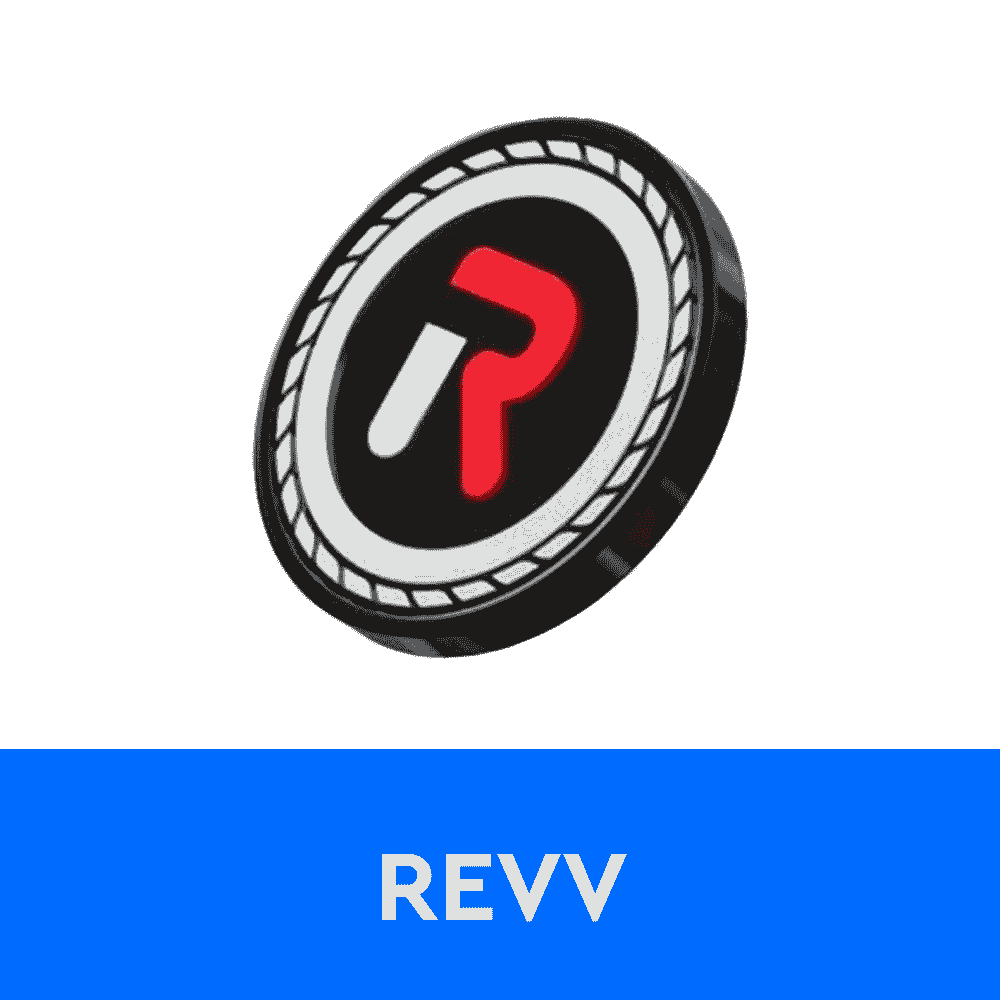
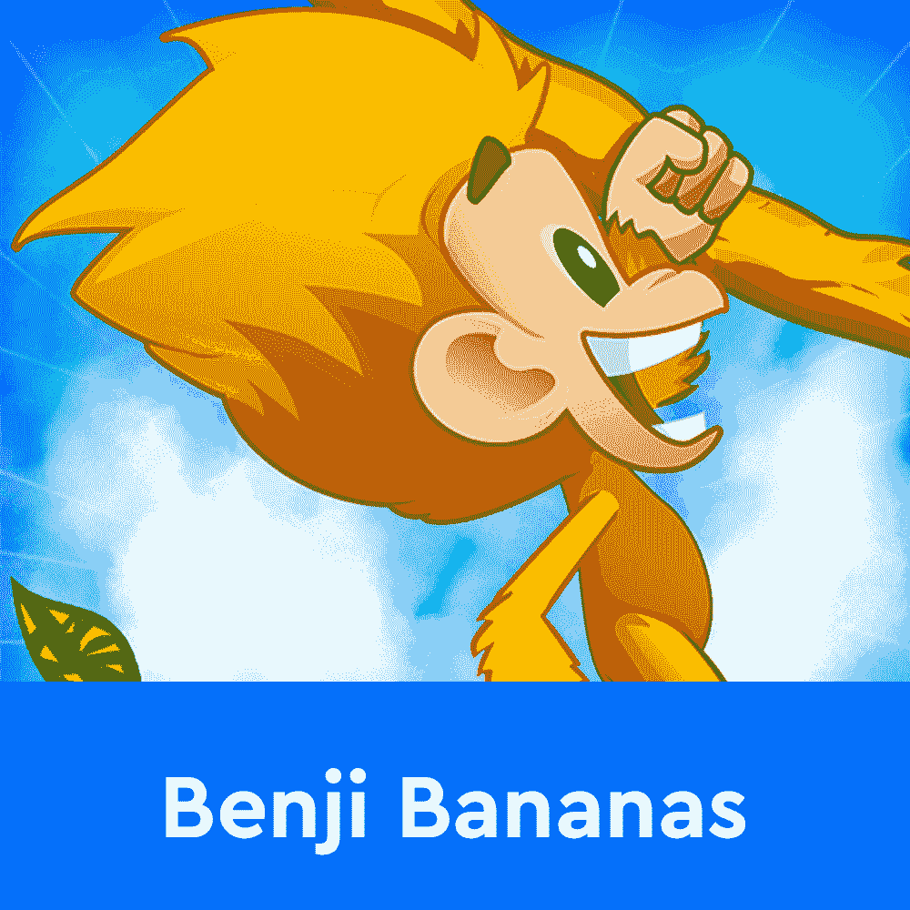
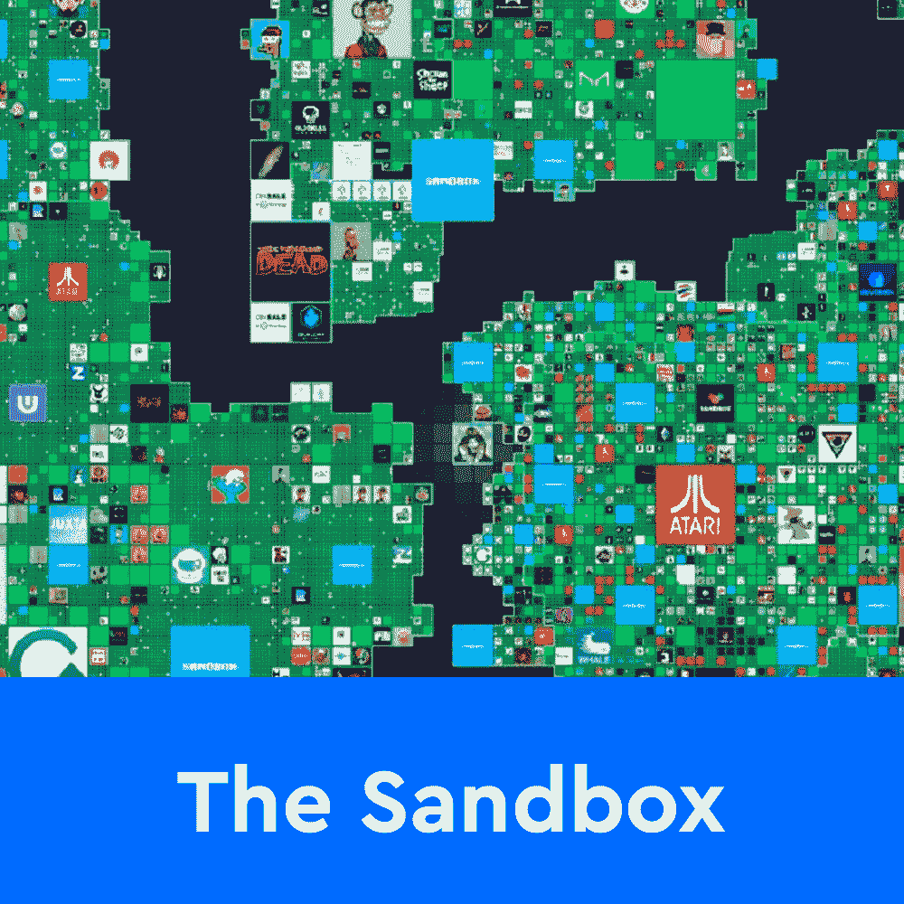
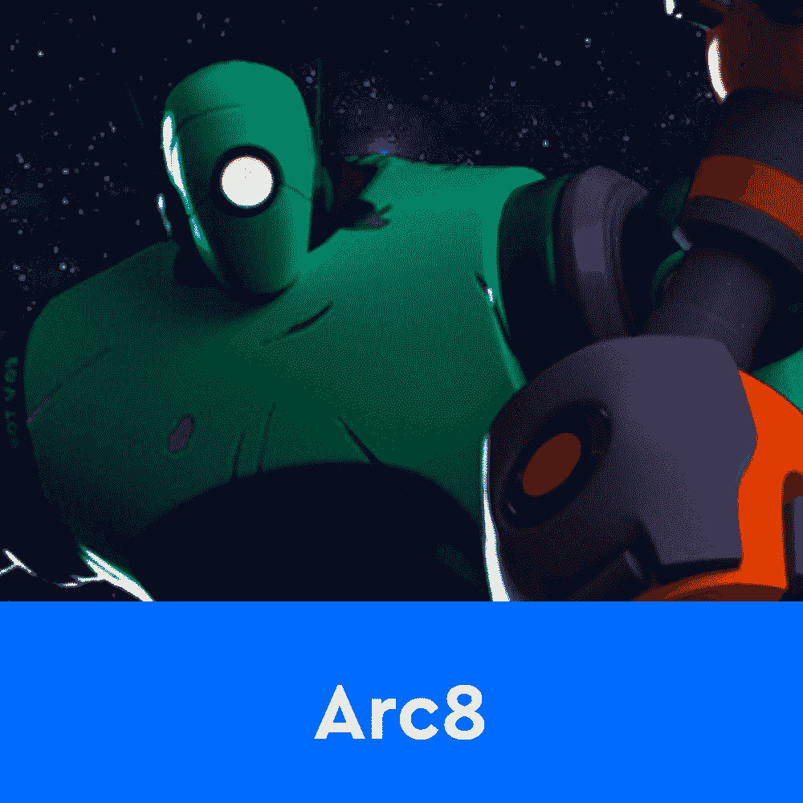
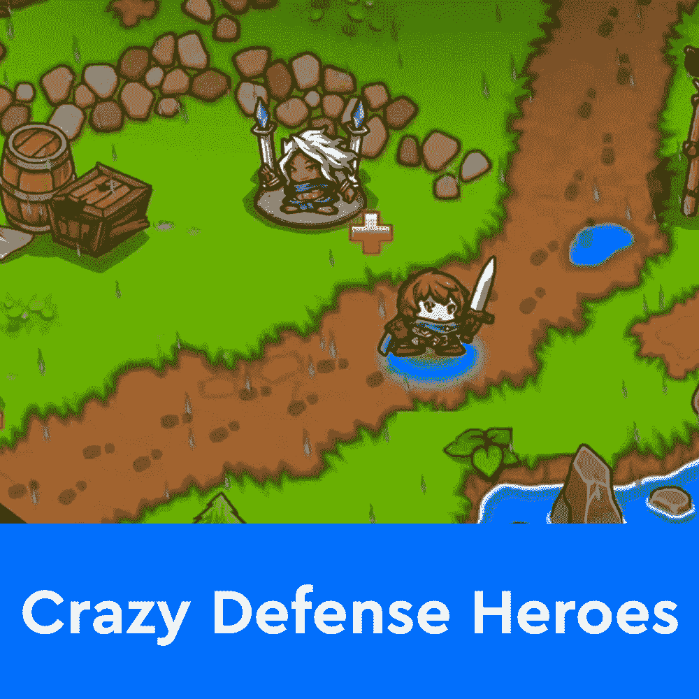
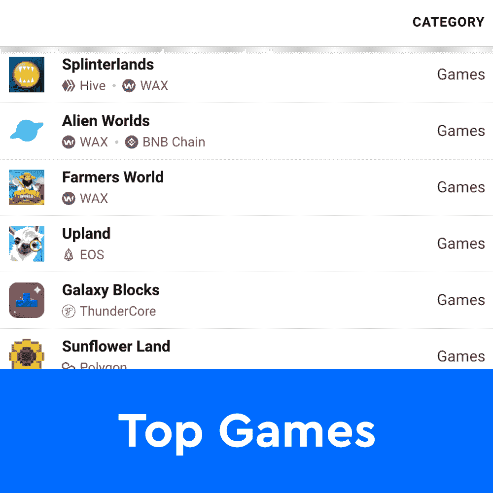

# 石基香蕉用灵长类动物标志扩展游戏中的经济

> 原文：<https://web.archive.org/web/https://dappradar.com/blog/benji-bananas-expands-in-game-economy-with-primate-token>

## 新的 ERC-20 令牌将提供与其他 Animoca 品牌平台的互操作性

Benji Bananas 作为 Animoca Brands 的最新游戏赚钱冒险成为焦点。当官方无聊的 Ape 游艇俱乐部令牌首次下降时，该游戏吹嘘它将奖励玩家 APE 令牌。现在，Animoca Brands 似乎正朝着一个略有不同的方向前进，通过新推出的灵长类动物令牌寻求与其他游戏产品的互操作性。

***概要:***

*   *[石基香蕉推出 20.6 亿灵长类代币作为主要的游戏赚取奖励代币](https://web.archive.org/web/20221208151823/https://dappradar.com/blog/benji-bananas-expands-in-game-economy-with-primate-token/#PRIMATE)*
*   *[玩家仍需猿购买一张石基香蕉会员通行证](https://web.archive.org/web/20221208151823/https://dappradar.com/blog/benji-bananas-expands-in-game-economy-with-primate-token/#Bananas)*
*   *[灵长目的核心效用将是提供一个与其他 Animoca 品牌游戏代币的简单互换功能](https://web.archive.org/web/20221208151823/https://dappradar.com/blog/benji-bananas-expands-in-game-economy-with-primate-token/#interoperability)*

Animoca Brands 团队在今天早些时候的 Twitter 声明中介绍了灵长类动物。代币已经部署在以太坊主网上，总共供应 20.6 亿灵长类代币。重要的是，为了参加游戏中的灵长类游戏，玩家必须获得 NFT 会员通行证。

## 石磊香蕉介绍了玩赚

Benji Bananas 最初是一个免费的移动平台，于 2013 年推出。游戏的目标是在藤本植物之间跳跃，收集尽可能多的香蕉。2022 年 3 月，Animoca Brands 决定更进一步，在平台上引入游戏赚取机制。

这些功能是在 Bored Ape 游艇俱乐部推出备受期待的本地令牌 Ape 的同时宣布的。Animoca Brands 是宇迦实验室和 ApeCoin DAO 的投资者，它将这两种产品联系起来，并发布了 Benji Bananas 会员通行证。通行证解锁了手机游戏中的“玩赚”功能，最初，玩家获得了新推出的 APE 令牌。

大约一个月后，Animoca Brands 对这款游戏进行了重大调整。虽然在流动性方面，APE 仍将在平台上发挥核心作用，但 Benji Bananas 现在将有一个新的奖励令牌，名为 PRIMATE。

重要的是，会员通行证的主要销售仍将在 APE 代币中进行。这是一个重要的细节，因为为新的灵长类动物令牌提供稳定性的主要流动性池之一将是 APE。资金池中的大多数 APE 代币是通过 NFT 通行证的初级销售产生的。[你可以在这里阅读更多关于班吉香蕉会员证的信息](https://web.archive.org/web/20221208151823/https://dappradar.com/blog/play-benji-bananas-on-mobile-to-earn-apecoin)。

## 灵长类互用性

有人可能想知道为什么 Animoca Brands 推出了一个全新的标志。尤其是当 Benji Bananas 已经开始支付猿类奖励的时候。答案是互操作性。

Animoca Brands 拥有大量其他游戏产品组合，其中大多数都具有游戏赚取功能和自己的游戏内代币和经济。随着灵长类动物的推出，Benji Bananas 与整个 Animoca 品牌生态系统建立了更紧密的联系。

根据官方公告，PRIMATE 的主要目标之一将是允许玩家用他们的奖励换取其他 Animoca 品牌的游戏代币。这些资产包括沙盒的沙子令牌、REVV Racing 的 REVV 令牌和 Arc8 的 GMEE。

[<picture></picture>](https://web.archive.org/web/20221208151823/https://dappradar.com/hub/token/eth/SAND/ETH?from=0x3845badade8e6dff049820680d1f14bd3903a5d0)[<picture></picture>](https://web.archive.org/web/20221208151823/https://dappradar.com/hub/token/eth/REVV/ETH?from=0x557b933a7c2c45672b610f8954a3deb39a51a8ca)[<picture></picture>](https://web.archive.org/web/20221208151823/https://dappradar.com/hub/token/eth/GMEE/ETH?from=0xd9016a907dc0ecfa3ca425ab20b6b785b42f2373)

这种互操作性是加强整个 Animoca Brands 游戏组合中令牌整体性能的重要因素。更重要的是，它将允许 Benji Bananas 玩家轻松进入其他 Animoca 品牌的游戏。

随着灵长类动物奖励开始流入，DappRadar 将继续监测 Benji Bananas 和 Animoca 品牌。如果你想了解更多关于 Animoca Brands 产品组合中其他游戏产品的信息，请点击下面的链接。此外，如果您拥有 DappRadar PRO 会员资格，您将能够在一个地方获得所有这些游戏的最新链数据。

[<picture></picture>](https://web.archive.org/web/20221208151823/https://dappradar.com/ethereum/games/benji-bananas-membership-pass)[<picture></picture>](https://web.archive.org/web/20221208151823/https://dappradar.com/ethereum/games/the-sandbox)[<picture></picture>](https://web.archive.org/web/20221208151823/https://dappradar.com/polygon/games/revv-racing)[<picture></picture>](https://web.archive.org/web/20221208151823/https://dappradar.com/polygon/games/arc8-by-gamee-1)[<picture></picture>](https://web.archive.org/web/20221208151823/https://dappradar.com/multichain/games/crazy-defense-heroes)[<picture></picture>](https://web.archive.org/web/20221208151823/https://dappradar.com/rankings/category/games) NewsletterUnsubscribe at any time. [T&Cs](https://web.archive.org/web/20221208151823/https://dappradar.com/terms) and [Privacy Policy](https://web.archive.org/web/20221208151823/https://dappradar.com/privacy-policy)