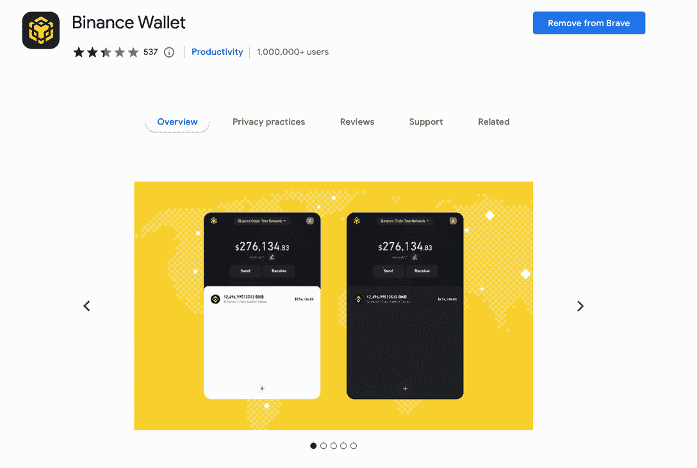
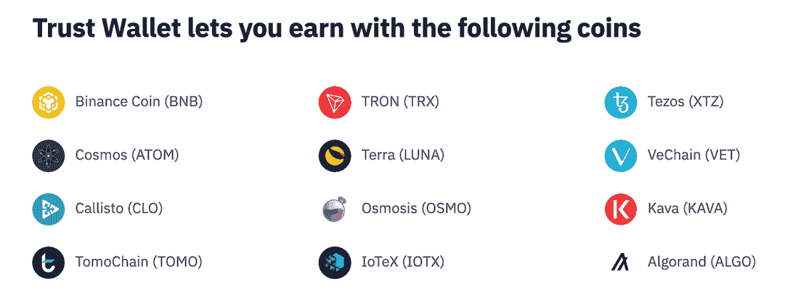

# 2022 年最佳 BNB 链式钱包

> 原文：<https://web.archive.org/web/https://dappradar.com/blog/best-bnb-chain-wallets>

## 达普拉达评选出的最佳 BNB 链式钱包

BNB 连锁，BNB 灯塔连锁和 BNB 智能连锁的合称，拥有世界上最大的区块链网络之一。其原生 BNB token 的流通市值已超过 449 亿美元，为其自身的生态系统提供动力。那么，用户应该选择什么钱包呢？

在今天的文章中，你会发现:

*   BNB 链条概述。
*   BNB 智能链最受欢迎的网络扩展、移动应用和硬件钱包是什么？
*   用户如何利用 DappRadar 跟踪工具来跟上 BNB 连锁店生态系统的最新趋势？

选择加密钱包取决于用户自己的需求和偏好。安全性、保管和设备是需要考虑的几个重要方面。选择正确的 [BNB 链(BNB)](https://web.archive.org/web/20220926170836/https://dappradar.com/rankings/protocol/binance-smart-chain) 钱包将使用户更顺利地跟踪，存储和交换 BEP-20 代币，并使用 BNB 供电的 dapps。

用户可以使用 [DappRadar 投资组合跟踪器实时监控他们在 BNB 的连锁资产。](https://web.archive.org/web/20220926170836/https://dappradar.com/hub/wallet/)

对于那些不熟悉加密的人来说，BEP-20 是 BNB 链上兼容 ERC-20 的令牌标准。因此，以太坊上的代币可以通过一座桥移动到 BNB 链。此外，BEP-20 体现了 BNB 链的技术规范，为开发人员提供了一种灵活的格式来为他们的项目推出基于 BNB 的令牌。

如果你对 BNB 连锁店不太了解，DappRadar 准备了一系列文章来帮助你全面了解它充满活力的生态系统。

*   什么是 BNB 链，它是如何工作的？
*   [什么是 BNB 令牌？](/web/20220926170836/https://dappradar.com/blog/what-is-the-bnb-token/)
*   [BNB 连锁报道 Q2 2022](https://web.archive.org/web/20220926170836/https://dappradar.com/blog/bnb-chain-report-q2-2022)
*   [以太坊与 BNB 连锁店:解释主要差异](https://web.archive.org/web/20220926170836/https://dappradar.com/blog/ethereum-vs-bnb-chain-key-differences-explained)
*   [你可能错过的 BNB 连锁最热门的 5 款游戏](https://web.archive.org/web/20220926170836/https://dappradar.com/blog/the-5-hottest-games-on-bnb-chain-you-probably-missed)

事不宜迟，让我们直接进入今天的话题吧！

## 币安钱包-币安的官方浏览器扩展钱包

[币安钱包](https://web.archive.org/web/20220926170836/https://chrome.google.com/webstore/detail/binance-wallet/fhbohimaelbohpjbbldcngcnapndodjp)是来自币安的官方浏览器扩展钱包。该扩展允许用户在 BNB 灯塔链、 [BNB 智能链](https://web.archive.org/web/20220926170836/https://dappradar.com/rankings/protocol/binance-smart-chain)和[以太坊](https://web.archive.org/web/20220926170836/https://dappradar.com/rankings/protocol/ethereum)上发送和接收资金。此外，它支持 BNB 链生态系统中两个区块链之间的跨链转移。

由于 dapp 仍然主要是基于网络的应用程序，币安钱包允许用户使用网络浏览器无缝登录这些 dapp。币安钱包也有一些区别于其他扩展钱包的功能。例如，它使用户能够通过 Wallet Direct 轻松地将他们现有的币安帐户链接到他们的钱包。

此外，用户可以通过 tKey，一种阈值密钥管理的模型，用他们的 Gmail 帐户注册钱包。这项功能可以帮助用户在丢失钱包时快速找回钱包。

使用 [DappRadar 投资组合开始实时跟踪您的 BNB 连锁资产。](https://web.archive.org/web/20220926170836/https://dappradar.com/hub/wallet/)

## 元掩码–适用于 iOS、Android 和浏览器

[MetaMask](https://web.archive.org/web/20220926170836/https://metamask.io/) 可以说是最被广泛接受的钱包，支持 ERC-20 代币、NFT 和多个区块链，包括 [BNB 链](https://web.archive.org/web/20220926170836/https://dappradar.com/rankings/protocol/binance-smart-chain)、[以太坊](https://web.archive.org/web/20220926170836/https://dappradar.com/rankings/protocol/ethereum)、[多边形](https://web.archive.org/web/20220926170836/https://dappradar.com/rankings/protocol/polygon)、[克罗诺斯](https://web.archive.org/web/20220926170836/https://dappradar.com/rankings/protocol/cronos)、[雪崩](https://web.archive.org/web/20220926170836/https://dappradar.com/rankings/protocol/avalanche)等数十种。最初只在浏览器扩展中提供，现在也支持 Android 和 iOS。

MetaMask 因其易用性和在加密货币社区的多年服务而成为 BNB 连锁用户的热门选择。声誉在这里扮演了一个角色。除了让用户签署交易和管理他们的加密资产，[它还提供了一个交换服务](https://web.archive.org/web/20220926170836/https://dappradar.com/ethereum/defi/metamask-swap),从多个分散的交易所(dex)获得有竞争力的价格。

## 信任钱包-币安的官方移动应用钱包

与其他分散式钱包一样， [Trust Wallet](https://web.archive.org/web/20220926170836/https://trustwallet.com/) 利用一组种子短语作为每个加密货币钱包的主密钥。记录这些种子短语非常重要。它可以帮助钱包所有者在丢失或损坏移动设备的情况下，重新访问他们的帐户和里面的所有内容。

此外，Trust Wallet 还提供了一些额外的内置功能。例如，用户可以用信用卡或借记卡购买加密货币。最重要的是，钱包还让用户通过押上他们的加密资产来赚取被动收入。

## 数学钱包——首批支持 BSC 的钱包之一

让 [Math Wallet](https://web.archive.org/web/20220926170836/https://mathwallet.org/en-us/) 脱颖而出的是它能够连接极其广泛的区块链网络。

数学钱包支持超过 130 个公共链，包括主流区块链，基板链，和 EVM 网络。Math Wallet 是最早支持 BNB 链的公司之一，它为 iOS 和 Android 设备提供浏览器扩展加密钱包和移动应用程序。

值得一提的是，数学生态系统超越了它的钱包服务。2019 年 10 月，推出了数学令牌，以促进数学的扩展和活力。这对 Math Wallet 用户来说是个好消息，因为他们可以通过持有 Math 享受更广泛的福利，如下注机会和奖励分配。

## SafePal——让密码保持离线的硬件钱包

SafePal 是一家硬件钱包提供商。与上面提到的软件钱包不同，硬件钱包将用户的私钥存储在物理设备中，只有设备所有者才能访问。使用硬件钱包的最大优势是它可以让用户的私钥保持离线状态。这样一来，硬件钱包被病毒或黑客感染的概率就低了很多。

因此，如果你想离线存储你的 BNB 链令牌，以降低它们对黑客和病毒的脆弱性，硬件钱包是一个选择。然而，如果你要与 dapps 互动，你需要将你的令牌转移到一个热钱包，SafePal 也提供这种服务。

## 安全的钱包是您进入充满活力的 BNB 生态系统的门户

BNB 连锁为业内一些最受欢迎的 dapps 提供可靠而强大的基础设施，涵盖元宇宙、 [DeFi](https://web.archive.org/web/20220926170836/https://dappradar.com/rankings/protocol/binance-smart-chain/category/defi) 、[市场](https://web.archive.org/web/20220926170836/https://dappradar.com/rankings/protocol/binance-smart-chain/category/defi)、[博彩](https://web.archive.org/web/20220926170836/https://dappradar.com/rankings/protocol/binance-smart-chain/category/games)等。根据 [DappRadar 行业概览](https://web.archive.org/web/20220926170836/https://dappradar.com/industry-overview)，在过去的 30 天里，BNB 连锁店和 [Wax](https://web.archive.org/web/20220926170836/https://dappradar.com/rankings/protocol/wax) 在独立用户方面一直并驾齐驱，占据榜首。下图捕捉到了两者之间的激烈竞争。

使用稳定安全的钱包应该是所有加密用户的首要任务。然后，用户可以安心地交易加密资产，探索 BNB 的 dapp 世界。

在 DappRadar，用户可以通过我们的排名轻松查看最受欢迎的 BNB 连锁店 dapps 这里有一些有用的链接。

*   [跟踪您的 BNB 链投资组合](https://web.archive.org/web/20220926170836/https://dappradar.com/hub/wallet/bsc)，包括您的加密和非加密技术
*   [BNB 连锁店 dapps 排名](https://web.archive.org/web/20220926170836/https://dappradar.com/rankings/protocol/binance-smart-chain)发现最受欢迎的 Dapps
*   令牌浏览器中的 [BNB 令牌](https://web.archive.org/web/20220926170836/https://dappradar.com/hub/token/eth/BNB?from=0xb8c77482e45f1f44de1745f52c74426c631bdd52)
*   [BNB·迪菲·TVL](https://web.archive.org/web/20220926170836/https://dappradar.com/defi/protocol/binance-smart-chain)显示了 BNB 链条上所有迪菲资产的总价值
*   BNB NFTs 展示了市场上最受欢迎的 NFT 系列

DappRadar 将继续监测和报告 BNB 链及其生态系统的演变。在 [Twitter](https://web.archive.org/web/20220926170836/https://twitter.com/dappradar) 、 [Discord](https://web.archive.org/web/20220926170836/https://discord.gg/4ybbssrHkm) 和 [Youtube](https://web.archive.org/web/20220926170836/https://www.youtube.com/c/DappRadar) 上关注我们，跟上区块链世界的动态。

 NewsletterUnsubscribe at any time. [T&Cs](https://web.archive.org/web/20220926170836/https://dappradar.com/terms) and [Privacy Policy](https://web.archive.org/web/20220926170836/https://dappradar.com/privacy-policy)