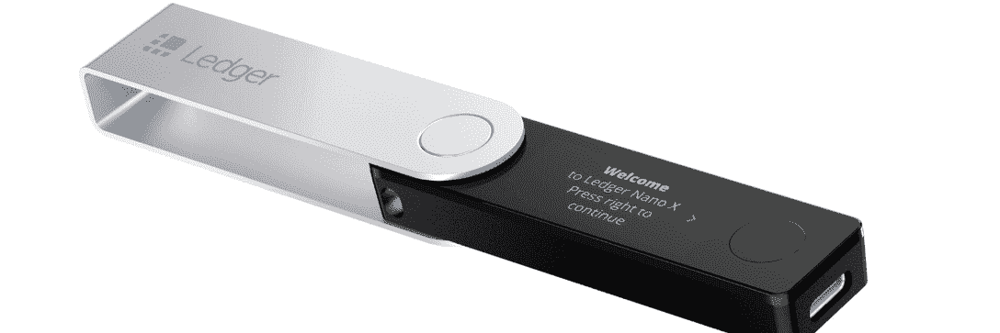
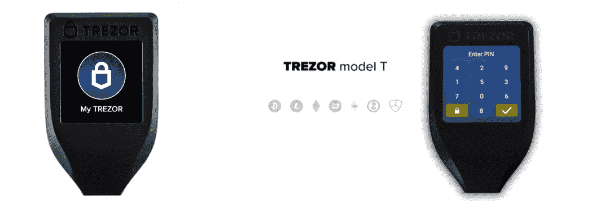
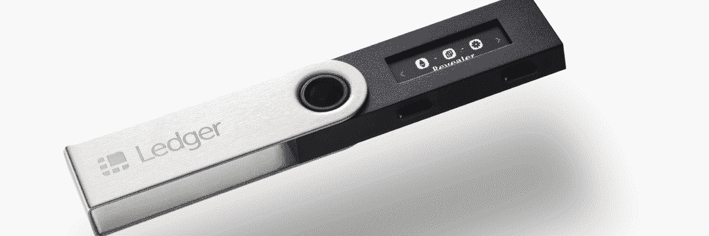
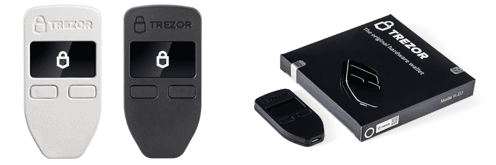
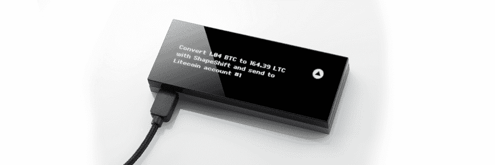

# 2023 年最佳加密硬件钱包

> 原文：<https://web.archive.org/web/https://dappradar.com/blog/best-crypto-hardware-wallets-for-2023>

## 市场上最好和最安全的硬件钱包来存储您的密码

当您存储您的加密资产时，您希望使用最好的加密钱包，使用硬件钱包肯定有好处。在你购买的主流交易所留下少量加密货币可能没问题。然而，将它转移到您控制的加密钱包中是一个更安全的选择。加密钱包通常有两种形式——软件和硬件。在本帖中，我们将分析当今最好的加密硬件钱包。

硬件钱包已经存在了相当一段时间，它们被认为是存储加密货币的安全选择。此外，硬件钱包为 MetaMask 等钱包服务增加了一层额外的安全保障。在本文中，我们将对此进行深入探讨:

*   [什么是硬件钱包？](https://web.archive.org/web/20230111053108/https://dappradar.com/blog/best-crypto-hardware-wallets-for-2023/#what)
*   硬件钱包有多安全？
*   [最好的加密硬件钱包有哪些？](https://web.archive.org/web/20230111053108/https://dappradar.com/blog/best-crypto-hardware-wallets-for-2023/#best)

## 什么是硬件钱包？

硬件钱包与软件钱包截然相反，尽管两者都用于接收、发送、收集和跟踪加密资产的所有权。软件钱包以浏览器扩展或移动应用的形式出现，而硬件钱包则是类似 USB/拇指驱动器的离线设备。硬件钱包也称为冷钱包或冷存储，与热(在线)钱包或热存储相对。

使用硬件钱包使所有者能够完全控制特定硬件钱包中的加密货币钱包。这意味着一个硬件钱夹可以包含多个钱夹地址。用户通常使用助记符来创建他们的钱包地址和私人密钥的备份。一如既往，永远不要与他人分享你的私人密钥或助记符。

## 硬件钱包有多安全？

硬件加密钱包比软件钱包更能抵御病毒和黑客的攻击。这是因为他们将个人的私钥(用于访问加密资产)完全离线，远离可能包含有害或易受攻击软件的联网计算机。

也就是说，如果您丢失了硬件钱包设备，您将无法访问所有加密资产。也就是说，除非你写下或者备份了它们。因此，如果您在管理物理设备方面遇到困难，您可能希望选择热存储。

最重要的是，黑掉一个硬件钱包并不是完全不可能的，尤其是如果你是从二手市场购买而不是直接从制造商那里购买的话。因此，在购买用于管理资产的加密硬件钱包时，请务必考虑这一点。从二级市场购买时要小心，因为骗子可以篡改钱包。这可能会让他们直接访问买家的钱包地址。

## 当今最好的加密硬件钱包

现在，让我们来看看当今市场上可以提供的一些最好的加密硬件钱包:

### 莱杰纳米 X

[Ledger Nano X](https://web.archive.org/web/20230111053108/https://shop.ledger.com/products/ledger-nano-x) 能够通过蓝牙与移动设备连接，可以与 Ledger Live 应用程序集成，以保持用户的加密资产离线，免受病毒和黑客的攻击。Ledger Live 是该公司的内部软件，允许用户在他们的纳米设备上安装应用程序，并管理他们的加密资产。该钱包支持近 100 个去中心化应用程序和超过 5550 个硬币和代币。

### Trezor 型

世界上第一个使用 Trezor 的[sha mir Backup](https://web.archive.org/web/20230111053108/https://blog.trezor.io/shamir-backup-the-revolution-of-private-keys-backup-is-here-858687ed7fe7)(slip 39)[的硬件钱包 Trezor Model T](https://web.archive.org/web/20230111053108/https://shop.trezor.io/product/trezor-model-t) 还可以充当安全令牌、数字 ID 和认证器。Shamir Backup 允许用户在丢失设备的情况下，使用 12 个字的恢复种子来恢复他们的整个钱包。T 型车方便的触摸屏允许用户在操作之前验证和确认所有的操作。用户密码在 Trezor 密码管理器中单独锁定。这些只有在用户实际确认设备上的操作后才会被释放。这款加密硬件钱包支持超过 1，200 枚硬币。

### 莱杰纳米 S

虽然它不像更贵的同类产品那样支持蓝牙，但它是一款硬件钱包，仍然以相对较低的价格提供基本功能。这包括交易和管理您的加密资产，让他们安全离线，并支持大量的硬币和令牌。Nano S 与 Ledger Live 应用程序兼容。你可以通过它在设备上安装多达三个 dapps。

### 特雷索模型一

Trezor 硬件钱包的早期版本, [Trezor Model One](https://web.archive.org/web/20230111053108/http://v/) 被用作其更昂贵的 Model T 的基础。旧型号没有触摸屏，并且需要与手机或桌面进行交互。然而，它非常适合那些喜欢选择较少的简单性的人。最重要的是，它可以作为一个 U2F(通用第二因子)令牌，所以你可以绝对肯定你批准什么行动。

### KeepKey

该公司的第一个加密钱包，ShapeShift 的 [KeepKey](https://web.archive.org/web/20230111053108/https://shapeshift.com/keepkey) 价格实惠，功能齐全。想想离线私钥管理、加密交易和跟踪、时尚的大显示屏等等。其他功能包括基于网络的 ShapeShift 集成，将您的加密工具整合到一个环境中。此外，还有简单的备份和恢复选项以及 12 个字的恢复语句。该钱包支持 46 个 ERC-20 代币，以及所有主要的加密货币。

## 硬件在安全性方面胜过软件

如果你的加密资金的安全是你的第一优先事项，你不会错选择这些加密硬件钱包中的任何一个。然而，如果你有把你的物理设备放错地方的倾向，那么你可能要考虑去买一个软件加密钱包。

不管你选择什么，如果你在 Twitter 上关注 DappRadar，你可以了解更多关于各种加密资产、分散化应用以及所有这些东西的信息。也欢迎你加入 [DappRadar PRO](https://web.archive.org/web/20230111053108/https://dappradar.com/token/pro) 社区，使用我们的 [Discord](https://web.archive.org/web/20230111053108/https://discord.gg/4ybbssrHkm) 服务器。

## 随身携带您的 Web3 之旅

使用 DappRadar 移动应用程序，再也不会错过 Web3。查看最受欢迎的 dapps 的性能，并关注您投资组合中的 NFT。您在 DappRadar 上的帐户会与我们的移动应用程序同步，这样您很快就可以选择实时接收提醒。

[Download the DappRadar app now](https://web.archive.org/web/20230111053108/https://dappradar.app.link/blog)[<picture></picture>](https://web.archive.org/web/20230111053108/https://play.google.com/store/apps/details?id=com.portfolio.dappradar)