# 2023 年前 25 大最佳 NFT 非功能性食品交易市场

> 原文：<https://web.archive.org/web/https://dappradar.com/blog/best-nft-marketplaces-to-buy-sell-nfts>

## OpenSea，Rarible，SuperRare，Atomic Hub 等等！

随着不可替代代币的不断普及，市场对代币买卖的需求也在不断增长。但是在哪里可以找到 NFT 并安全地进行交易呢？根据我们的研究，这是 NFT 前 25 个最好的市场的终极列表，可以买卖你自己的 NFT。我们希望这些信息对您有所帮助！

## 25 个最适合你的 NFT 的 NFT 市场

这是 NFT 顶级市场的终极列表，可以买卖你自己的 NFT。

1.  [OpenSea](https://web.archive.org/web/20230123215922/https://dappradar.com/blog/best-nft-marketplaces-to-buy-sell-nfts/#1.-OpenSea)
2.  [X2Y2](https://web.archive.org/web/20230123215922/https://dappradar.com/blog/best-nft-marketplaces-to-buy-sell-nfts/#x2y2)
3.  [魔法伊甸园](/web/20230123215922/https://dappradar.com/blog/wp-admin/post.php)
4.  [looks are](/web/20230123215922/https://dappradar.com/blog/wp-admin/post.php)
5.  [blottobay](https://web.archive.org/web/20230123215922/https://dappradar.com/blog/best-nft-marketplaces-to-buy-sell-nfts/#blocto)
6.  [不可变的 X 市场](https://web.archive.org/web/20230123215922/https://dappradar.com/blog/best-nft-marketplaces-to-buy-sell-nfts/#immutable)
7.  [模糊](https://web.archive.org/web/20230123215922/https://dappradar.com/blog/best-nft-marketplaces-to-buy-sell-nfts/#blur)
8.  [θ下降](https://web.archive.org/web/20230123215922/https://dappradar.com/blog/best-nft-marketplaces-to-buy-sell-nfts/#theta)
9.  索拉纳特
10.  [原子丘](/web/20230123215922/https://dappradar.com/blog/wp-admin/post.php)
11.  [稀有的](/web/20230123215922/https://dappradar.com/blog/wp-admin/post.php)
12.  克服
13.  [基础](/web/20230123215922/https://dappradar.com/blog/wp-admin/post.php)
14.  [分散土地市场](/web/20230123215922/https://dappradar.com/blog/wp-admin/post.php)
15.  [PancakeSwap NFTs](/web/20230123215922/https://dappradar.com/blog/wp-admin/post.php)
16.  [元素](https://web.archive.org/web/20230123215922/https://dappradar.com/blog/best-nft-marketplaces-to-buy-sell-nfts/#element)
17.  [Objkt](/web/20230123215922/https://dappradar.com/blog/wp-admin/post.php)
18.  [NFTrade](https://web.archive.org/web/20230123215922/https://dappradar.com/blog/best-nft-marketplaces-to-buy-sell-nfts/#nftrade)
19.  [段](https://web.archive.org/web/20230123215922/https://dappradar.com/blog/best-nft-marketplaces-to-buy-sell-nfts/#paras)
20.  [兰德画廊](https://web.archive.org/web/20230123215922/https://dappradar.com/blog/best-nft-marketplaces-to-buy-sell-nfts/#rand)
21.  [Quix](https://web.archive.org/web/20230123215922/https://dappradar.com/blog/best-nft-marketplaces-to-buy-sell-nfts/#quix)
22.  tofunft
23.  [祖泽市场](https://web.archive.org/web/20230123215922/https://dappradar.com/blog/best-nft-marketplaces-to-buy-sell-nfts/#zuse)
24.  [JPG 商店](https://web.archive.org/web/20230123215922/https://dappradar.com/blog/best-nft-marketplaces-to-buy-sell-nfts/#jpg)
25.  [已知起源](/web/20230123215922/https://dappradar.com/blog/wp-admin/post.php)

### 1.OpenSea

就交易量而言，OpenSea 无疑仍是当今最大的 NFT 市场。根据 DappRadar 的年度行业报告，2022 年 OpenSea 的总交易额比上一年增长了 26.22%(186 亿美元)。这是排在第二位的 X2Y2 年交易额的 10 倍以上。

[Read DappRadar Industry Report 2022](/web/20230123215922/https://dappradar.com/blog/dapp-industry-report-2022-dapp-industry-proves-resilient-in-crypto-winter/)

事实上，OpenSea 是最大的 NFT 市场，这也体现在它的各种各样的 NFT 和支持区块链生态系统。在这里，用户可以买卖数字艺术 NFT、域名、虚拟世界中的土地、可收藏的交易卡、游戏物品等等。

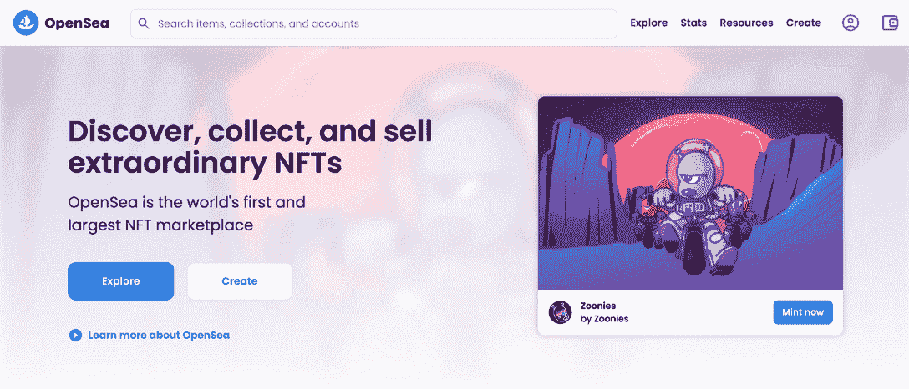

这里提供的一些 NFT 来自流行的项目，如无聊猿游艇俱乐部，沙盒，另一边的其他事迹，当然还有 ENS 域。

总的来说，NFT 市场支持跨越不同区块链平台的数百个项目。OpenSea 支持以太坊、 [Polygon](https://web.archive.org/web/20230123215922/https://dappradar.com/rankings/protocol/polygon) 、Klatyn、Solana、Polygon、Avalanche、Arbitrum、乐观和 BNB 链，它还将增加更多的平台。

任何使用 [Metamask](https://web.archive.org/web/20230123215922/https://dappradar.com/blog/what-is-metamask) 或其他 Web3 钱包登录该平台的人都可以创建自己的 NFT，而无需支付任何汽油费。创作者可以免费创建自己的 NFT 集和相应的 NFT，无需编写任何代码。使用他们自己的智能合同的游戏和其他区块链项目也可以很容易地添加到 OpenSea。

在 OpenSea 上销售 NFT 有几种方式。卖家可以设定一个固定的价格，让价格随着时间的推移而下降，或者设立一个有结束日期的拍卖。

[View more stats about OpenSea](https://web.archive.org/web/20230123215922/https://dappradar.com/ethereum/marketplaces/opensea)

### 2.X2Y2

分散的 NFT 市场 X2Y2 于 2022 年 2 月在 OpenSea 上随着吸血鬼的攻击而推出。与 OpenSea 不同，X2Y2 希望为用户提供“真正分散”的体验。实现上述想法的做法之一是通过奖励那些下注 X2Y2 代币的人来与其社区分享利润。

X2Y2 令牌是促进 X2Y2 生态系统的治理和费用共享实用工具令牌。今年 2 月，marketplace 向 2022 年 1 月 1 日之前在平台上交易的 OpenSea 用户空投了 12%的令牌供应。

除了在市场上交易 NFT，用户还可以用自己的 NFT 作为抵押，从其他贷款机构借入 ETH，这在 X2Y2 上被称为 NFT 贷款。那些已经建立起品牌知名度的蓝筹 NFT，比如 BAYC，Doodles，CryptoPunks 等。通常被视为理想的抵押品。

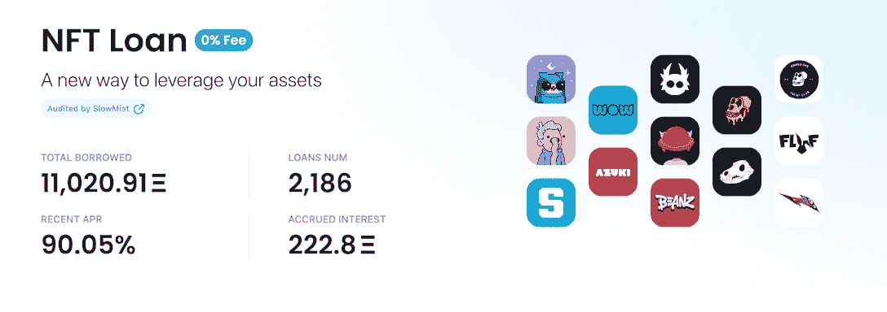

尽管今年 NFT 市场活动逐月下降，但由于其费用共享机制和 NFTFi 创新，Y2X2 在链上指标方面取得了令人印象深刻的成绩。

[View more stats about X2Y2](https://web.archive.org/web/20230123215922/https://dappradar.com/ethereum/marketplaces/x2y2)

### 3.魔幻伊甸园

魔术伊甸园是最大的索拉纳 NFT 市场，并已扩大到以太坊和多边形。它的流行源于几个原因。

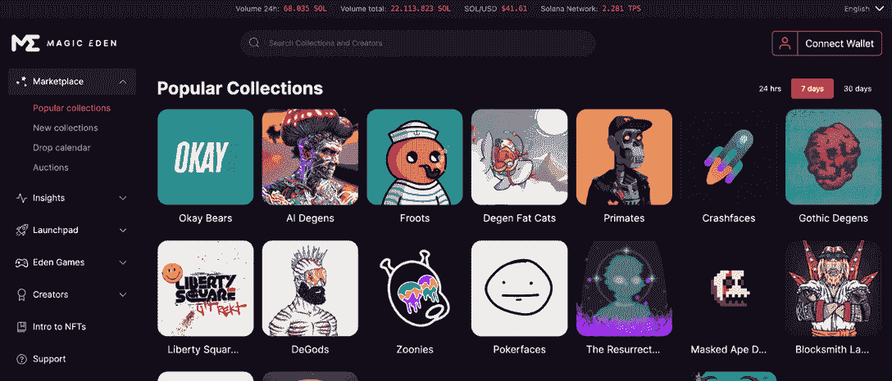

索拉纳网络本身速度快，天然气费用低，销售费用仅占 2%，市场迅速流行起来。这使得它成为创作者和交易者的一个很好的选择，但这并不是魔术伊甸园真正的乐趣所在。

它的特别之处在于它的启动平台允许新手创建者在没有开发经验的情况下创建 NFT。

Magic Eden 不仅是新创作者的绝佳起点，而且收藏家也可以通过使用该平台的 NFT 即将推出的策划列表受益于这个市场。

魔法伊甸园于 2022 年 9 月扩张至以太坊。据 CEO Jack Lu 透露，Magic Eden 的生态系统未来将扩展到其他网络，以太坊只是其中之一。他谈到了以太网生态系统中令人惊叹的 NFT 社区、收藏品、创作者和文化，这是 Magic Eden 将其作为首选的关键动机。

[View more stats about Magic Eden](https://web.archive.org/web/20230123215922/https://dappradar.com/solana/marketplaces/magic-eden)

### 6.看起来不错

在以太坊上运行的 NFT 市场 looks 于 2022 年初推出，是 OpenSea 的直接竞争对手。

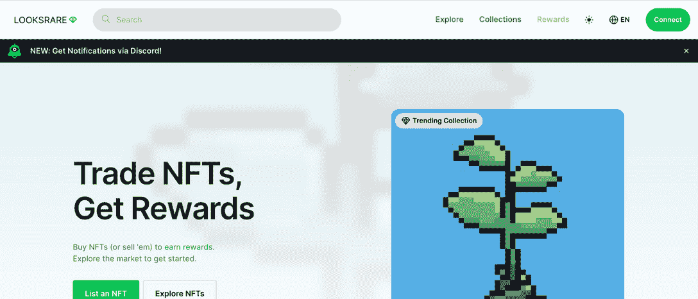

使用 LooksRare 有几个好处。首先，它便宜得多，只收取 2%的销售费用。第二，每次你使用这个市场购买或出售 NFT，你都会得到 [LOOKS token](https://web.archive.org/web/20230123215922/https://dappradar.com/hub/token/eth/LOOKS) 作为奖励。

值得注意的是，75%的 token 是分发给社区的，收益是分散的。此外，您可以下注这个代币，并赚取您的下注代币的利息，当然是以 LOOKS 代币支付。

奖励积分来自 LooksRare 竞价系统，该系统允许您对任何系列进行竞价并自行定价。

[View more stats about LooksRare](https://web.archive.org/web/20230123215922/https://dappradar.com/ethereum/marketplaces/looksrare)

### 5.布洛克托贝

BloctoBay 是一个流动的 NFT 市场。用户可以购买、出售和发现独家流量 NFT，包括 NBA Top Shot、Dark Country、MotoGP Ignition、CNN 的 Vault、Ben Mauro 的 Evolution、姆克儿、Chainmonsters 等。它支持 web 浏览器和本机应用程序体验。

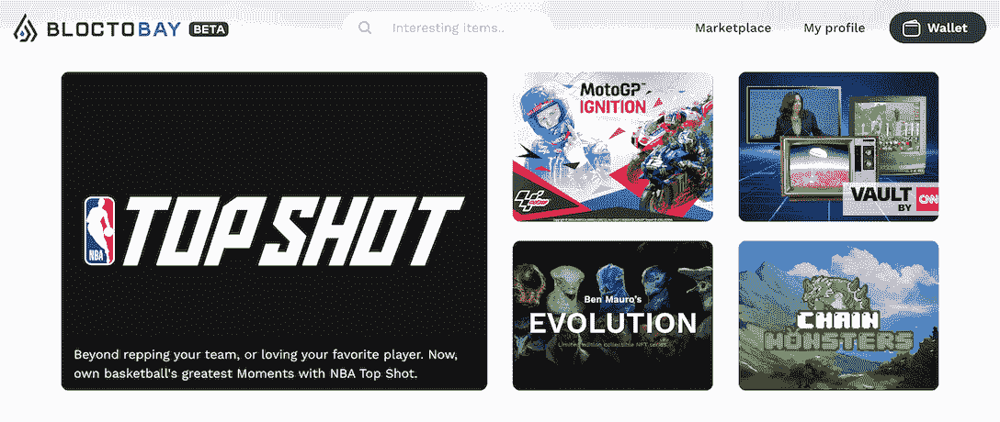

BloctoBay 在 2022 年的交易量达到 4.28 亿美元，在 DappRadar 跟踪的所有市场中排名第六。前五名是上面提到的四个交易市场，加上只交易自己的 NFTs 的 CryptoPunk marketplace。

BloctoBay 的交易量相比去年激增了 983%。这是由于除 NBA TopShot 之外的许多新系列进入市场，使用户的选择多样化。

在您探索 BloctoBay 之前，您必须首先连接您的 Blocto wallet。该钱包支持多个区块链，如流量，以太坊，创和更多未来。

[View more stats about BloctoBay](https://web.archive.org/web/20230123215922/https://dappradar.com/flow/marketplaces/bloctobay/)

### 6.不变的 X 市场

在不变的 X 区块链上，这是一个无汽油的市场。用户可以买卖 NFT，无需支付任何燃气费。

以太坊的第二层解决方案专注于为 Web3 游戏构建高吞吐量和高性价比的基础设施。现在，不可变 X 已经发展成为一个充满活力的游戏区块链，是一些流行游戏的家园，如《被解放的上帝》和《守护者协会》。此外，最受期待的游戏之一 Illuvium 也选择了 Immutable 作为运行其游戏的网络。

考虑到这一点，就很容易理解为什么 Immutable X Marketplace 已经成为 NFT 最引人注目的市场之一，因为用户可以在这里交易在 Immutable X 网络上创建的各种各样的数字资产。最重要的是，该市场利用了区块链范围内的 NFT 订单簿，在不变的 x 上的 NFT 市场之间形成了良性竞争

[View more stats about Immutable X Market](https://web.archive.org/web/20230123215922/https://dappradar.com/rankings/protocol/immutablex/category/marketplaces)

### 7.虚化

模糊是一个特殊的 NFT 市场，因为它是为专业交易者服务的。这也反映在它的界面设计上，它采用简单的设计和暗色调来突出数据、信息和快速行动。

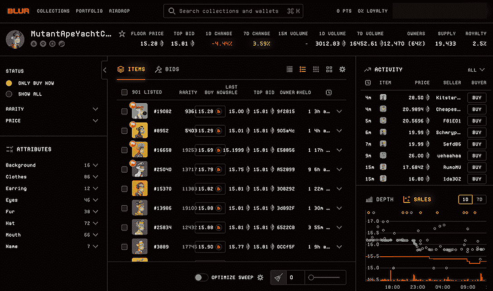

这个新的 NFT 市场得到了许多秘密投资者和意见领袖的支持，包括 Pink 6529、Cozomo Medici (Snoop Dogg)、dhof(Vine and Loot 的创造者)等。在从这些投资者那里筹集了 1100 万美元的资金后，它于 2022 年 10 月 19 日正式上线。

模糊不针对一般用户。有趣的是，尽管定位于小众市场，但该平台的用户拥有惊人的“购买力”。在过去的 30 天里，Blur 上唯一活跃钱包的数量只有 OpenSea 的 1/6，但前者产生了 1.631 亿美元的交易，后者产生了 2.79 亿美元的交易。

[View more stats about Blur](https://web.archive.org/web/20230123215922/https://dappradar.com/ethereum/marketplaces/blur)

### 8.θ下降

Theta Drop 是 Theta Network 上的一个 NFT 市场，这是一个专为媒体和娱乐而建的生态友好型区块链。根据 Theta 网站的说法，在 Theta 网络上创建和交易 NFT 只需几分之一便士，比以太坊快 100 倍。

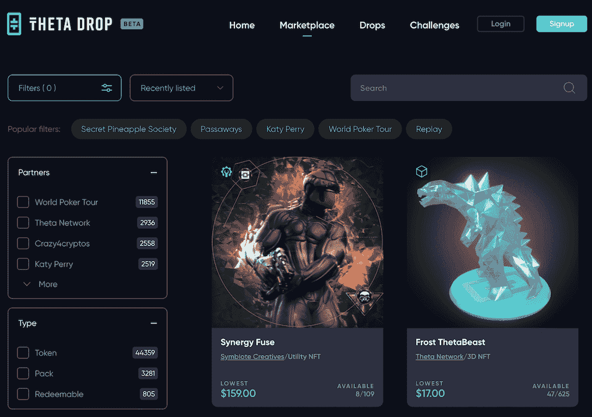

Theta Drop 是一个实时的 NFT 市场，这是它最大的卖点。这意味着该市场在拍卖和 NFT 下降期间纳入了直播流，旨在增加创作者粉丝的参与度，并与电视直播和有线广播合作，面向数百万全球观众。

由于这些独特的功能，Theta Drop 与知名 IP 和名人进行了多次合作，包括美国偶像、世界扑克巡回赛、凯蒂佩里等。

[View more stats about Theta Drop](https://web.archive.org/web/20230123215922/https://dappradar.com/theta/marketplaces/thetadrop/marketplaces)

### 9.索拉纳特

索拉纳是第一个在索拉纳上推出的 NFT 市场。虽然它不再是网络上的第一名，但它仍然提供了很多。

费用是 3%，但是创作者可以自由决定包含在 NFTs 售价中的创作者费用的数额。

这个市场的另一个出色的特点是价格历史，让收藏家可以看到藏品在其生命周期中的表现。如果你想确认你打算购买的 NFT 是否是一项好的投资，这可能会有所帮助。

Solanart 还推出了贷款功能。当用户需要借用 SOL 时，他们锁定一个 NFT 作为担保。即使被用作抵押品，NFT 也将留在用户的钱包里，因此他们仍然可以享受空投之类的好处。

用户可以借贷的金额最高为最低价值的 40%，他们有 14 天的时间偿还贷款。

[View more stats about Solanart](https://web.archive.org/web/20230123215922/https://dappradar.com/solana/marketplaces/solanart)

### 10.原子中枢

NFT 有各种各样的区块链蜡像市场，但真正的领导者只有一个，那就是 T2 原子能中心。这个市场列出了所有的蜡项目，并允许每个人交易他们的资产对蜡令牌。

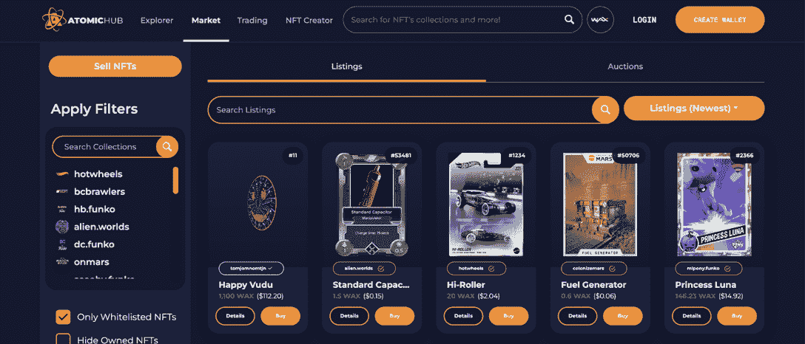

蜡区块链土生土长意味着交易不需要任何汽油费，这也是市场发展迅猛的原因之一。这允许用户交易价值 0.25 美元的资产。

此外，在 Atomic Hub 上创建自己的 NFT 收藏也相当容易。无需支付任何汽油费，用户只需点击顶部菜单中的“NFT 创建者”即可创建自己的收藏。每个集合都可以填充相似主题的 NFT，创建者可以使用“模式”来标准化这些 NFT 背后的数据。

[View more stats about Atomic Hub](https://web.archive.org/web/20230123215922/https://dappradar.com/wax/marketplaces/atomicmarket)

### 11.稀有的

Rarible 是 NFT 的一个市场和聚合器，在这里每个买卖 NFT 的人都会自动获得 [RARI 代币](https://web.archive.org/web/20230123215922/https://dappradar.com/blog/how-to-claim-rari-tokens)。这些 RARI 代币给了所有者平台的股份和治理决策的投票权。尽管 Rarible 允许用户出售游戏物品，但该平台非常注重艺术品和数字收藏品。

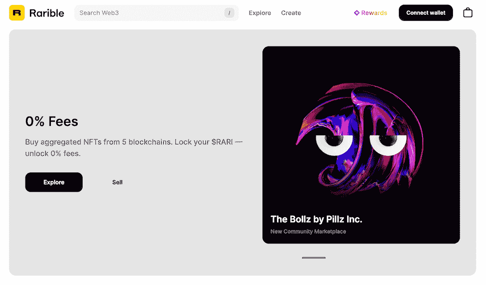

创作者可以使用稀有智能合约在稀有上铸造 NFT。在这种情况下，你的 NFT 将被添加到稀有收藏。

然而，Rarible 也允许用户创建自己的收藏。这意味着该平台将创建一个独特的智能合同，允许艺术家和卖家将他们的创作捆绑到一个集合中。根据以太坊区块链的天然气费用，推出这样一份智能合同可能相当昂贵。

在 Rarible 上，你可以出售各种 NFT，从艺术品和收藏品到游戏物品、虚拟土地和域名。该平台允许卖家仅对那些购买其 NFTs 的人隐藏内容，这是一个在创作者经济中经常使用的功能。

[View more stats about Rarible](https://web.archive.org/web/20230123215922/https://dappradar.com/multichain/marketplaces/rarible)

### 12.超级罕见

SuperRare 已经成为 NFT 艺术中心，集策展、画廊和拍卖于一体。该平台只允许知名艺术家出售他们的作品，并对他们出售的艺术进行策划。

因此，被 SuperRare 认可被圈内人认为是一项了不起的成就。所有在 SuperRare 上的购买都需要以太币或以太币，以太币是以太坊区块链的本地货币。

SuperRare 上的艺术品通常更具排他性，也更昂贵。所有售出的物品都是独一无二的，也就是说只有一个版本。

[View more stats about SuperRare](https://web.archive.org/web/20230123215922/https://dappradar.com/ethereum/marketplaces/superrare)

### 13.基础

另一个以美术 NFTs 闻名的平台是基金会，它非常注重艺术质量。最初，你只能在受到第三方邀请的情况下出售你的作品。然而，基金会今年早些时候放弃了邀请政策，寻求市场扩张。

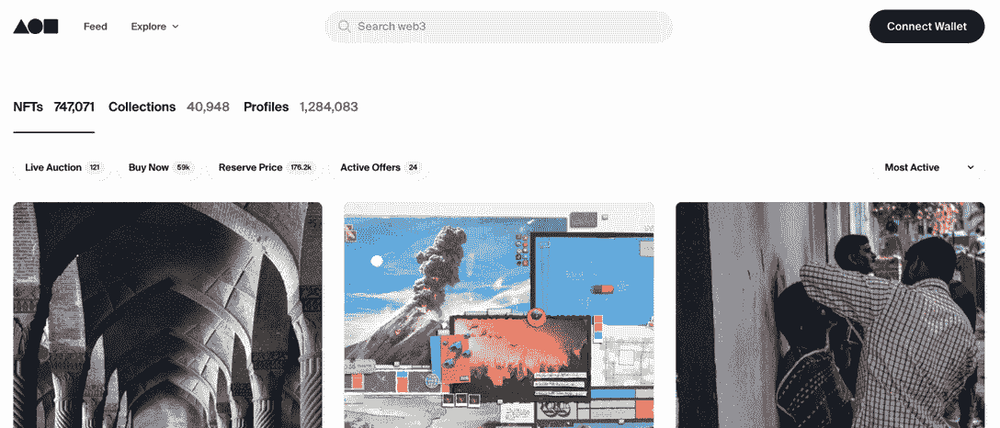

以前，所有艺术品都通过拍卖出售，而平台不允许二次销售。但随着基金会在 2021 年 5 月推出二级市场，这种局面宣告结束。

Foundation 在用户体验方面不断创新，特别是引入了 Drops 功能。对于创作者来说，Drops 是启动大型项目的一种更省油、更划算的方式。例如，你可以用制造一个 NFT 所需要的相同数量的气体制造一个高达 10，000 NFT 的水滴。

Drops 还支持静态定价，允许创作者为收藏中的每个 NFT 单独定价。

[View more stats about Foundation](https://web.archive.org/web/20230123215922/https://dappradar.com/ethereum/marketplaces/foundation)

### 14.分散土地市场

分散的土地是一个分散的虚拟现实平台，由以太坊区块链提供动力。在去中心化的世界里，用户可以创造、体验和货币化他们所建造和拥有的东西。

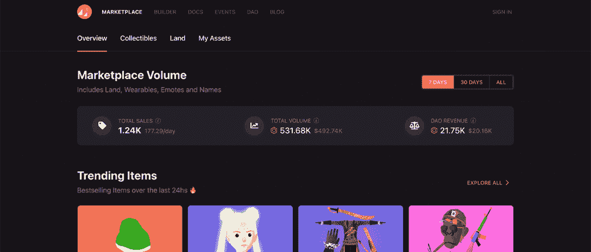

在共享的虚拟世界中，用户可以购买土地，即记录在区块链支持的账本上的“地块”。土地本身以及建立在其上的虚拟财产是一种不可替代的数字资产或公用事业令牌，称为土地，存储在以太坊智能合同中。

土地所有者控制在其土地上发布的内容，这些内容被编码到智能合同中。这些内容可以是任何东西，从场景和图像到游戏和应用程序。用户可以像在现实世界中一样探索、旅行和参观场馆。该平台也是一个供用户互动的对等网络。

[View more stats about Decentraland](https://web.archive.org/web/20230123215922/https://dappradar.com/ethereum/social/decentraland)

### 15.NFT 烤饼店

截至 2021 年 9 月，分散式交易所 [PancakeSwap](https://web.archive.org/web/20230123215922/https://dappradar.com/binance-smart-chain/defi/pancakeswap) 在 BNB 连锁店推出了自己的 NFT 市场。

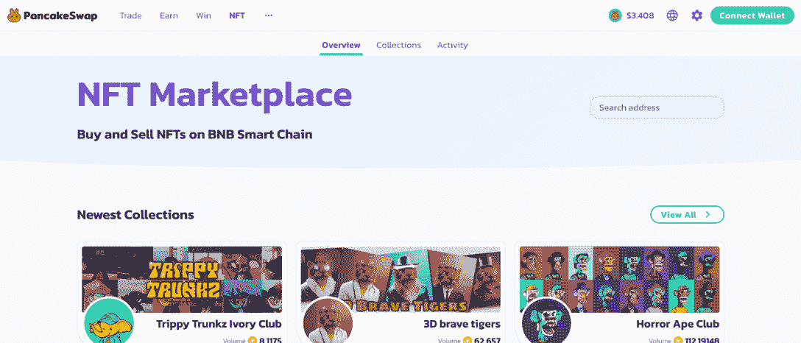

他们的第一个 NFT 系列非常成功的推出，煎饼兔子，是今天 NFT 最好的市场之一的开始。PancakeSwap 用户能够以非常低的费用在市场上列出基于 BSC 的 NFT。

更不用说，PancakeSwap 从每笔销售额中扣除 2%，然后用于回购和焚烧蛋糕代币。

[View more stats about PancakeSwap NFT](https://web.archive.org/web/20230123215922/https://dappradar.com/binance-smart-chain/defi/pancakeswap)

### 16.元素

Element 是一个社区驱动的聚合市场，通过节省用户的时间和金钱来增强用户的能力。

市场为用户提供了各种高效的交易功能。例如，用户可以批量订购或批量取消，这有助于节省高达 49%的天然气。对于创作者来说，Element 的吸引力在于它允许他们的 NFT 在多个市场上市。此外，用户可以在出售 NFT 时立即收到版税，没有结算延迟。

多市场上市目前支持 Element、OpenSea、LooksRare、X2Y2 等交易市场。

[View more stats about Element](https://web.archive.org/web/20230123215922/https://dappradar.com/multichain/marketplaces/element-market/marketplaces)

### 17.Objkt

Tezos 网络上最大的市场， [Objkt](https://web.archive.org/web/20230123215922/https://dappradar.com/tezos/marketplaces/objkt-com) 有着有趣的历史。它最初是一个为现已停产的 Hic et Nun marketplace 运营拍卖的平台，后来逐渐发展成为 Tezos 上的 NFT 平台。

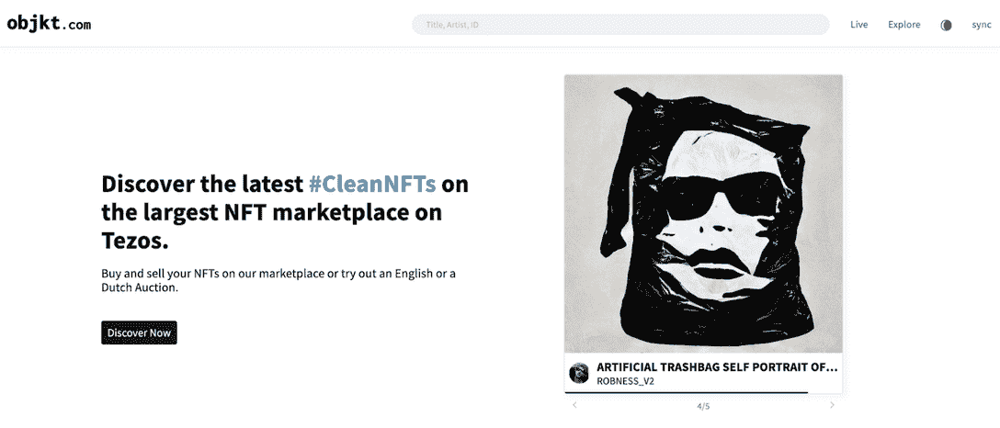

Objkt 允许 NFT 铸币，但它也展示了 Tezos 上所有来自 Kalamint、Rarible 和 FXHash 等平台的可用 NFT。

它对所有成功的交易收取 2.5%的费用。对于 Tezos 上的收藏者来说，Objkt 有一个排行榜，允许用户监控整个网络中的热门收藏和底价。

[View more stats about Objkt](https://web.archive.org/web/20230123215922/https://dappradar.com/tezos/marketplaces/objkt-com)

### 18.NFTrade

跨链 NFT 市场和产量农业平台 NFTrade 是另一个值得注意的 NFT 市场聚合器。

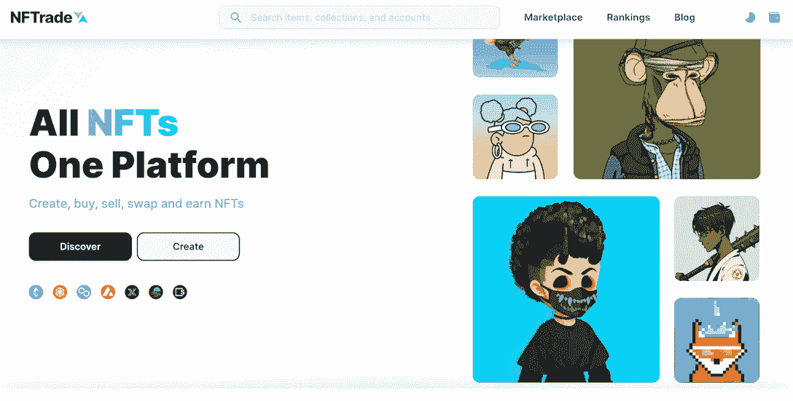

多链市场，聚集了六个区块链的 NFT，包括以太坊、多边形、雪崩网络、BNB 链、月光和月光。

NFT 农场允许持有者从他们的代币中获得额外的额外奖励。通过 NFTrade，来自不同领域和生态系统的项目，无论属于哪个行业，都可以通过 NFTs 为其令牌持有者带来额外的收益。

[View more stats about NFTrade](https://web.archive.org/web/20230123215922/https://dappradar.com/avalanche/marketplaces/nftrade)

### 19.伞兵部队

Paras 是一个建立在区块链附近的数字艺术卡市场。所以 Paras 使用 NEAR 令牌作为用户之间的交换媒介。

Paras 对其艺术家的作品采取了策展的方式。它采用了一个选择过程，确保始终如一的质量和提升创作者。艺术家必须申请在 Paras 上创建新卡，每周只能批准 30 名新艺术家。

Paras 希望不仅仅成为一个 NFT 市场。他们的目标是利用 Web3 技术来孵化和生产加密的原生 IP。通过自下而上的方法创建 IP，它将为用户带来不同类型的内容体验。

[View more stats about Paras](https://web.archive.org/web/20230123215922/https://dappradar.com/near/marketplaces/paras-2-0#dappradar-full-description)

### 20.兰德画廊

兰德画廊是阿尔格兰德网络上最大的 NFT 市场之一。它允许用户轻松地购买、销售和分发 Algorand 支持的 NFT。

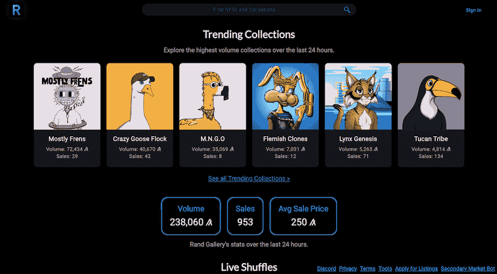

有几种方法可以在兰德画廊买到 NFT 的作品。购买 NFT 的第一个也是最基本的方法是找到你喜欢的列表，然后直接购买。

除此之外，你还可以从 shuffle 购买 NFT，这是一种更有趣的购买 NFT 的方式。一次洗牌可以包含整个系列或部分系列，随机出售。许多集合将在特定的日期和时间开始洗牌，所以你需要掌握项目的社交媒体渠道。

[View more stats about Rand Gallery](https://web.archive.org/web/20230123215922/https://dappradar.com/multichain/marketplaces/rand-gallery)

### 21.Quix

Quix 是 NFT 最大的乐观市场，也可以在 Artbitrum 上找到，这两个都是以太坊的第二层扩展解决方案。

值得注意的是，Quix 继承了 mainnet Ethereum 的所有安全性，而执行交易的成本却很低。市场的安全性和效率是毋庸置疑的。Quix 的平均交易费仅为 0.0001 ETH，迄今为止已经为用户节省了 900 万美元的汽油费。

[View more stats about Quix](https://web.archive.org/web/20230123215922/https://dappradar.com/multichain/marketplaces/quix)

### 22.托丰特

以前被称为 SCV NFT 市场， [tofuNFT](https://web.archive.org/web/20230123215922/https://dappradar.com/multichain/marketplaces/tofunft) 是一个多连锁店的 NFT 市场，专注于游戏和收藏品。

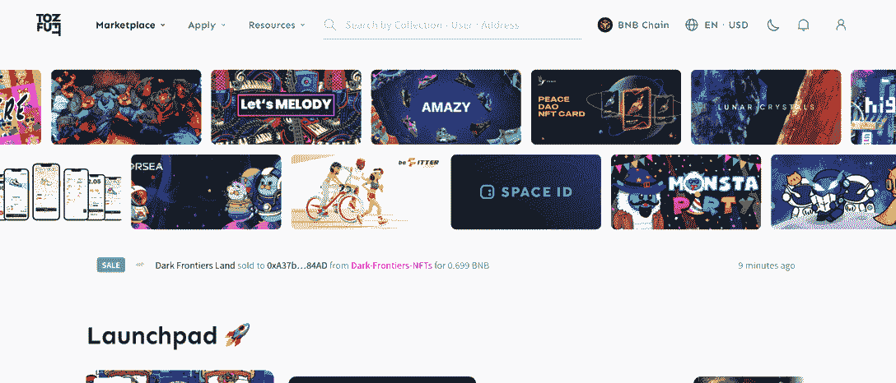

虽然收藏家可以利用 tofuNFT 全面的搜索和过滤引擎轻松找到任何 NFT，但这个市场对交易者和创作者来说也不轻松。

挂牌交易不收汽油费，NFT 可以通过拍卖、固定价格或接受购买要约的方式出售。请注意，平台会收取 5%的高额费用。

tofuNFT 于 2021 年 12 月推出，它拥有一批忠实的用户。

[View more stats about tofuNFT](https://web.archive.org/web/20230123215922/https://dappradar.com/multichain/marketplaces/tofunft)

### 23.祖泽市场

Zuse Market 是一个建立在 Hedera 上的 NFT 发射台和市场。

该市场于 2022 年 2 月首次亮相，自那以来取得了令人难以置信的进展。值得注意的是，Zuse Market 在 2022 年下半年表现出显著的势头，交易量超过 600 万美元。

[View more stats about Zuse Market](https://web.archive.org/web/20230123215922/https://dappradar.com/hedera/marketplaces/zuse-market/marketplaces)

### 24.JPG 商店

JPG 商店是一个基于卡达诺的市场，允许用户创建和发现 NFT 艺术品和收藏品。

作为卡尔达诺的领先市场，JPG 商店努力支持那些艺术家、创作者和社区推进生态系统，帮助卡尔达诺释放其潜力。JPG 商店的交易接受 ADA，即 Cardano 网络的本地令牌。

特别值得注意的是，自 2022 年 6 月以来，JPG 店的交易量飙升。其日交易量稳定保持在 20 万美元以上，最高时超过 80 万美元。

[View more stats about JPG Store](https://web.archive.org/web/20230123215922/https://dappradar.com/cardano/marketplaces/jpg-store)

### 25.已知来源

[已知产地](https://web.archive.org/web/20230123215922/https://dappradar.com/ethereum/marketplaces/knownorigin)是区块链以太坊最早的 NFT 艺术市场之一。

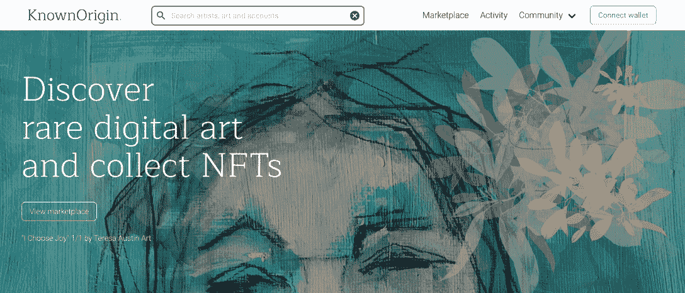

策划艺术平台今天仍然存在，只允许被批准的创作者在他们的平台上出售他们的数字艺术。在 NFT 的炒作中，该平台似乎失去了一些意义，但该平台仍然有一个活跃的一级和二级销售市场。

[View more stats about Known Origin](https://web.archive.org/web/20230123215922/https://dappradar.com/ethereum/marketplaces/knownorigin)

## 什么是 NFT，在哪里可以买到？

NFT 是区块链上独特的数字物品，例如，它们可以是可收藏的卡片、艺术品，也可以是虚拟房地产，或者是视频游戏中的剑。

有 NFT 市场买卖你自己的不可替代的代币或数字资产，它们有各种各样的形状和大小。

要了解更多关于 NFTs 的信息，请参考[我们关于 NFTs 的教育文章](https://web.archive.org/web/20230123215922/https://dappradar.com/blog/what-are-non-fungible-tokens-nfts)。

## 如何打造 NFT 系列？

在你铸造 NFT 之前，你首先需要制作一个数字资产。这可以是一张照片，一个数字作品，等等。然后，您需要将该数字资产铸造为 NFT，在大多数情况下，这可以在此处列出的 NFT 市场上轻松完成。

作为 NFT 的创作者，你有责任只在一个地方铸造你的作品。从技术上讲，你可以多次铸造相同的数字资产，但这肯定会损害你作为创造者的声誉。

NFTs 最常见的令牌标准是 ERC-721，而 ERC-1155 是后来才加入的。然而，随着以太坊替代品的兴起，代币标准也被复制到不同的区块链。

在 Tron 上，有 TRC-721 标准，而币安智能链支持 BEP-721 和 BEP-1155。此外，Wax 和 Flow 对 NFT 有自己的标准。

## 如何跟踪最好的 NFT 市场？

当收集非功能性交易时，了解市场的最新情况是非常重要的。跟踪 NFT 最佳市场表现的最佳工具之一是 [DappRadar NFT 市场排名](https://web.archive.org/web/20230123215922/https://dappradar.com/nft/marketplaces)。

在那里，你会发现不可替代的代币交易量，每个市场的交易者数量，以及更多的关键指标。

## DappRadar 可以帮助您管理您的 NFT 波尔图葡萄酒

多亏了新的 [DappRadar 投资组合跟踪器](https://web.archive.org/web/20230123215922/https://dappradar.com/hub/wallet/)，你可以根据最近的销售价格来跟踪你的 NFT 投资组合的总价值。界面干净易用，还可以跟踪新的收藏和加密货币。

[https://web.archive.org/web/20230123215922if_/https://www.youtube.com/embed/WHL_uYv8riA?feature=oembed](https://web.archive.org/web/20230123215922if_/https://www.youtube.com/embed/WHL_uYv8riA?feature=oembed)

你想在激动人心的 Web3 世界中了解更多关于 NFT 最佳项目的信息吗？关注 [DappRadar 博客](https://web.archive.org/web/20230123215922/https://dappradar.com/blog/)、 [YouTube](https://web.archive.org/web/20230123215922/https://www.youtube.com/c/DappRadar) 频道和 [Twitter](https://web.archive.org/web/20230123215922/https://twitter.com/dappradar) 。

***以上不构成投资建议。此处给出的信息仅供参考。请行使尽职调查，做你的研究。***

 NewsletterUnsubscribe at any time. [T&Cs](https://web.archive.org/web/20230123215922/https://dappradar.com/terms) and [Privacy Policy](https://web.archive.org/web/20230123215922/https://dappradar.com/privacy-policy)