# 5 款最佳游戏，包含“边玩边赚”奖学金计划

> 原文：<https://web.archive.org/web/https://dappradar.com/blog/best-play-to-earn-games-scholarship-programs>

## 开始以学者的身份玩游戏，一边玩一边赚钱

“玩即赚”游戏已经成为区块链最受欢迎的领域之一，奖学金项目通常是玩家了解这些游戏的途径。然而，并不是所有的项目都为新手提供这种简单的切入点。下面是一个为每个人提供奖学金项目和可访问的入职机制的游戏列表。

虽然区块链上的游戏可能有利可图，但它通常需要大量的初始投资。这可以是 NFT 人物、土地、法术书和其他进入游戏赚钱生态系统所必需的资源。然而，并不是所有的玩家都有能力购买这些入门资源。这就是奖学金项目和贷款机制派上用场的地方。

## 什么是奖学金项目？

2021 年的游戏赚钱热潮也让位于玩家之间互动方式的新趋势。区块链游戏市场发展迅速，由于高昂的价格和准入要求，无法进入的玩家数量也随之增加。

奖学金项目有多种形式，但它们的主要目标是为游戏赚钱项目提供一个更容易获得的切入点。实质上，奖学金计划允许拥有更多资源和资产的玩家将它们分配和出租给其他不能自己购买这些入门资产的玩家。当然，每个计划都有其独特的特点和要求。尽管如此，最终的目标是为尽可能多的玩家提供进入游戏赚钱世界的机会。

## 5 个游戏，带“边玩边赚”奖学金计划

### 无限轴

如果不提到 Axie Infinity，我们甚至不可能开始谈论“游戏赚钱”奖学金。这个以游戏赚钱的庞然大物是第一个将奖学金项目和行会放到地图上的。该游戏目前拥有该领域最大的学术社区。

Axie Infinity 公会和奖学金在 2020 年出现，当时游戏的 NFTs 飙升至历史最高价格。为了开始玩游戏，用户需要有一个由 NFTs 代表的三轴团队。由于 Axie NFTs 每张售价数百美元，许多玩家转向奖学金。这些允许他们参与经理的非功能性金融交易，作为回报，他们分享他们的游戏赚取利润。

Axie Infinity 为该领域的奖学金项目设立了高标准。成千上万的玩家现在是公会的一部分。奖学金项目已经不仅仅是简单的出租 NFT。今天，Axie Infinity 奖学金计划是一种创建强大的技能型玩家团队的方式，希望一起游戏和赚钱。浏览下面的链接，开始成为 Axie Infinity scholar。

[<picture>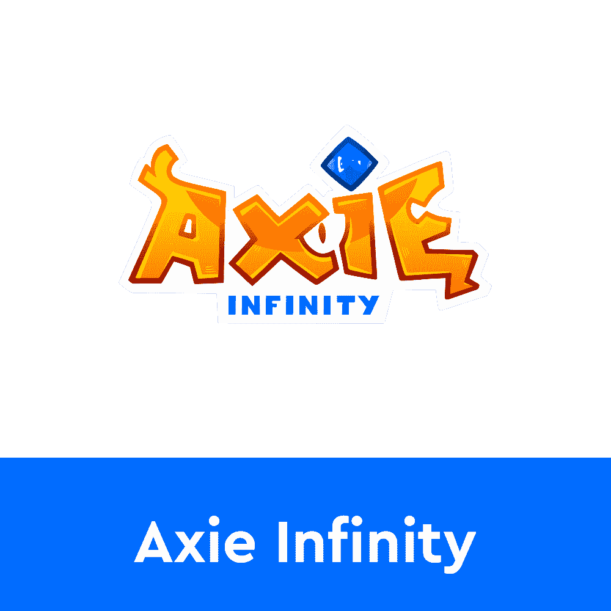</picture>](https://web.archive.org/web/20221202194607/https://dappradar.com/multichain/games/axie-infinity)[<picture>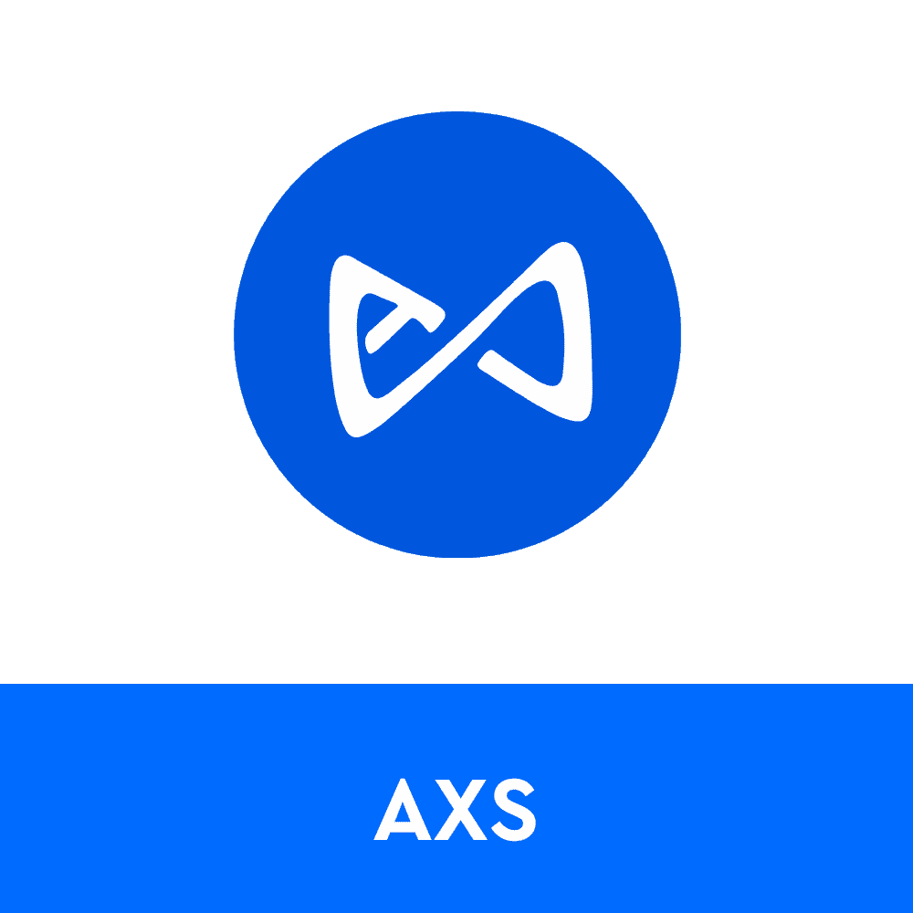</picture>](https://web.archive.org/web/20221202194607/https://dappradar.com/hub/token/eth/AXS/ETH?from=0xbb0e17ef65f82ab018d8edd776e8dd940327b28b)[<picture>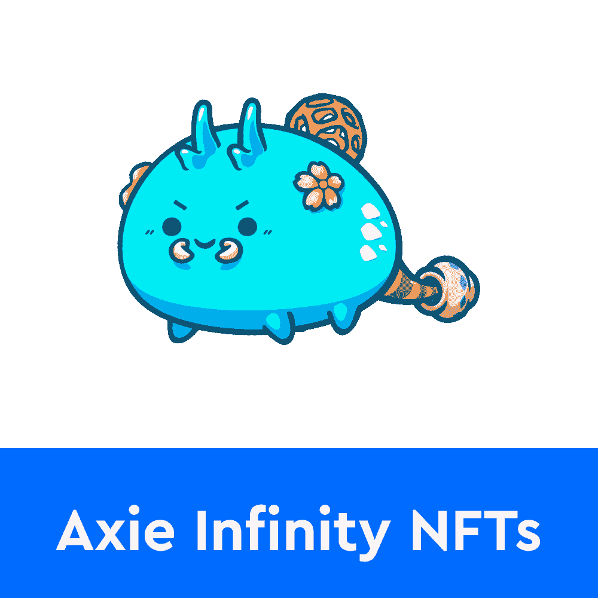</picture>](https://web.archive.org/web/20221202194607/https://dappradar.com/multichain/games/axie-infinity)

[https://web.archive.org/web/20221202194607if_/https://www.youtube.com/embed/oMa8cc6YxSI?feature=oembed](https://web.archive.org/web/20221202194607if_/https://www.youtube.com/embed/oMa8cc6YxSI?feature=oembed)

### Thetan 竞技场

跟随 Axie Infinity 的脚步，Thetan Arena 是另一个受欢迎的游戏赚钱项目，拥有完善的奖学金计划。收集 NFT 战斗角色和建立一支强大的队伍是西坦竞技场游戏的核心。然而，随着游戏开始吸引越来越多的玩家，NFT 价格飙升，现在有许多学者在那里，借用 NFT 作为奖学金计划的一部分。

坦竞技场允许玩家参加一对一的战斗和比赛，以赚取 TCG 和 THC 代币。然后，这些令牌可以用来提高您的 NFTs 的统计数据，或者在 dex 上交换其他加密资产。在 Animoca Brands 和 Kardia Ventures 等行业巨头的支持下，Thetan Arena 已经成为刚刚起步的玩家的一个游戏赚钱项目。

[<picture>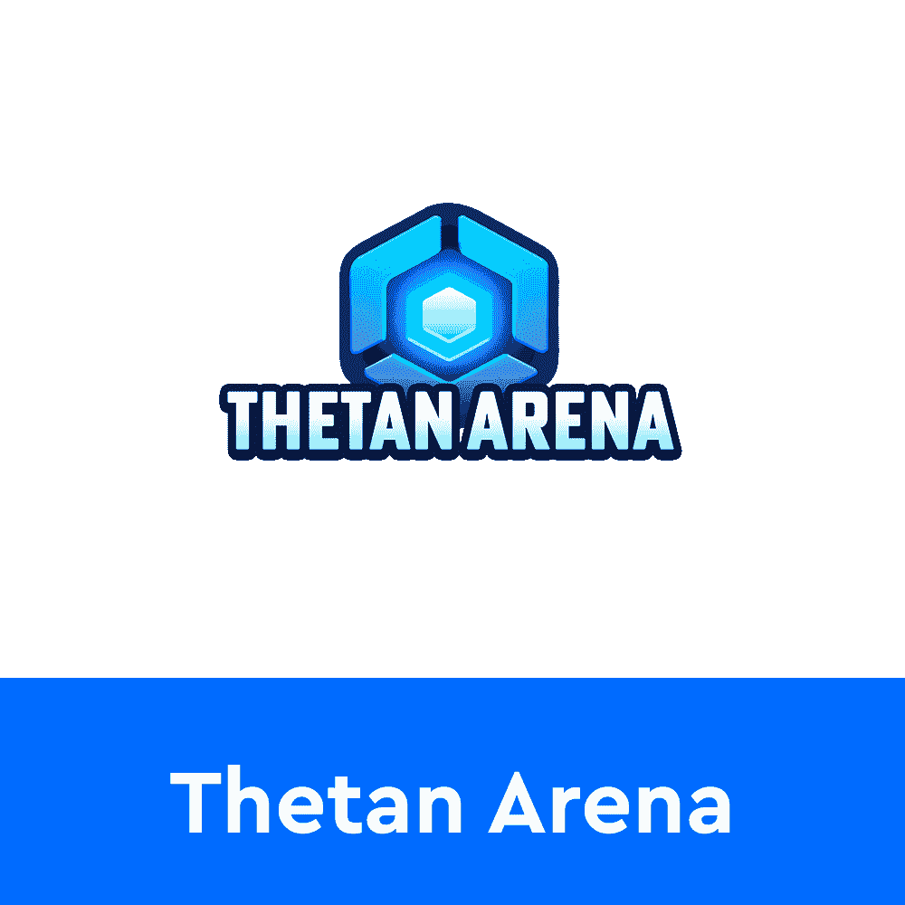</picture>](https://web.archive.org/web/20221202194607/https://dappradar.com/binance-smart-chain/games/thetan-arena)[<picture>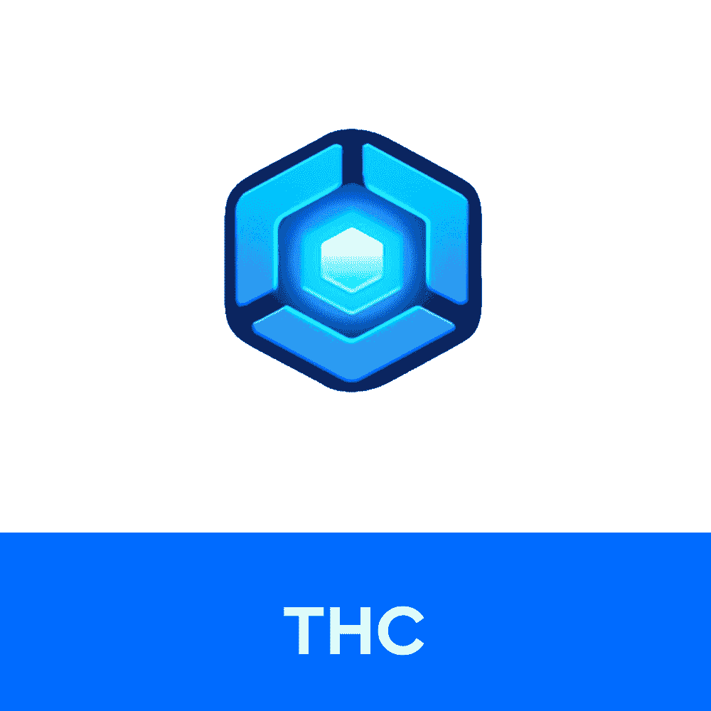</picture>](https://web.archive.org/web/20221202194607/https://dappradar.com/hub/token/bsc/USDT?from=0x24802247bd157d771b7effa205237d8e9269ba8a)[<picture>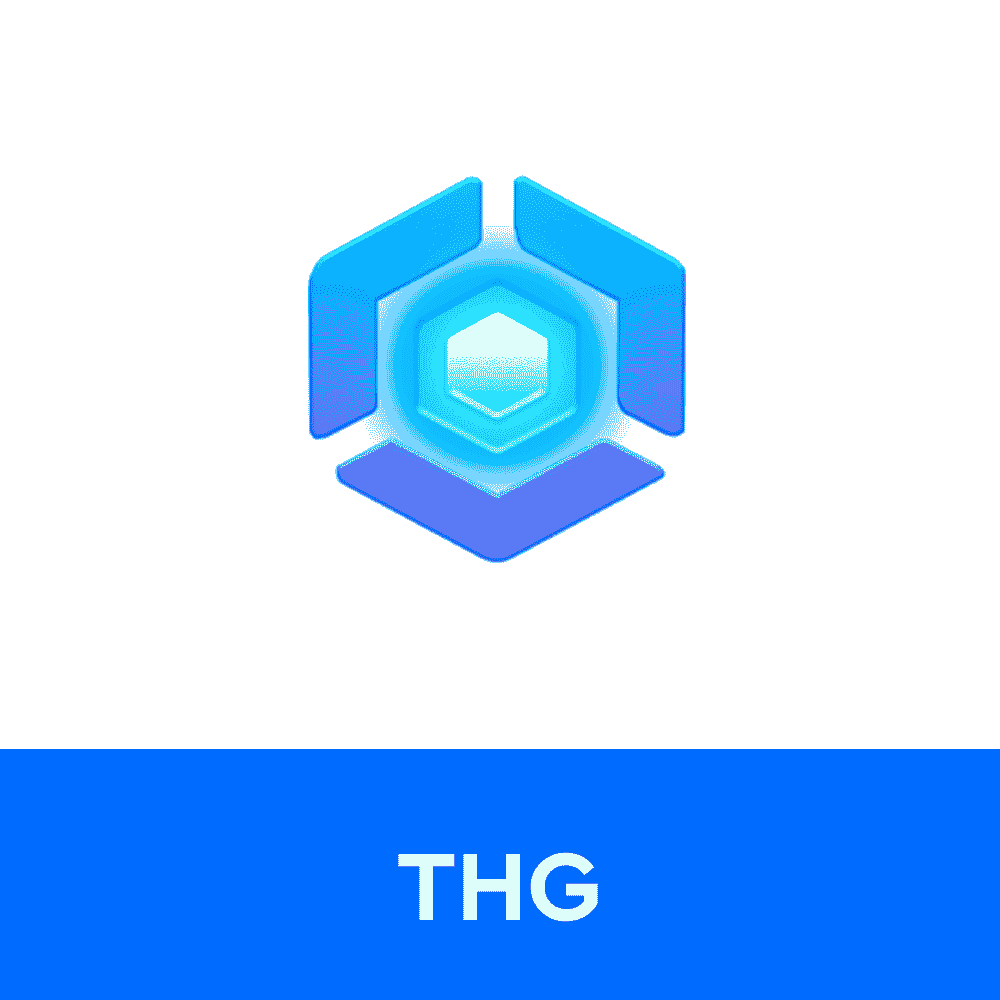</picture>](https://web.archive.org/web/20221202194607/https://dappradar.com/hub/token/bsc/USDT?from=0x9fd87aefe02441b123c3c32466cd9db4c578618f)

[https://web.archive.org/web/20221202194607if_/https://www.youtube.com/embed/YlP8C390SsQ?feature=oembed](https://web.archive.org/web/20221202194607if_/https://www.youtube.com/embed/YlP8C390SsQ?feature=oembed)

### Aavegotchi

Aavegotchi 已经成为多边形区块链上的一个奇迹项目。这款游戏在 2022 年一直处于稳步上升的轨道上，游戏中可玩角色 NFTs 的价格也是如此。令人印象深刻的是，Aavegotchi 最近刚刚推出了一个租借机制，允许玩家租借 Gotchi NFTs 并参与游戏赚取功能。

租一辆哥特 NFT 可以让玩家在新推出的哥特里弗斯中参与探索任务。这些任务会奖励玩家大量的游戏内资源和代币，比如 FUD、FOMO、阿尔法和 KEK。

[<picture>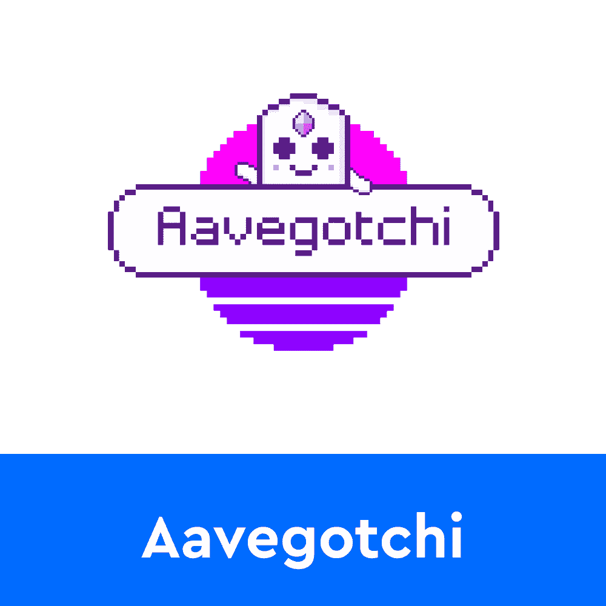</picture>](https://web.archive.org/web/20221202194607/https://dappradar.com/polygon/games/aavegotchi)[<picture>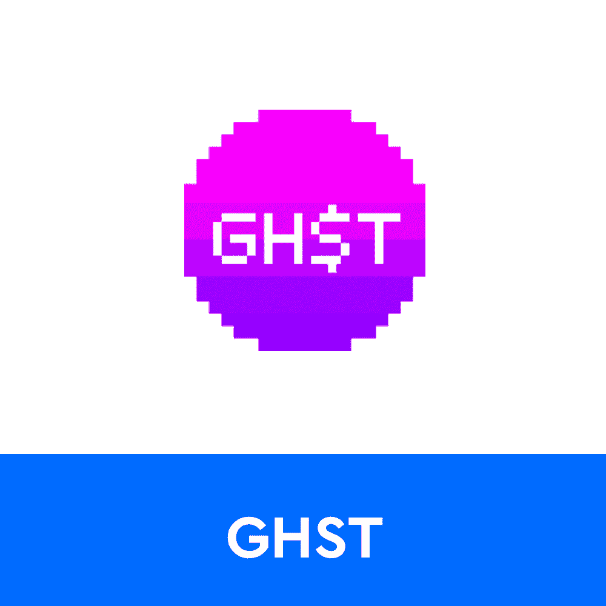</picture>](https://web.archive.org/web/20221202194607/https://dappradar.com/hub/token/eth/GHST_1?from=0x3F382DbD960E3a9bbCeaE22651E88158d2791550)[<picture>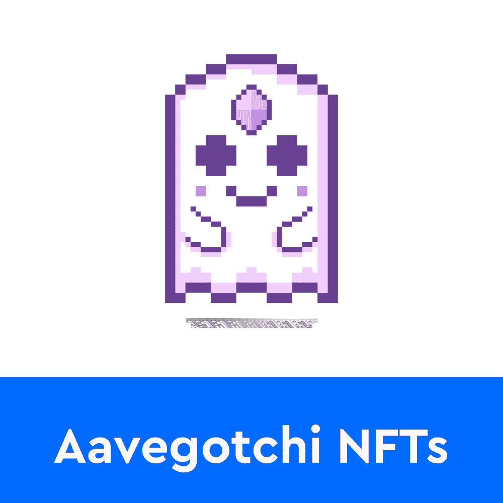</picture>](https://web.archive.org/web/20221202194607/https://dappradar.com/polygon/games/aavegotchi)

[https://web.archive.org/web/20221202194607if_/https://www.youtube.com/embed/PtgZT-dVERI?feature=oembed](https://web.archive.org/web/20221202194607if_/https://www.youtube.com/embed/PtgZT-dVERI?feature=oembed)

### 分散游戏冰扑克

进入一种不同的游戏，分散游戏冰扑克已经成为区块链游戏扑克方面的领导者。该平台托管在分散的虚拟世界中，允许拥有或租赁可穿戴 NFT 的玩家参与日常挑战并赚取冰代币。

分散游戏团队一直在努力开发一个复杂的代表团和奖学金计划。随着游戏开始吸引越来越多的玩家，有限的可穿戴式 NFT 供应成为受欢迎的资产。现在，分散游戏冰扑克玩家可以委托他们的可穿戴 NFT，并分享他们的委托人产生的每日冰利润。

[<picture>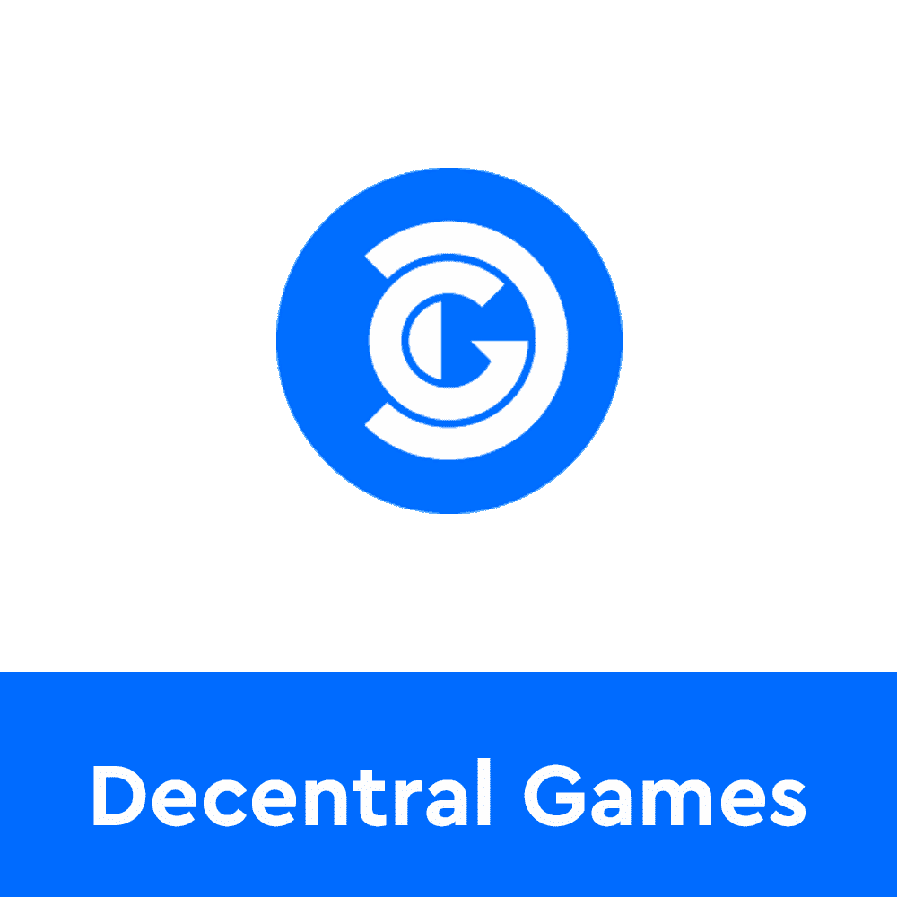</picture>](https://web.archive.org/web/20221202194607/https://dappradar.com/multichain/games/decentral-games)[<picture>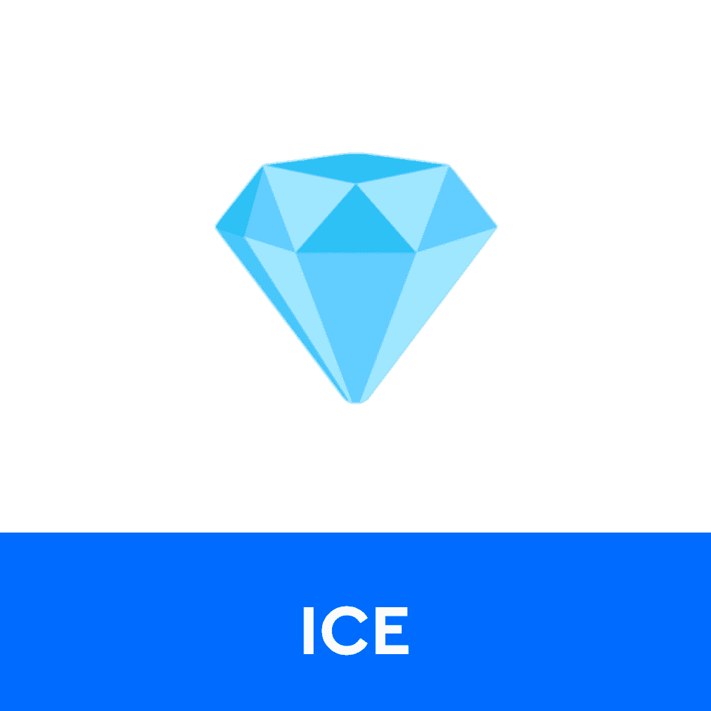</picture>](https://web.archive.org/web/20221202194607/https://dappradar.com/hub/token/polygon/ICE_2?from=0xc6c855ad634dcdad23e64da71ba85b8c51e5ad7c)[<picture>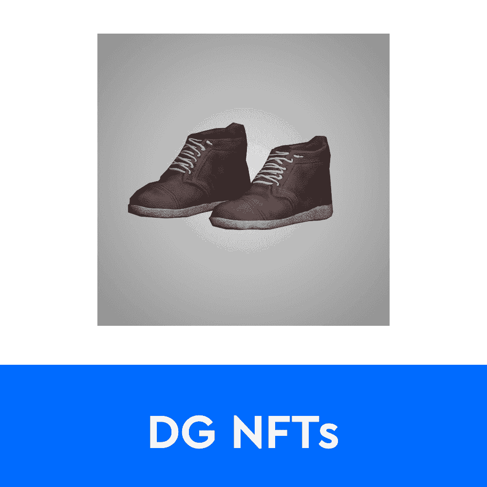</picture>](https://web.archive.org/web/20221202194607/https://dappradar.com/nft/protocol/polygon)

[https://web.archive.org/web/20221202194607if_/https://www.youtube.com/embed/iWTSheM5CoI?feature=oembed](https://web.archive.org/web/20221202194607if_/https://www.youtube.com/embed/iWTSheM5CoI?feature=oembed)

### 夹板地

最后但同样重要的是，在这个列表中，我们有分裂的土地。作为一个真正的游戏赚钱先锋，Splinterlands 拥有该领域最强大的学术社区之一。虽然游戏的起点并不是很高(一本魔法书只需要 10 美元)，但要进入更高的等级并获得更好的奖励需要强大的甲板。

为了给玩家一个更好的机会来建造终极甲板，Splinterlands 创建了一个游戏内市场。游戏玩家可以通过市场购买或出租卡片，允许他们定制自己的卡片组并建立一个强大的团队。你的团队越优秀，你得到的奖励就越多。重要的是，Splinterlands 有两种游戏内货币 DEC 和 SPS，它们可以成为等级奖励箱的一部分。

[<picture>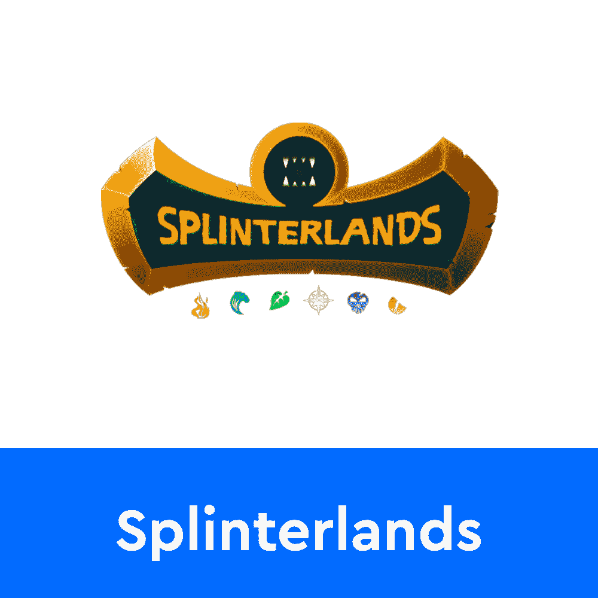</picture>](https://web.archive.org/web/20221202194607/https://dappradar.com/multichain/games/splinterlands)[<picture>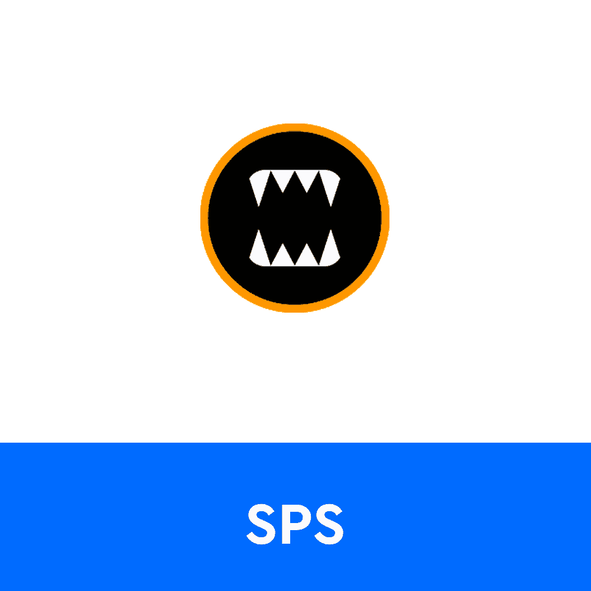</picture>](https://web.archive.org/web/20221202194607/https://dappradar.com/hub/token/bsc/USDT?from=0x1633b7157e7638c4d6593436111bf125ee74703f)[<picture>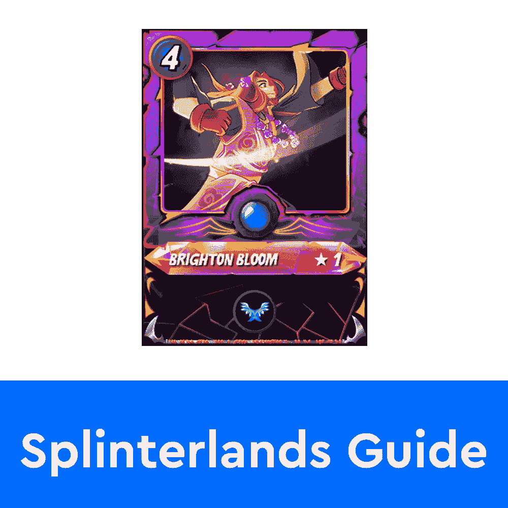</picture>](https://web.archive.org/web/20221202194607/https://dappradar.com/blog/splinterlands-guide-to-play-and-earn)

[https://web.archive.org/web/20221202194607if_/https://www.youtube.com/embed/PXj7594jgaM?start=1&feature=oembed](https://web.archive.org/web/20221202194607if_/https://www.youtube.com/embed/PXj7594jgaM?start=1&feature=oembed)

## 分享“玩即赚”的体验

奖学金计划有一个终极目标，那就是让尽可能多的玩家一起享受游戏赚钱的乐趣。社区是整个加密领域最重要的部分之一，在游戏领域更是如此。随着该领域在 2021 年进入快速增长期，奖学金项目变得更加重要。这些提供了一个机会，让更多的玩家加入进来，有机地发展社区。

如果您想了解更多关于玩即赚游戏的信息，请查看此[详细指南](https://web.archive.org/web/20221202194607/https://dappradar.com/blog/the-ultimate-guide-to-playing-games-earning-crypto/)。此外，您可以跟踪我们的[月度游戏评论](https://web.archive.org/web/20221202194607/https://dappradar.com/blog/best-play-to-earn-crypto-nft-games)，为您带来最热门的 P2E 机会。

随着更多奖学金项目的推出和游戏社区的发展，DappRadar 将继续关注游戏赚钱空间。要获得最新的游戏更新，请在 [Twitter](https://web.archive.org/web/20221202194607/https://twitter.com/dappradar) 上关注 DappRadar，并加入我们的 [Discord](https://web.archive.org/web/20221202194607/https://discord.gg/4ybbssrHkm) 社区。

 NewsletterUnsubscribe at any time. [T&Cs](https://web.archive.org/web/20221202194607/https://dappradar.com/terms) and [Privacy Policy](https://web.archive.org/web/20221202194607/https://dappradar.com/privacy-policy)