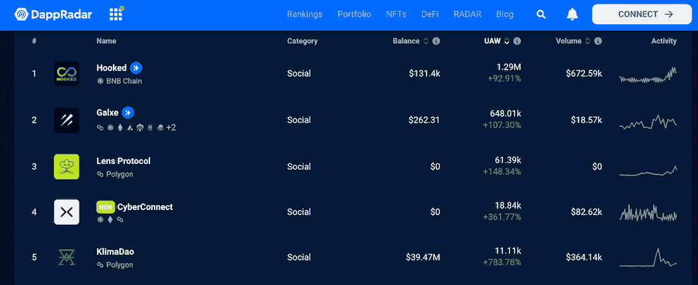
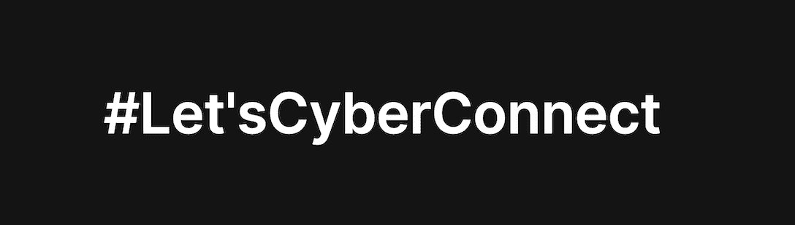
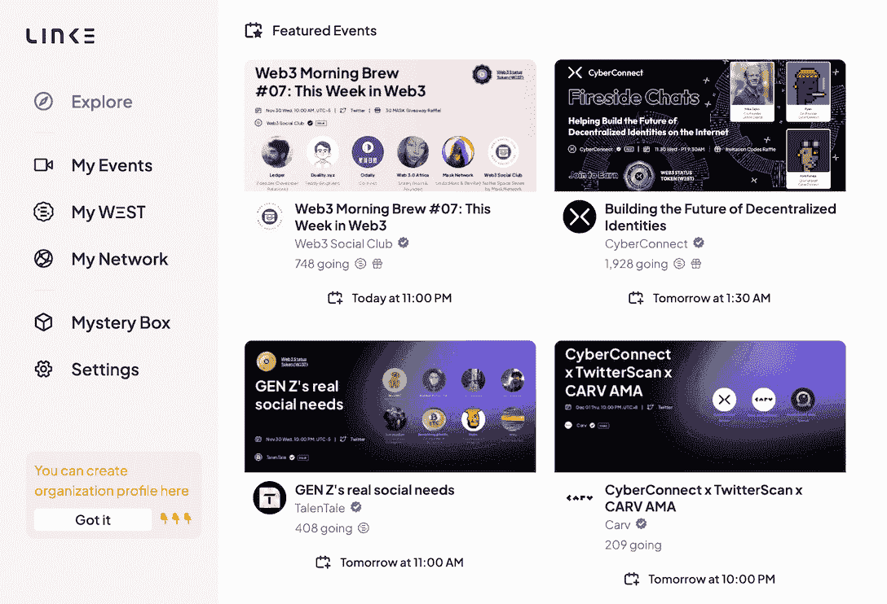
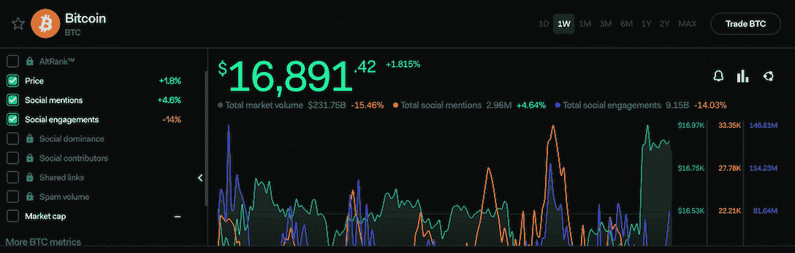
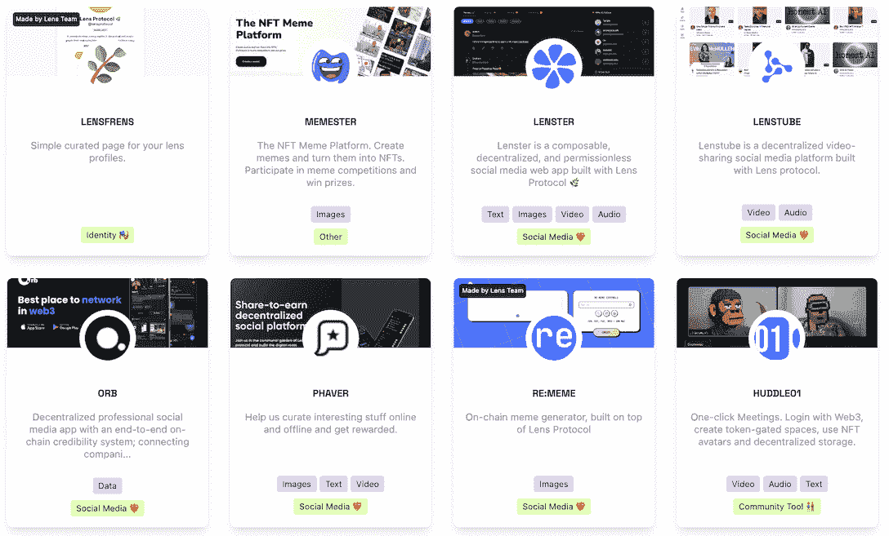
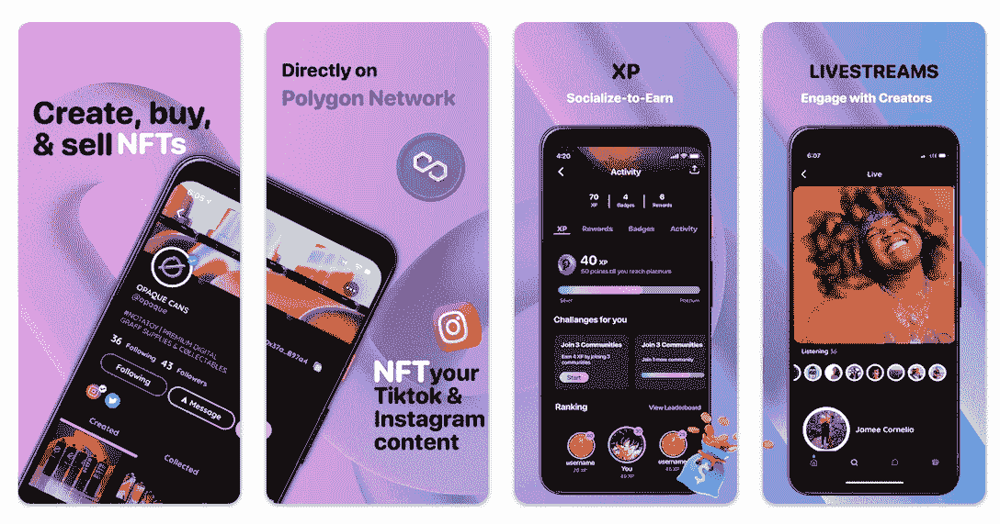
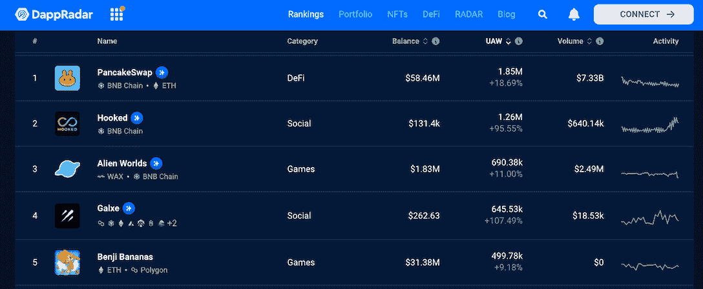
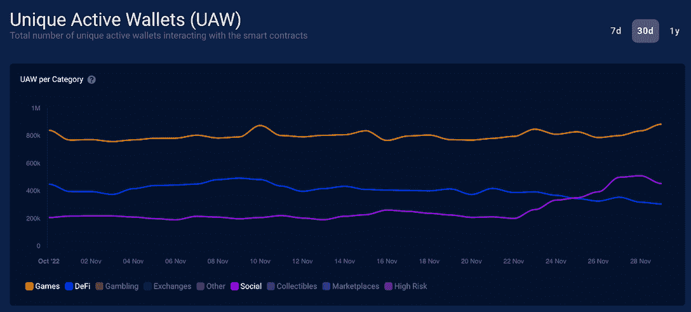

# 最佳社交媒体平台通过 Web3 增强用户能力

> 原文：<https://web.archive.org/web/https://dappradar.com/blog/best-social-media-crypto-web3>

## Galxe、Lens Protocol 和 CyberConnect 在 DappRadar 社交排名中位列前 5。

****Web3 社交媒体在 2022 年见证了一波用户增长。这些项目旨在解决 Web2 社交体验的许多问题，同时给用户更多的控制权。在这里，我们将介绍一些最受欢迎的社交 dapps，并解释为什么它们获得了用户的认可。****

**目录**

*   *[为什么 Web3 社交媒体受欢迎](https://web.archive.org/web/20221210121100/https://dappradar.com/blog/best-social-media-crypto-web3/#why)*
*   *[web 3 社交媒体有何不同？](https://web.archive.org/web/20221210121100/https://dappradar.com/blog/best-social-media-crypto-web3/#how)*
*   *[网络连接](https://web.archive.org/web/20221210121100/https://dappradar.com/blog/best-social-media-crypto-web3/#cyberconnect)*
*   *[【光束】](https://web.archive.org/web/20221210121100/https://dappradar.com/blog/best-social-media-crypto-web3/#galxe)*
*   *[镜头协议](https://web.archive.org/web/20221210121100/https://dappradar.com/blog/best-social-media-crypto-web3/#lens)*
*   *[新月](https://web.archive.org/web/20221210121100/https://dappradar.com/blog/best-social-media-crypto-web3/#lunarcrush)*
*   *[Huddln](https://web.archive.org/web/20221210121100/https://dappradar.com/blog/best-social-media-crypto-web3/#huddln)*
*   从统计数据来看，Web3 社交媒体表现如何？

## 为什么 Web3 社交媒体受欢迎

根据[data portal 2022 年 10 月的数据报告](https://web.archive.org/web/20221210121100/https://datareportal.com/reports/digital-2022-july-global-statshot)，全球有 47.4 亿社交媒体用户，占 13 岁以上人口的 76%。此外，用户每天平均花费约 2.5 小时使用社交媒体。

另一方面，大型 Web2 技术公司已经成为在线信息的守门人，他们的社交媒体平台占据了大部分用户的注意力。

然而，这些平台的运作方式却隐藏着许多问题。

例如，垄断性的社交平台可以决定一个人应该如何行为。它让不遵守规则的用户保持沉默，甚至将其删除。此外，为了实现他们渴望关注的商业模式，这些公司引入了操纵算法，导致回音室，可能会剥夺用户获取真相的自由。

## Web3 社交媒体有何不同？

Web3 有可能以一种新的模式完成一场社交媒体革命。它的支持者认为，这个开放的互联网有潜力纠正许多 Web2 错误，为社交媒体带来诸如审查阻力、数据透明和自我主权等属性。

与此同时，Web3 不仅提供了使用数字化信息的新方式，还提供了与之相关的数字经济，创造了新的商业模式，使网络中的所有参与者受益。

### 那么，最好的 Web3 社交媒体是什么呢？

一个有效的方法是利用 DappRadar 排名工具。DappRadar 旨在为用户提供数据驱动的洞察力，并帮助他们有效地评估 Web3 项目。在这里，用户不仅可以找到最好和发展最快的项目，还可以找到有潜力的新 dapps。

*DappRadar Social Rankings on 30 November*

[Explore DappRadar Social Rankings](https://web.archive.org/web/20221210121100/https://dappradar.com/rankings/category/social)

现在，让我们深入了解一下 DappRadar 社交排名上最热门的一些项目。

## 网络连接

#### 享受定制的社交体验，而不牺牲隐私

CyberConnect 是一个去中心化的社交图协议，它为开发者提供了一套丰富的工具来构建 Web3 社交应用。用户在使用 CyberConnect 支持的社交网络时，可以真正拥有自己的社交身份、内容和联系。

### 用 CyberConnect 构建什么？

开发者可以创建博客平台，用户可以在选定的区块链上以 NFT 格式发布他们的内容，以实现盈利目的。它还可以支持众筹功能，让用户将他们的创作货币化。

另一个例子是活动的社交平台，如 Meetup 或脸书活动。Link3 就是这样一个平台，但是在 CyberConnect 的帮助下，它实现了许多 Web3 元素。

用户只需使用 web3 钱包登录 Link3 平台，即可浏览并参与各种在线和离线活动。但是，更重要的是，用户可以在这里找到自己感兴趣的话题，加入讨论。

CyberConnect 是 DappRadar 社交排名中的新成员。该党一进入排行榜，就飙升至前 10 名。

2022 年 11 月，CyberConnect 独特的活动钱包(UAW)增长了近 400%，有超过 18，000 个钱包与之交互。

[Check out more stats about CyberConnect](https://web.archive.org/web/20221210121100/https://dappradar.com/multichain/social/cyberconnect)

## 高尔塞

#### 学习 Web3 知识，寻找 NFT 交易，等等

Galxe 可以说是最近最引人注目的 Web3 社交项目，它的 UAW 在过去 30 天里一直在持续增长。它目前在 DappRadar 社交排名中排名第二，30 天 UAW 超过 644，000。

Galxe 有什么吸引人的地方？

Galxe 是一个协作式凭证基础设施，它探索了围绕 Soulbound token 和 Web3 身份认证的思想。简单地说，它根据人们的区块链行为创建用户档案。

然后，品牌和项目可以使用这些 Web3 数字证书来更好地推广他们的项目，例如将他们的忠诚度系统游戏化，开展营销活动，获取用户，等等。

对于最终用户来说，他们可以参加 Galxe 上的活动和活动来收集 NFT 徽章。这些奖章将授予用户不同的权利和利益。

使用 Galxe 进行推广的项目来自各种各样的企业，包括 Polygon、BNB 连锁店、CoinGecko、Project twentire 等等。

[Learn more about Galxe](https://web.archive.org/web/20221210121100/https://dappradar.com/multichain/social/galxe)

## 月见草

#### 针对加密、NFTs 和股票的社交智能

[https://web.archive.org/web/20221210121100if_/https://www.youtube.com/embed/aMZeHaUFGY0?feature=oembed](https://web.archive.org/web/20221210121100if_/https://www.youtube.com/embed/aMZeHaUFGY0?feature=oembed)

LunarCrush 是一个社交监听引擎，收集加密货币、NFT 和股票的社交和市场数据，并将其提炼为可操作的情报。LunarCrush 的使命是帮助用户过滤社交媒体上的噪音，并在不断变化的市场中识别价值。例如，LunarCrush 可以告诉用户哪些项目正在获得媒体曝光，哪些影响者正在产生影响，等等。

下面我们用一个具体的项目为例进一步说明。

如果你想了解比特币的社会情绪，你可以在 LunarCrush 上找到相当多的信息。例如，你可以看到比特币在社交媒体上被提到了多少次，用户的参与度如何，等等。

用户参与 LunarCrush 将增强其引擎，以提供更准确的信息。作为回报，参与者将获得 LUNR 令牌作为奖励。

[Learn more about LunarCrush](https://web.archive.org/web/20221210121100/https://dappradar.com/zilliqa/social/lunrcrush#dappradar-full-description)

## 镜头协议

#### 你的身份是你自己的

Lens Protocol 是 Polygon 上的一个可组合的、去中心化的社交图，它使创作者能够完全控制他们的内容和数据。有了 Lens Protocol，用户就拥有了自己的个人资料，他们想在哪里使用，如何使用，甚至如何赚钱。

除了给予用户数据的所有权，Lens 希望解决上面提到的 Web2 社交媒体的一些问题，但采用社区驱动的方式。它邀请开发人员创新和开发健康的算法基础设施，允许用户个性化他们自己的提要和选择。

Lens 生态系统正在不断扩大，越来越多的社交媒体选择在其上为其社区提供服务。这些项目涵盖了各种媒体类型，从图像、文本、短视频等等。

[View more stats about Lens Protocol](https://web.archive.org/web/20221210121100/https://dappradar.com/polygon/social/lens-protocol)[Read DappRadar’s in-depth explanation on Lens Protocol](/web/20221210121100/https://dappradar.com/blog/lens-protocol-bringing-social-media-to-the-blockchain/)

## 混乱

#### 以游戏化的方式参与社区

首先，Huddln 是一个移动社交媒体市场，允许用户将其现有内容转换为 NFT。创作者可以利用 Huddln 的社交赚取经验来鼓励社区成员的支持。

此外，与 Galxe 和 LunarCrush 类似，Huddln XP 协议旨在为企业提供高效的营销工具。它为项目和创作者提供了一个简单的方法来跟踪和激励用户的链上和链下行为。

通过调用 Huddln 的 API 或智能合约，它让 Huddln 系统知道用户的行为，这些行为将被分析和评分。根据这些分数，项目所有者可以奖励用户空投和其他好处。

[Learn Huddln’s dapp stats in detail](https://web.archive.org/web/20221210121100/https://dappradar.com/polygon/social/huddln)

## 就统计数据而言，Web3 社交媒体表现如何？

从 DappRadar 追踪的数据来看，Web3 Social 的用户数量最近有所上升。超过 200，000 个智能合同和近 13，000 个 dapp 被跟踪，DappRadar 排名中的前五名由两个社交 dapp(Galxe 和 Hooked)占据并不常见。

[Explore DappRadar Social Ranking](https://web.archive.org/web/20221210121100/https://dappradar.com/rankings/category/social)

拉远来看一下[行业概况，](https://web.archive.org/web/20221210121100/https://dappradar.com/industry-overview)我们还发现，社交领域的独特活动钱包最近已经超过了 DeFi，上升趋势超过了 UAW 游戏。

虽然我们无法预测 Web3 社交媒体平台是否会摆脱 Web2 巨头，但看到这些趋势的出现仍然令人兴奋。此外，目前的趋势会持续多久还不清楚。但用户对数据透明、自我主权和开放网络的共识无疑将继续下去。

## 随身携带您的 Web3 之旅

使用 DappRadar 移动应用程序，再也不会错过 Web3。查看最受欢迎的 dapps 的性能，并关注您投资组合中的 NFT。您在 DappRadar 上的帐户会与我们的移动应用程序同步，这样您很快就可以选择实时接收提醒。

[Download the DappRadar app now](https://web.archive.org/web/20221210121100/https://dappradar.app.link/blog)[<picture></picture>](https://web.archive.org/web/20221210121100/https://play.google.com/store/apps/details?id=com.portfolio.dappradar) NewsletterUnsubscribe at any time. [T&Cs](https://web.archive.org/web/20221210121100/https://dappradar.com/terms) and [Privacy Policy](https://web.archive.org/web/20221210121100/https://dappradar.com/privacy-policy)