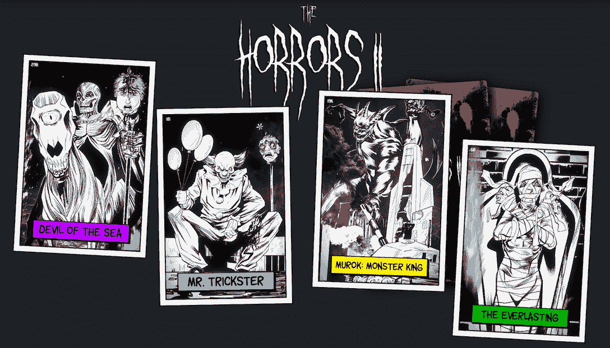
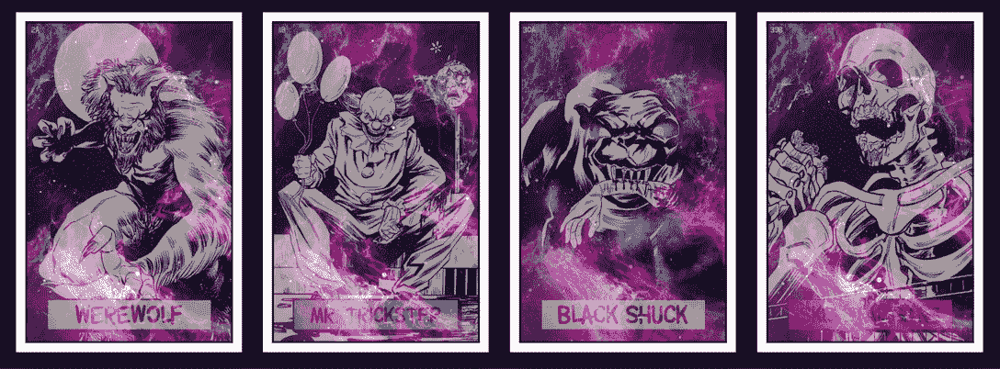
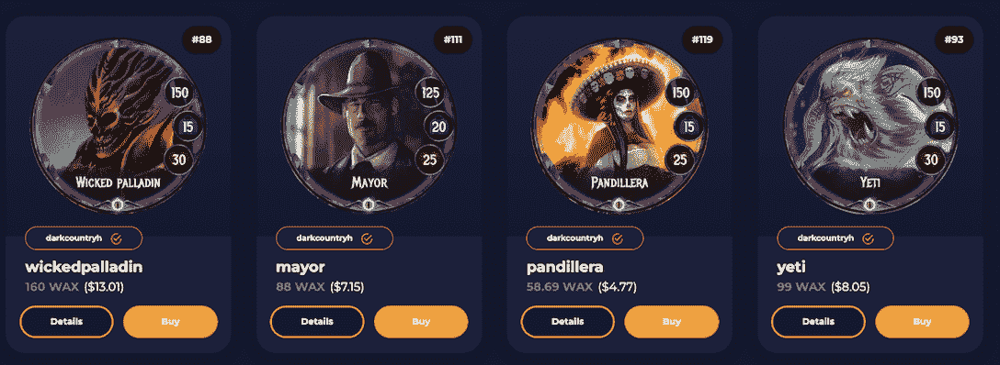
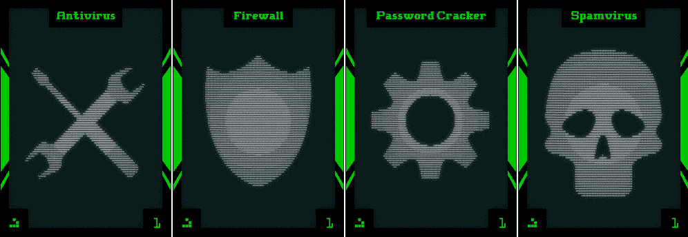
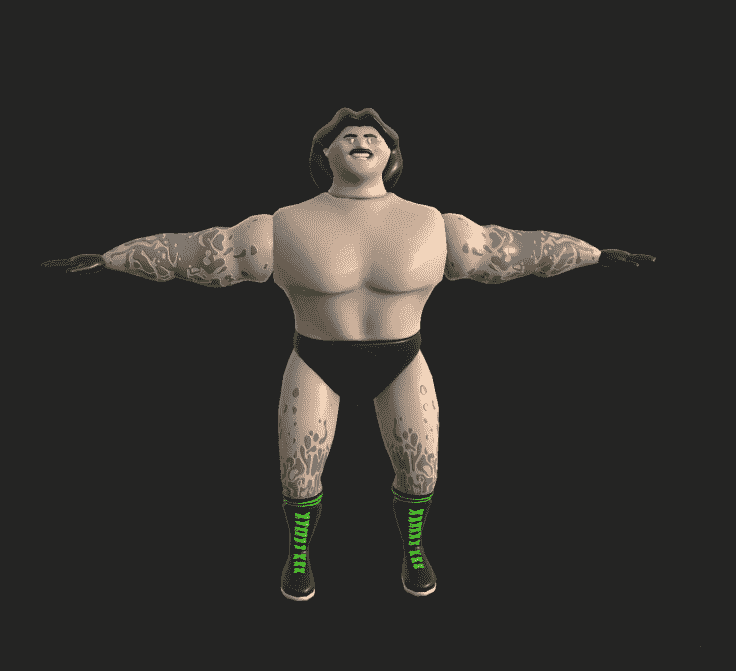

# 最佳鬼魅游戏&蜡上的 NFTs 为你的万圣节增添情趣

> 原文：<https://web.archive.org/web/https://dappradar.com/blog/best-spooky-games-nfts-on-wax-to-spice-up-your-halloween>

## 《超稀有》、《黑暗国度》和《黑客世界》都希望用户过一个充满乐趣的万圣节。

蜡像区块链从不缺少好玩的 dapps。随着万圣节的到来，在过去的 30 天里，给玩家们增添恐怖场景的游戏和非功能游戏越来越受欢迎。

**内容:**

*   [Ultra Rare 的恐怖系列是给恐怖爱好者的](https://web.archive.org/web/20221130145718/https://dappradar.com/blog/best-spooky-games-nfts-on-wax-to-spice-up-your-halloween/#ultra-rare)。
*   [体验黑暗国度的哥特式氛围](https://web.archive.org/web/20221130145718/https://dappradar.com/blog/best-spooky-games-nfts-on-wax-to-spice-up-your-halloween/#dark-country)。
*   在密码世界里，还有什么比黑客更可怕？
*   [没有什么比区块链格斗家更能代表万圣节了](https://web.archive.org/web/20221130145718/https://dappradar.com/blog/best-spooky-games-nfts-on-wax-to-spice-up-your-halloween/#bb)
*   [有用的链接](https://web.archive.org/web/20221130145718/https://dappradar.com/blog/best-spooky-games-nfts-on-wax-to-spice-up-your-halloween/#links)

万圣节到了！想给节日气氛增添一些怪异但不恐怖的东西吗？你来对地方了！我们已经将幽灵游戏和 NFT 蜡像集放在一起，让您尽情娱乐，享受边玩边赚的甜蜜乐趣。

WAX 被称为“NFTs 之王”，是一个专门构建的区块链，用于支持最活跃的加密领域，如 NFTs、游戏和虚拟世界。网络的本地令牌也被创造为蜡，服务于包括赌注、奖励、投票和交易结算的目的。

如果你想进一步了解这个区块链，下面的 DappRadar 终极指南会有所帮助。

[What is Wax?](/web/20221130145718/https://dappradar.com/blog/what-is-wax/)

现在，让我们言归正传，找到最符合你胃口的万圣节美食。

[Explore dapps on WAX](https://web.archive.org/web/20221130145718/https://dappradar.com/rankings/protocol/wax)

## 超稀有的恐怖系列是给恐怖爱好者的

超罕见是一个创新的 NFT 平台，面向恐怖漫画爱好者。它旨在利用 WAX 强大的网络和铸造系统来提升用户的收藏和漫画观看体验。

一年多前，该平台发布了第一个蜡像系列《恐怖》。该系列是一套以黑暗、大胆、暴力的艺术风格和成人主题为特色的卡片。但是，不仅如此，在这一系列极具收藏价值的卡片背后，还有一个受恐怖怪物启发的精彩故事，从文学到电影再到世界各地的民间传说。

这个系列在蜡界大受欢迎，上市 2 小时就卖光了。随着万圣节的临近，该系列又有了新的亮点。

[Check out The Horror series](https://web.archive.org/web/20221130145718/https://dappradar.com/wax/collectibles/the-horrors)

## 体验黑暗国度的哥特式氛围

[https://web.archive.org/web/20221130145718if_/https://www.youtube.com/embed/cogkugVEgfQ?feature=oembed](https://web.archive.org/web/20221130145718if_/https://www.youtube.com/embed/cogkugVEgfQ?feature=oembed)

《黑暗国度》是一款美国哥特式纸牌游戏，背景是阴郁的西部荒野，有游骑兵、牛仔、闹鬼的印第安人、僵尸、鬼魂和恶魔。

受《魔法:聚会与炉石》等经典 tcg 的启发，《黑暗国度》完美继承了这一流派的核心特征，同时增强了玩家驱动经济的游戏性。

[Check out all cards on AtomicHub](https://web.archive.org/web/20221130145718/https://dappradar.com/wax/marketplaces/atomicmarket)

卡牌游戏开发了各种游戏模式，包括锦标赛、PVP 和 PVE 战役。在每个游戏模式中，玩家可以收集他们的英雄、生物、法术和技能。此外,《黑暗国度》允许玩家利用 NFT 技术完全拥有他们所有的卡。

[Learn more about Dark Country](https://web.archive.org/web/20221130145718/https://dappradar.com/wax/games/dark-country)

## 在密码世界里，还有什么比黑客更可怕的呢？

黑客世界是一款最近在蜡像区块链上广受欢迎的游戏。它模仿黑客的活动，让玩家体验作为网络攻击者的刺激。

玩家必须通过破解他们的虚拟电脑，将他们变成奴隶来征服他们的对手。或者说，黑客必须感染别人的电脑，让他们执行攻击者的命令。

该游戏有一个代币(雄鹿)和五种类型的 NFT:

*   密码破解是用来闯入其他玩家和 NPC 的电脑。
*   防火墙用来防御其他玩家的密码破解。
*   Spamvirus 是用来感染玩家和 NPC 的电脑来收钱的。
*   杀毒是玩家用来清除病毒的工具。
*   访问授权通行证可以帮助玩家获得游戏内奖金和白名单的机会下降。

[Check out HackersWorld](https://web.archive.org/web/20221130145718/https://dappradar.com/wax/games/hackersworld)

## 没有什么比区块链格斗家更能代表万圣节了

没错。Web3 中排名第一的格斗游戏通过其季节性活动为节日增添了趣味。一场免费的 PvP 锦标赛将于太平洋时间周日上午 10 点开始。

所有参与者都将收到一张纪念卡，在比赛期间使用，以纪念这一时刻。更棒的是！前三名获胜者将收到一些怪异的定制内容，上面有他们的名字和排名。

别忘了万圣节也是为死者举办的派对。你那些无用的大摇大摆出来的打手们又可以帮上忙了。你可以把他们带到广场上，从坟墓外面大肆破坏。任何一个 1 系列区块链格斗者都可以带着一个“活死人”装备进入拳击台，挥舞死亡十字架。

报名参加免费活动，点击[此处](https://web.archive.org/web/20221130145718/https://discord.com/channels/907624301119819776/1024128596807274497)并“注册”。

[Check out Blockchain Brawlers free Beta](https://web.archive.org/web/20221130145718/http://play-beta.bcbrawlers.com/)

## 有用的链接

在过去的一个月里，许多新的想法在蜡像游戏生态系统中涌现出来。但是，毫无疑问，WAX 在游戏和 NFT 领域的地位是不可动摇的。要深入了解 WAX 如何重塑用户与 Web3 游戏的互动方式，请阅读 [DappRadar 的终极 WAX 指南](https://web.archive.org/web/20221130145718/https://dappradar.com/blog/what-is-wax/)。

[Check out trending games on WAX](https://web.archive.org/web/20221130145718/https://dappradar.com/rankings/protocol/wax/category/games/2)

了解更多关于 WAX 的信息:

[网站](https://web.archive.org/web/20221130145718/https://wdny.io/carbon-offset-virls/)

[推特](https://web.archive.org/web/20221130145718/https://twitter.com/WAX_io)

[不和](https://web.archive.org/web/20221130145718/https://go.wax.io/Discord)

**免责声明** —这是一篇赞助文章。DappRadar 不认可本页面上的任何内容或产品。DappRadar 旨在提供准确的信息，但读者应该在采取行动之前总是自己做研究。DappRadar 的文章不能被认为是投资建议。