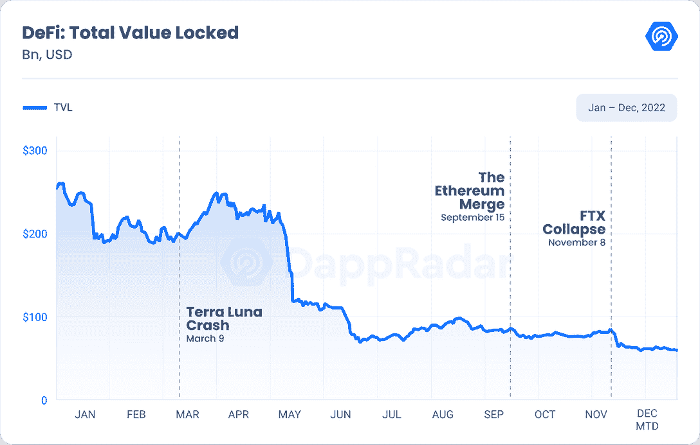
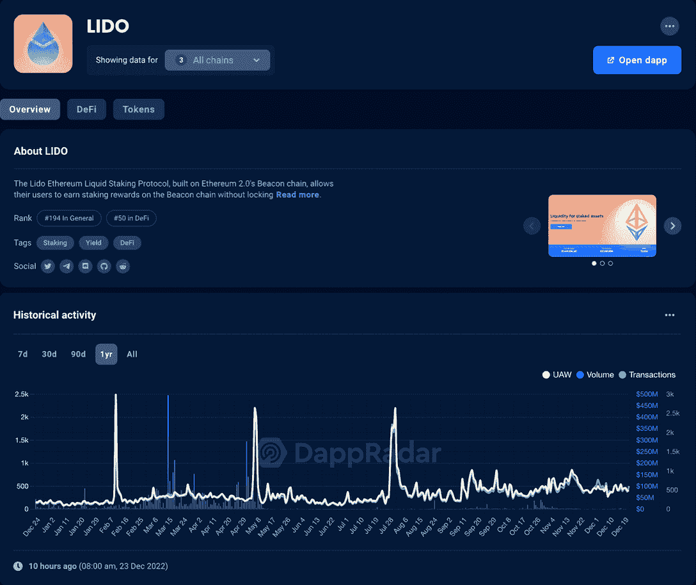
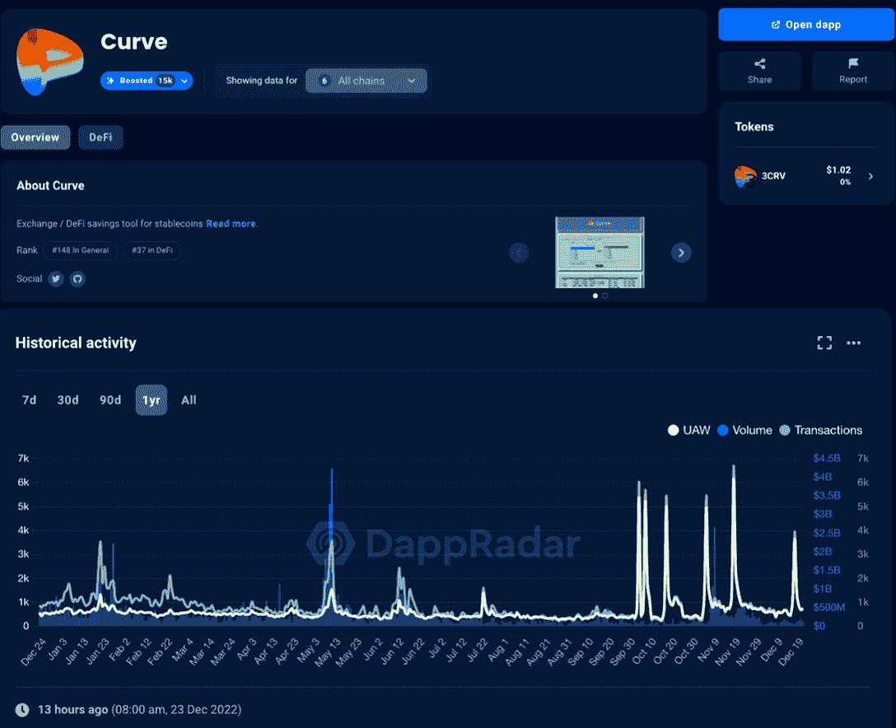

# 2023 年最值得关注的 DeFi Dapps

> 原文：<https://web.archive.org/web/https://dappradar.com/blog/best-top-defi-dapps-trading-lending-platforms>

## DeFi dapps 可能有助于推动今年的行业发展

DeFi dapps 可能有助于推动今年的行业发展

哪些顶尖的 DeFi 项目准备在 2023 年大展拳脚？市场经历了动荡的一年，但在挑战中，许多 DeFi 项目推出了更加多样化的产品，以满足不同 DeFi 用户日益增长的需求。在本文中，我们介绍了 DeFi 项目，这些项目在最近几年拥有强大的用户基础和高收入。他们有潜力在下一年继续这一积极趋势。

**内容:**

*   *[概述](https://web.archive.org/web/20230118215059/https://dappradar.com/blog/best-top-defi-dapps-trading-lending-platforms/#overview)*
*   *[Uniswap](https://web.archive.org/web/20230118215059/https://dappradar.com/blog/best-top-defi-dapps-trading-lending-platforms/#uniswap)*
*   *GMX*
*   *[读](https://web.archive.org/web/20230118215059/https://dappradar.com/blog/best-top-defi-dapps-trading-lending-platforms/#lido)*
*   [*曲线*](https://web.archive.org/web/20230118215059/https://dappradar.com/blog/best-top-defi-dapps-trading-lending-platforms/#curve)

*   *[如何找到顶级 DeFi dapps](https://web.archive.org/web/20230118215059/https://dappradar.com/blog/best-top-defi-dapps-trading-lending-platforms/#top)*

## 概观

根据 DappRadar 最近的年度行业报告，DeFi TVL 从 1 月份的 2114 亿美元的高点跌至 12 月份的 550 亿美元——亏损 73.97%。几个因素导致了 TVL 的下降，如用户提款、加密货币贬值等。如需深入分析，您可以阅读完整报告。

[Read the full report](https://web.archive.org/web/20230118215059/https://dappradar.com/blog/dapp-industry-report-2022-dapp-industry-proves-resilient-in-crypto-winter)

但值得注意的是，下降的数字并不是这个行业的全部。许多 DeFi 协议继续逆潮流而动，不断改进功能，努力建设更健康、更可持续的 DeFi 未来。

让我们来看看市场上最具创新性的 DeFi dapps。

## Uniswap 是使用最多的索引

Uniswap 是一个 DeFi 协议，是以太坊上用于交换 ERC-20 令牌的分散式交换。这意味着用户可以使用这个 dapp 将令牌 A 转换为令牌 B。与大多数交易所不同，Uniswap 并不通过撮合买家和卖家来实现流动性。相反，它使用数学等式和代币池来实现自动做市。

Uniswap 也是分散和开放源码的。因此任何人都可以审查代码并提出改进建议。

DeFi 协议现在已经发展到 V3。最新版本可以帮助交易者和流动性提供者最大化回报，最小化价格滑移，并更有效地管理下行风险。有趣的是，Uniswap V3 使用 NFTs 来表示流动性池中某个头寸的所有权。没错，这些 NFT 是可以交易的，当然代表了一种价值。

要使用 Uniswap，用户必须向协议付费，这是其收入来源。目前，Uniswap 是所有 DeFi 协议中最赚钱的，7 天平均每日交易费为 733，809 美元。

[View all the stats about Uniswap V3](https://web.archive.org/web/20230118215059/https://dappradar.com/multichain/exchanges/uniswap-v3)

## GMX 提供零滑动，并与用户分享利润

GMX 是 Arbitrum 生态系统中最大的分散式交易所，它也支持 Avalanche。该 DeFi 协议通过流动性池 GLP 提供零滑点和低成本的分散式永久和现货交易。

与 Uniswap 不同，GMX 使用 Chainlink Oracles 支持的动态定价，并从主要交易量交易所汇总价格，而不是使用自动做市商。这提高了交易效率，有助于在执行市价单时实现零滑点。

该协议的生态系统中有两种加密货币:GMX 和 GLP。持有这两个令牌会给用户带来好处。具体来说，交易产生的费用的 30%以 ETH(在 Arbitrum 上)或 AVAX(在 Avalanche 上)的形式分配给 GMX 股东，70%分配给 GLP 股东。

这种回馈社区的方式也让 GMX 在过去的一年里获得了用户的大力支持。令人印象深刻的是，该项目在熊市期间成功实现了用户数量(UAW)和代币价格的大幅增长。

[View more stats about GMX](https://web.archive.org/web/20230118215059/https://dappradar.com/multichain/defi/gmx)

## 利多让每个人都赢得以太坊赌注奖励

期待已久的以太坊升级终于发生了。随着合并的到来，以太坊已经过渡到一个利益攸关的网络。因此，它变得更加节能，同时还允许任何人通过使用 32 ETH 成为验证者。验证器是一个接收交易确认奖励的网络节点，因为 32 ETH 是一大笔钱，所以替代方案已经出现。丽都就是其中之一。

通过利多下注 ETH，你就拥有了一份验证器。因此，用户赚取一定比例的块奖励，也以 ETH 支付，用户在此期间不需要锁定他们的 ETH。一旦用户通过利多金融在以太坊下注，他们将按照 1:1 的比例获得 ERC 20 代币 stETH，并可以自由交易。

持有 stETH 代币的人有权获得赌注奖励，即使这些 stETH 是在二级市场上购买的。因此，stETH 作为抵押品参与 Aave 等借贷协议是可以接受的，也是非常可取的。

在过去的一年里，Lido 已经将其定位解决方案扩展到多个网络，如 Solana、Polygon 和 Polkadot。从下面的图表中可以看出，在过去的一年里，丽都独特的活动钱包(UAW)和交易量总体上呈上升趋势。它目前在所有 DeFi 协议中排名第二，TVL 为 59 亿美元。

[View more stats about Lido](https://web.archive.org/web/20230118215059/https://dappradar.com/multichain/defi/lido)

## 曲线，稳定曲线的 Uniswap

在加密货币行业，高波动性的加密货币不太适合作为支付媒介。stablecoins 的出现旨在为包括比特币(BTC)在内的流行加密货币的高波动性提供一种替代选择。因此，专家预计这些稳定的硬币将在数字经济中扮演越来越重要的角色。

Curve 是一个基于以太坊的分散式交易所，专注于稳定的货币。它使用户能够享受难以置信的低滑移，即使转换大量稳定的硬币。

Curve 的平台令牌 CRV 主要服务于平台治理。赌注 CRV 给用户访问 veCRV。后者使持有者能够就激励结构、费用支付方式和流动性提供者的长期盈利实践等决策进行投票。

从下面的图表中可以看出，Curve 的受欢迎程度在今年第 4 季度继续攀升，出现了一些明显的峰值。曲线是如此受欢迎和有影响力，以至于有一个潜在的控制和霸权的数字战争，[也被称为曲线战争](/web/20230118215059/https://dappradar.com/blog/the-curve-wars-explained-when-defi-becomes-aggressive/)。

[View more stats about Curve](https://web.archive.org/web/20230118215059/https://dappradar.com/multichain/defi/curve)

## 合成燃料衍生品交易

加密货币的衍生品交易一直需求很高，因为它允许用户执行更多样化的投资策略。这些可以在短时间内产生更多的回报，尤其是与现货市场相比。然而，这也意味着用户需要承担更高的风险。

Synthetix 是一个分散的合成资产协议。它提供 Synths，链上合成资产，跟踪其他资产的价格，并创建一个镜像的链上版本。Synthetix 平台支持 20 多种表示法定货币、商品(如黄金)和加密资产的合成器。

合成资产交易可以在不实际持有资产的情况下进行交易。这种高级交易可以满足更有经验的交易者的投资胃口，其受欢迎程度在过去一年中有了显著增长。

[View all the stats about Synthetix](https://web.archive.org/web/20230118215059/https://dappradar.com/multichain/defi/synthetix)

## 使用 DappRadar 查找顶级 DeFi dapps

到 2022 年，全球仍有许多人生活在法定货币持续大幅贬值的国家。此外，一部分人口无法获得最基本的银行服务。然而，DeFi 的出现改变了传统金融中存在的许多问题。

另一方面，DeFi 在技术、服务能力和用户体验方面还有很长的路要走。DeFi 行业仍处于非常早期的阶段，但只要开发者不断创新，DeFi 将在人们的生活中发挥更加关键的作用。与此同时，您可以随时利用 DappRadar 的各种跟踪工具来获得对这个充满活力的行业的数据驱动型洞察。

[DappRadar DeFi Tracking](https://web.archive.org/web/20230118215059/https://dappradar.com/defi)

当然，你可以通过 DappRadar 排名找到顶级的 DeFi dapps 和交易所。

[Discover dapps through the DappRadar Rankings](https://web.archive.org/web/20230118215059/https://dappradar.com/rankings/category/defi)

## 随身携带您的 Web3 之旅

使用 DappRadar 移动应用程序，再也不会错过 Web3。查看最受欢迎的 dapps 的性能，并关注您投资组合中的 NFT。您在 DappRadar 上的帐户会与我们的移动应用程序同步，这样您很快就可以选择实时接收提醒。

[Download the DappRadar app now](https://web.archive.org/web/20230118215059/https://dappradar.app.link/blog)[<picture></picture>](https://web.archive.org/web/20230118215059/https://play.google.com/store/apps/details?id=com.portfolio.dappradar) NewsletterUnsubscribe at any time. [T&Cs](https://web.archive.org/web/20230118215059/https://dappradar.com/terms) and [Privacy Policy](https://web.archive.org/web/20230118215059/https://dappradar.com/privacy-policy)