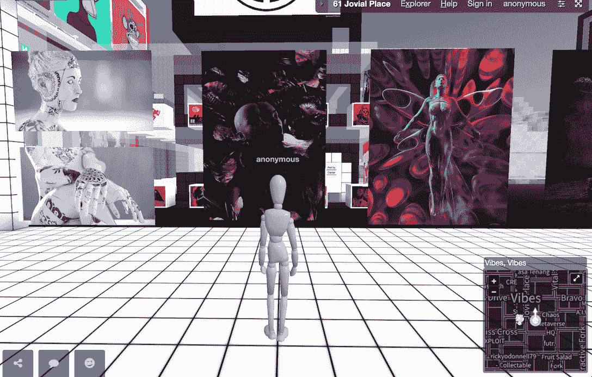
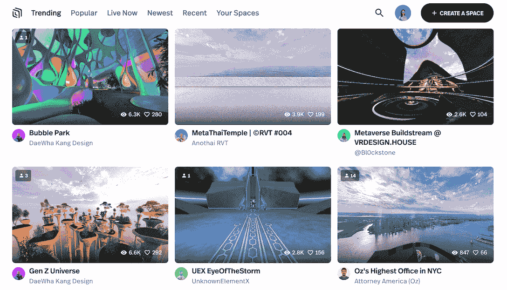

# 2023 年元宇宙顶级虚拟世界

> 原文：<https://web.archive.org/web/https://dappradar.com/blog/best-top-metaverse-virtual-worlds>

## 一系列元宇宙世界将重塑我们与互联网和信息的互动方式

2023 年，顶级的元宇宙虚拟世界已经准备好震撼世界。事实上，许多元宇宙的想法已经酝酿多年。经过 2022 年一年的扎实发展，元宇宙不再只是一个时髦词或乌托邦式的理想。科学技术有力地将这一概念推向了现实。

在今年的元宇宙消费电子展上，Web3 和游戏有自己的专用空间，吸引了全球科技公司展示他们在打造平行现实方面的最新突破。

[根据埃森哲最近的研究](https://web.archive.org/web/20230307143654/https://newsroom.accenture.com/news/growing-consumer-and-business-interest-in-the-metaverse-expected-to-fuel-trillion-dollar-opportunity-for-commerce-accenture-finds.htm)，到 2025 年底，元宇宙体验和商务将带来 1 万亿美元的市场价值。此外，调查结果表明，55%的消费者希望成为元宇宙的活跃用户，几乎所有人(90%)都希望在 2023 年成为活跃用户。

**内容**

*   *[但是为什么是元宇宙呢？](https://web.archive.org/web/20230307143654/https://dappradar.com/blog/best-top-metaverse-virtual-worlds/#but)*
*   *[分散地](https://web.archive.org/web/20230307143654/https://dappradar.com/blog/best-top-metaverse-virtual-worlds/#decentraland)*
*   [*沙盒*](https://web.archive.org/web/20230307143654/https://dappradar.com/blog/best-top-metaverse-virtual-worlds/#sandbox)
*   *[超高速](https://web.archive.org/web/20230307143654/https://dappradar.com/blog/best-top-metaverse-virtual-worlds/#hyperfy)*
*   *[底层](https://web.archive.org/web/20230307143654/https://dappradar.com/blog/best-top-metaverse-virtual-worlds/#substrata)*
*   [*体素，原名*](https://web.archive.org/web/20230307143654/https://dappradar.com/blog/best-top-metaverse-virtual-worlds/#voxels)
*   
*   *[*空间*](https://web.archive.org/web/20230307143654/https://dappradar.com/blog/best-top-metaverse-virtual-worlds/#spatial)*
*   *[*矩阵世界*](https://web.archive.org/web/20230307143654/https://dappradar.com/blog/best-top-metaverse-virtual-worlds/#matrix)*
*   *[*NFT 一亩三分地*](https://web.archive.org/web/20230307143654/https://dappradar.com/blog/best-top-metaverse-virtual-worlds/#nft)*

 **## 但是为什么是元宇宙呢？

元宇宙将改变人们生成、消费和交换信息的方式。再次以斯皮尔伯格的电影《玩家一号》为例可能有些老生常谈，但它确实为我们提供了一个生动的未来游戏视觉参考。其实电影的情节已经在现实生活中发生了。

今天，我们以二维形式与互联网互动，一个分隔两个世界的屏幕。但是在元宇宙，你以身临其境的方式与信息互动。一挥手，一点头，以及你的声音都可以成为命令，而不是输入文本和移动鼠标来完成它们。

元宇宙很重要，因为它是行业不可知的，而是像互联网一样，它改变了沟通。人们几乎可以用它做任何事情，从游戏到工作，从社交到研究。

我们整理了一篇文章来帮助您了解元宇宙的基本概念和技术。点击下面的按钮阅读。

[What is Metaverse?](/web/20230307143654/https://dappradar.com/blog/what-is-the-metaverse/)

元宇宙由不同类型的虚拟世界和服务组成。它们可以是游戏空间、博物馆和画廊、体育爱好者俱乐部、金融服务、媒体渠道、办公室，以及几乎任何东西。

接下来，让我们深入了解一下 2023 年你应该知道的顶级元宇宙虚拟世界。

## 1.分散土地

分散王国是一个开源的虚拟社交世界，由以太坊区块链提供支持。它允许用户个性化他们的数字角色，创建虚拟建筑，策划体验，并从中获利。

[https://web.archive.org/web/20230307143654if_/https://www.youtube.com/embed/CPcOk2sKzCM?feature=oembed](https://web.archive.org/web/20230307143654if_/https://www.youtube.com/embed/CPcOk2sKzCM?feature=oembed)

在过去的一年里，分散之地已经孵化了各种娱乐活动，包括时装周，艺术周，元宇宙音乐节等等。此外，品牌已经找到了吸引 Web3 用户的新方法，喜力、三星、耐克、可口可乐、星巴克、达美乐和阿迪达斯都在这里举办品牌体验活动。

所有上述活动都发生在土地上，土地是元宇宙的重要资产。有了土地，用户可以在上面建造场地和举办体验。如果你想举办一个聚会，但你没有任何土地，选项是租一个。

另外值得一提的是，《分散之地》的 VR 版本已经上市，用户可以用 Oculus Quest 2 进行体验。

[Explore Decentraland](https://web.archive.org/web/20230307143654/https://dappradar.com/ethereum/marketplaces/decentraland)

## 2.沙盒

沙盒是一个虚拟世界，玩家可以在其中建立、拥有和赚钱他们的视频游戏作品。以游戏为中心是这个元宇宙平台的最大卖点。

[https://web.archive.org/web/20230307143654if_/https://www.youtube.com/embed/w2p4kvjuviQ?list=PL_AqeWVYruhoUK4s-64AdcO9HY-2nhnpD](https://web.archive.org/web/20230307143654if_/https://www.youtube.com/embed/w2p4kvjuviQ?list=PL_AqeWVYruhoUK4s-64AdcO9HY-2nhnpD)

为了创造一个动态和可持续的生态系统，沙盒为任何人制作 3D 游戏提供了一套强大的游戏制作工具。感谢沙盒游戏制作人，你可以成为一个游戏创作者，即使不知道如何编码。

沙盒中的游戏体验是无限的。在最新的第三季中，雅达利恢复了其经典游戏水晶城堡，SCMP 带用户乘坐著名的天星小轮。总之，可能性是无限的。

随着多人游戏功能以及视频和音频流的引入，沙盒在 2023 年更值得期待。

[Explore The Sandbox](https://web.archive.org/web/20230307143654/https://dappradar.com/ethereum/games/the-sandbox)

## 3.超高速

Hyperfy 是以太坊区块链上的一个虚拟世界构建平台。它为用户提供工具来设计和建造他们可以拥有并在开放市场上自由交易的整个世界。

[https://web.archive.org/web/20230307143654if_/https://www.youtube.com/embed/ISUhhgHz0wo?feature=oembed](https://web.archive.org/web/20230307143654if_/https://www.youtube.com/embed/ISUhhgHz0wo?feature=oembed)

它吸引了许多数字创作者和艺术家，他们建立了许多高度沉浸式的空间供用户探索。你可以在未来派画廊里欣赏艺术品，在仓库里玩扑克，或者在梵高的卧室里闲逛。

[Explore Hyperfy](https://web.archive.org/web/20230307143654/https://dappradar.com/hub/nft-collection/hyperfy)

## 4 .基底

Substrata 是一个免费的在线 3D 元宇宙，用户可以在这里建立、探索和相互交流。

[https://web.archive.org/web/20230307143654if_/https://www.youtube.com/embed/CcWYmJLdnFI?feature=oembed](https://web.archive.org/web/20230307143654if_/https://www.youtube.com/embed/CcWYmJLdnFI?feature=oembed)

Substrata 团队在高端图形方面拥有丰富的经验。他们开发了一种 3D 引擎，可用于处理元宇宙所需的大量动态内容，同时保证高质量的输出。

要在基质世界中创建一个物体，用户需要拥有一个包裹。或者，他们可以转到沙盒(宗地#20)，一个公共宗地，并开始创建。

[Explore Substrata](https://web.archive.org/web/20230307143654/https://dappradar.com/ethereum/collectibles/substrata)

## 5.体素，以前称为隐体素

Voxels 是以太坊区块链上的一个虚拟世界构建和共享平台。用户可以在这个虚拟世界中开发、探索、交易和拥有财产。

[https://web.archive.org/web/20230307143654if_/https://www.youtube.com/embed/PMAkpeyWGWA?feature=oembed](https://web.archive.org/web/20230307143654if_/https://www.youtube.com/embed/PMAkpeyWGWA?feature=oembed)

随着 NFT 热潮的兴起，隐体素在 2021 年声名鹊起，但后来改名为体素。今天，它仍然是最著名的元宇宙平台之一，吸引着数字艺术家和开发者建造各种形状的 3D 建筑和场馆。

体素似乎比分散土地和沙盒更受艺术家的欢迎。体素的街道两旁排列着数字艺术画廊，展示着各种各样令人惊叹和引人注目的艺术品。

但同样值得一提的是，Voxels 是一个无所不包的虚拟世界，不仅可以进行数字艺术，还可以进行社交活动，甚至可以进行游戏。最重要的是，该平台可通过浏览器、移动设备和 VR 头戴设备访问。

[Explore Voxels](https://web.archive.org/web/20230307143654/https://dappradar.com/ethereum/collectibles/voxels)

## 6\. Somnium Space

Somnium Space 是区块链上一个开放的、社交的、持久的 VR 世界，目前在以太坊和 Solana 上可以使用。

[https://web.archive.org/web/20230307143654if_/https://www.youtube.com/embed/YARmHLs2BjI?feature=oembed](https://web.archive.org/web/20230307143654if_/https://www.youtube.com/embed/YARmHLs2BjI?feature=oembed)

用户可以购买和拥有虚拟土地，建造他们的梦想家园，创业，享受各种娱乐和社会活动，如现场音乐会，聚会和玩视频游戏。

该空间可以通过 VR、PC 和 web 访问，并且也是移动友好的。该项目有一个长期的愿景，即创建一个虚拟环境，为现实提供丰富的补充，充满无限和令人兴奋的可能性。

[Explore Somnium Space](https://web.archive.org/web/20230307143654/https://dappradar.com/ethereum/games/somnium-space)

## 7.空间的

Spatial 是一个 3D 元宇宙平台，允许创作者和品牌建立自己的空间，共同分享文化和激情。它为用户提供了强大且易于使用的工具，以轻松的方式创建引人注目的交互式内容。

[https://web.archive.org/web/20230307143654if_/https://www.youtube.com/embed/UQNX4Hn3mw4?feature=oembed](https://web.archive.org/web/20230307143654if_/https://www.youtube.com/embed/UQNX4Hn3mw4?feature=oembed)

该平台旨在支持元宇宙使用案例，如社交网络、网络 3 营销、品牌活动等。品牌和用户已经受益于 Spatial 的流畅体验和梦幻般的视觉效果。

在这里，用户建造了赛博朋克森林、天际线办公室、俯瞰纽约的风景、未来的云吧等等。最重要的是，所有这些用户创新都可以作为 NFT 进行交易。

空间也支持虚拟现实体验。想象一下，沉浸在像这样的虚拟空间中的电影首映式、画廊派对，甚至是体育赛事中，会有多神奇。

[Explore Sptial NFT colletion](https://web.archive.org/web/20230307143654/https://dappradar.com/hub/nft-collection/spatialx)

## 8.矩阵世界

矩阵世界是一个分散的开放虚拟世界，让用户与身临其境的 3D 应用程序互动。该平台目前支持 Flow 和以太坊，并将在更多网络上可用。

[https://web.archive.org/web/20230307143654if_/https://www.youtube.com/embed/4Ht0j6TomuA?feature=oembed](https://web.archive.org/web/20230307143654if_/https://www.youtube.com/embed/4Ht0j6TomuA?feature=oembed)

在 Matrix World 中，用户可以利用 Matrix 内置的计算资源构建 3D 架构，举办虚拟活动，展示 NFT，并创建自己的 3D 分散式应用程序。为了实现这一目标，它将为用户提供强大的低代码工具，让每个人都可以进行创作。

所以如果你想创造一个平行世界，到时候你可以试试系统工具。

《黑客帝国世界》测试版将于 2023 年问世，2024 年初正式对外开放。

[Explore Matrix World](https://web.archive.org/web/20230307143654/https://dappradar.com/multichain/games/matrix-world)

## 9.NFT 世界

NFT 世界曾经是一个用多边形在《我的世界》上建造的元宇宙平台。但自 2022 年 7 月 20 日以来，NFT 世界一直在开发自己的游戏和元宇宙生态系统。现在，开源平台已经培育了一个蓬勃发展的社区，积极推动其虚拟世界的发展和游戏创新。

[https://web.archive.org/web/20230307143654if_/https://www.youtube.com/embed/pzfsKNJa6jM?feature=oembed](https://web.archive.org/web/20230307143654if_/https://www.youtube.com/embed/pzfsKNJa6jM?feature=oembed)

虚拟世界旨在最大限度地释放用户的创造力。在这方面，用户可以利用各种强大的工具来共同构建这个虚拟世界。

例如，在 NFT 世界中，世界和系统是完全可编程的，这意味着用户可以完全控制生态系统如何工作。此外，它支持实时游戏中的世界和土地编辑，为用户带来无缝的虚拟体验。

通常，虚拟世界要求玩家使用一个不嵌入平台的独立编辑器。但是 NFT 世界允许用户在不离开平台的情况下修改他们的虚拟空间。

[Explore NFT World](https://web.archive.org/web/20230307143654/https://dappradar.com/ethereum/games/nft-worlds)

## 10.奈夫克

Netvrk 是一个包罗万象的多链元宇宙，游戏、娱乐、电子商务、教育和社交网络共存于一个沉浸式环境中。用户可以通过电脑、手机和虚拟现实技术访问该平台。

[https://web.archive.org/web/20230307143654if_/https://www.youtube.com/embed/NmS88f-S_ko?feature=oembed](https://web.archive.org/web/20230307143654if_/https://www.youtube.com/embed/NmS88f-S_ko?feature=oembed)

Netvrk 利用虚幻引擎 5 结合区块链技术，为用户带来精致、高保真的元宇宙体验。在 Netvrk 这里，“唯一的限制是你的想象力”。你探索一个异国情调的世界，跳进一个皇家战争游戏，网上购物，或去音乐会和聚会在任何时间任何地点。

这个元宇宙平台为用户提供了创建引擎，使他们能够使用这个直观、易用的工具集在元宇宙创建自己的数字资产。

根据官方路线图，它将于 2023 年在 Q1 推出 alpha。

[Explore Netvrk](https://web.archive.org/web/20230307143654/https://dappradar.com/ethereum/games/netvrk)

## 随身携带您的 Web3 之旅

使用 DappRadar 移动应用程序，再也不会错过 Web3。查看最受欢迎的 dapps 的性能，并关注您投资组合中的 NFT。您的 DappRadar 帐户与我们的移动应用程序同步，让您可以随时接收实时提醒。

[Download the DappRadar app now](https://web.archive.org/web/20230307143654/https://dappradar.app.link/blog)[<picture></picture>](https://web.archive.org/web/20230307143654/https://play.google.com/store/apps/details?id=com.portfolio.dappradar)**