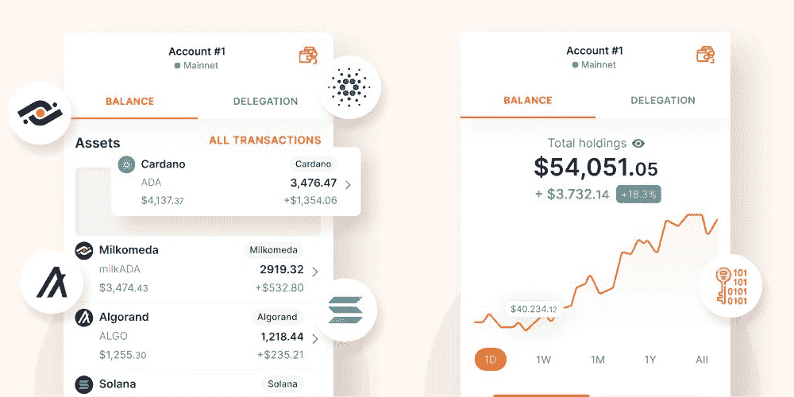

# 卡尔达诺的最佳钱包:比较与选择

> 原文：<https://web.archive.org/web/https://dappradar.com/blog/best-wallets-for-cardano>

## 找出储存您的卡达诺资产的最佳选择

成为卡尔达诺社区的一员意味着你可以在区块链最快、最便宜的地方驾驶 dapps。但要成为这个生态系统的一部分，并存储 ADA 和其他 Cardano 加密货币，你必须有一个兼容的钱包。但是从哪里开始呢？在这篇完整的文章中，你将了解 Cardano 的最佳钱包。

## 目录

*   [卡达诺钱包:你为什么需要它们](https://web.archive.org/web/20221215044741/https://dappradar.com/blog/best-wallets-for-cardano/#Cardano-wallets:-why-you-need-them)
*   【Cardano 的最佳浏览器钱包
    *   [纳米钱包](https://web.archive.org/web/20221215044741/https://dappradar.com/blog/best-wallets-for-cardano/#NamiWallet)
    *   [弗林特城](https://web.archive.org/web/20221215044741/https://dappradar.com/blog/best-wallets-for-cardano/#FlintWallet)
    *   [GeroWallet](https://web.archive.org/web/20221215044741/https://dappradar.com/blog/best-wallets-for-cardano/#GeroWallet)
    *   [永久钱包](https://web.archive.org/web/20221215044741/https://dappradar.com/blog/best-wallets-for-cardano/#EternlWallet)
    *   [赖瑞](https://web.archive.org/web/20221215044741/https://dappradar.com/blog/best-wallets-for-cardano/#Yoroi)
*   [卡尔达诺的最佳本地钱包](https://web.archive.org/web/20221215044741/https://dappradar.com/blog/best-wallets-for-cardano/#The-best-local-wallet-for-Cardano)
    *   [代达罗斯](https://web.archive.org/web/20221215044741/https://dappradar.com/blog/best-wallets-for-cardano/#Daedalus)
*   【Cardano 的最佳硬件钱包
    *   [总账](https://web.archive.org/web/20221215044741/https://dappradar.com/blog/best-wallets-for-cardano/#Ledger)
*   [最好的卡达诺钱包是什么？](https://web.archive.org/web/20221215044741/https://dappradar.com/blog/best-wallets-for-cardano/#What-is-the-best-Cardano-wallet?)
*   [如何为 Cardano 打造钱包？](https://web.archive.org/web/20221215044741/https://dappradar.com/blog/best-wallets-for-cardano/#How-to-create-a-wallet-for-Cardano?)
*   [通过 DappRadar 继续了解 Cardano】](https://web.archive.org/web/20221215044741/https://dappradar.com/blog/best-wallets-for-cardano/#Keep-learning-about-Cardano-with-DappRadar)
    *   [有用的文章](https://web.archive.org/web/20221215044741/https://dappradar.com/blog/best-wallets-for-cardano/#Useful-articles)
    *   [轨道卡达诺 dapps 现在](https://web.archive.org/web/20221215044741/https://dappradar.com/blog/best-wallets-for-cardano/#Track-Cardano-dapps-now)

## 卡达诺钱包:你为什么需要它们

在我们向您展示 Cardano 的最佳钱包之前，您必须首先了解为什么您需要一个钱包。

正如下面的视频所解释的那样，加密货币钱包是一个存放代币的安全地方，就像现实世界中存放金钱的钱包一样。

[https://web.archive.org/web/20221215044741if_/https://www.youtube.com/embed/Odixm1ehnfw?feature=oembed](https://web.archive.org/web/20221215044741if_/https://www.youtube.com/embed/Odixm1ehnfw?feature=oembed)

然而，不同的区块链有自己的加密货币，工作在不同的分散应用程序(dapps)上。因此，每当你希望与 Cardano 生态系统互动并使用 ADA(Cardano 的本地令牌)时，你将需要一个与 Cardano 互动的钱包。

无论你想购买卡达诺 NFTs，借或借 ADA，或在卡达诺区块链做任何涉及加密的活动，你都必须在卡达诺有一个钱包地址。

但是如何选择一个呢？继续阅读，发现最适合 Cardano 的钱包。

## 卡尔达诺的最佳浏览器钱包

浏览器钱包是最受欢迎的钱包类型。它们是连接到你的网络浏览器的软件，比如 Chrome 或 Brave，使交易变得容易。

钱包扩展与卡达诺区块链互动，通常是非托管的，这意味着你可以完全控制你的钥匙和资金。下面就让我们来发现一些适合 Cardano 的最佳浏览器钱包:

### 纳米钱包

Nami Wallet 适用于任何基于 Chrome 的浏览器，让你能够*“充分体验 Cardano”*这是一款广受欢迎的 Cardano 钱包，经常被认为是首选。

> 娜美是爱，娜美是生活。 [@NamiWallet](https://web.archive.org/web/20221215044741/https://twitter.com/NamiWallet?ref_src=twsrc%5Etfw) …用户下载的样子👀🚀pic.twitter.com/JM7utAGNOZ
> 
> — jack (@jackfriks) [September 18, 2021](https://web.archive.org/web/20221215044741/https://twitter.com/jackfriks/status/1439280174869229578?ref_src=twsrc%5Etfw)

通过使用 Nami 存储、发送和接收多项资产，您还可以将 ADA 委托给股份池。Nami 在推特(T0)上保持着一个活跃的社区，并且有一个官方的 Youtube 频道，在那里你可以找到一些有用的 T2 教程(T3)。

### FlintWallet

Flint 于 2021 年推出，是 Cardano 钱包的另一个绝佳选择。它有一个用户友好的设计，使整个 DeFi 和 NFT 的经验顺利和愉快。

Source: [Flint’s official Twitter account](https://web.archive.org/web/20221215044741/https://twitter.com/FlintWallet/)

它易于使用，可以作为 Chrome 的扩展，在使用 iOS 或 Android 的移动设备上使用。虽然到目前为止，Flint 只允许你管理 Cardano 的资产，但该公司计划扩展到支持 Solana、Ethereum 和其他资产。绝对是一个值得一试的项目。

### 格罗瓦莱

另一个上榜的轻型钱包是 GeroWallet。这款钱包以用户体验为宗旨，在浏览器中访问 Cardano 驱动的 dapps 更容易。

> 这是您下载 GeroWallet 的标志🔮不是我们自吹自擂，而是 UX 越来越顺利了！在评论中标记需要查看的人。
> 下载:【https://t.co/nqL8fu4gMm】下载:【pic.twitter.com/W80K3HcbOg】[下载:](https://web.archive.org/web/20221215044741/https://t.co/W80K3HcbOg)
> 
> — GeroWallet (@GeroWallet) [August 31, 2022](https://web.archive.org/web/20221215044741/https://twitter.com/GeroWallet/status/1564991399535132672?ref_src=twsrc%5Etfw)

Source: [Ledger](https://web.archive.org/web/20221215044741/https://www.ledger.com/cardano-wallet/)

一旦您的分类帐设备连接上，您就可以开始使用 AdaLite、Yoroi Wallet 和代达罗斯等服务来管理您的 Cardano 资产。

*   **进一步阅读** : [使用分类账安全存储您的加密和非功能性文件](https://web.archive.org/web/20221215044741/https://dappradar.com/blog/store-your-crypto-nfts-safe-ledger-hardware-wallet)

## 最好的卡达诺钱包是什么？

正如你现在所知道的，有几个很好的选择，当你有自己的钱包的时候。但是，您可以独自决定哪一个最适合您的特定需求。

我们的建议是，亲自尝试每一款 Cardano 钱包，自己做研究，自己下结论。就像 crypto 和 dapps 世界中的一切一样，为自己选择 Cardano 钱包是你应该自己做出的决定。

## 我可以将 ADA 保留在我的集中交易账户中吗？

是的，你可以。许多集中的交易所，如币安、FTX 和比特币基地，允许你买卖和交易 ADA。然而，不建议将加密货币存储在任何交易所——无论是集中还是分散的——中。

> ***【不是你的钥匙，不是你的硬币】***

通过信任第三方来保护你的资产，你无法控制你的投资到底有多安全。

尤其是在区块链技术的世界里，你可以更容易地自由和负责地做出财务决策。

举例来说，如果交易所想要带着你的钱消失，或者如果他们[遭遇黑客攻击](https://web.archive.org/web/20221215044741/https://dappradar.com/blog/tag/hack)，你可能最终拿不到你的资金——因为从技术上讲，它们本来就不属于你。如果你没有拿到代币的钥匙，它们就不是你的。

通过控制你钱包里的私人钥匙，你的卡达诺加密货币就安全多了。

## 如何打造 Cardano 的钱包？

一旦你选择了你理想的卡达诺钱包，是时候创建你自己的钱包地址了。根据您的选择，这个过程会有一点不同，但仍然很简单。

我们已经创建了一篇[文章来指导您完成过程](https://web.archive.org/web/20221215044741/https://dappradar.com/blog/how-to-create-a-wallet-for-cardano)，如果您需要任何帮助，可以查看这篇文章。

请记住不要公开您的 seed 短语，并始终将您的安全放在第一位。除了你自己，不要相信任何人，享受卡达诺给你的自由。

## 用 DappRadar 继续了解 Cardano

任何想在 Web3 和 Cardano dapps 寻找机会的人都应该首先投资教育。知识就是力量，在这样一个快速发展的世界里，你永远也学不够。

在 DappRadar，您不仅可以通过我们的教育内容了解关于卡尔达诺区块链的一切，还可以通过我们的排名跟踪最佳项目。

### 了解 Cardano 更多信息的有用文章

*   [什么是卡尔达诺:简单解释](https://web.archive.org/web/20221215044741/https://dappradar.com/blog/what-is-cardano-a-simple-explanation)
*   [对比:以太坊 vs 卡尔达诺](https://web.archive.org/web/20221215044741/https://dappradar.com/blog/comparison-ethereum-versus-cardano)
*   [如何为 Cardano 制作钱包:初学者指南](https://web.archive.org/web/20221215044741/https://dappradar.com/blog/how-to-create-a-wallet-for-cardano)

### 现在跟踪卡达诺 dapps

现在，您可以使用 DappRadar 的神奇工具来跟踪您最喜爱的 Cardano dapps 正在做什么。使用 Cardano 排名来监督所有 Cardano 应用程序的列表，并访问它们的统计数据，如用户、数量和交易。

这意味着在 DappRadar，你可以找到最受欢迎的 NFT 收藏品、市场、分散交易和卡尔达诺区块链上的游戏。

[Submit Cardano Dapps To DappRadar](https://web.archive.org/web/20221215044741/https://dappradar.com/dashboard/submit-dapp)

我们希望您喜欢了解 Cardano 的最佳钱包。如果你想参与更多关于 dapp 行业的讨论，一定要查看我们的 [Twitter](https://web.archive.org/web/20221215044741/https://twitter.com/DappRadar) 并加入我们的 [Discord](https://web.archive.org/web/20221215044741/https://discord.com/invite/4ybbssrHkm) 。

## 随身携带您的 Web3 之旅

使用 DappRadar 移动应用程序，再也不会错过 Web3。查看最受欢迎的 dapps 的性能，并关注您投资组合中的 NFT。您在 DappRadar 上的帐户会与我们的移动应用程序同步，这样您很快就可以选择实时接收提醒。

[Download the DappRadar app now](https://web.archive.org/web/20221215044741/https://dappradar.app.link/blog)[<picture></picture>](https://web.archive.org/web/20221215044741/https://play.google.com/store/apps/details?id=com.portfolio.dappradar)

***以上不构成投资建议。此处给出的信息仅供参考。请尽职调查并自行研究。***

 NewsletterUnsubscribe at any time. [T&Cs](https://web.archive.org/web/20221215044741/https://dappradar.com/terms) and [Privacy Policy](https://web.archive.org/web/20221215044741/https://dappradar.com/privacy-policy)