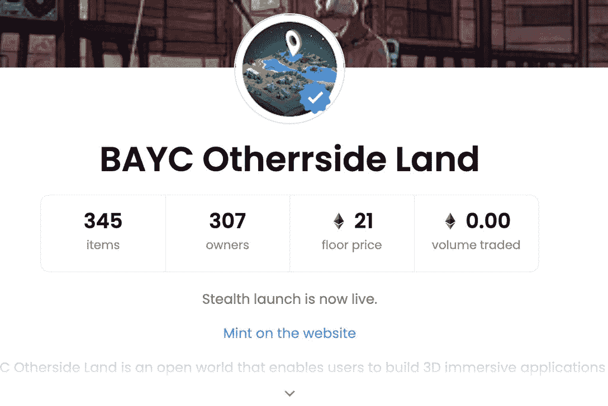
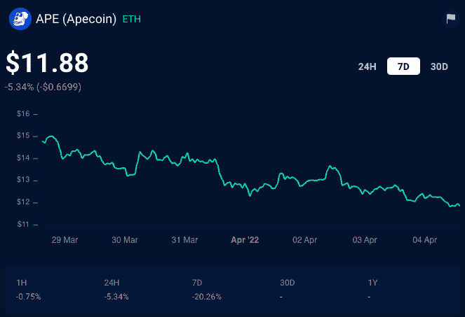
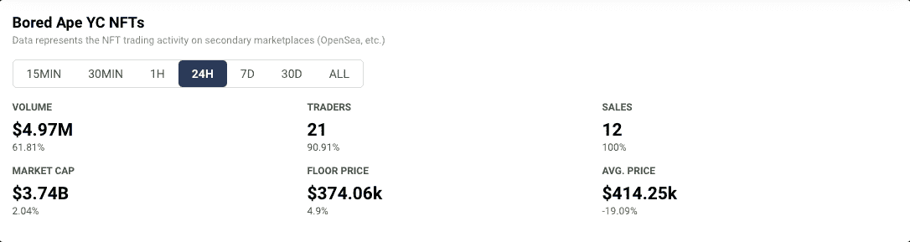

# 小心无聊的猿游艇俱乐部骗局

> 原文：<https://web.archive.org/web/https://dappradar.com/blog/beware-bored-ape-yacht-club-scam>

## 骗子利用用户界面漏洞和 OpenSea 漏洞进行 NFT 网络钓鱼攻击

无聊猿社区的成员需要小心，因为一个无聊猿游艇俱乐部的骗局在周末变得活跃起来。恶意行为者在 4 月 2 日星期六利用 NFT 市场 OpenSea 实施他们的网络钓鱼攻击。这次黑客攻击是最近打击该行业的一长串高调骗局中的最新一起。持续的攻击会开始影响平台的经济吗？

***汇总***

*   ***骗子们借道炒作周边*** [***BAYC 元宇宙彼岸***](https://web.archive.org/web/20221006045901/https://dappradar.com/blog/bored-ape-metaverse-is-here-see-you-on-the-otherside)
*   ***值得了解的*** [***如何识破骗局***](https://web.archive.org/web/20221006045901/https://dappradar.com/blog/8-ways-to-check-if-its-a-token-scam) ***趁早***
*   ***区块链技术还处于蛮荒的西部阶段***
*   ***BAYC***[***ape coin***](https://web.archive.org/web/20221006045901/https://dappradar.com/hub/token/eth/APE?from=0x4d224452801aced8b2f0aebe155379bb5d594381)***和*** [***整体经济***](https://web.archive.org/web/20221006045901/https://dappradar.com/ethereum/collectibles/bored-ape-yacht-club) ***未受骗局影响，为现***

## 骗局模式正在出现

骗局正在经历他们的文化时刻。去你最喜欢的付费电视平台，你不需要努力寻找一部制作精美的传记片，讲述一个厚颜无耻、魅力十足的骗子。Axie Infinity 黑客攻击是超现代技术盗窃的一个破纪录的例子。现在我们有一些肆无忌惮的骗子试图窃取人们的钱，因为最近围绕[无聊猿游艇俱乐部的新元宇宙彼岸](https://web.archive.org/web/20221006045901/https://dappradar.com/blog/bored-ape-metaverse-is-here-see-you-on-the-otherside)的炒作。

在最近的这场骗局中，一个可疑的钱包地址冒充了 BAYC 官方团队。然后，他们向 web3 生态系统中一系列有影响力的人发送假的 NFT 土地包裹。该网络钓鱼企图旨在分离持有人的区块链资产。我们还没有收到任何东西被偷的报告。

真正令人担忧的是黑客在欺骗中使用的方法。他们利用了 OpenSea 平台内部的一个可疑漏洞。这个 bug 提供了一个漏洞，允许骗子从官方的 BAYC 账户发起 NFT 转账，或者至少看起来是这样。虚假交易使骗子能够伪装成真正的 BAYC 团队，并试图骗取不知情的受害者的资产。

下面是违规账号的截图。你可以看到他们为了创造看起来相当可信的东西所做的努力。

Beware: the offending account on OpenSea

幸运的是，有一些方法可以识别诈骗何时发生。DappRadar 最近发表了一篇[有用的文章，解释如何识别诈骗令牌](https://web.archive.org/web/20221006045901/https://dappradar.com/blog/8-ways-to-check-if-its-a-token-scam)。在 [Twitter](https://web.archive.org/web/20221006045901/https://twitter.com/NFTherder/status/1510626632117231626) 上也有一个警惕的社区，在 Discord 服务器上也有乐于助人的人，当他们看到坏人时，他们会叫出来。

## Web3 类似于狂野西部的机遇和风险

我们从电影中了解的狂野西部是关于冒险、自由和机遇的。事实上，这是一个无情的沙漠，大多数人生活在没有保护的地方，不受恶意的偷马贼和暴力的强盗的伤害。必须建立正规的警察部队来保护人民免受犯罪活动的侵害。

同样，web3 的真相常常被掩盖在迷人的故事背后。大获全胜和巨额利润为分散式营销机器创造了好故事。但是，不为人知的盗窃、诈骗和受害者的故事就像一夜暴富一样是故事的一部分。

随着 NFT 抢劫案变得越来越复杂和大胆，各公司将开发在线安全解决方案。但就目前情况来看，分散平台的用户在与陌生人接触之前三思而行是很重要的。

## 无聊猿经济暂时未受影响

现在判断盗窃未遂对整个 BAYC 经济的影响还为时过早。查看 DappRadar 的令牌资源管理器，我们可以看到其本地令牌 ApeCoin 的价格在过去的 24 小时和 7 天内下降了。

DappRadar’s [Token Explorer](https://web.archive.org/web/20221006045901/https://dappradar.com/hub/tokens/ethereum/all/)

同样，如果我们看一下 [BAYC 分析页面](https://web.archive.org/web/20221006045901/https://dappradar.com/ethereum/collectibles/bored-ape-yacht-club)，一辆 BAYC NFT 的平均销售价格在过去一天下跌了 19.09%。

DappRadar’s [on-chain activity tracker for BAYC](https://web.archive.org/web/20221006045901/https://dappradar.com/ethereum/collectibles/bored-ape-yacht-club)

这可能与两天前这种猿的惊人销售价格有更大的关系，在它再次下降到正常水平之前，它将平均销售价格提高到一个不切实际的高度。但是如果更多的攻击发生，攻击相同的集合，观察它对 NFT 价格的影响将会非常有趣。

你可以使用 DappRadar 的工具[跟踪代币价格](https://web.archive.org/web/20221006045901/https://dappradar.com/hub/tokens/ethereum/all/)并监控你自己的[区块链资产组合](https://web.archive.org/web/20221006045901/https://dappradar.com/hub/wallet/)。同样，你可以使用我们的排名页面来了解 [dapps](https://web.archive.org/web/20221006045901/https://dappradar.com/rankings) 和 [NFTs](https://web.archive.org/web/20221006045901/https://dappradar.com/nft) 的最新表现。敬请关注我们的[博客](https://web.archive.org/web/20221006045901/https://dappradar.com/blog/)获取最新消息，并关注我们的 [Twitter](https://web.archive.org/web/20221006045901/https://twitter.com/DappRadar) 订阅源获取最新更新。