# 尽管 FTX 崩溃，区块链游戏仍有弹性

> 原文：<https://web.archive.org/web/https://dappradar.com/blog/bga-game-report-october-november-2022>

## 在 FTX 的失败中，区块链游戏公司在 11 月筹集了超过 3.2 亿美元

尽管 FTX 崩溃了，但 Web3 游戏仍然是 dapp 行业的驱动力。在 10 月和 11 月，游戏活动几乎占了 DappRadar 在 50 个网络中跟踪的所有区块链活动的一半，11 月有 800，875 个每日唯一活跃钱包(UAW)与游戏的智能合约进行了交互。

《异形世界》和《分裂之地》仍然是玩得最多的两个 Web3 游戏，在 9 月份每天有超过 225，000 和 151，000 的 UAW 注册。trickshot Blitz 10 月份的月活增长了 70%，达到每日 23，086 次 UAW。由 Solitaire Blitz 和 Trickshot Blitz 主办的第七季挑战赛推动了这一增长。

同样，PlayMining 的活动增加了 33%，11 月平均达到 22，466 dUAW。这一增长是由新的 Web3 游戏 Graffiti Racer 的发布推动的。

区块链游戏的影响在 NFT 市场也是显而易见的，在过去的两个月里，游戏内 NFT 的总交易额为 5500 万美元。《被解放的众神》仍然是交易量最高的游戏，占游戏资产总交易量的 60%。

2022 年，STEPN 拥有超过 223 万用户，生产了超过 70 万双鞋。广受欢迎的 dapp 是 FTX 投资组合的一部分，但该公司的创始人表示，他们“没有接触 FTX 的情况”，并将继续打造生态系统产品。FTX 的崩溃导致 GMT 和 GST 价格下跌 33%。

最后，尽管对区块链游戏和元宇宙项目的投资在过去几个月有所下降，但在 10 月和 11 月还是筹集了 5.34 亿美元。同样值得注意的是，许多项目专注于构建 Web3 游戏基础设施。这方面的例子有地平线区块链游戏和菲尼克斯游戏，它们都筹集了 1.9 亿美元的资金。

# 关键要点

*   11 月，尽管 FTX 崩溃，区块链博彩活动平均每天有 800，875 个独特的活动钱包。
*   Wax 一直是最主要的游戏协议，平均每天有超过 340，000 个独特的活动钱包。
*   由于靠近 FTX，Solana 的活动受到的打击最大，11 月份下降了 89.42%，平均每天只有 2，326 个活跃钱包；受影响最大的是 Star Atlas、Aurory 和 TapFantasy。
*   区块链游戏和元宇宙项目融资 5.34 亿美元；Web3 游戏发行商菲尼克斯游戏公司宣布投资 1.5 亿美元收购、投资和发行区块链游戏。
*   10 月和 11 月的 NFT 游戏总交易额为 5500 万美元；《被解放的上帝》引领区块链游戏界。卡牌游戏的交易额占市场的 64.25%，两个月内分别达到 2160 万美元和 1345 万美元。
*   M2E dapp 的团队 Walken 报告了 200 万个累计注册账户。尽管加密条件苛刻，但这一指标自 2022 年 8 月以来增长了 100%以上。

# 内容

*   [区块链游戏行业概述](https://web.archive.org/web/20230116130411/https://dappradar.com/blog/bga-game-report-october-november-2022/#overview)
*   [顶级 web3 游戏在 10 月继续增长](https://web.archive.org/web/20230116130411/https://dappradar.com/blog/bga-game-report-october-november-2022/#top)
*   [FTX 事件对顶级区块链游戏的影响微乎其微](https://web.archive.org/web/20230116130411/https://dappradar.com/blog/bga-game-report-october-november-2022/#ftx)
*   这是虚拟世界的底部吗？
*   [Move-to-earn 继续被采用](https://web.archive.org/web/20230116130411/https://dappradar.com/blog/bga-game-report-october-november-2022/#move)
*   区块链奥运会和元宇宙项目筹集了 5.34 亿美元
*   [从 web2 到 web3 的采用继续进行](https://web.archive.org/web/20230116130411/https://dappradar.com/blog/bga-game-report-october-november-2022/#adoption)
*   [结论](https://web.archive.org/web/20230116130411/https://dappradar.com/blog/bga-game-report-october-november-2022/#conclusion)

## 区块链游戏行业概述

***免责声明:DappRadar 会跟踪一段时间内与分散式应用程序的智能合约交互的唯一活动钱包(UAW)的数量。这也称为“链上”或“区块链”活动。然而，多个 dapps 不需要执行区块链事务来执行某些动作。***

区块链生态系统之外的活动被称为“链外”或“Web 2.0”活动。传统上用日活跃用户数(dau)来衡量链外活跃度。离线活动的一个例子是用户访问沙盒或分散的虚拟世界，或者用户在区块链上玩 Axie Infinity 而不要求奖励。

10 月份，区块链博彩业的每日活跃钱包数量与 9 月份持平(911，720 个)。这占所有区块链活动的 45.71%。

11 月，[尽管 FTX 崩溃](https://web.archive.org/web/20230116130411/https://dappradar.com/blog/assessing-the-impact-of-ftx-meltdown-in-the-dapp-industry)，但区块链博彩活动仍有弹性，平均每日独立活跃钱包(dUAW)仅下降 12%，达到 800，875 个。它仍然是该行业最重要的部分，占所有区块链活动的 42.67%。主导地位的下降是由 FTX 危机期间 DeFi 部门的增长所驱动的。

看看前六大[游戏协议](https://web.archive.org/web/20230116130411/https://dappradar.com/rankings/category/games)的独特活跃钱包(UAW)，WAX 仍然是占主导地位的区块链，也是唯一一个在过去三个月中保持活跃的游戏。10 月份，平均每日活跃钱包数达到 329，529 个，较 9 月份增长 8.85%。11 月，游戏 dapp 的 dUAW 增长了 4.48%，达到 344，284 个钱包。

第二个游戏协议 hive 10 月增长 4.94%，平均 169,655 dUAW。但是，在 11 月份，它下降了 7.83%，达到 156，369 dUAW，与 7 月份记录的活动相同。和往常一样，区块链蜂巢上的大部分活动都是由纸牌游戏《分裂大陆》负责的。

10 月，BNB 链超过 Hive 成为第二大最受欢迎的游戏协议，增长 3.95%(平均 171，269 dUAW)。然而，11 月 BNB 连锁店遭受了巨大的打击，协议活动下降了 35.08%(平均 111，188 dUAW)。尤其是微小世界和 MOBOX: NFT 农民，他们的用户群减少了 12.39%和 21.37%。

Polygon 自 9 月份以来一直处于下降趋势，唯一活跃钱包的数量不断减少。虽然 Polygon 以其品牌合作伙伴关系和大量业务开发而自豪，但该生态系统的游戏 dapps 的连锁活动继续下降。10 月份，UAW 的数量减少了 4.33%(平均为 82，002 dUAW)，11 月份减少了 8.8%(平均为 74，786 dUAW)。

即使是沙盒游戏第三季的成功也不能提升区块链的数字。类似地，主要受房地产游戏《高地》推动的 EOS 也呈下降趋势，10 月和 11 月分别下降 13%和 16.57%。

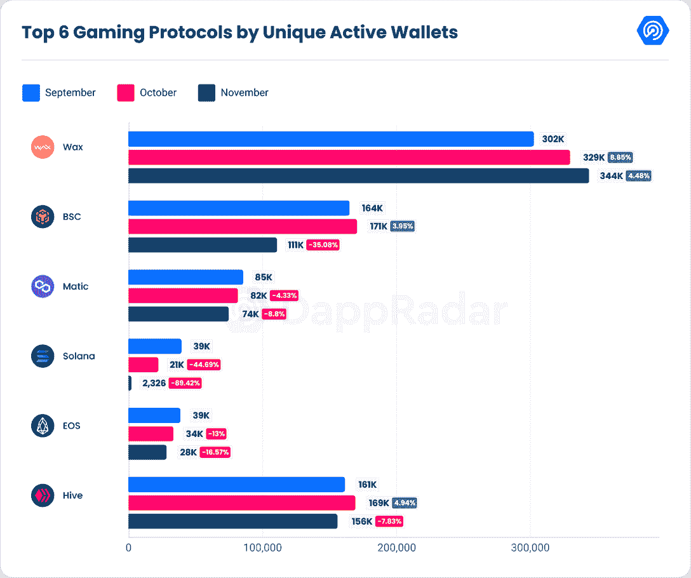

索拉纳经历了过去两个月的最大跌幅。10 月份，其活跃度下降了 44.69%，日均唯一活跃钱包达到 21979 个。11 月，由于 FTX 崩溃，区块链急剧下降了 89.42%(平均为 2，326 dUAW)。这是我们为 dUAW 登记的最低数字。

## 十月份顶级网络 3 游戏继续增长

10 月份,《异形世界》是玩得最多的区块链游戏，平均每天有 212，350 次 UAW，比上月增加了 25%。10 月 20 日，他们[宣布](https://web.archive.org/web/20230116130411/https://twitter.com/AlienWorlds/status/1583069247097667589?ref_src=twsrc%5Etfw%7Ctwcamp%5Etweetembed%7Ctwterm%5E1583069247097667589%7Ctwgr%5E0f9f9a9d267ea08c2dec2d83543a3826400e55cc%7Ctwcon%5Es1_&ref_url=https%3A%2F%2Fwww.blockchaingamer.biz%2Fnews%2F20122%2Falien-worlds-announces-new-in-game-daos-for-its-planetary-syndicates%2F)推出全新的游戏内 DAOs，作为他们新的行星辛迪加模式的一部分。通过在蜡的基础上进行构建，外星世界被赋予了轻松创建道斯代理民主制的手段。

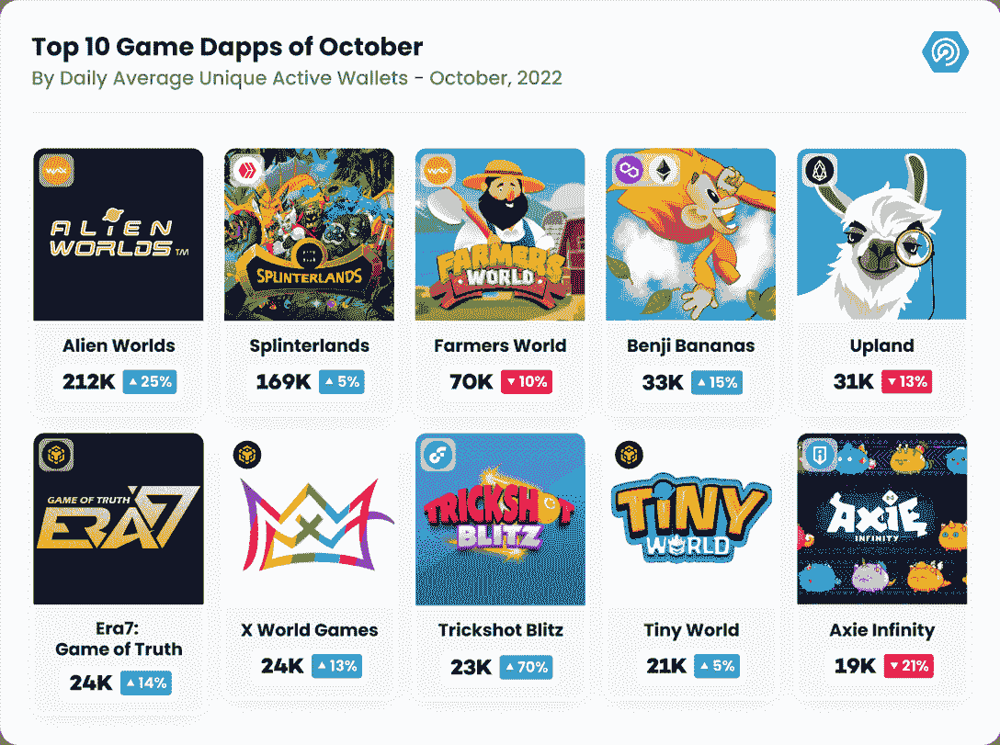

继《外星世界》之后，Splinterlands 的平均 dUAW 为 169，445，自上个月以来增长了 5%。10 月 5 日，该公司宣布了一个主要系列的数字卡；在过去的几个月里，他们已经卖出了超过 1000 万包混沌军团系列。

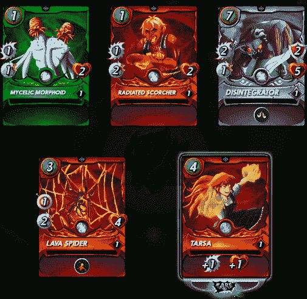

Splinterlands cards being unpacked – Source: [splintertalk](https://web.archive.org/web/20230116130411/https://www.splintertalk.io/@qoogohome/the-chaos-legion-pack-i-opened-today-rlexcf)

混沌军团(Chaos Legion)是一个卡牌包系列，于 2022 年 1 月 17 日首次公开发售，是该游戏自 2018 年问世以来的第三个主要卡牌扩展。仅生产了 15，000，000 包，这一新的里程碑标志着卡片可用性的最后冲刺，全年持续销售以及其他 NFT 销售。《混乱军团》的成功是这款以幻想为主题的数位卡战斗游戏一长串胜利中的最新一个。

AR 移动地产游戏 Upland 的活跃度继续呈下降趋势，10 月份达到 31，595 dUAW。他们还宣布了与 Gala Games 的新合作伙伴关系，Vox 将成为 Upland 在该平台以太坊互操作性门户中的第一个合作伙伴。Upland 希望建立一个开放和可互操作的游戏经济。

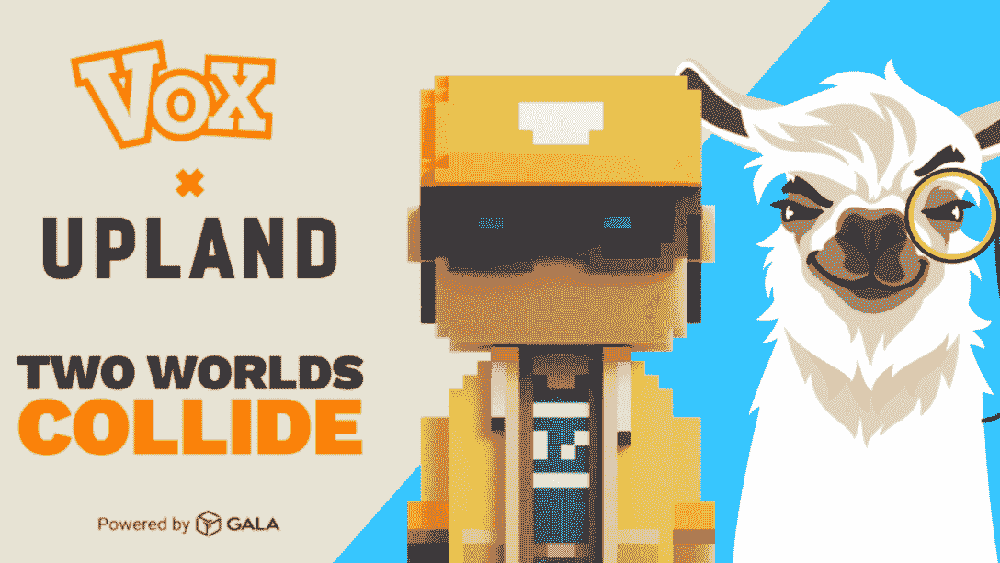

此次合作将为两家公司的开放元宇宙愿景奠定基础，该愿景鼓励资产互操作性。允许用户跨平台和链存储、销售和运输他们的资产。

移动游戏 Trickshot Blitz 的月活跃率惊人地增长了 70%。流量区块链上的休闲游戏达到了 23,086 dUAW。这一增长是由 Solitaire Blitz 和 Trickshot Blitz 主办的第七季挑战赛的推出推动的。这个季节持续了 7 天，从 10 月 8 日持续到 15 日。用户可以通过击败其他人获得高达 60 拉里的收入。还有一个迷因比赛和推荐计划，奖励 2500 代币。

Axie Infinity 继续其下降趋势:今年 10 月，他们的平均 dUAW 为 19，434，比 9 月下降了 21%。尽管如此，他们还是宣布发布 Axie Infinity: Raylights，这是他们第一款以新方式利用现有 Axie NFTs 的第三方产品。在这种情况下，新游戏需要一个陆地 NFT 和一些 Axie，这突出了其他游戏开发者可以如何使用 Axie 生态系统和罗尼区块链来构建他们的游戏。

[https://web.archive.org/web/20230116130411if_/https://www.youtube.com/embed/YfN5UH7SHtk?feature=oembed](https://web.archive.org/web/20230116130411if_/https://www.youtube.com/embed/YfN5UH7SHtk?feature=oembed)

在 Axie Infinity: Raylights 中，玩家在地下播种矿物，最深达三层，以便种植植物。该游戏包括十种不同类型的矿物，但玩家在开始时只能获得前三种。其他的随着玩家的进步和新发现而解锁。在播种矿物后，玩家分配一个轴来种植植物。一旦生长计时器完成，植物将被添加到库存中，在那里它可以被放置到地块上。

最后，Era7: Game of Truth 和 X World Games 巩固了他们的基础玩家，日均活跃钱包数约为 24，000 个，分别比上个月增加了 14%和 13%。

## FTX 事件对区块链顶级赛事的影响微乎其微

11 月份，[《异形世界》](https://web.archive.org/web/20230116130411/https://dappradar.com/multichain/games/alien-worlds)是玩得最多的区块链游戏，日均 UAW 为 225，360，比上月增长了 6%。11 月 22 日，来自外星世界的武器和角色 NFT 被宣布可以被送进[战斗世界](https://web.archive.org/web/20230116130411/https://battledome.live/)。

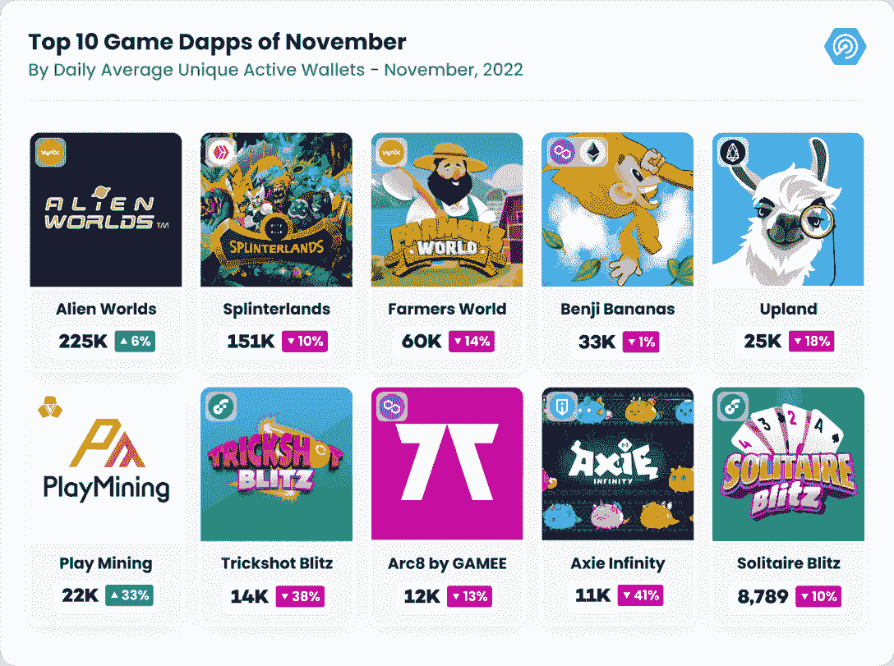

现在，有必要指出的是，这并不是《外星世界》在过去两年中承诺的雷神穹顶。相反，这是一个第三方应用程序，由一个名为 Restack AI 的小组开发。部分资金由来自外星世界的[银河枢纽先锋赠款](https://web.archive.org/web/20230116130411/https://alienworlds.medium.com/galactic-hubs-season-1-future-grantees-4aeedda5d99)提供，战斗类比赛允许多达 20 名玩家与他们的外星世界 NFT 决一胜负。这是相当被动的游戏，符合其余的外星世界的游戏体验。

另一方面，夹板地的活动减少了 10%，平均达到 151，517 dUAW。11 月 11 日，该团队宣布计划为他们的 Runi NFTs 添加额外的用例，因为销售一直很慢。

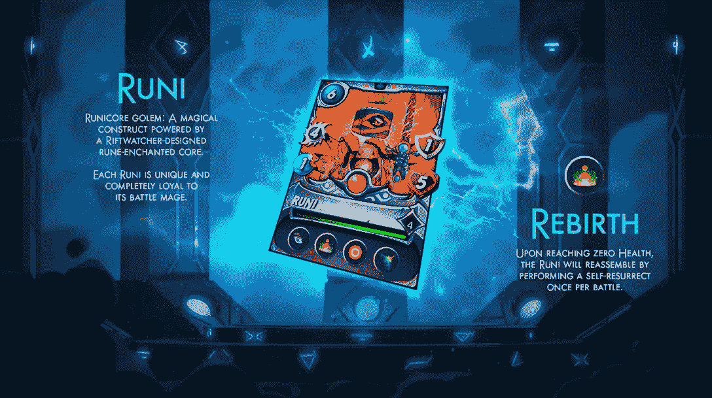

Source: [Splinterlands](https://web.archive.org/web/20230116130411/https://splinterlands.com/)

独一无二的，生成性的，PFP 风格的 NFT，将成为碎片领地中的卡片。Splinterlands 希望为以太坊区块链增加一个赌注合同，允许用户在游戏中使用他们的 Runi。每个 Runi 都有一个独特的游戏内卡，所有者也可以将他们的 Runi 作品用于商业用途。

此外，11 月 17 日，据报道，由于加密市场的持续恶化和全球经济衰退，splitterlands[解雇了近 45%的员工。Splinterlands 明确表示，他们在 FTX 或任何其他有风险的交易所或服务中没有任何资金，也没有任何债务或以任何方式使用杠杆。该公司有现金和密码来资助未来和正在进行的发展。](https://web.archive.org/web/20230116130411/https://twitter.com/splinterlands/status/1593345186842775553?ref_src=twsrc%5Etfw%7Ctwcamp%5Etweetembed%7Ctwterm%5E1593345186842775553%7Ctwgr%5E9660b8eb8f8cff8e993ef3dfe3bc6a45cbae84e0%7Ctwcon%5Es1_&ref_url=https%3A%2F%2Fwww.playtoearn.online%2F2022%2F11%2F20%2Fsplinterlands-lays-off-45-staff%2F)

PlayMining 的活动增加了 33 %, 11 月平均达到 22，466 dUAW。游戏 Graffiti Racer 的发布引起了 PlayMining 生态系统中活动的增加。Graffiti Racer 加入了四款“即玩即赚”( P2E) PlayMining 游戏的目录，这些游戏允许玩家赚取 DEAPcoin (DEP)代币。用户可以在 PlayMining NFT 市场上用这些代币购买游戏物品。

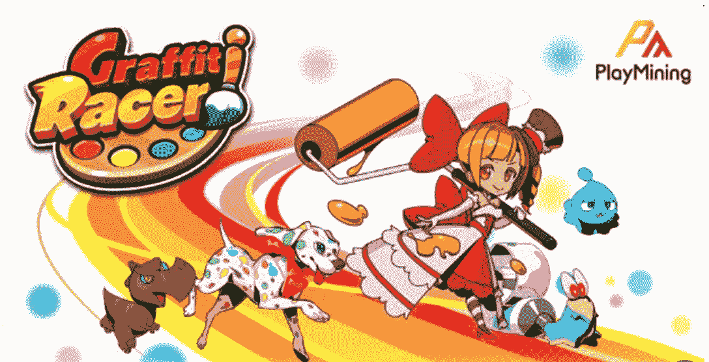

Source: [globenewswire](https://web.archive.org/web/20230116130411/https://www.globenewswire.com/en/news-release/2022/11/02/2546210/0/en/PlayMining-Web3-Entertainment-Platform-Launches-4th-GameFi-Title-Graffiti-Racer.html)

在 Graffiti Racer 中，玩家给“NFT 床单”角色涂上耐力、速度和操控性等赛车技能属性的颜色。一旦着色，字符可以在旅游和比赛中比赛。高分为玩家赢得 DEP 奖励，他们可以用它来购买额外的 NFT 床单。NFT 也是可以收集的，越稀有的技能越强大，角色也可以通过游戏升级。

Benji Bananas 巩固了他们大约 33，000 dUAW 的基础玩家，比上个月减少了 1%。这个月我们和他们一起做了一个 AMA；因此，如果你想知道这个游戏的未来，去[看看吧](https://web.archive.org/web/20230116130411/https://twitter.com/DappRadar/status/1597591249099558912)。

## 这是虚拟世界的底层吗？

自 7 月以来，虚拟世界项目一直呈下降趋势。10 月和 11 月，该类别的交易量下降了 30%，至 11 月的 900 万美元。这是自 2021 年 6 月以来登记的最低数字。

10 月份销售数量环比攀升 9.7% (20，843)，显示该类型项目需求依然可观。然而，在 11 月，销售数量急剧下降 47.61% (10，919)，这是自 2021 年 7 月以来的最低数字。

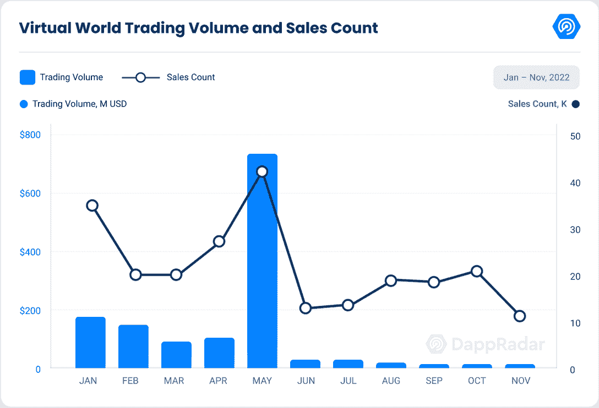

在 10 月和 11 月，Otherdeed for Otherside 平均每月下降 35 %, 11 月达到 5460223 美元。占虚拟世界总交易量的 60.13%。从销售额来看，与 9 月份相比，Otherside 的 Otherdeed 在 10 月份增长了 9.28%，但随后在 11 月份下降了 15.52%。

同样， [NFT 世界 V2](https://web.archive.org/web/20230116130411/https://dappradar.com/ethereum/games/nft-worlds) 平均每月减少 31.5%，11 月份交易量达到 129，628 美元。 [WorldWideWebb](https://web.archive.org/web/20230116130411/https://dappradar.com/ethereum/collectibles/worldwide-webb-land) 也处于同样的下降趋势，平均来看，这两个月下降了 38.5%，11 月份达到 76229 美元。

沙盒于 11 月 2 日完成了第三季的 Alpha 测试，是最受关注的事件之一，有超过 353，000 名独立用户参与了 98 个全新的品牌体验。10 月份，交易量下降了 32.43%，达到 1，568，409 美元，但销售额增加了 12.71%，达到 14，917 美元。11 月，交易量持续下降 33%，达到 100 万美元。尽管如此，11 月 22 日他们还是宣布了新的土地出售。

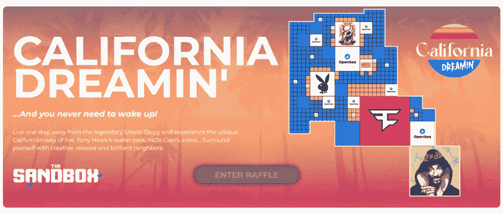

Source: [The Sandbox](https://web.archive.org/web/20230116130411/https://www.sandbox.game/en/)

即将到来的拍卖将拍卖 1，967 块土地——50 块地产、695 块普通土地、134 块优质土地和 19 块 1 合 1 土地——标准和优质土地销售通过盲票系统分配。

拍卖于 11 月 24 日开始，第一波名为“California Dreamin”的活动代表了“以加州为主题的品牌，如花花公子和马拉松”。到 2023 年初，还将有两次主题发布。

另一方面，10 月份的交易量增长了 31.34%，再次超过了 120 万美元，销售额增长了 43.02%。但在 11 月份，交易量和销售额分别下降了 53.98%和 23.44%。

总的来说，看起来在过去的几个月里，对虚拟世界项目的需求和宣传一直呈下降趋势。当然，FTX 的情况没有帮助，交易量和销售数量的下降是可以看到的。尽管如此，正如下面的章节所见，元宇宙世界项目今年筹集了超过 20 亿美元。

## Move-to-earn 将继续被采用

加密货币领域目前越来越受欢迎的一个趋势是移动赚取，这是一个相对较新的利基市场，有一系列产品和服务可以奖励你的积极性。Move-to-earn 应用程序提供了一种创新的赚钱方式，同时改善了您的身体活动。

STEPN 仍然是最受欢迎的 M2E(移动到收入)dapps 之一，2022 年累计月用户超过 223 万，生产超过 70 万双鞋。广受欢迎的 dapp 是 FTX 投资组合的一部分，但该公司的创始人[声称](https://web.archive.org/web/20230116130411/https://twitter.com/FSLdailynews/status/1591108043659702274)“没有暴露于 FTX 局势”，并向社区保证财政部资金是安全的，他们仍然专注于为生态系统开发新产品。

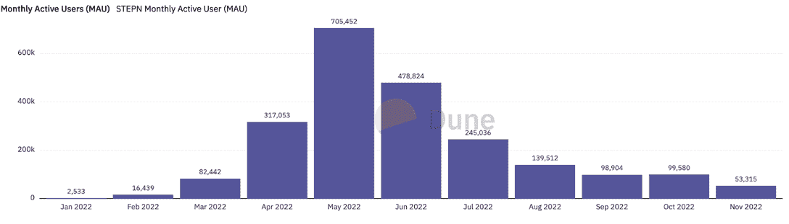

Source: [Dune Analytics](https://web.archive.org/web/20230116130411/https://dune.com/nguyentoan/STEPN-(GMT-GST)-Core-Metrics)

用户可以通过绿色 Satoshi 代币(GST)锻炼获得奖励，这些代币可以在兼容的 DEX/CEX 上出售，也可以在 STEPN 应用程序中用于制造、修理和调平运动鞋。此外，STEPN 还与第二个令牌——绿色元宇宙令牌(GMT)相结合，用于管理平台。

GMT 和 GST 价格受到 FTX 崩盘的影响，自崩盘发生以来，两者都下跌了 33%。

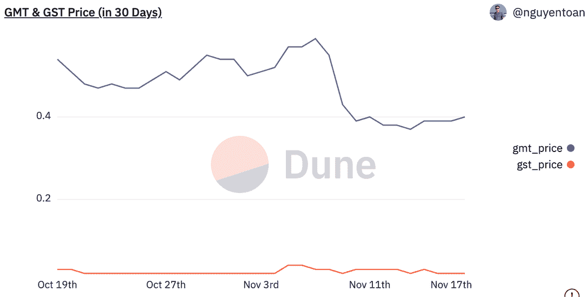

Source: [Dune Analytics](https://web.archive.org/web/20230116130411/https://dune.com/nguyentoan/STEPN-(GMT-GST)-Core-Metrics)

尽管 STEPN 在移动赚钱领域遥遥领先，但其他几个 dapps 也获得了巨大的吸引力，包括:

### Step 应用程序(FITFI)

作为最新的 move-to-earn 平台，Step App 受到 STEPN 及其功能的极大启发，同样，用户必须下注名为 SNEAKs 的可升级运动鞋 NFTs，才能开始赚取奖励。12 月 1 日，Step App 将在东京的一次活动中推出其同名应用。

牙买加短跑运动员乌塞恩·博尔特(Usain Bolt)将在该活动中担任主要发言人和 DJ，该活动由 Bybit 加密货币交易所赞助。

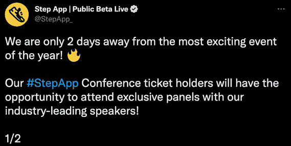

Source: [Twitter](https://web.archive.org/web/20230116130411/https://twitter.com/StepApp_/status/1597517105070542848?ref_src=twsrc%5Etfw%7Ctwcamp%5Etweetembed%7Ctwterm%5E1597517105070542848%7Ctwgr%5E8dbf415849de94b3c70fde3a029c11fd3a9c95cf%7Ctwcon%5Es1_&ref_url=https%3A%2F%2Fcapital.com%2Fstep-app-move-to-earn-web2-metaverse-december-launch)

除了其主要的移动赚取功能，Step 应用程序还允许用户进行微交易。他们可以使用信用卡或加密货币从应用商店购买一系列东西，包括角色皮肤、潜行皮肤和地图样式。该应用程序还具有下注游戏功能，用户可以使用他们的代币与朋友或其他玩家一起参加锦标赛。

Step App 拥有超过 90，000 名注册用户，并与顶级运动员建立了合作伙伴关系，旨在将 FitFi 带给随时准备好的观众。

### 基因宠物(基因)

gene pets 鼓励用户更好地照顾他们的身心，让他们沉浸在游戏化的体验中，在那里他们培育、战斗和成长被称为 gene pets 的数字动物。这些基因宠物可以买卖和交易，更强大的宠物会产生更多的钱。

像许多其他移动赚钱应用一样，Genopets 有两个标志。第一个令牌，基因，作为游戏的治理令牌，用于指导游戏的开发和底层流程。第二个令牌，KI，是玩家作为奖励获得的游戏内现金，可以用来提炼水晶和为他们的基因宠物购买栖息地以提高他们的属性。

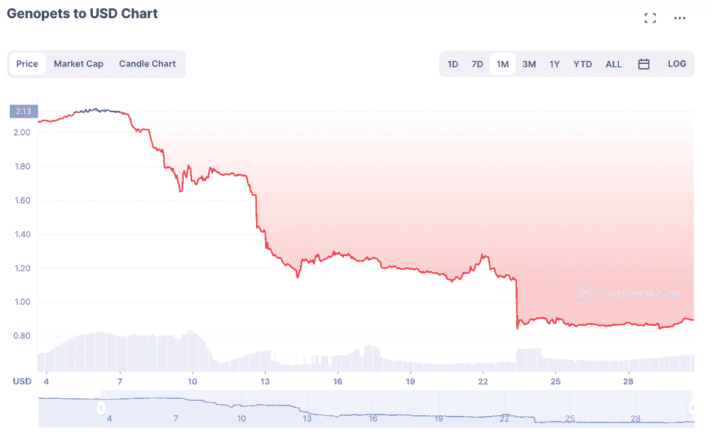

Source: [CoinMarketCap](https://web.archive.org/web/20230116130411/https://coinmarketcap.com/currencies/genopets/)

Genopets 没有受到围绕 FTX 问题的直接影响。然而，本地基因令牌在 FTX 可以买到，因此在过去两周内价格下跌了 58%。

11 月 17 日，Genopets 推出了他们的传奇实验室，允许玩家制作有史以来第一个宠物增强版。那些拥有缺页 NFT 和所需数量令牌的人可以在实验室尝试创建，获得几个随机项目中的一个。这些页面是 NFT，它们都可以在[魔法伊甸园](https://web.archive.org/web/20230116130411/https://magiceden.io/marketplace/genopets_recipe_hunt)上购买。

### 漫游(瓦肯)

[Walken](https://web.archive.org/web/20230116130411/https://dappradar.com/solana/games/walken) 结合了当今加密和 GameFi 领域的两个热门概念，Play2Earn 和 Exercise2Earn(也称为 Move2Earn 或 Walk2Earn)。通过锻炼，玩家可以获得应用内令牌(GEM)，他们可以使用这些令牌来升级游戏内的化身，这些化身可以争夺 WLKN，即该项目的原生令牌。Walken 建立在 Solana 区块链的基础上，由开发 Appyfurious 和 Getfit 应用程序的团队开发。

尽管 FTX 的情况，根据该小组分享的声明，其注册账户数超过 200 万。自 2022 年 8 月以来，尽管加密市场加速了熊市衰退，但这一指标仍增加了 100%以上。此外，根据 dune analytics 的数据，自游戏推出以来，已经铸造了 80808 枚金币。

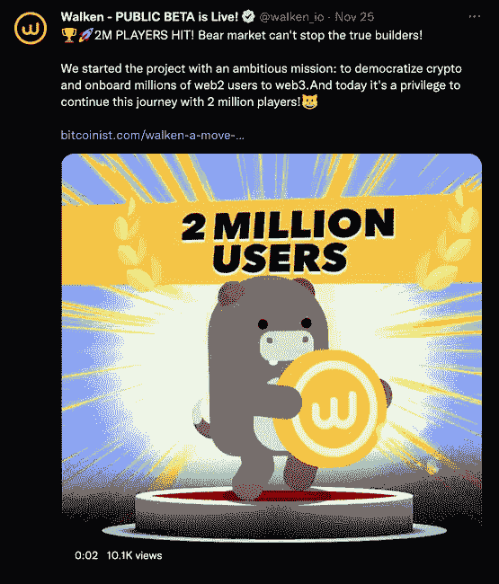

Source: [Twitter](https://web.archive.org/web/20230116130411/https://twitter.com/walken_io?ref_src=twsrc%5Etfw%7Ctwcamp%5Etweetembed%7Ctwterm%5E1596156771206279168%7Ctwgr%5E1f911757c5438a51a8acf318d797c46cd7d5a67a%7Ctwcon%5Es1_&ref_url=https%3A%2F%2Fnextnftdrop.com%2Fnews%2Fwalken-reaches-milestone-of-2-million-registered-users%2F)

Walken 对用户的价值很大一部分是它与 DeFi 平台的集成，鼓励用户，尤其是新的加密持有者，使用并受益于 DeFi 服务。此外，Walken 正在寻求将开发者和第三方游戏工作室引入其生态系统，以促进加密的采用并提高 WLKN 令牌的价值。

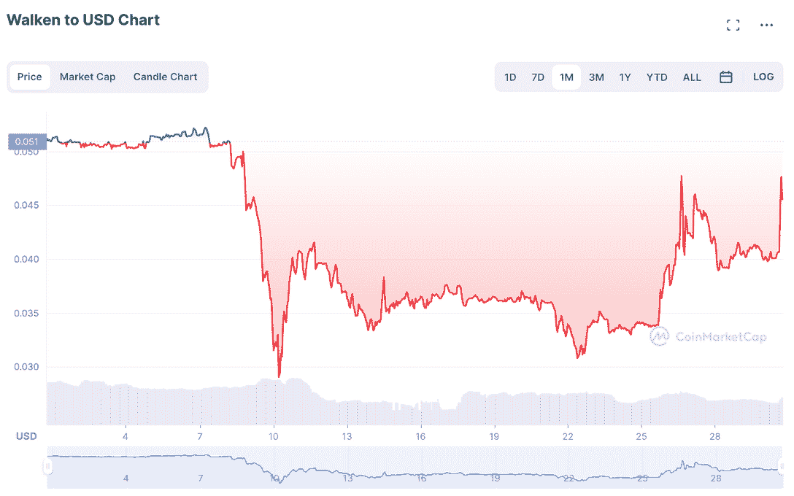

Source: [CoinMarketCap](https://web.archive.org/web/20230116130411/https://coinmarketcap.com/currencies/walken/)

建立在索拉纳，FTX 危机影响了 WLKN 令牌在最初几天。事实上，价格在头两天下降了 42%，但之后开始回升。今天的价格是 0.045 美元，比月初下降了 10%。

## 区块链奥运会和元宇宙项目筹集了 5.34 亿美元

全年，区块链博彩公司的合作伙伴和投资源源不断，在 10 月和 11 月，又筹集了 5.34 亿美元。我们观察到对区块链博彩业的投资呈上升趋势。9 月是区块链博彩投资最少的一个月，初创公司和有前途的项目的价值不断增加。

过去两个月发生了两起引人注目的投资。10 月 4 日，专注于 Web3 游戏开发的初创公司 Horizon Blockchain Games 宣布在 A 轮融资中筹集 4000 万美元，涉及育碧和 Take-Two Interactive 等大型传统视频游戏公司。

据 Horizon 称，他们将利用这笔资金来发展公司的生态系统，雇佣更多员工来开发更好的用户友好型和 Web3 原生产品。

11 月 27 日，Web3 游戏发行商菲尼克斯游戏公司宣布出资 1.5 亿美元收购、投资和发行区块链游戏。他们将利用这笔资金建立一家游戏发行公司，将区块链游戏带给主流观众。

在菲尼克斯奥运会的最近一轮融资中，凤凰集团和迪拜的 Cypher Capital 等投资者参与了进来。菲尼克斯游戏公司的联合创始人兼首席执行官克里斯·柯(Chris Ko)曾领导过神话游戏公司，他认为菲尼克斯游戏公司“就像一个风险投资基金”，为下一代区块链游戏注入活力。

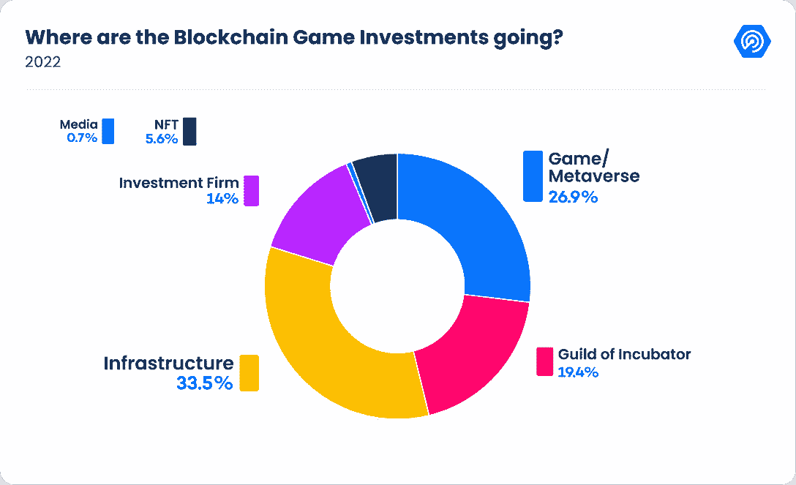

纵观全局，我们观察到，2022 年迄今为止，33.5%的投资流向了基础设施，19.4%流向了公会或孵化器，26.9%流向了游戏和元宇宙项目，14%流向了投资公司，5.6%流向了 NFT 游戏项目。

基础设施和奥运会/元宇宙项目是最重要的资金接收方。Animoca Brands 和潘迪拉资本是今年最引人注目的投资者。

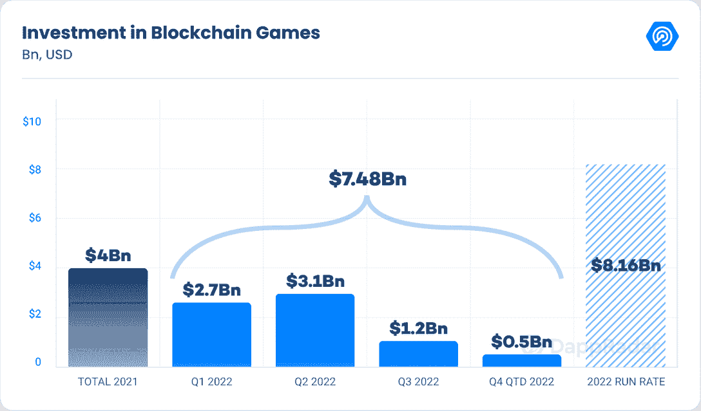

与上一季度的预测相比，今年对这一不断增长的行业的投资总额预期下降了 11.7%，至 81.6 亿美元。

2022 年的投资金额表明，尽管数字资产市场充满挑战和不确定性，但大投资者仍然看好区块链博彩业。

## 从 web2 到 web3 的采用仍在继续

自第一款雅达利游戏问世以来，游戏玩家已经在无数游戏上投入了成千上万个小时——但在解锁一项成就或击败一款游戏后，他们几乎没有任何有形的产出。但是 Web3 和区块链技术改变了整个动态，在一个关键的方面与基于 Web2 的游戏有了显著的不同:所有权。

区块链技术提供了一种以以前不可能的方式拥有游戏内资产的手段。不可变的分布式分类帐提供了暗示独特性和数字所有权的方法，为游戏玩家提供了一种全新的方式来要求他们通过游戏获得的物品——这是社区多年来一直寻求的所有权感。

出于这个原因，许多 Web2 游戏公司开始采用 Web3。10 月，Double Jump Tokyo 与世嘉达成协议，将后者广受欢迎的《三国泰森》游戏系列引入区块链。

即时战略游戏 Sangokushi 泰森是日本游戏厅中最受欢迎的游戏，也是可以放在游戏区供玩家在游戏中使用的收藏卡。

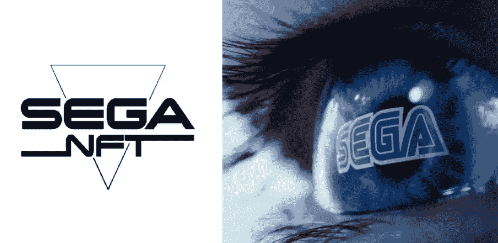

Source: [Gamerant.com](https://web.archive.org/web/20230116130411/https://gamerant.com/sega-blockchain-nft-card-game-doomed-controversial/)

虽然游戏仍在开发中，但区块链的应用程序仍有待猜测。但是，如果区块链以 NFT 的形式支持这些可收藏的卡片，以确保游戏的实用性，同时为游戏提供一种所有权和筹款的方式，这将是有意义的。

不过，要说世嘉在此之前没有和区块链发生过摩擦，未免有些冒昧。今年 1 月，该公司为其“世嘉 NFT”注册了商标。这个商标是在首席执行官 Haruki Satomi 对 NFTs 表现出更广泛的冷淡后不久出现的。

此外，在 11 月份，索尼发布的一项专利建议该公司可以利用区块链和 NFTs 来探索游戏内资产的用途。

这项名为“使用分布式账本上的令牌跟踪唯一的游戏内数字资产”的专利以跟踪数字资产所有权变化的图表为特色。专利描述指出，“个人经常发现拥有或使用与受尊敬的名人或活动相关的独特物理物品是有意义的。”

索尼正在研究的技术将使跟踪任何游戏中数字资产的历史成为可能，例如在玩家之间交易的可穿戴设备或皮肤，本质上与 NFT 的工作方式相同，但没有提到它们的名字。

## 结论

尽管 FTX 失败了，但区块链技术依然强劲，并且是改变我们金融体系和游戏经济的其他创新项目的基础。该技术没有退缩，提供服务，并允许每个用户发送和接收资产。

那些通过游戏或 NFT 渠道进入加密领域的人可能对阿拉米达和 FTX 中央交易所的崩溃不感兴趣。

有什么意义？除非他们的代币在 FTX 持有，这是不太可能的，因为大多数区块链游戏都有内部市场和玩家下注选项，这意味着代币必须放在区块链的钱包里。在没有意识到的情况下，游戏玩家可能已经学到了最严酷的 Web3 课程:不是你的密钥，也不是你的密码。

FTX 事件在某种程度上影响了 Web3 中的每一个人。人们对该行业的信任将会动摇，他们会想知道这些事件会导致什么。

我们目前正处于萌芽阶段，具有巨大的发展潜力。虽然有几个改进的机会，但行业仍在不断发展和创新。

区块链游戏的未来是光明的，它有望成为 Web3 的领跑者。