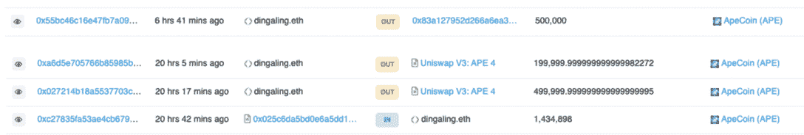
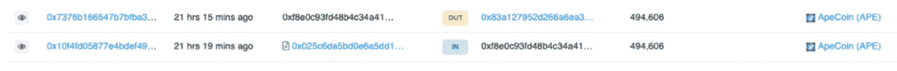
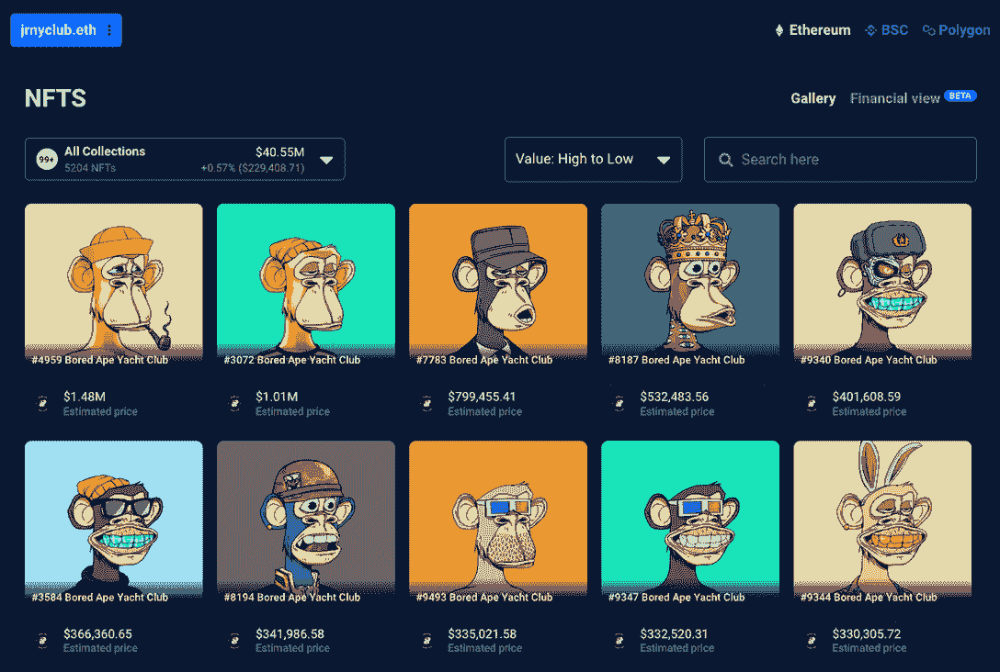
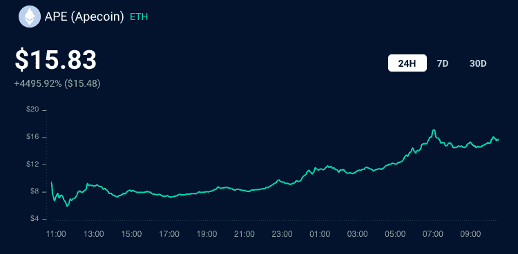

# 最大的无聊猿鲸把它们的猿移到交易所

> 原文：<https://web.archive.org/web/https://dappradar.com/blog/biggest-bored-ape-whales-move-their-ape-to-exchanges>

## Uniswap V3、币安和 FTX 是三个主要目的地

昨天，最大的无聊猿猴游艇俱乐部 NFT 鲸鱼都有资格获得大量的猿猴代币。分析表明，大多数人已经将他们的 APE 转移到 Uniswap V3、币安和 FTX 等交易所，在那里最有可能的结果是卖出或交易。

声称自己是猿的无聊猿鲸倾向于出售它们的代币。有些人把它们全卖了，有些人卖了一大块，正如前面提到的，有些人还没有收集它们。

在 3 月 17 日开始的空投中，无聊猿游艇俱乐部中最大的鲸鱼收到了大量的猿代币。排名前十的白鲸总共拥有 655 个无聊猿游艇俱乐部 NFT，以及更多的突变猿游艇俱乐部(MAYC)和无聊猿养狗俱乐部(BAKC)NFT。其中，丁加林以 113 只无聊猿 NFT 领先群雄。

如前所述，BAYC、MAYC 和 BAKC 的持有人有资格获得不同金额的下降，这取决于他们持有的资产。重要的是，我们在这里看到的是前 10 名 BAYC NFT 持有者中的第 6 名。这些相同的钱包也可以持有 MAYC 和 BAKC NFT，他们每个人都可以获得所有者 APE 令牌，如下所述。

## 谁在卖？

在这堆东西的顶端是 NFT 的影响者和收藏家丁加林，他收集了大量的 T2 112 BAYC T3 NFT 以及 T4 98 MAYC T5 和 BAKC T7 NFT。他收集了 1，434，898 只猿猴，卖掉了其中 1，199，999 只，剩下 234，899 只。这意味着 Dingaling 以大约 1430 万美元的价格出售了 83.6%的配额，或者，他们可以交易或押注于 FTX。

较小的 NFT 持有者也出售 APE，例如， [Canaryvault.eth](https://web.archive.org/web/20220927121440/https://dappradar.com/hub/wallet/eth/0xd38a87d7b690323ef6883e887614502abcf9b1eb/nfts) 与 [72 BAYC，](https://web.archive.org/web/20220927121440/https://dappradar.com/hub/wallet/eth/0xd38a87d7b690323ef6883e887614502abcf9b1eb/nfts/1/boredapeyachtclub)[20 MAYC](https://web.archive.org/web/20220927121440/https://dappradar.com/hub/wallet/eth/0xd38a87d7b690323ef6883e887614502abcf9b1eb/nfts/1/mutant-ape-yacht-club)NFT 收到 767，608 个 APE，现在已经转移了 765，566 个，这意味着他们清理了 99.7%的 APE 代币。从交易来看，代币被送往币安，在那里最有可能的结果是交易或出售。

最后，[这个匿名钱包](https://web.archive.org/web/20220927121440/https://dappradar.com/hub/wallet/eth/0xd38a87d7b690323ef6883e887614502abcf9b1eb/nfts)包含[50 BAYC](https://web.archive.org/web/20220927121440/https://dappradar.com/hub/wallet/eth/0xf8e0c93fd48b4c34a4194d3af436b13032e641f3/nfts/1/boredapeyachtclub)NFT，收到 494，606 APE，并立即将 100%转移到交易平台 FTX，在那里最有可能的结果再次是卖出或交易。

## 谁在等？

如前所述，一些鲸鱼还没有收集他们的猿和一些举行。有趣的是，第二大 BAYC NFT 持有者, [Jrnyclub.eth](https://web.archive.org/web/20220927121440/https://dappradar.com/hub/wallet/eth/0x1b523dc90a79cf5ee5d095825e586e33780f7188/nfts) 持有所有 1278360 枚 APE 代币，价值超过 1900 万美元。而第三大持有者[在撰写本文时还没有认领他们的猿。](https://web.archive.org/web/20220927121440/https://etherscan.io/token/0xbc4ca0eda7647a8ab7c2061c2e118a18a936f13d#balances)

## 猿价上涨

在经历了一个稍微艰难的开始后，APE token 自 3 月 17 日推出以来一直在持续升值，目前价值近 16 美元。由于倡导者和手握钻石的投资者持有他们的 APE，卖出压力似乎很小。在这个早期阶段，很难预测接下来的 48 小时，但似乎白鲸的快速套现并没有影响代币或其价格。

未来几天，随着更多符合条件的 NFT 持有者申请 APE 配额，看看这种代币的表现将会非常有趣。大量的抛售压力可能会在短期内降低代币的价值。如前所述，有一些钱包尚未收集，可能坐在数百万美元的猿。

然而，BAYC 社区是强大的，并在许多场合表明，他们已经成功地围绕该系列建立了一个品牌，不仅为内部人士创造了一种专属感觉，也为非帮派人士创造了一种 FOMO 的感觉。

## 十大无聊的猿 NFT 钱包

想探索十大 BAYC NFT 持有人钱包？点击下面，你就可以走了！

1.  [Dingaling.eth](https://web.archive.org/web/20220927121440/https://dappradar.com/hub/wallet/eth/0x54be3a794282c030b15e43ae2bb182e14c409c5e)
2.  [Jrny.eth](https://web.archive.org/web/20220927121440/https://dappradar.com/hub/wallet/eth/0x1b523dc90a79cf5ee5d095825e586e33780f7188)
3.  [0x98e 711 f 31 e 49 C2 e 50 C1 a 290 b 6 F2 B1 e 493 e 43 ea 76](https://web.archive.org/web/20220927121440/https://dappradar.com/hub/wallet/eth/0x98e711f31e49c2e50c1a290b6f2b1e493e43ea76)
4.  [canary fault . eth](https://web.archive.org/web/20220927121440/https://dappradar.com/hub/wallet/eth/0xd38a87d7b690323ef6883e887614502abcf9b1eb)
5.  [vault.j1mmy.eth](https://web.archive.org/web/20220927121440/https://dappradar.com/hub/wallet/eth/0x8ad272ac86c6c88683d9a60eb8ed57e6c304bb0c)
6.  [Machibigbrother.eth](https://web.archive.org/web/20220927121440/https://dappradar.com/hub/wallet/eth/0x020ca66c30bec2c4fe3861a94e4db4a498a35872)
7.  [0x F8 E0 c 93 FD 48 b4c 34 a 4194 D3 af 436 b 13032 e 641 f 3](https://web.archive.org/web/20220927121440/https://dappradar.com/hub/wallet/eth/0xf8e0c93fd48b4c34a4194d3af436b13032e641f3)
8.  [0x a7 ab 7a 265 f 274 fa 664187698932 D3 cabb 851023d](https://web.archive.org/web/20220927121440/https://dappradar.com/hub/wallet/eth/0xa7ab7a265f274fa664187698932d3cabb851023d)
9.  [goldape.eth](https://web.archive.org/web/20220927121440/https://dappradar.com/hub/wallet/eth/0xf606719e6e4ac5f184e702e207de3840a9c66374)
10.  [Bkr.eth](https://web.archive.org/web/20220927121440/https://dappradar.com/hub/wallet/eth/0x04f5df957ce0405ba0264eca6130161cfaa12571)

 NewsletterUnsubscribe at any time. [T&Cs](https://web.archive.org/web/20220927121440/https://dappradar.com/terms) and [Privacy Policy](https://web.archive.org/web/20220927121440/https://dappradar.com/privacy-policy)