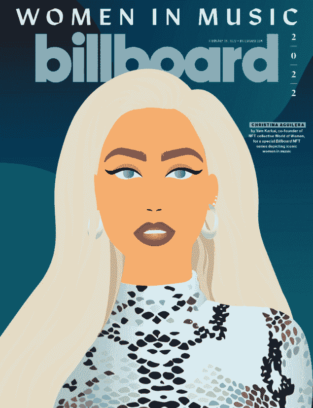
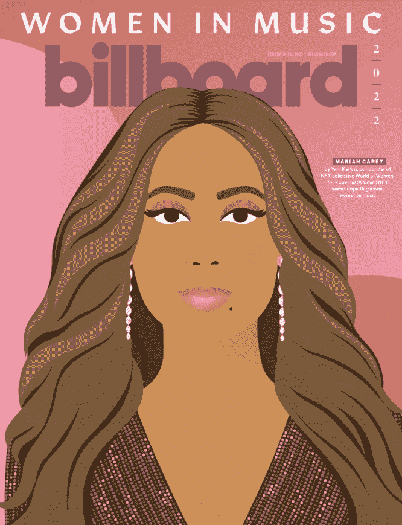
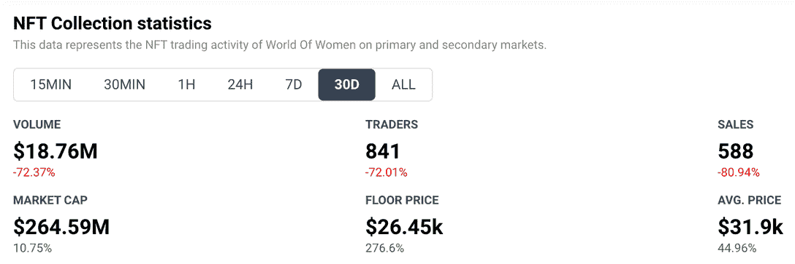

# 公告牌 x 女性的世界 Collab 用音乐赞美女性

> 原文：<https://web.archive.org/web/https://dappradar.com/blog/billboard-x-world-of-women-collab-celebrates-women-in-music>

## Billboard 委托三个 NFT 来纪念偶像女歌手

女性世界创始人兼艺术家 Yam Karkai 为《公告牌》杂志的封面设计了一个由三位女性组成的独家系列。

克里斯蒂娜·阿奎莱拉登上了《公告牌》杂志三个封面中的第一个，作为该杂志“音乐中的女性”项目的 NFT 肖像系列的一部分。2 月 28 日的特刊上，歌手兼流行偶像麦当娜登上了 3 月 1 日的封面。继续阅读，找出谁的数字图像装饰今天的副本。

Yam Karkai: Christina Aguilera

实际的 NFT 将于 3 月晚些时候在 FTX 分散市场上拍卖，因此请关注他们的网站和社交媒体的更新。一部分收入将捐给每个封面明星选择的非营利组织。作为额外的奖励，Billboard 将让 NFTs 的购买者飞往洛杉矶参加该杂志的 2023 年音乐女性活动。

Yam Karkai: Madonna

今天的第三期也是最后一期封面是玛丽亚·凯莉。她是一位无需介绍的女士，但对于区块链的世界来说，她肯定不陌生。

Yam Karkai: Mariah Carey

## 女人的世界

Yam Karkai 于 2021 年 7 月共同创立了[女性世界](https://web.archive.org/web/20220929050251/https://dappradar.com/ethereum/collectibles/world-of-women)，旨在帮助女性进入区块链和数字资产领域。虽然女性在 cryptos 和 NFT 领域变得越来越活跃，但众所周知，男性仍然主导着这一特定领域。卡尔凯和“女性世界”团队希望通过将女性放在 NFT 项目的前沿和中心，向所有妇女和女孩展示她们也有自己的空间。

自从妇女世界项目开始以来，它越来越强大。Karkai 最初收集的 10，000 个铸造的 NFT 最初以每个 0.07 ETH 的价格出售。如今，它们的底价为 9 ETH(26450 美元)，平均售价略高于此。虽然在过去的 30 天里，交易者的数量和销售额都有所下降，但我们可以从下面看到，收藏市场的市值却大幅上升。

Source: DappRadar

世界妇女 NFT 已经创造了数亿美元的销售额。该公司通过资助公益事业和赋予全球女性权力，恪守其创始原则。点击查看他们如何支持多元化的社区。