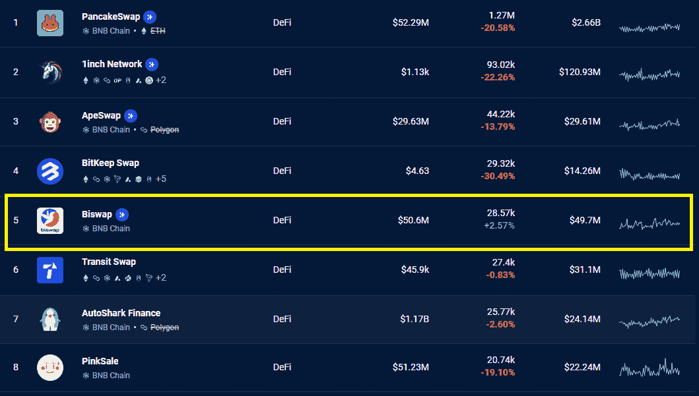

# Biswap DEX 进展和优惠

> 原文：<https://web.archive.org/web/https://dappradar.com/blog/biswap-dex-defi-yield-farming-beneficial-offers>

## 低费用、多重奖励制度和有吸引力的高产农业

**bis WAP 是 BNB 连锁生态系统中领先的 DeFi dapps，有近 29，000 个钱包连接到该平台。更重要的是，它是 BNB 连锁上唯一一个在过去 30 天内增长的 DeFi 平台。**

在过去的一个月里，Biswap 在其 DeFi 平台上吸引了总共 28，570 个不同的活动钱包，其受众同期增长了 2.5%。在其他竞争对手如 1inch、PancakeSwap 和 BitKeep 的用户群减少了至少 20%的情况下，Biswap 成功吸引了新用户。

Biswap 的平台锁定了 2.14 亿美元，有足够的流动性巩固其在 BNB 链 DeFi 生态系统中的强大地位。该平台也因其对用户满意度的关注而脱颖而出。Biswap 对稳定对收取 0.1%的交易费用，对其他硬币收取 0.2%的交易费用，拥有一个超级有竞争力的交易平台，而 75%的费用是流动性提供者奖励。

[Check out Biswap](https://web.archive.org/web/20230126102228/https://biswap.org/?ref=1aefec6b3cf777fba8be&utm_source=PR_DappRadar&utm_medium=PR_Website&utm_campaign=article_about_biswap)

## 在 Biswap 上交易时感到安全

DappRadar 自 2021 年 6 月 2 日以来一直在跟踪 Biswap，我们现在跟踪了 DeFi 平台的 70 份智能合同。这种类型的历史伴随着名声。此外，Biswap 还接受了 Certik 的[审计，Certik 是一家以智能合同审计闻名的组织。此外，他们还是 Web3 领先组织之一币安的战略合作伙伴。](https://web.archive.org/web/20230126102228/https://biswap.org/pdf/BiswapAudit.pdf)

当然，我们知道安全性是加密领域的一个重要话题。因此，我们总是建议使用多个钱包，每个钱包都有不同的用途。不要把你的钱包连接到每一个 dapp，也不要批准来自你不熟悉的 dapp 的交易。

总的来说，用户体验在 Biswap 上起着很大的作用。新功能，如加密到菲亚特交换和专家模式，为已经丰富的平台增加了新的选择。

## Biswap 上的高产农业

DeFi 领域的常见做法是提供较高的押记资产年收益率(and Biswap 在该领域也非常有竞争力。用户可以通过培育各种流动性池来获得 BSW 本地代币。例如，WBNB-BUSD 基金的 APY 高达 15.05%。

为了获得这样的奖励，用户需要在 Biswap 上提供流动性。只需将两个等值的代币相加，然后放入一个池中。例如，添加 100 美元的 WBNB 和 100 美元的 BUSD，然后您将把 200 美元放入 WBNB-BUSD 池。如果 APY 为 15%，一年后你将获得 30 美元的回报。这些奖励将以当地的 BSW 代币支付，代币本身就有价值。奖励的价值会随着加密货币的价格波动而波动。

此外，Biswap 有一个多类型的推荐程序，用户可以通过推荐链接邀请朋友来赚钱。用户可以从他们朋友的交换中获得高达 20%的收入，另外 5%来自活跃在农场和 Launchpools 的朋友。

## 更新的 Biswap 路线图

那些认为 DeFi 平台没有任何创新的人，需要继续阅读。由于集中式交易所不断摸索，Biswap 主动开发了一个永久交易平台，允许用户交易分散式期货。他们将与 ApolloX 合作引入这一特性。

在 2023 年的前三个月，还将有一个或多个机制来锁定和烧毁本地 BSW 令牌。这些倡议将通过 DAO 投票向机构群体提出，这意味着那些持有 BSW 代币的人对代币的未来有发言权。

在 2023 年夏季开始时，该团队希望引入一种新的自动化市场标记协议。这个新的 AMM 将允许流动性提供者和用户更好地优化他们的头寸和交易，使交换服务更有效，滑点更低。流动性提供者将赚得更多，交易者将支付更少。每个人都赢了。

[Check out Biswap](https://web.archive.org/web/20230126102228/https://biswap.org/?ref=1aefec6b3cf777fba8be&utm_source=PR_DappRadar&utm_medium=PR_Website&utm_campaign=article_about_biswap)