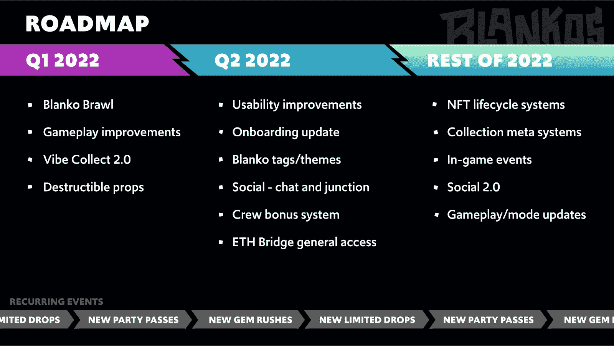

# 布兰科斯方块党戏弄新的游戏和社会功能

> 原文：<https://web.archive.org/web/https://dappradar.com/blog/blankos-block-party-teases-new-gameplay-and-social-features>

## 神话游戏发布 2022 年 Blankos 街区派对路线图

区块链支持的在线多人游戏 Blankos Block Party 将在 6 月底之前推出以太坊桥、各种社交功能和游戏改进。神秘游戏，派对游戏背后的开发商，在他们 2022 年剩余时间的更新路线图中揭示了这些和更多。

根据官方公布，2022 年第二季度将是 Blankos Block Party 的开发者们最忙碌的时候。在 4 月到 6 月底之间，该团队预计将发布许多对该平台的可用性改进。其中包括一个重要的入职更新和一个以太坊桥，这将帮助玩家轻松地移动资产。

2022 年的剩余时间将允许 Blanks 团队专注于游戏的 NFT 方面。他们计划引入 NFT 生命周期系统，这将增加布兰科斯 NFT 收藏的稀缺性和需求。此外，该团队将改善他们的 NFT 滴背后的元数据系统。

当然，随着团队实现路线图里程碑的进展，更多的信息和细节将与 Blankos 社区共享。尽管如此，这是吸引玩家并让他们一窥游戏未来的重要一步。

## 什么是布兰科斯街区派对？

Blankos Block Party 是一款有趣的开放世界多人游戏，设计像一个巨型 Block Party。玩家可以使用不同的布兰科斯人物来完成各种挑战和任务。这些为玩家赢得积分，积分转化为游戏中的货币 Moola。此外，玩家可以通过游戏努力获得 NFT 资产，通过在游戏世界中度过时间来有效地创造价值。

Blankos 角色可以用各种配件和附件定制，每一个都是 NFT。其中一个比较著名的合作项目是[布兰科斯 x 博柏利人物 NFT 系列](https://web.archive.org/web/20221007101844/https://dappradar.com/blog/burberry-x-blankos-nfts-sold-out-in-30-seconds/)，该系列在去年几秒钟内就销售一空。然而，重要的是要注意，玩这个游戏并不要求非功能性测试。任何人都可以自由开始。

除了玩游戏和解锁奖励，Blankos Block Party 还有另一个以社区为中心的机制:用户生成的内容。Blankos Block Party 平台的核心前提之一是玩家有机会创造他们寻求的体验。玩家可以设计他们的派对，拥有许多游戏模式，包括射击、赛车或收集风格的挑战。更重要的是，创作者可以将这三者结合起来。有了 2022 年的路线图，怀疑一些游戏性的改进将会给建党者带来新的游戏模式并不牵强。

[https://web.archive.org/web/20221007101844if_/https://www.youtube.com/embed/juwIwjCRxGI?feature=oembed](https://web.archive.org/web/20221007101844if_/https://www.youtube.com/embed/juwIwjCRxGI?feature=oembed)

## 布兰科斯有什么不同？

Blankos Block Party 在一个私人区块链上运行，但神话游戏的团队计划开放它。随着以太坊桥的引入，您可以在路线图上看到这一点。让 Blankos 与众不同的是，它首先是一款简单的视频游戏。每个人都可以享受 Blankos 或制作迷你游戏，而不必担心 NFTs 或游戏赚取机制。

其他游戏，如《马里奥制造》和《小大星球》,依靠用户生成的内容繁荣发展，却不奖励参与者。然而，布兰科斯的玩法不同。Blankos Block Party 提供可选的 NFT，类似于其他游戏提供皮肤的方式。此外，还有季节性奖励和每日挑战，都促进玩家的活动和参与。尽管这款游戏仍在开发中，但神话在去年 12 月宣布注册了 100 万名玩家。即使只有 10%的人每月玩一次这款游戏，Blankos 也会直接进入区块链十大游戏之列。

根据 DappRadar 的最新 [BGA 游戏报告，区块链游戏占所有追踪的区块链交易总量的 49%。这些游戏大多依赖重复的机制，更类似于传统游戏中的“淘金”。我们通常将这一产品类别描述为 GameFi 或游戏化 DeFi。然而，整个行业都渴望创作高质量的游戏。重要的是，这些项目旨在与超级马里奥和刺客信条等产品在趣味性和参与度方面进行竞争。](https://web.archive.org/web/20221007101844/https://dappradar.com/blog/dappradar-x-bga-games-report-february-2022)

交易卡牌游戏[spliter lands](https://web.archive.org/web/20221007101844/https://dappradar.com/multichain/games/splinterlands)表现出色，每月活跃用户超过 50 万。同样，塔防手游[疯狂防御英雄](https://web.archive.org/web/20221007101844/https://dappradar.com/multichain/games/crazy-defense-heroes)吸引了 206000 个独特的活跃钱包。像 [Axie Infinity](https://web.archive.org/web/20221007101844/https://dappradar.com/ronin/games/axie-infinity) 和 [REVV Racing](https://web.archive.org/web/20221007101844/https://dappradar.com/polygon/games/revv-racing) 一样，这些游戏是朝着正确方向迈出的第一步。Blankos 绝对应该和这些先锋游戏一起被提及。

布兰科斯街区派对是最令人兴奋的区块链游戏项目之一。如果你是一个游戏迷，你可以通过 [DappRadar 顶级游戏排名](https://web.archive.org/web/20221007101844/https://dappradar.com/rankings/category/games)浏览区块链游戏领域的其他后起之秀。此外，你可以在[的推特](https://web.archive.org/web/20221007101844/https://twitter.com/dappradar)上关注 DappRadar，第一时间了解最新的区块链博彩新闻。

 NewsletterUnsubscribe at any time. [T&Cs](https://web.archive.org/web/20221007101844/https://dappradar.com/terms) and [Privacy Policy](https://web.archive.org/web/20221007101844/https://dappradar.com/privacy-policy)