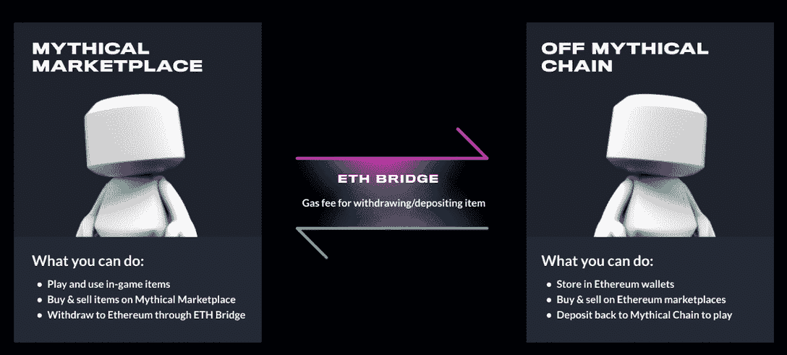
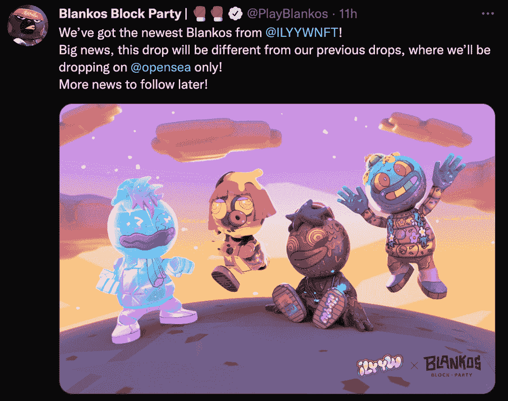

# Blankos Block 党的第一个开放海洋下降来了

> 原文：<https://web.archive.org/web/https://dappradar.com/blog/blankos-block-partys-first-opensea-drop-coming>

## 你需要知道的一切关于布兰科斯的神秘链条和转移 NFT 到以太坊

Blankos Block Party 是首批在我们的 Web3 泡泡之外获得声望的区块链游戏之一。该平台由神话游戏创建，允许玩家探索布兰科斯世界，参加各种挑战并收集珍贵的 NFT 皮肤。游戏在自定义的神话链上运行。然而，该团队现在宣布了它在以太坊主网上的第一次 OpenSea 独家 NFT 投放。

## 总结:

*   [Blankos NFT 存在于游戏中使用的神话链上](https://web.archive.org/web/20221202025225/https://dappradar.com/blog/blankos-block-partys-first-opensea-drop-coming/#Block-Party)
*   [以太坊桥的神话链允许玩家连接他们的 NFT，并在像 OpenSea 这样的市场上出售](https://web.archive.org/web/20221202025225/https://dappradar.com/blog/blankos-block-partys-first-opensea-drop-coming/#Mythical)
*   [ilywnft drop 将是第一个在 OpenSea 上发布的布兰科斯 NFT 系列](https://web.archive.org/web/20221202025225/https://dappradar.com/blog/blankos-block-partys-first-opensea-drop-coming/#OpenSea)

## 布兰科街区派对和神话游戏

Blankos Block Party 是神话游戏私人神话链上为每个人举办的游戏体验。玩家可以参与探索游戏世界的单人冒险，或者组织大型街区派对，与其他玩家竞争。

NFT 在 Blankos 体验中起着核心作用。你扮演的每个角色都可以通过专属的 NFT 可穿戴设备进行定制。这些可穿戴设备也为你的游戏角色带来能力上的好处。布兰科斯发布的最著名的 NFT 系列之一是与时尚巨头博柏利合作的。重要的是，每个角色也是一个 NFT，这意味着玩家可以交易他们的可玩角色并建立一个丰富的收藏。

直到最近，所有 Blankos NFTs 都只能在神话链上托管的游戏内市场上获得。然而，为了开放游戏的生态系统，团队向以太坊桥发布了神话链。

## 神话链 x 以太坊

神话游戏平台是建立在一个许可链上的，使用的是权威证明共识模型。既环保又可持续。通过该平台铸造 NFT 和整合市场不需要采矿。然而，由于神话链是一个私有链，交易资产只能发生在封闭的神话游戏生态系统中。

为了给玩家带来更多的交易机会，神话游戏创建了一个通往以太坊主网的桥梁。这座桥允许玩家将他们的 NFT 转移到以太坊，并在受欢迎的二级市场进行交易，如 [OpenSea](https://web.archive.org/web/20221202025225/https://dappradar.com/multichain/marketplaces/opensea) 。反之亦然，玩家现在可以在以太坊上购买 NFT，并将其桥接回神话链。

值得注意的是，一旦 NFT 被连接到以太坊，玩家就不能在游戏中使用它作为布兰科斯的角色。当然，在交易方面，任何与以太坊区块链的互动都需要汽油费，所以玩家也需要记住这一点。

## Blankos x ILYYWNFT NFTs 将投放到 OpenSea

到以太坊桥的神话链已经运行了几个月，允许玩家在两个区块链之间转移 NFT。这种灵活性也让布兰科斯团队与“我喜欢你，你很奇怪”合作，创造了第一个基于以太坊的布兰科斯 NFT 系列。

关于即将到来的下降的细节仍然很少。然而，有一点是清楚的 NFTs 将只在 OpenSea 上发布。根据[官方公告](https://web.archive.org/web/20221202025225/https://twitter.com/PlayBlankos/status/1522003245832544257)，Blankos 将在未来几天发布更多关于下跌的信息。

这将是第一个专门在 OpenSea 上发布的布兰科斯 NFT 系列。当然，玩家仍然可以将新的 NFT 连接到神话链上，在游戏中使用或者在神话市场上交易。

这里需要注意的一点是，以太坊目前在整个区块链拥有最多的 NFT 观众。这有可能让 Blankos 接触到更广泛的受众，并吸引以前可能不属于生态系统的大牌收藏家。

当布兰科斯街区派对和神话游戏进入以太坊 NFT 空间时，达普雷达将继续监视它们。在 Twitter 上关注 DappRadar，获得关于即将到来的 Blankos x ILYYWNFT drop 的最新消息，以及 NFT 空间正在发生的一切。

 NewsletterUnsubscribe at any time. [T&Cs](https://web.archive.org/web/20221202025225/https://dappradar.com/terms) and [Privacy Policy](https://web.archive.org/web/20221202025225/https://dappradar.com/privacy-policy)