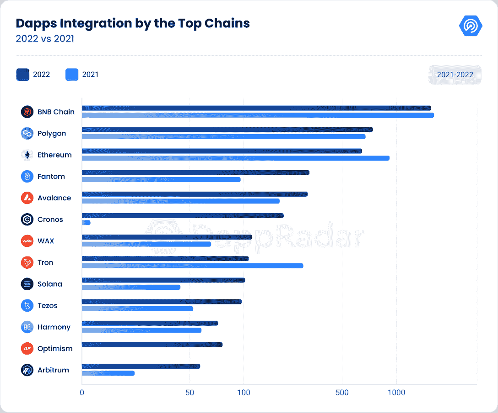
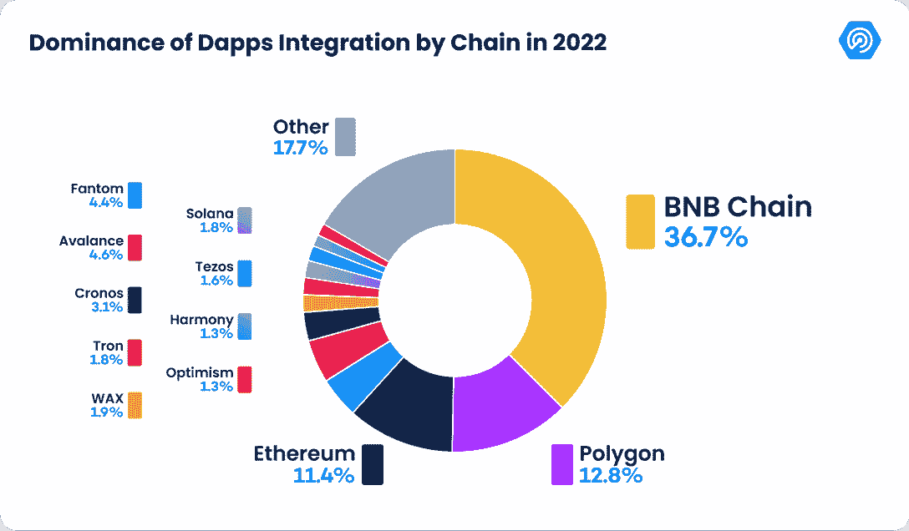
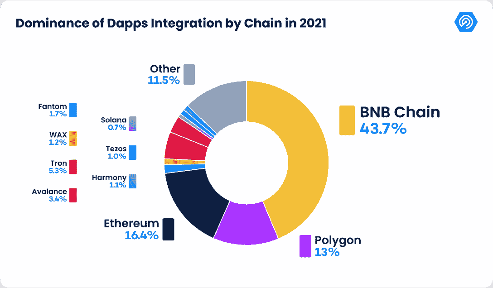
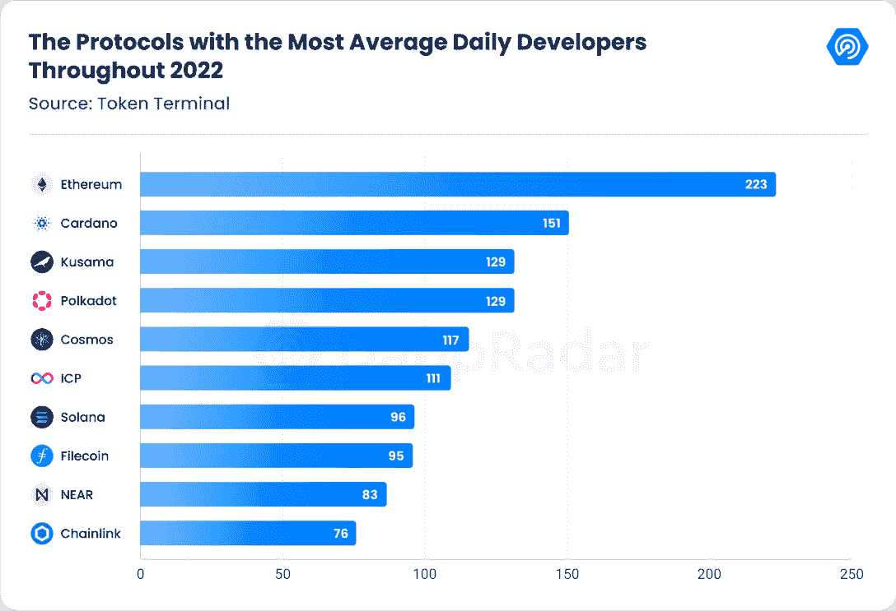
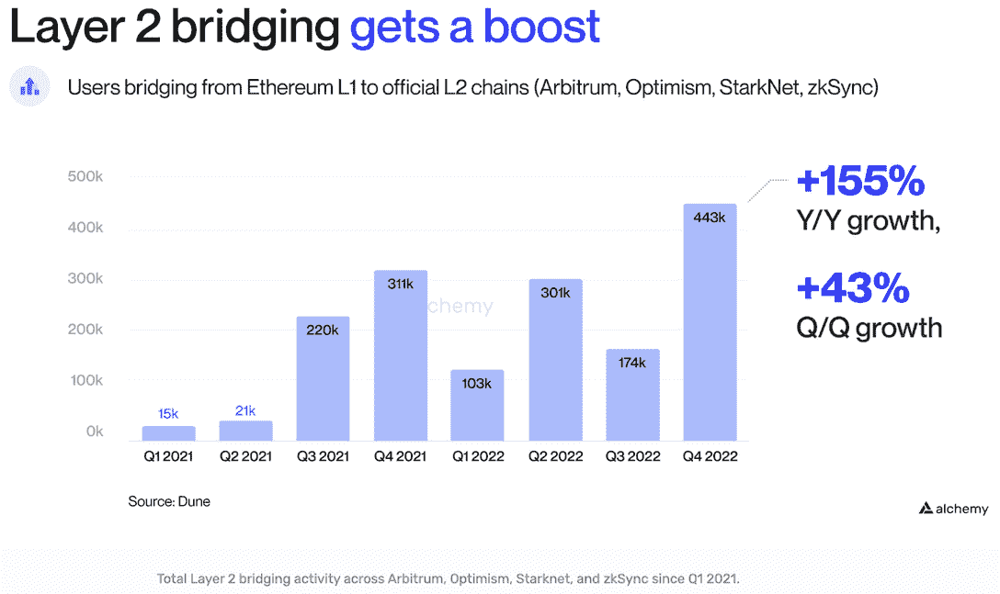
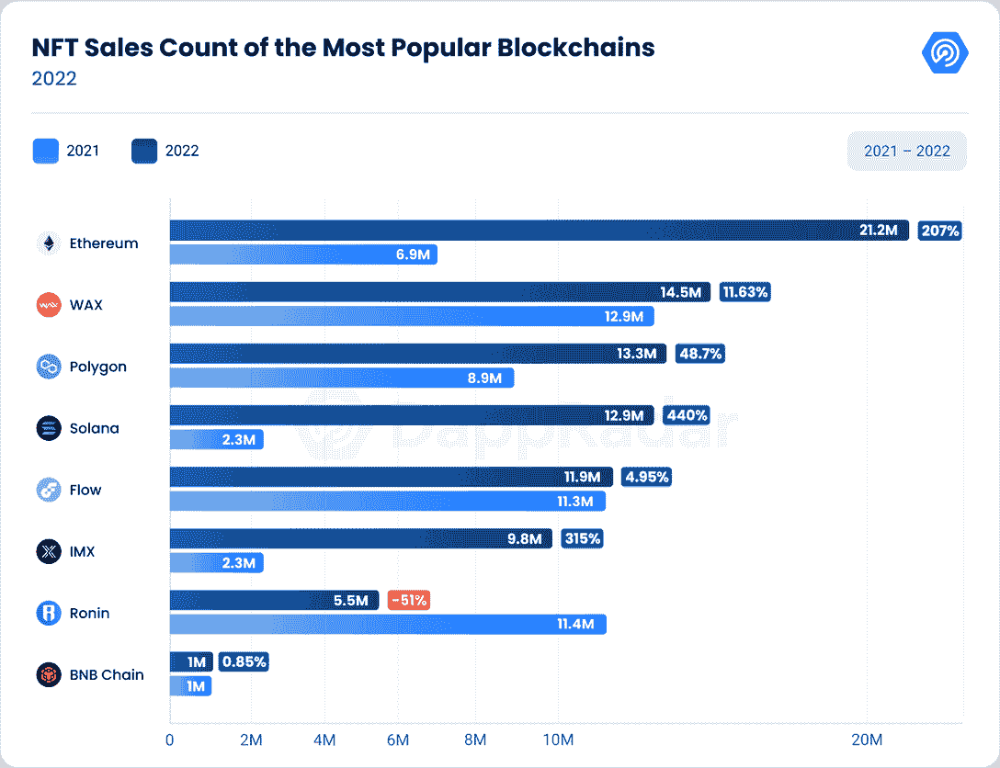
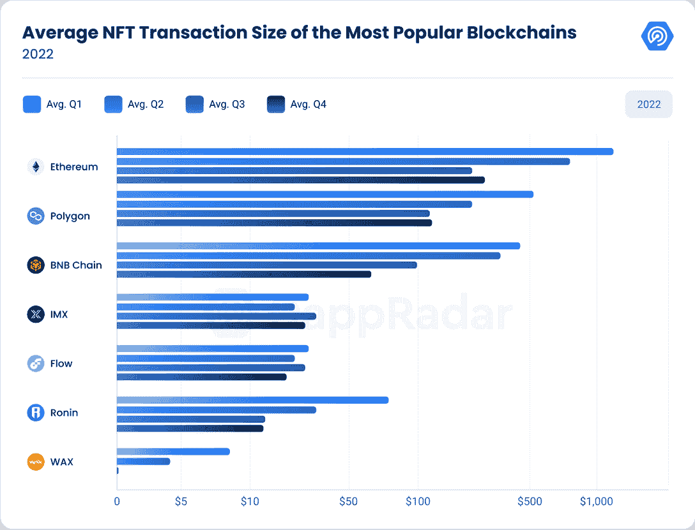
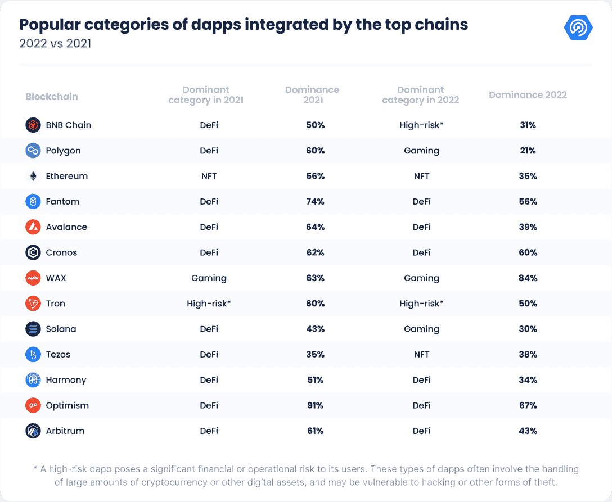
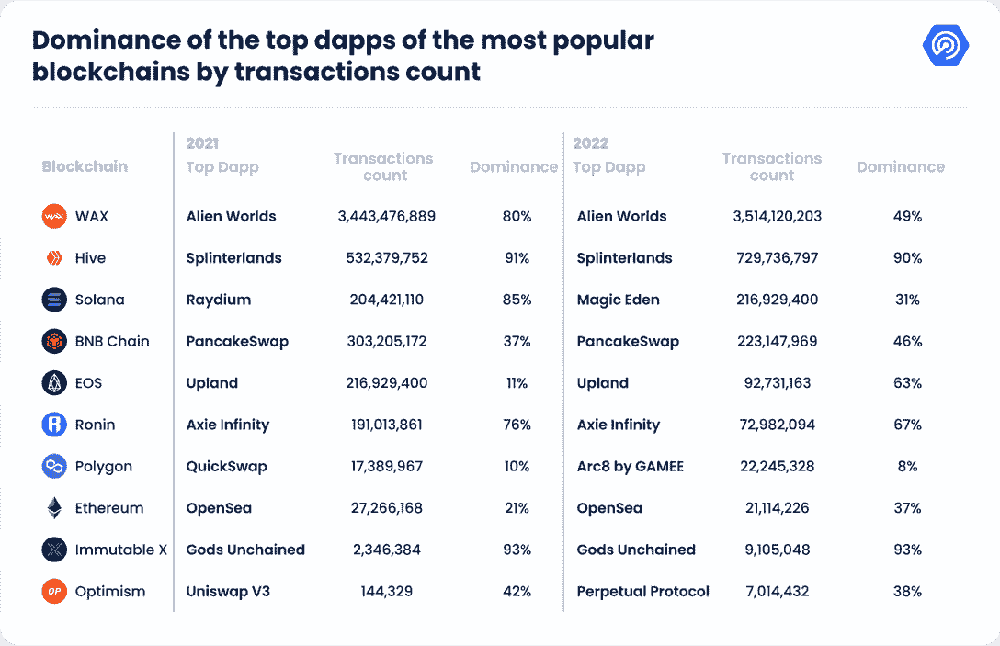
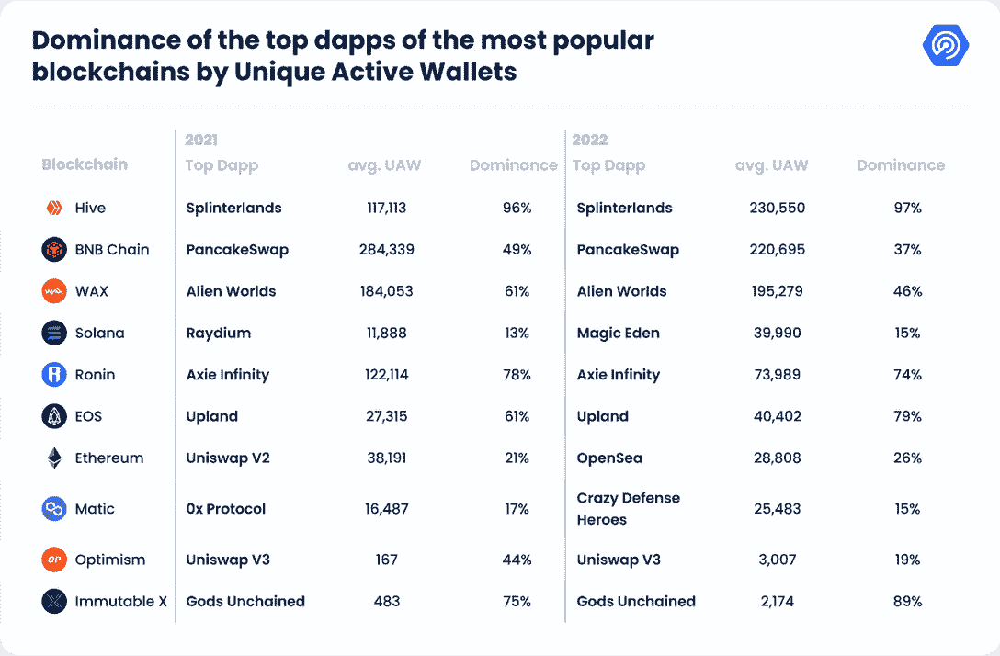

# 区块链和 Dapp 采用报告 2022:了解不断发展的格局

> 原文：<https://web.archive.org/web/https://dappradar.com/blog/blockchain-and-dapp-adoption-report-2022>

## BNB 连锁在 dapp 活动中领先，但以太坊仍然是最有价值的网络

**2022 年，dapp 行业的每日唯一活跃钱包(dUAW)数量增长了 50%，平均从 2021 年的 158 万个 dUAW 增长到去年的 237 万个。**

由于各种事件，包括乌克兰战争、Terra Luna 的崩溃，以及 FTX 和其他围绕多个集中交易所的丑闻，dapp 行业的链上指标在过去几个月一直呈下降趋势。尽管面临这些挑战，dapp 行业已经展示了其弹性和成熟度，而用户和企业对区块链技术的采用表明该行业的未来是光明的。

在本报告中，我们将进一步了解关键指标和趋势，以了解 dapp 行业的采用情况。

NFTs 的兴起是 dapp 行业的一个主要趋势，我们将深入研究围绕 NFT 销售和 NFT 平均交易的数据。我们还将看看 NFT 和游戏 dapp 的流行程度的转变，以及分散金融(DeFi)dapp 主导地位的下降。此外，我们将通过不同区块链的交易和区块链活动分析 dapp 的优势。

## 内容

*   [第 2 层解决方案引领 dapp 集成](https://web.archive.org/web/20230208132618/https://dappradar.com/blog/blockchain-and-dapp-adoption-report-2022/#Chapter-1)
*   [以太坊和卡尔达诺:2022 年开发者最活跃的区块链](https://web.archive.org/web/20230208132618/https://dappradar.com/blog/blockchain-and-dapp-adoption-report-2022/#Chapter-2)
*   [以太坊主导 2022 年 NFT 销售统计，蜡排在第二位](https://web.archive.org/web/20230208132618/https://dappradar.com/blog/blockchain-and-dapp-adoption-report-2022/#Chapter-3)
*   [以太坊的平均交易规模超过竞争对手](https://web.archive.org/web/20230208132618/https://dappradar.com/blog/blockchain-and-dapp-adoption-report-2022/#Chapter-4)
*   [随着 NFT 和游戏 dapps 越来越受欢迎，DeFi 优势减少](https://web.archive.org/web/20230208132618/https://dappradar.com/blog/blockchain-and-dapp-adoption-report-2022/#Chapter-5)
*   [通过交易和区块链活动分析 dapp 的优势](https://web.archive.org/web/20230208132618/https://dappradar.com/blog/blockchain-and-dapp-adoption-report-2022/#Chapter-5)
*   [结论](https://web.archive.org/web/20230208132618/https://dappradar.com/blog/blockchain-and-dapp-adoption-report-2022/#Chapter-6)

## 关键要点

*   2022 年，BNB 链以 2163 个 dapps 领先于所有区块链，比上一年减少了 7%；多边形和以太坊紧随其后。
*   开发者活动的新趋势可能正在出现，模块化区块链，包括 Polkadot 和 Cosmos，其开发者活动同比增长 16%和 131.7%。
*   以太坊在 2022 年超过了 2120 万 NFT 销售额，处理了所有网络中最多的交易，而 Wax 和 Flow 分别以 1450 万和 1190 万的销售额紧随其后。
*   以太坊脱颖而出，成为内在 NFT 价值最高的网络，每笔 NFT 交易超过 300 美元，Polygon 和 Solana 紧随其后，平均 NFT 交易为 104 美元和 88 美元。
*   第二层解决方案的采用是不可否认的；乐观和 Arbitrum 分别处理了 1800 万和 600 万笔交易，而 IMX 超过了 970 万笔 NFT 交易。

## 第 2 层解决方案引领 dapp 集成

分散式应用程序(dapps)已经成为区块链生态系统中越来越重要的一个方面。为了从开发人员的角度衡量 dapps 的采用情况，我们分析了去年区块链集成到 DappRadar 中的 dapps 的数量。

2022 年 dapp 市场最引人注目的趋势之一是第二层(L2)解决方案越来越受欢迎。这些网络，如乐观和 Arbitrum，在 dapps 的整合方面有显著的增长，分别为 590.91%和 160.87%。这一趋势凸显了 L2s 在 dapp 开发人员和用户中日益流行，因为它们提供了比以太坊等第一层区块链更快、更实惠的解决方案，同时仍继承了其设计的安全性。

相比之下，一些最大的第一层区块链，如 BNB 链，以太坊和创，经历了今年的下降。BNB 连锁店下降了 7.56%，但仍然是最受欢迎的区块链，占 36.7%的市场份额，今年整合了 2，163 个 dapps。最近的市场趋势为一波网络浪潮铺平了道路，包括 Polygon、Avalanche 和 Fantom。

2022 年，dapps 整合度增幅最大的区块链是克罗诺斯，较前一年出现了惊人的 1292.31%的变化。另一方面，2022 年增长最少的区块链是和谐，与 2021 年相比变化不大，为 24.59%。和谐的减少可以归因于两个原因，第一个是因为 2022 年 6 月发生了一次桥梁黑客攻击，随后是 DeFi 王国(DFK)决定离开和谐区块链网络。相反，他们决定在雪崩网络上创建自己的子网。

我们正在目睹的另一个趋势是，更多的 dapps 在不太知名或不太受欢迎的区块链推出，如 Klatyn 或 Oasis。2021 年，“其他”类别占 11.5%，但 2022 年该类别增长至 16.4%。dapp 市场的这种转变可能会给这些新兴的区块链带来新的机遇和增长。

## 以太坊和卡尔达诺:2022 年开发商最活跃的区块链

开发者活动是区块链健康和发展的关键指标。它显示了开发人员的兴趣和参与程度，这对于新功能的开发、增强的安全性、网络效应、创新以及采用非常重要。高水平的开发者活动表明一个更健壮和更投入的网络。

根据[令牌终端](https://web.archive.org/web/20230208132618/https://tokenterminal.com/)显示，2022 年活跃开发者增长最显著的区块链是 Solana 和互联网计算机(ICP)，比 2021 年分别增长 1320%和 1050%。值得注意的是，即使在 FTX 下跌和德戈斯离开的附近，索拉纳的趋势仍然看起来很有希望，因为过去 30 天的平均每日活跃开发者数量仅下降了 31.4%，仍然吸引了平均 69 名每日活跃开发者。

此外，根据 [Alchemy 的报告](https://web.archive.org/web/20230208132618/https://www.alchemy.com/blog/web3-developer-report-q4-2022#:~:text=How%20many%20Solana%20programs%20were%20deployed%20in%202022%3F)，截至 2023 年 1 月 1 日，共有 1148 个具有至少一个独特互动的独特 Solana 计划，比 2022 年 1 月 1 日的 421 个独特 Solana 计划增长了 173%。

另一方面，活跃开发者数量下降最小的区块链是以太坊，其活跃开发者数量下降了 9.37%。即使有所下降，以太坊仍然是区块链最活跃的开发者，2022 年每天 223 人。第二，Cardano 平均每天有 151 名活跃开发者，比 2021 年增加了 26.47%。

有趣的是，三个模块化区块链完成了前五名。2022 年，波尔卡多特和草间弥生的活跃开发者分别增长了 16.06%和 12.80%。这两个相连的区块链生态系统平均每天吸引 129 名活跃开发者。接下来是宇宙。Polkadot 的互操作 parachains 和宇宙 IBC 协议提供了一种灵活和可扩展的方法来构建 dapps。

最后，根据 Alchemy 的 2022 年第四季度报告,去年共有 102.1 万名独立用户从以太坊过渡到乐观、Arbitrum、Starknet 或 zkSync。仅在 2022 年第四季度，就有 443，000 个独立用户进行了桥接。与 2022 年第三季度相比，增长了 155%。

Source: [Alchemy’s Web3 Development Report (Q4 2022)](https://web.archive.org/web/20230208132618/https://www.alchemy.com/blog/web3-developer-report-q4-2022)

随着交易费用的降低和每秒交易量的增加，许多开发者和消费者开始使用第二层区块链。要构建和使用 L2s，用户必须将 ETH 和其他 ERC20 资产从以太坊桥接到它们的名称目的地。

这些统计数据强调了人们对使用 L2 来执行过去在以太坊主网上完成的任务越来越感兴趣。

## 以太坊主导 2022 年 NFT 销售计数；蜡排在第二

NFT 市场在 2022 年发生了重大转变，与去年相比，NFT 的销量大幅增加。根据我们的数据，2022 年 NFT 销量达到 1.01 亿，比上年增长 67.57%。

以太坊仍然是 NFT 市场的佼佼者，拥有 21%的 NFT 市场份额，销售额为 2120 万英镑。这并不意外，因为以太坊拥有大部分蓝筹股系列。

排在第二位的是 Wax，售出了 1450 万英镑的 NFT 资产，同比增长 11.63%。这一增长与 2022 年最受欢迎的区块链游戏之一“dapp 外星人世界”的活动相一致。

有趣的是，Flow 和币安智能连锁(BNB)的 NFT 销量几乎与上年持平，分别仅小幅增长 4.95%(1190 万辆)和 0.85%(100 万辆)。

NFT 销售数量的成功不仅限于以太坊、蜡像和币安。其他各种连锁店也在 2022 年取得了成功。Solana 和 Immutable X 表现突出，分别增长了 440%和 319%，达到 1290 万和 980 万笔交易。Polygon 的销售额也有所增长，达到 1330 万英镑，比上一年增长了 48.7%。

然而，并不是每个区块链在这种情况下都有所改善，销售额下降最多的是罗宁区块链，下降了 51.79%，达到 550 万辆。

## 以太坊的平均 NFT 交易规模超过了竞争对手

在分析了上一节中的 NFT 销售计数后，我们分析了 2022 年 NFT 的平均交易规模，确定了那些为 dapp 生态系统带来更多价值的区块链。例如，Wax 处理的 NFT 交易仅次于以太坊，但平均交易规模在 2022 年降至 5 美元以下。这反过来反映了 Wax 主持更多的纯游戏交易，而不是高价值的 NFT 收藏品。

以太坊的 NFT 交易价值最高，2022 年第四季度平均为 246 美元。这比 Q1 的 1266 美元下降了 78.74%。从 ETH 价格来看，第四季度的平均交易规模约为 0.19 ETH，比 Q1 的 0.19 ETH 下降了 52%。因此，无论是美元还是以太网，以太坊的平均 NFT 交易额在 2022 年都有所下降。这与以太坊价格的下降是一致的，2022 年 1-12 月下降了 55%。

尽管如此，就交易价值而言，以太坊仍然位居榜首。以太坊 NFT 收藏馆的底价更高，其蓝筹股收藏馆和鲸鱼交易商证明了这一点。这确保了以太坊上的 NFT 交易更有价值。

在这一年中，每个区块链的平均交易规模都有所下降，这反映了严峻的宏观经济形势和本国货币的贬值。然而，一些网络比其他网络遭受了更大的打击。BNB 连锁和浪人的降幅最大，分别为 84%和 81%，第四季度平均达到 67 美元和 14 美元，而 Q1 为 424 美元和 76 美元。

另一方面，其他区块链设法维持其平均交易规模，降幅较小。Polygon 设法通过与沙盒的合作增加价值，并成功推出 Reddit Collections，收集王牌。

在与 NBA 和 NFL 的合作关系的推动下，Flow 还成为 NFT 交易中第三大价值最高的区块链。尽管更加稳定，但其平均交易值仍然低于不可变 x。两个区块链，几乎保持了相同的平均 NFT 交易规模，尽管其令牌价格下降。此外，不可变 X 是唯一一个实际上从 Q2 到第四季度平均 NFT 事务规模有所增加的链。

总体而言，可以看出，NFT 区块链博彩公司的平均交易规模往往低于 NFT 区块链收藏品公司。因为 NFT 区块链游戏更倾向于游戏中的物品和虚拟资产，它们通常比稀缺的可收集的非功能性物品便宜。

## 随着 NFT 和游戏 dapps 越来越受欢迎，DeFi 的主导地位下降

DeFi 长期以来一直是区块链 dapps 的主导类别，但看看 2022 年的整体数据，这种主导地位似乎开始减弱。根据我们对 2022 年和 2021 年顶级连锁店的 dapp 类别的分析，DeFi dapps 越来越不受欢迎，而 NFT 收藏品和游戏 dapp 等类别则有所增长。

2021 年，DeFi dapps 占所有顶级 dapp 的 50-91%。以太坊，Fantom，Avalanche，Cronos，Tezos，Harmony 和乐观主义都显示了高比例的 DeFi dapps。然而，在 2022 年，这种优势在所有顶级连锁店中都有所下降，只有 39-56%的 dapps 属于 DeFi 类别。

这种转变的最大驱动力之一是 NFT 的日益流行。2021 年，NFT 是以太坊上的主导类别，占所有 dapps 的 56%。这一趋势在 2022 年仍将继续，非功能性测试仍然是最主要的类别，占 35%。此外，NFT 在 Tezos 上的受欢迎程度也有显著增长，从 2021 年的 0%上升到 2022 年的 38%。

2022 年，游戏 dapps 也越来越受欢迎。Polygon 在 2021 年在 DeFi 类别中拥有 60%的 dapp，在 2022 年下降到 21%，在游戏类别中 dapp 有所增加。Solana 的 DeFi 类别从 2021 年的 43%下降到 2022 年的 30%。但在这里，游戏也有了显著的增长。

高风险 dapps 在 BNB 链和创上的优势也有所增加，在 2022 年仍然是一个重要的类别。高风险 dapps 会给其用户带来巨大的财务或运营风险。这些类型的 dapps 通常涉及大量加密货币或其他数字资产的处理，并且可能容易受到黑客攻击或其他形式的盗窃。在过去的一年中，由于潜在的更快收益，在用户中变得越来越流行。

远离 DeFi dapps 并不完全令人惊讶，因为近年来 DeFi 空间变得越来越拥挤。随着更多的项目进入市场，我们很可能会看到整个区块链 dapp 类别的持续多样化。NFT 和游戏 dapps 的兴起是这一趋势的明显标志，看看这些类别在未来几年如何继续演变将是有趣的。

## 通过交易和区块链活动分析 dapp 的优势

通过交易计数分析最受欢迎的区块链的顶级 dapp 的支配地位，我们观察到顶级 dapp 如何在其各自的区块链上具有高水平的支配地位。

例如，在 2021 年，蜡区块链上的外星世界拥有 80%的优势，区块链蜂巢上的分裂大陆拥有 91%的优势。此外，似乎给定区块链的顶级 dapps 倾向于在接下来的一年保持他们的位置，而《外星世界》和《分裂之地》将在 2022 年继续领先。

然而，值得注意的是，一些区块链如 Wax、Hive、Solana 和 BNB 链上的顶级 dapps 的优势在 2022 年有所下降。PancakeSwap 和 OpenSea 等一些顶级 dapps 的交易数量在 2022 年也有所下降。这表明区块链生态系统正变得更具竞争力和多样性，这对该行业是一个积极的发展。

值得一提的是，Polygon 是最好的分布式网络，因为它在 2022 年的顶级 dapp 仅占据 8%的统治地位。这表明与其他区块链相比，Polygon 拥有更加多样化的生态系统。此外，有更多的 dapps 争夺用户的注意力和他们的交易。对于网络的长期可持续性而言，这是一个积极的迹象，因为它降低了依赖单一成功的风险，而这种风险可能会对整个生态系统产生负面影响。

此外，我们通过观察独特的活动钱包，观察了几个受欢迎的 dapps 如何在其网络上保持高水平的统治地位。

2022 年，Splinterlands 占 Hive(UAW)唯一活跃钱包的 97%，平均每天有 230，550 个唯一活跃钱包，它也是最活跃的 dapp。2022 年，PancakeSwap 占 BNB 所有 UAW 连锁店的 46%，比 2021 年的 37%有所增加。

我们观察到的一个新趋势是以太坊主导类别的转变。2021 年，以太坊最大的政党是 DeFi dapp，Uniswap V2，拥有 21%的统治地位。然而，在 2022 年，这变成了 NFT 市场的 OpenSea，占据了 26%的市场份额。这凸显了以太坊越来越多地被用作 NFT 区块链的事实。同样，Polygon 也从 DeFi 转向了游戏，因为 2022 年的顶级 dapp 是一款游戏。这与 Polygon 宣布推出多个游戏 dapps 是一致的。

值得注意的是，如果区块链的大部分交易活动和独特的活跃钱包只依赖于一个单一的 dapp，这可能是生态系统的潜在危险。这是因为它增加了集中化的风险，即一小群参与者或实体控制了网络的大部分活动和价值。这可能导致缺乏创新和竞争，以及潜在的安全风险，如果占主导地位的 dapp 受到损害或失败。

## 结论

我们对 2022 年 dapp 采用情况的分析强调了区块链生态系统中的几个关键趋势。其中最值得注意的是用户行为从 DeFi 向游戏和高风险 dapps 的转变。此外，我们看到非正规金融服务仍然很重要，表明这一领域将继续扩大。

今年还出现了新的网络和 dapps，它们在区块链生态系统中变得越来越重要。日益激烈的竞争正在推动行业的创新和发展，看看这些新参与者在未来会如何影响市场将是一件有趣的事情。

虽然该分析强调了顶级 dapp 在某些区块链上的主导地位，但需要注意的是，多样化仍在进行中，尤其是当涉及到某些 dapp 对某些区块链的控制和影响时。

尽管 2022 年遇到困难的宏观经济因素，我们仍然对这个行业的未来保持乐观。区块链技术还处于起步阶段，还有很大的成长发展空间。