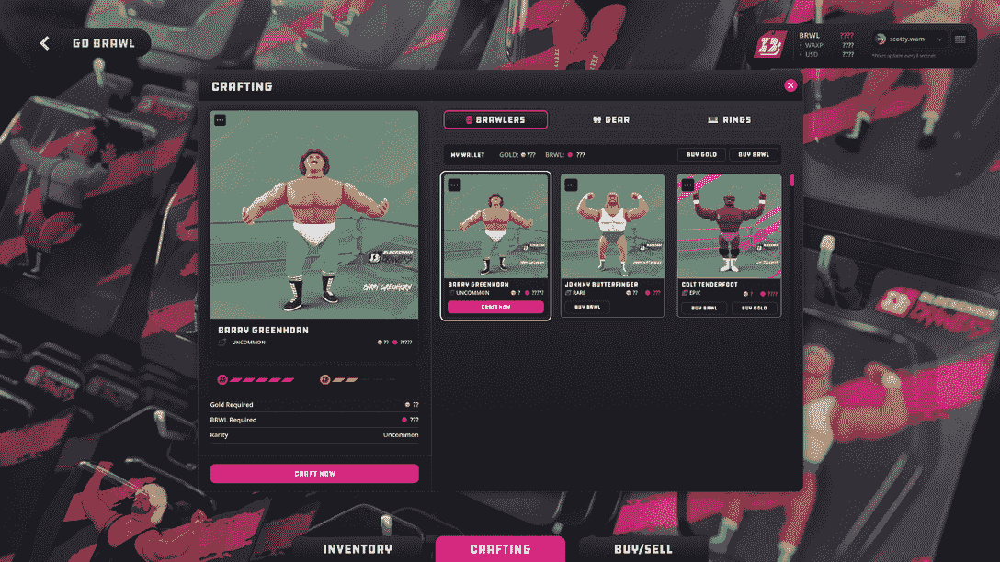
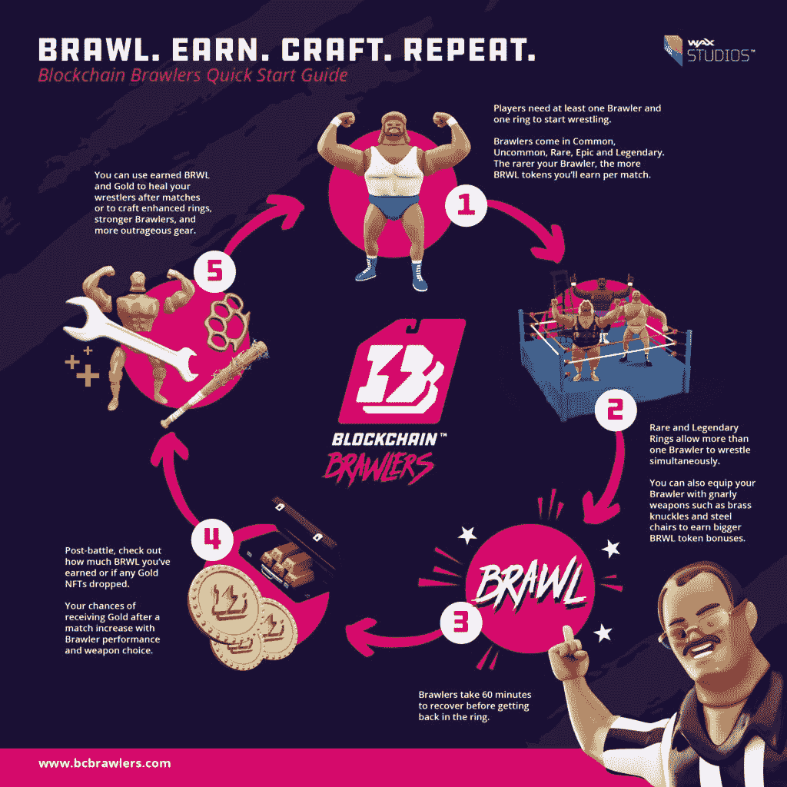

# 区块链格斗家:加入元宇宙最喧闹的游戏，赢取 BRWL

> 原文：<https://web.archive.org/web/https://dappradar.com/blog/blockchain-brawlers-join-the-rowdiest-game-in-the-metaverse-and-earn-brwl>

## 介绍区块链格斗家，第一个从 WAX 工作室发行的主要游戏

**Blockchain Brawlers 是一款“玩赚”游戏，游戏中有数十名竞技格斗家，玩家有机会赢得 BRWL 代币。备受期待的区块链蜡像馆职业摔跤主题游戏将于 2022 年 3 月 30 日首次亮相。要开始游戏并获得官方代币，您需要获得一枚戒指和至少一名格斗家。**

由 WAX Studios 开发的 Blockchain Brawlers 将在 3 月 30 日周三上线时发出一些严重的噪音。这种在蜡像区块链上的摔跤主题游戏玩起来很有趣，并且提供了赚钱的机会。区块链格斗家采用自己的动作人物方式进行职业摔跤，旨在成为“元宇宙最喧闹的游戏”。

经过团队几个月的辛勤工作，Blockchain Brawlers 将于本月底正式开放格斗戒指。所以今天，让我们潜入区块链格斗家的世界，为游戏做好准备，并收获一些 BRWL 代币。

## 区块链格斗家游戏解释

参与这个游戏非常简单。首先，玩家需要一个擂台和一个格斗家开始格斗。有各种类型的戒指和争吵，每一个都有不同的稀有程度。值得一提的是，指环和格斗者都是不可替换的令牌(NFT)，你可以购买、使用、制作和与他人进行[交易](https://web.archive.org/web/20221004131403/https://wax.atomichub.io/explorer/collection/bcbrawlers#assets)。

除了在市场上买一个格斗家，你还可以用起始物品制作一个。下图是格斗家制作界面。如果你想打造一个强大的格斗队，你需要游戏中的令牌，BRWL，来做到这一点。如果您的余额中没有足够的 BRWL，您可以去诸如 Alcor 这样的 DEX 获取一些。如果你没有足够的黄金 NFT(所有工艺配方中需要的另一种成分)，你可以去任何一个 WAX 的二级市场购买一些，比如 Atomic Hub。

## 如何掌握游戏内经济

区块链格斗家的游戏内经济很简单:手艺、格斗、赚钱和重复！

如上所述，BRWL 是区块链格斗家的游戏货币。除了从德克斯那里获得，玩家还可以通过游戏获得 BRWL。格斗家可以通过在拳击台上格斗赢得 BRWL。稀有度越高的格斗家可以获得越多的 BRWL 代币。为你的格斗家配备不同等级的装备，如指关节、棒球棒或钢椅，将会获得更大的 BRWL 代币奖励。

BRWL 的好处在于现实世界的价值和游戏中的效用。例如，用 BRWL 代币，你可以在比赛后治愈你的摔跤手，制造更好的戒指，更强的格斗家和更令人发指的装备。

除了获得 BRWL 代币，玩家还有机会在比赛结束后获得金色 NFT 作为奖励。黄金非战斗天赋也是格斗家制造，治疗和特殊升级所必需的。

## 区块链格斗家为游戏发布预热

区块链格斗家的高度参与社区目前在全球拥有超过 29，000 名 Discord 成员。此外，Blockchain Brawler 的游戏生态系统正在不断扩大。WAX 和币安智能链(BSC)之间的桥梁已经建成。玩家可以从 2022 年 3 月 17 日起在 Wax 和 BSC 之间自由移动他们的区块链格斗家。

区块链格斗家将于 3 月 30 日在蜡像区块链生态系统上首次亮相。所以，准备好你的戒指和拳手，加入高空飞行，标志性摔跤手的乌合之众队。[加入社区](https://web.archive.org/web/20221004131403/https://www.bcbrawlers.com/clkn/https/discord.gg/xpz249ME3C)将让你不会错过关于游戏的最新消息。

**链接**:

[网站](https://web.archive.org/web/20221004131403/https://www.bcbrawlers.com/)

[推特](https://web.archive.org/web/20221004131403/https://www.bcbrawlers.com/clkn/https/twitter.com/bc_brawlers)

[不和](https://web.archive.org/web/20221004131403/https://www.bcbrawlers.com/clkn/https/discord.gg/xpz249ME3C)

[中等](https://web.archive.org/web/20221004131403/https://www.bcbrawlers.com/clkn/https/medium.com/blockchain-brawlers)

**免责声明** —这是一篇赞助文章。DappRadar 不认可本页面上的任何内容或产品。DappRadar 旨在提供准确的信息，但读者应该在采取行动之前总是自己做研究。DappRadar 的文章不能被认为是投资建议。