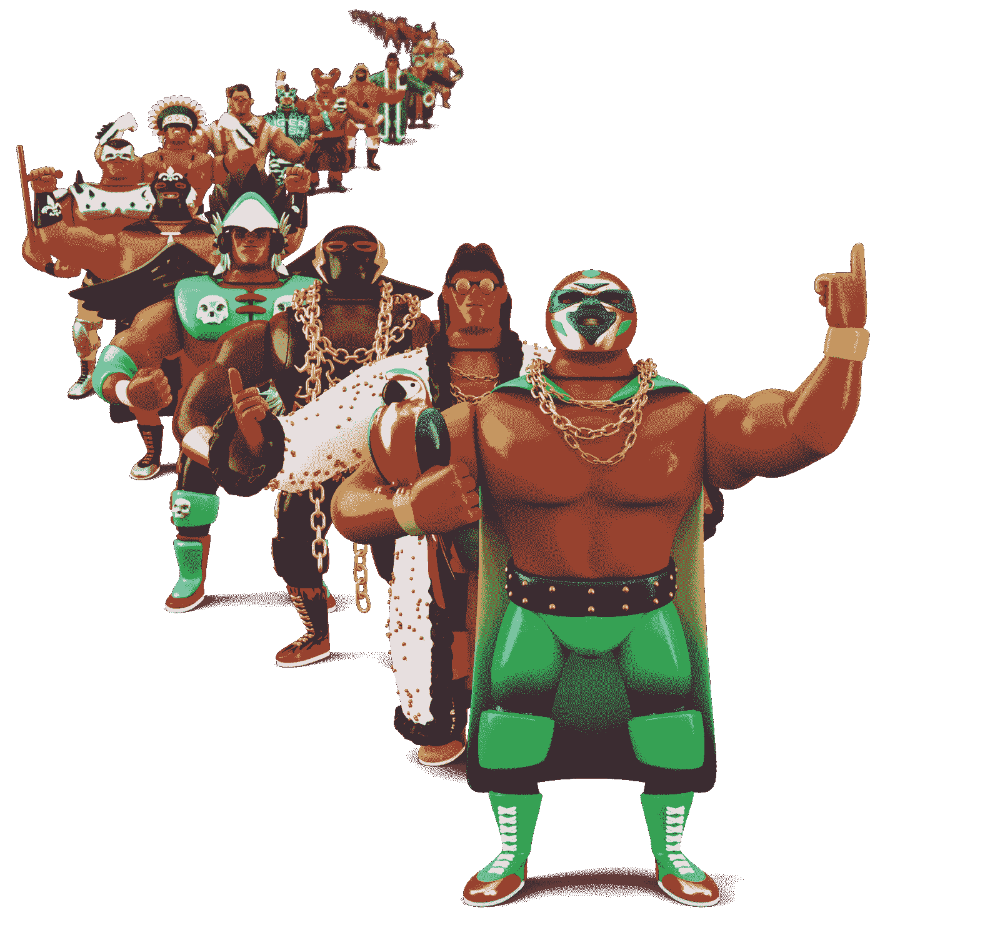
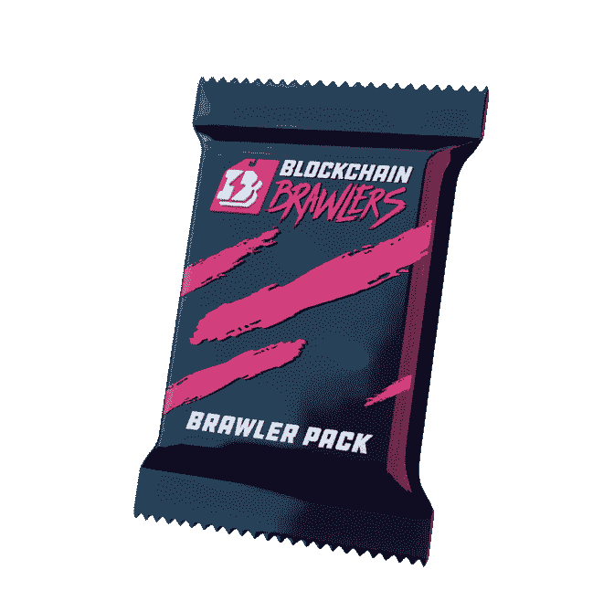

# 蜡上的区块链格斗家为 P2E 游戏发布会升温

> 原文：<https://web.archive.org/web/https://dappradar.com/blog/blockchain-brawlers-on-wax-heats-up-for-p2e-game-launch>

## 2 月 8 日，将推出创始人 NFT 系列装备包

**Blockchain Brawlers 是一款即将推出的 NFT 收集和游戏赚取游戏，正在为 2 月 8 日的大型发布做准备。凭借近 10，000 名 Twitter 粉丝和一个活跃的 Discord 社区，Blockchain Brawlers 将迎来一个令人印象深刻的下降，以及一个成功的游戏开始。**

在撰写本文时，还有两周时间进入区块链格斗家 NFT 滴的白名单竞争。你可以查看官网，阅读更多关于获得白名单的信息[这里](https://web.archive.org/web/20221206180633/https://dappradar.com/wax/games/blockchain-brawlers)。

2021 年 11 月，第一批 100 个“创始人版”传奇格斗家在币安·NFT 拍卖行上市。不过，2 月 8 日，区块链格斗家将在 Wax 上正式推出 Founders packs 和 Gear packs。重要的是，这一 NFT 下降也标志着正式的 Blcockhain Brawlers play-to-earn 游戏测试版的推出。

## 2 月 8 日有什么打折？

即将到来的区块链格斗家 NFT 下降将提供两个包。第一包包括一个打架的 NFT 在三个稀有(常见，不常见和罕见)之一。该包还具有一个戒指 NFT 在三个稀有之一。这款套装售价 350 美元，限量仅 750 套。

此外，下降将采用齿轮 NFT 包。这个包包括一个争吵武器 NFT 在三个稀有之一。在游戏中，武器被用来增强你的格斗家的能力，并给你带来更多的奖励。这种包装的价格为 75 美元，也仅限于 750 美元。

## 区块链格斗家游戏是什么？

即将到来的区块链斗殴者游戏赚取承诺将是一个真正的蜡区块链爆炸。即将到来的 NFT 下降将为游戏开始设置舞台。区块链格斗者将是游戏中的主要角色，而擂台将是游戏竞技场。此外，装备 NFT 将作为游戏中玩家的武器和助推器。

拥有一个 NFT 和一个 NFT 戒指的玩家可以参加战斗。无论谁赢得这场战斗，都将获得游戏的本地令牌 BRWL 令牌的奖励。重要的是，罕见的传奇戒指允许一个以上的打架者同时摔跤。根据力量和附加物品的不同，打架者之间的成功率也不同。赢得一场战斗也让玩家有机会赢得额外的 NFT。

## 桥梁蜡和金融

重要的是，打造完整的区块链争吵者生态系统的最后阶段是在币安和 Wax 之间建立一座桥梁。作为币安智能链上推出的主要争吵者 NFT 集合，项目背后的团队正在积极努力弥合这两个协议。

根据官方路线图，币安 NFT 和 WAX 之间的桥梁将被锻造，以便玩家和收藏家能够将他们的争吵者转移到他们的 WAX Cloud 钱包。这是为早期用户创造一个可访问的连接和吸引新观众的重要一步。

随着 NFT 掉落和玩赚游戏即将推出，DappRadar 将监测区块链格斗家的发展。你也可以在他们的官方 DappRadar 页面[这里](https://web.archive.org/web/20221206180633/https://dappradar.com/wax/games/blockchain-brawlers)追踪游戏的进展。此外，你可以加入 [DappRadar PRO](https://web.archive.org/web/20221206180633/https://dappradar.com/token/pro) 来实时跟踪区块链格斗家系列的最新 NFT 销售数据。

 NewsletterUnsubscribe at any time. [T&Cs](https://web.archive.org/web/20221206180633/https://dappradar.com/terms) and [Privacy Policy](https://web.archive.org/web/20221206180633/https://dappradar.com/privacy-policy)