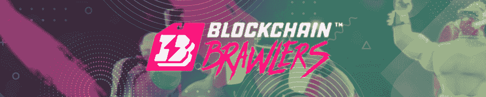

# 本周，区块链格斗家在竞技场上大打出手

> 原文：<https://web.archive.org/web/https://dappradar.com/blog/blockchain-brawlers-smashes-in-the-arena-this-week>

## 在过去的七天里，这款基于蜡像的游戏见证了它的本土标志 BRWL 升值超过 150%

**Blockchain Brawlers 在每周一次的 DappRadar 顶级区块链游戏排名中占据首位。在过去的七天里，该游戏吸引了超过 2，000 个独特的活动钱包，并在 NFT 产生了超过 137，000 美元的交易量。然而，最令人印象深刻的是，该游戏的原生令牌 BRWL 在过去七天内的估值增长了 150%。**

本周另一个值得注意的趋势是游戏类代币估值的全面复苏。名单上的所有项目都出现了价值增值，这表明区块链游戏有可能战胜当前的熊市趋势。

根据[最新的 DappRadar 和 BGA Games 报告](https://web.archive.org/web/20220825105748/https://dappradar.com/blog/dappradar-x-bga-games-report-4-blockchain-games-continue-to-ascend-despite-collapsing-markets)，区块链博彩活动在 4 月份创下历史新高。游戏 dapps 吸引了超过 120 万个独特的活动钱包。这篇文章通过结合连锁活动、NFT 交易量、代币估值和围绕项目的新闻，来审视本月最热门的游戏 dapps。

浏览以下本月十大区块链游戏的完整列表。单击相应的图片，了解每个平台的更多信息。或者，看看下面的视频，它总结了排名，可以快速查看。

[https://web.archive.org/web/20220825105748if_/https://www.youtube.com/embed/23VtCTGeK7c?feature=oembed](https://web.archive.org/web/20220825105748if_/https://www.youtube.com/embed/23VtCTGeK7c?feature=oembed)

## 区块链十大运动会–第 20 周

#### 1.[区块链格斗家](https://web.archive.org/web/20220825105748/https://dappradar.com/wax/games/blockchain-brawlers)

由于其本土令牌 BRWL 的价格大幅上涨，区块链格斗家在本周的排名中占据主导地位。随着超过 2000 个不同的活跃钱包连接到该平台，游戏内货币飙升 150%。另一个推动平台活动的重要细节是即将于 5 月 25 日发布的工件类卡包。

#### 2.[炸弹密码](https://web.archive.org/web/20220825105748/https://dappradar.com/binance-smart-chain/games/bomb-crypto)

炸弹加密也有令人印象深刻的一周，在名单上排名第二。在过去的七天里，这款炸弹式游戏吸引了超过 21，000 个独特的活动钱包。更重要的是，游戏的原生令牌 BCOIN 的价值飙升了 90%以上。

#### 3.[被解放的神](https://web.archive.org/web/20220825105748/https://dappradar.com/ethereum/games/gods-unchained)

随着《神圣秩序》卡牌包的发布，交易卡牌游戏《被解放的神》让很多玩家兴奋不已。该游戏吸引了超过 5000 个独特的活动钱包。

#### 4.[夹板垫](https://web.archive.org/web/20220825105748/https://dappradar.com/hive/games/splinterlands)

Hive 的神奇游戏 Splinterlands 本周失去了一些牵引力，跌出了前 3 名。尽管如此，这款游戏还是吸引了近 50 万个不同的活跃钱包。此外，SPS 的估值增长了 33%以上，而 Splinterlands NFTs 在区块链蜡像馆的交易量超过了 9000 美元。这还不包括 Hive 上的交易活动，在 Hive 上，游戏[的交易量超过了](https://web.archive.org/web/20220825105748/https://peakmonsters.com/dashboard)60 万美元。

#### 5.[外星世界](https://web.archive.org/web/20220825105748/https://dappradar.com/multichain/games/alien-worlds)

BSC 采矿游戏《外星世界》再次落后于《碎片之地》,本周排名第五。该游戏吸引了超过 250，000 个独特的活动钱包。此外，《异形世界》的本币 TLM 的估值上涨了 20%以上。

#### 6.[分散式国家](https://web.archive.org/web/20220825105748/https://dappradar.com/ethereum/marketplaces/decentraland)

《虚拟世界分散之地》在缺席了很长一段时间后，重新出现在每周游戏排行榜上。该平台在过去七天里产生了 130 万美元的 NFT 交易量。此外，它的原生令牌法力值增值超过 50%。

#### 7.世界

紧随其后的是 NFT 世界，另一个基于以太坊的虚拟世界平台。该游戏最近宣布将引入域名注册，允许玩家获得一个. wrld 域名 NFT。此外，游戏的原生令牌 WRLD 看到了超过 10%的价格上涨。

#### 8.[peg xy](https://web.archive.org/web/20220825105748/https://dappradar.com/polygon/games/pegaxy)

基于多边形的赛车游戏 Pegaxy 本周入围，排名第八。该游戏吸引了超过 58，000 个独特的活动钱包，其原生令牌的估值超过 16%。Pegaxy 最近推出了其封闭的测试版移动应用程序，符合条件的 NFT 用户现在可以试用该平台。

#### 9.[高地](https://web.archive.org/web/20220825105748/https://dappradar.com/eos/games/upland)

房地产模拟器高地仍然是 EOS 区块链上访问量最大的 dapp。虽然这款游戏本周排名第九，但在过去七天里，它仍然吸引了超过 140，000 个独特的活动钱包。

#### 10. [Mobox](https://web.archive.org/web/20220825105748/https://dappradar.com/binance-smart-chain/games/mobox-nft-farmer)

BSC NFT 农业游戏 Mobox 本周完成了区块链游戏排行榜。该平台吸引了近 90，000 个不同的活跃钱包，并在过去七天内产生了超过 170 万美元的 NFT 交易量。此外，游戏的原生令牌 MOBOX 的价格上涨了 20%以上。

## 区块链争吵者正在升温

区块链格斗家是 Wax 游戏生态系统的最新成员之一。虽然这款游戏仍在建立稳固的观众群，但它已经开始产生大量的炒作。Brawler 和 Ring NFTs 在 Wax 的[原子市场](https://web.archive.org/web/20220825105748/https://dappradar.com/wax/marketplaces/atomicmarket)上成为热门，而游戏中的货币 BRWL 在过去七天里升值超过 150%。

更何况《区块链格斗家》还处于发展初期。该项目有一个雄心勃勃的路线图。在不久的将来，玩家将能够出租和借用格斗家和戒指，以增加他们的收入或产生被动收入。

DappRadar 将继续监测新的蜡击中游戏，因为区块链格斗家勾掉其路线图上的里程碑。如果你想了解更多关于这款游戏的信息，请访问他们的官方页面。你也可以在这里追踪区块链格斗家 NFT 销售[。要想第一时间获得最新的区块链奥运会新闻，请在](https://web.archive.org/web/20220825105748/https://dappradar.com/nft/protocol/wax)[推特](https://web.archive.org/web/20220825105748/https://twitter.com/dappradar)上关注 DappRadar。

 NewsletterUnsubscribe at any time. [T&Cs](https://web.archive.org/web/20220825105748/https://dappradar.com/terms) and [Privacy Policy](https://web.archive.org/web/20220825105748/https://dappradar.com/privacy-policy)