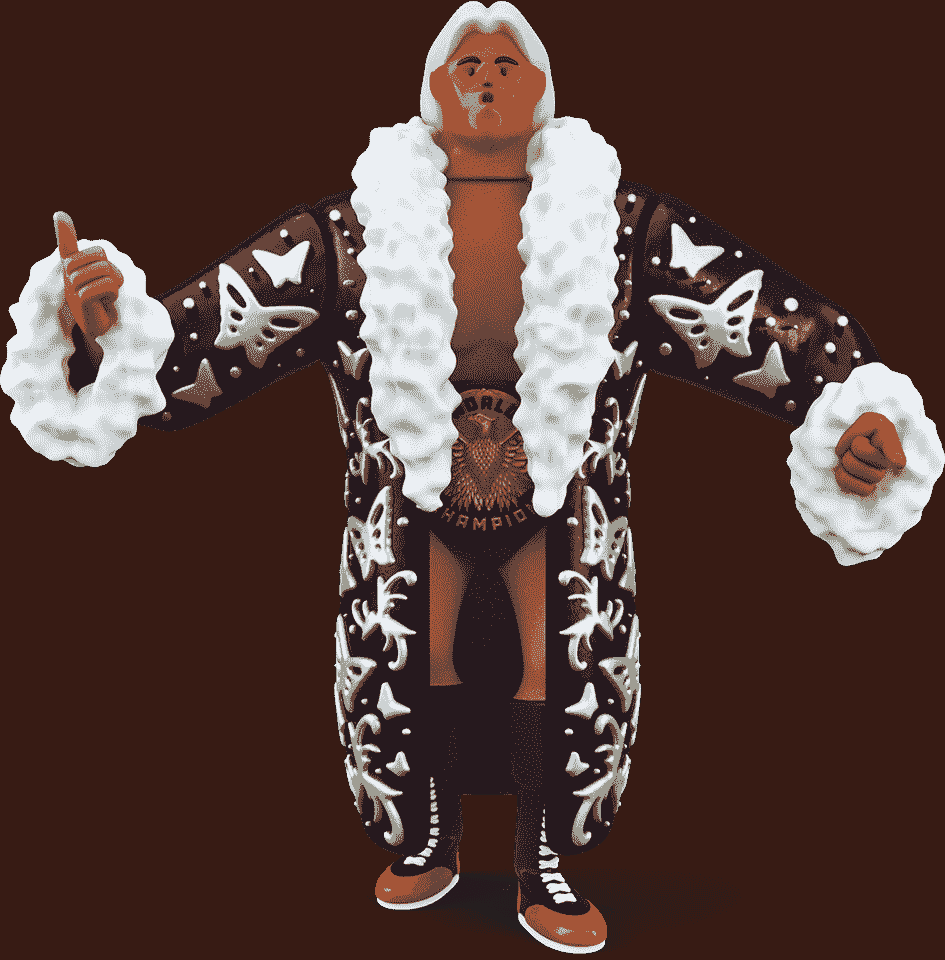

# 区块链格斗家用限量版 NFTs 欢迎瑞克·佛莱尔

> 原文：<https://web.archive.org/web/https://dappradar.com/blog/blockchain-brawlers-welcomes-ric-flair-with-limited-edition-nfts>

## 这位著名的世界摔跤冠军将出现在极其罕见的传奇 NFT 系列中

作为蜡像游戏生态系统的最新成员之一，Blockchain Brawlers 宣布了一款以 Ric“自然男孩”天赋为特色的独家 NFT 游戏。一套 100 个极其罕见的传奇 NFT 包将于 3 月向列入白名单的收藏家出售。

100 名幸运白名单持有者将获得一个礼包，其中包含一个“自然男孩”瑞克·佛莱尔传奇 NFT 和一个四个版本之一的免费戒指 NFT。版本范围如下:标准，硬核，笼子匹配，死亡匹配。此外，每位买家都有机会获得一条 NFT，佩戴三条超稀有腰带之一，包括全国冠军、世界冠军和元宇宙冠军。

瑞克·佛莱尔是 16 次世界摔跤冠军，也是摔跤界最臭名昭著的人物之一。事实上，一个 WWE 明星正在拥抱区块链格斗家和游戏中融入的玩赚和 NFT 技术，这给了它很大的影响力。此外，这种明星的出现和认可将为争吵者竞技场和蜡像收藏品世界带来新的观众。

关于进入瑞克天才包白名单的细节将很快在官方区块链争吵者 Discord 上公布。

## 什么是区块链格斗家？

Blockchain Brawlers 是一款即将推出的 NFT 收集和游戏赚取游戏，正在为 2 月 8 日的大型发布做准备。拥有近 10，000 名 Twitter 关注者和一个活跃的 Discord 社区，这款游戏将会有一个令人印象深刻的下降，以及一个成功的开始。

2021 年 11 月，第一批 100 个“创始人版”传奇格斗家在币安·NFT 拍卖行上市。不过，2 月 8 日，区块链格斗家将在 Wax 上正式推出 Founders packs 和 Gear packs。重要的是，这一 NFT 下降也标志着官方游戏的测试版的推出。

瑞克·佛莱尔独家包是一个额外的机会，让玩家在游戏中领先，并开始赚钱。重要的是，拥有 NFT 和 NFT 戒指的玩家可以参与战斗。无论谁赢得这场战斗，都将获得游戏的本地令牌 BRWL 令牌的奖励。

随着 NFT 掉落和玩赚游戏即将推出，DappRadar 将监测区块链格斗家的发展。你也可以在他们的官方 DappRadar 页面[这里](https://web.archive.org/web/20221001120728/https://dappradar.com/wax/games/blockchain-brawlers)追踪游戏的进展。此外，你可以加入 [DappRadar PRO](https://web.archive.org/web/20221001120728/https://dappradar.com/token/pro) 来实时跟踪区块链格斗家系列的最新 NFT 销售数据。

 NewsletterUnsubscribe at any time. [T&Cs](https://web.archive.org/web/20221001120728/https://dappradar.com/terms) and [Privacy Policy](https://web.archive.org/web/20221001120728/https://dappradar.com/privacy-policy)