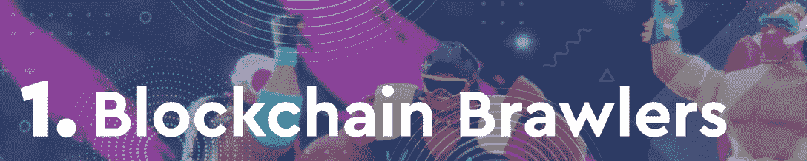
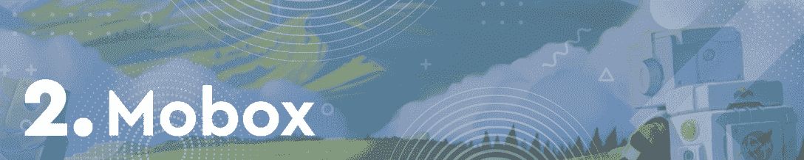
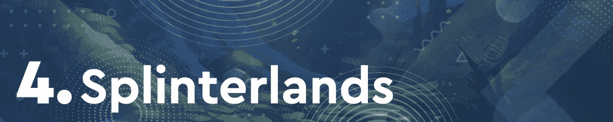
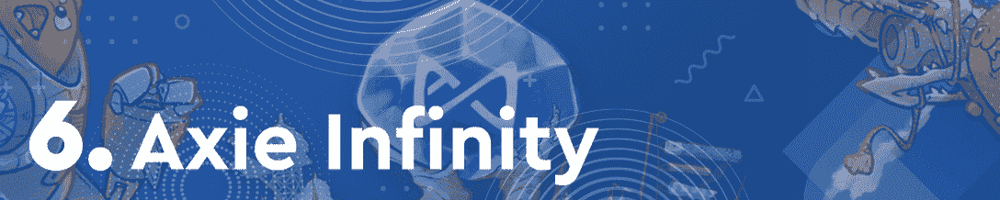
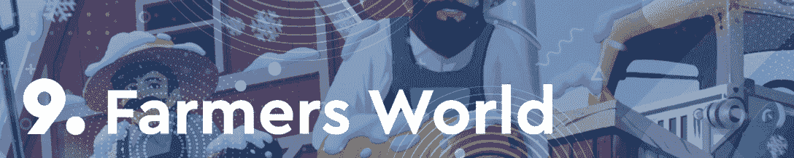

# 区块链格斗家赢得了本周的竞技场战斗

> 原文：<https://web.archive.org/web/https://dappradar.com/blog/blockchain-brawlers-wins-the-arena-fight-this-week>

## 这款基于蜡像的游戏见证了其本土标志 BRWL 价值 150%的增长

**Blockchain Brawlers 是蜡区块链上的一颗新星。它越来越受欢迎，对游戏经济产生了积极的影响。在过去的七天里，该游戏的原生令牌 BRWL 的估值上涨了 150%，将该平台推上了 DappRadar 本周十大区块链游戏的榜首。**

通常的嫌疑人 Mobox 和 Upland 表现出色，分别排名第二和第三。本周，一个明显的趋势是缺少像沙盒和 NFT 世界这样的虚拟世界。这可能是由于 3 月份 NFT 土地销售出现了相当不利的趋势。

几个月来，区块链游戏一直处于加密活动的前沿。通过这篇文章，DappRadar 了解了本月最热门的游戏 dapps。为了编制这个排名，我们考虑了链上活动，NFT 交易量，令牌估值，以及围绕每个 dapp 的新闻和事件。

在下面浏览本周十大区块链游戏的完整列表。单击相应的图片，了解每个平台的更多信息。或者，看看下面的视频，它总结了排名，可以快速查看。

[https://web.archive.org/web/20221127161415if_/https://www.youtube.com/embed/UY2zOONMPeQ?feature=oembed](https://web.archive.org/web/20221127161415if_/https://www.youtube.com/embed/UY2zOONMPeQ?feature=oembed)

## 十大区块链游戏

### 区块链格斗家占据中心舞台

蜡基竞技场战斗游戏[方块链斗殴者](https://web.archive.org/web/20221127161415/https://dappradar.com/wax/games/blockchain-brawlers)令人难忘地首次进入达普拉达尔区块链十大游戏排行榜。**这款游戏本周排名第一，这要归功于其本土游戏 BRWL** 的估值显著上涨了 150%。此外，在过去的七天里，block chain bloggers 在 NFT 的交易量超过了 125，300 美元，同时有超过 3，000 个独特的活动钱包与游戏相连。

### Mobox 保持强劲的性能

基于 BSC 的农业游戏 [Mobox](https://web.archive.org/web/20221127161415/https://dappradar.com/binance-smart-chain/games/mobox-nft-farmer) 是三月份排名的统治者，然而，本周它下降了一位，排名第二。尽管排名下降，但 Mobox 的七天表现令人印象深刻，在 NFT 产生了超过 400 万美元的交易量。该平台的活动也激增，因为**超过 189，000 个独特的活动钱包连接到游戏**，期待新的 [Mobox 头像](https://web.archive.org/web/20221127161415/https://dappradar.com/blog/mobox-planning-avatar-airdrop-for-vembox-holders/)。

### 高地排名前三

基于 EOS 的房地产交易游戏 [Upland](https://web.archive.org/web/20221127161415/https://dappradar.com/eos/games/upland) 经常出现在 DappRadar 十大区块链游戏排名中。本周，平台**排名第三，这得益于超过 15 万个独立活跃钱包**的坚实用户基础。更重要的是，随着星火周的开始，围绕这款游戏的宣传也越来越多。

### Splinterlands 拥有最多的观众

基于 Hive 的[spliter lands](https://web.archive.org/web/20221127161415/https://dappradar.com/hive/games/splinterlands)本周排名第四，在过去一周再次吸引了最多数量的独特活跃钱包。随着**超过 522，000 个钱包连接到交易卡游戏平台**，Splinterlands 理所当然地进入了本周的前 5 名。

### 外星世界完成了蜡像梦之队

[外星世界](https://web.archive.org/web/20221127161415/https://dappradar.com/multichain/games/alien-worlds)是蜡像区块链上访问量最大的 dapps 网站之一，**在过去一周有超过 30 万个独特的活动钱包注册**。本周排名最高的游戏《区块链格斗家》在这方面还远远落后。不幸的是,《异形世界》的本土代币 TLM 本周贬值了约 5%,影响了游戏的排名。

### Axie Infinity 发射原点

在臭名昭著的[浪人桥黑客](https://web.archive.org/web/20221127161415/https://dappradar.com/blog/axie-infinity-activity-plummets-after-600-million-ronin-exploit/)事件之后，Axie Infinity 经历了动荡的几周。然而，由于推出了全新的 [Axie Infinity: Origin](https://web.archive.org/web/20221127161415/https://dappradar.com/blog/axie-infinity-origin-brings-brand-new-arena-mode/) ，这位游戏赚钱巨人进入了本周的前十名。这个新版本推动了平台的活动，在过去的七天里**在 NFT 产生了超过 860 万美元的交易量**。

### 欢迎 CryptoBlades

CryptoBlades 已经出现了相当长的一段时间，但这是该游戏第一次进入 DappRadar 十大区块链游戏排名。在过去的七天里，该游戏吸引了超过 36，000 个独特的活动钱包。但将它推上这个榜单的是**的一个** **增加了 9%的原生令牌技能**的值。

### Aavegotchi playdrops 在地平线上

随着 Gotchiverse 的推出，Aavegotchi 在过去的几周中表现不俗。本周，随着玩家们兴奋地加入第一次 [playdrop 活动](https://web.archive.org/web/20221127161415/https://dappradar.com/blog/aavegotchi-rewards-real-fans-by-replacing-airdrops-with-playdrops/)，它获得了第八名。更重要的是，T4 在过去的七天里吸引了超过 25 万美元的 NFT 交易量。

### 农民世界回来了

本周排名中第三个基于蜡的条目是[农民世界](https://web.archive.org/web/20221127161415/https://dappradar.com/wax/games/farmers-world)。这款游戏在过去的七天里在 NFT 创造了超过 152，000 美元的交易量，理所当然地占据了这个榜单的一席之地。农民世界也吸引了越来越多的玩家，在过去的一周内**有 123，250 个独特的活动钱包连接到游戏**。

### 《被解放的上帝》推出新的 NFT 背包

最后但同样重要的是，我们有[被解放的](https://web.archive.org/web/20221127161415/https://dappradar.com/ethereum/games/gods-unchained)神。随着时间的推移，这款游戏已经有了稳定的追随者，这一点显而易见。在过去的七天里,《被解放的神》**吸引了近 10，000 个独特的活跃钱包**到它的平台上。活跃度的上升也是由于即将发布的《致命审判》NFT 背包系列，这将是游戏第二季的最后一个。

## Blockchain Brawlers 在 Wax 上有激烈的竞争

由于其本地令牌 BRWL 令人印象深刻的价格上涨，区块链格斗家本周高居榜首。然而，这款游戏在它的家乡区块链面临着激烈的竞争。Wax 已经成为区块链游戏开发商的首选解决方案，因为它提供了快速而廉价的交易。非常受欢迎的[原子市场](https://web.archive.org/web/20221127161415/https://dappradar.com/multichain/marketplaces/atomicmarket)也是一个驱动力。

像[外星世界](https://web.archive.org/web/20221127161415/https://dappradar.com/multichain/games/alien-worlds)、[农民世界](https://web.archive.org/web/20221127161415/https://dappradar.com/wax/games/farmers-world)和[小树林](https://web.archive.org/web/20221127161415/https://dappradar.com/hive/games/splinterlands)这样的游戏长期受益于坚实的基础和 NFT 销售平台 Wax 优惠。更重要的是，这些游戏经常出现在 DappRadar 十大区块链游戏列表中。我们很想知道后起之秀区块链格斗家是否会步他们的后尘。目前，看起来确实是这样。

随着新项目声名鹊起并占据排行榜，达普拉达将继续关注区块链游戏领域。要查看区块链游戏在过去一周的表现的更详细的细分，请查看完整的[顶级区块链游戏排名](https://web.archive.org/web/20221127161415/https://dappradar.com/rankings/category/games)。你也可以加入 [DappRadar PRO](https://web.archive.org/web/20221127161415/https://dappradar.com/token/pro) 社区，获得最新的统计数据，并有机会加入私人 PRO [Discord](https://web.archive.org/web/20221127161415/https://discord.gg/4ybbssrHkm) 频道的独家讨论。

 NewsletterUnsubscribe at any time. [T&Cs](https://web.archive.org/web/20221127161415/https://dappradar.com/terms) and [Privacy Policy](https://web.archive.org/web/20221127161415/https://dappradar.com/privacy-policy)