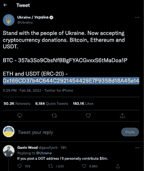
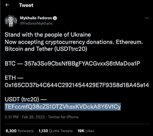
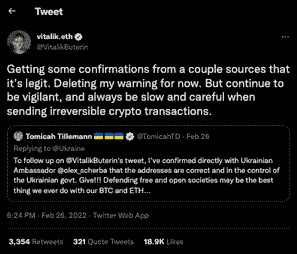
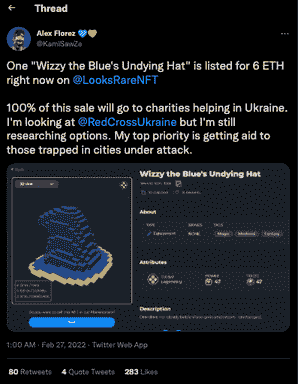
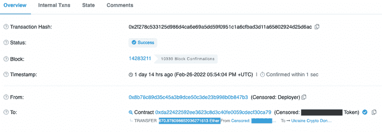
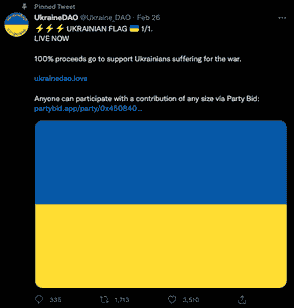
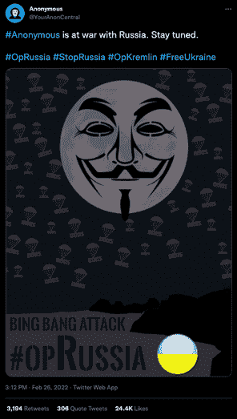

# 区块链和加密社区集会支持乌克兰

> 原文：<https://web.archive.org/web/https://dappradar.com/blog/blockchain-crypto-community-rallies-to-support-ukraine>

## 到目前为止，加密货币已经筹集了近 1000 万美元

**乌克兰** [**在 2021 年加密货币的采用方面排名全球第四**](https://web.archive.org/web/20221221163528/https://blog.chainalysis.com/reports/2021-global-crypto-adoption-index/) **，估计有 550 万人持有加密货币，几乎占总人口的 13%。现在，支持来自另一个方向，因为乌克兰政府呼吁捐款以抵御俄罗斯的入侵并提供援助，这完全得到了加密社区的支持。到目前为止，各种加密货币已经筹集了近 1000 万美元。**

值得注意的是，无数不诚实的组织和潜在的欺诈性钱包地址在互联网上四处流动，声称接受捐赠。建议遵循官方渠道，保持警惕。

捐赠正直接流向乌克兰政府、各种独立新闻、媒体来源和几个人道主义援助组织。此外，虽然一些人不得不停止通过 Patreon 等渠道接受捐款，但 crypto 提供了一条生命线。此外，个别区块链社区成员表示支持，建立 Dao，销售 NFT，并捐赠个人财富来支持该事业。

## 透明捐赠

据链上数据显示，以太坊钱包已经收到 520 万美元，地址为官方[乌克兰政府推特](https://web.archive.org/web/20221221163528/https://twitter.com/Ukraine?ref_src=twsrc%5Etfw%7Ctwcamp%5Etweetembed%7Ctwterm%5E1497594592438497282%7Ctwgr%5E%7Ctwcon%5Es1_&ref_url=https%3A%2F%2Fcointelegraph.com%2Fnews%2Fukraine-accepts-bitcoin-ethereum-usdt-donations-to-fund-ongoing-war)给出的[0x 165 CD 37 b4c 644 c 2921454429 e7f 9358d 18 a 45 e 14](https://web.archive.org/web/20221221163528/https://dappradar.com/hub/wallet/eth/0x165cd37b4c644c2921454429e7f9358d18a45e14/assets)——其中 USDT 110 万美元，USDC 10.9 万美元，两个与美元挂钩的稳定货币。

链上数据还显示，FTX 创始人萨姆·班克曼-弗里德在 USDT 捐赠了 25 万美元，chain 首席执行官迪帕克·塔普利亚尔在撰写时捐赠了 100 份 ETH，约合 27.7 万美元。除了 ERC 20 枚代币的贡献，乌克兰的比特币钱包已经收到了 420 万美元。

Polkadot 的创始人加文·伍德(Gavin Wood)在一条推特上评论说，如果 dot 地址可用，他将承诺 500 万美元。我们还没有看到一些东西，但加文·伍德似乎已经与乌克兰的 Subsocial 合作发起了一项关于 Polkadot 的倡议。

此外，乌克兰副总理费多罗夫分享了三个加密钱包地址。而 BTC 和 ETH 地址与上述地址相同。费多罗夫的 USDT 钱包地址是 Tron 区块链上的一个钱包，与乌克兰官方 Twitter 手柄共享的地址不同。

以太坊的联合创始人 Vitalik Buterin 最初怀疑请求加密捐款的账户是合法的，表明它们可能被黑客攻击了。然而，美国外交官 Tomicah Tillemann 后来从乌克兰大使 Olexander Scherba 那里证实了其合法性。

## 币安认捐 1000 万美元

全球最大的集中式加密交易所之一币安[宣布捐赠 1000 万美元用于援助乌克兰的人道主义危机](https://web.archive.org/web/20221221163528/https://coinzuba.com/2022/02/27/binance-donates-10-million-to-ukraine-and-launches-charity-fund)，进一步宣布启动乌克兰紧急基金，通过加密众筹提供紧急救援。

## NFT 社区集会

NFT 社区的成员聚集起来，主要通过慈善销售和捐赠向乌克兰提供支持。Rarible 呼吁其社区突出乌克兰艺术家的作品，并通过购买支持他们，还承诺 Rarible 团队会购买一些。沙盒的首席设计师 Alex Flores 在 6 ETH 出售一件 NFT 作品，没有版税，并声明销售所得将 100%捐赠给帮助乌克兰的慈善机构。然而，在撰写本文时，[尚未收到](https://web.archive.org/web/20221221163528/https://looksrare.org/collections/0xa342f5D851E866E18ff98F351f2c6637f4478dB5/53343204100803765692379285688171671302437967278842259121980540727211151329280#offers)对该商品的报价。

NFT 艺术家和有影响力的人 [Pak 也站了出来](https://web.archive.org/web/20221221163528/https://twitter.com/muratpak/status/1497631973103255557)，捐赠了一整批 NFT 物品，总价值 670 ETH，约合 180 万美元。

## 乌克兰岛

乌克兰道与乌克兰政府一起要求分散自治组织(DAO)捐款，为乌克兰士兵筹集资金。由投资集团 PleasrDAO、NFT 工作室 Trippy Labs 和俄罗斯艺术团体 Pussy Riot 的成员协调的筹款活动已经在 ERC 筹集了 300 多万美元——20 个代币。

该项目从其他有政治头脑的 DAO 获得灵感，如 AssangeDAO 和 ConstitutionDAO，它们试图在拍卖会上购买美国宪法的原版，但不幸失败了。

DAO 将以 0.08 ETH 的价格出售乌克兰国旗图像的 NFTs，以纪念乌克兰在 1991 年宣布独立，所有收入将捐给乌克兰的非营利组织。DAO 将捐赠 crypto to Come Back Alive，这是一个为乌克兰军方和包括红十字会在内的其他慈善组织筹集资金的慈善组织。

## 公正的媒体

宣传在任何冲突中都发挥着作用，但也许当俄罗斯卷入冲突时，这种作用最大。这一努力的一个重要部分是支持媒体机构努力从冲突中传递最准确、最公正的新闻。随着俄罗斯开始压制俄罗斯境内的所有独立媒体，西方禁用了克里姆林宫在整个欧洲的扩音器“今日俄罗斯”。基辅独立报(T2)是一家收集捐款继续报道乌克兰发生的事件的新闻机构。

与此同时，克里姆林宫的[网站和俄罗斯电视频道被黑客攻击，播放乌克兰歌曲](https://web.archive.org/web/20221221163528/https://www.independent.co.uk/news/world/europe/ukraine-russia-kremlin-website-hacked-b2024046.html)，此前据报道，随着俄罗斯对乌克兰的攻击继续，黑客组织 Anonymous 进行了一系列网络攻击。可以说，在今天的混合战争场景中有一个强大的盟友。

## 世界集会

虽然在过去的几天里，crypto 和区块链社区团结一致，大力支持乌克兰，但其他国家和组织也以自己的方式表示支持。与亲俄罗斯的白俄罗斯接壤的立陶宛组织了大规模的衣物、食品和其他物品的慈善捐赠，以帮助难民和那些试图逃离暴力的人。捐款如此之多，红十字会不得不停止接受他们，因为他们的卡车已经没有空间了。与此同时，总部和员工都在立陶宛的 challenger bank Revolut 将[为红十字会的慈善捐赠提供便利](https://web.archive.org/web/20221221163528/https://blog.revolut.com/the-war-on-ukraine-our-response/)，并免除通过其手机银行应用向乌克兰汇款的所有费用。

或许更有趣的是，尽管加密和主流新闻充斥着通过加密货币涌入的捐款，但传统组织伸出援手的报道却很少。可以说，拥有可识别领导人的全球组织希望避免任何可能让他们与任何一方结盟的政治声明或大胆举措——这再次显示了冲突时期中央集权、自上而下控制的实体的脆弱性。

到目前为止，加密货币被证明是对抗俄罗斯入侵乌克兰的有效武器。除了上述活动，乌克兰数字转型部长米哈伊洛·费多罗夫(Mykhailo Kumar)还呼吁向俄罗斯政界人士提供加密钱包地址。截至发稿时，[已收到](https://web.archive.org/web/20221221163528/https://www.news24.com/fin24/economy/world/ukrainian-govt-offering-rewards-for-russian-politicians-crypto-info-20220227) 500 条举报。它预计在接下来的几天内公布一份政客的地址列表。然后，它们将与全球主要交易所分享被标记为有毒的股票，最终试图将它们从主要交易所列入黑名单。

 NewsletterUnsubscribe at any time. [T&Cs](https://web.archive.org/web/20221221163528/https://dappradar.com/terms) and [Privacy Policy](https://web.archive.org/web/20221221163528/https://dappradar.com/privacy-policy)

***以上不构成投资建议。此处给出的信息仅供参考。请行使尽职调查，做你的研究。作者持有 ETH、BTC、AGIX、HEX、LINK、GRT、CRO、OMI、不可变 X、GALA、AVASTR、GMEE、CUBE、RADAR、FLOW、FTM、BNB、SPS、WRLD、ATOM 和 ADA。***