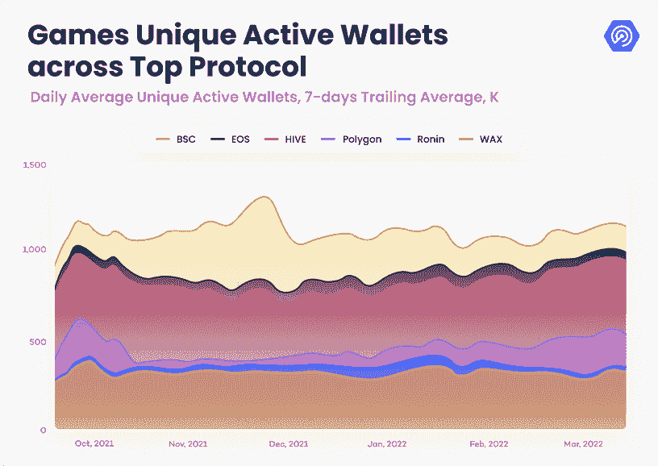
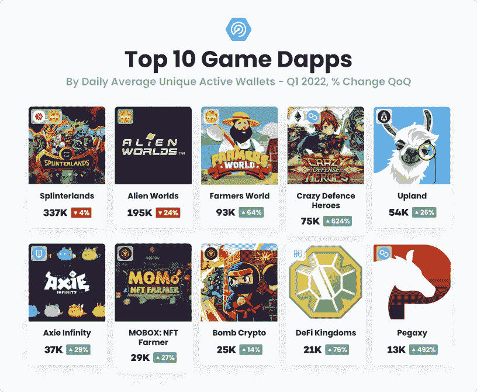
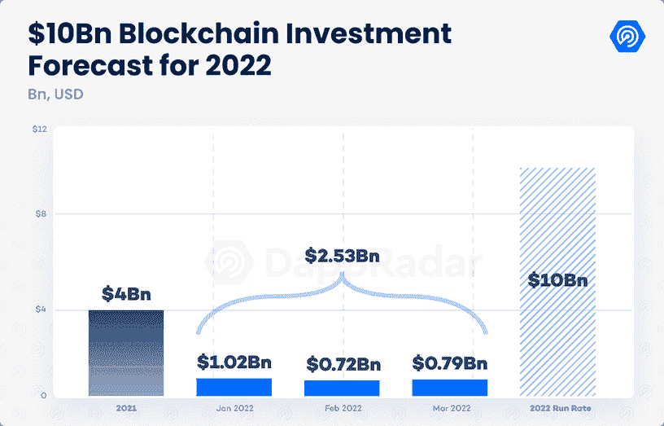
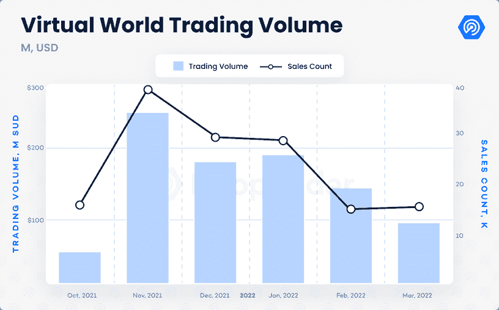

# 随着 Axie Infinity 的停止，区块链游戏用户增加了 2000%

> 原文：<https://web.archive.org/web/https://dappradar.com/blog/blockchain-game-users-up-2000-as-axie-infinity-stalls>

## 2022 年 3 月，区块链游戏吸引了 122 万 UAW

**区块链游戏再次成为焦点，最近的 [DappRadar 报告](https://web.archive.org/web/20221001232335/https://dappradar.com/blog/dappradar-x-bga-games-report-q1-2022)显示，用户数量同比增长 2000%，令人印象深刻。区块链游戏占 Q1 2022 年区块链应用使用量的一半以上。**

## 摘要

*   区块链游戏在 3 月份吸引了 122 万 UAW，占该行业活跃度的 52%
*   Sky Mavis 在遭受了加密史上最严重的攻击之一后，经历了一个具有挑战性的时期
*   25 亿美元的投资涌入 2022 年 Q1 区块链奥运会

在持续的乌克兰冲突加剧了熊市的情况下，区块链游戏公司保持了稳定的使用水平，第一季度平均每天有 117 万个独立活跃钱包(UAW)连接。此外，尽管与去年第四季度的日均流量相比下降了 2%，但 3 月份的日均流量超过了 122 万 UAW，显示出强劲的复苏势头。

## 哪个网络脱颖而出？

虽然在大多数区块链报道中以太坊占据了头条，但关于区块链游戏和用户数量的故事却是不同的。在这个空间中，Wax 领先于 Alien Worlds 和 Farmers World，Hive 位居第二，这要归功于 Splinterlands，紧随其后的是 BNB 链和多边形。

Polygon 继续建立在 2021 年获得的势头上，因为像 Crazy Defense Heroes、Pegaxy、Arc8 和 Aavegotchi 这样的游戏使 Polygon 的游戏活动从 12 月底增加了 219%。

Source: [DappRadar x BGA Q1 Blockchain Game Report](https://web.archive.org/web/20221001232335/https://dappradar.com/blog/dappradar-x-bga-games-report-q1-2022)

BNB 连锁店 Mobox NFT 法默设法保持其在链指标为正，比上一季度增加了 10%的活动，这要归功于围绕 Momoverse 的[坚实路线图。此外，自去年年底以来，BNB 链家的线上活动有所减少。除了 Mobox 和 Bomb Crypto，大多数游戏 dapps 在币安品牌网络上的使用一直不稳定。尽管如此，BNB 连锁店是区块链博彩活动的第三大网络。它在 Q1 吸引了 16.5 万的每日 UAW，比去年 12 月下降了 33%。](https://web.archive.org/web/20221001232335/https://dappradar.com/blog/mobox-planning-avatar-airdrop-for-vembox-holders)

在去年八月吸引了超过 30 万的每日 UAW 后，Wax 的《外星世界》失去了一些阵地。太空采矿游戏 GameFi dapp 每天仍吸引超过 188，000 UAW，而其 TLM 代币已成为最受欢迎的游戏加密货币之一。

Hive 上的活动[完全由 splitterlands](https://web.archive.org/web/20221001232335/https://dappradar.com/blog/dappradar-x-bga-games-report-q1-2022)领导，与 2 月相比，其 UAW 增加了 11%，自 Q1 2021 年以来，令人难以置信地增加了 5205%。OG 交易卡游戏对 2022 年有一些大的计划，看起来将继续吸引人群，并保持其在游戏排名中的主导地位。

Source: [DappRadar x BGA Q1 Blockchain Game Report](https://web.archive.org/web/20221001232335/https://dappradar.com/blog/dappradar-x-bga-games-report-q1-2022)

虽然[十大区块链游戏](https://web.archive.org/web/20221001232335/https://dappradar.com/blog/dappradar-x-bga-games-report-q1-2022)现在都是相当成熟的玩家，每个月都保持着他们的位置，但在未来的几周和几个月里，请注意其他游戏，如 Avalanche 的 Crabada 或 Immutable X 的 Gods Unchained，来挑战这些中坚分子。

## Ronin & Axie Infinity 怎么样？

虽然最近的[浪人漏洞攻击](/web/20221001232335/https://dappradar.com/blog/axie-infinity-activity-plummets-after-600-million-ronin-exploit/)迫使浪人的本地 dapps 停止运作，但 Axie Infinity 活动的减少不仅仅是这次攻击的结果。这款游戏在 2022 年 1 月达到顶峰，日均 UAW 超过 55，000 次，此后一直在下降。自那以来，3 月份的 UAW 日均流量已降至 22，000 左右。

二月中旬，UAW 的数量进一步减少，这是因为 Sky Mavis 对 SLP 奖励进行了修改，试图使 Axie 的游戏内货币更具可持续性。尽管如此，Axie Infinity 仍是日常使用量最高的十大游戏之一，该游戏仍吸引了超过 150 万名日常活跃用户，衡量离线数据。

虽然 Ronin bridge 漏洞对 Sky Mavis 来说是一个沉重的打击，但 Axie Infinity 用户群和 Web3 社区的支持是巨大的。币安带领 Animoca Brands 和 a16z 进行了一轮 1.5 亿美元的融资，以帮助偿还用户资金，同时启动了一项[100 万美元的漏洞奖励计划](https://web.archive.org/web/20221001232335/https://decrypt.co/97580/axie-infinity-developer-launches-1m-bug-bounty-after-622m-ronin-hack)，以帮助巩固和加强其生态系统的核心，

即使在这个充满挑战的时期，Axie Infinity 在可预见的时间内可能仍将是领先的游戏赚取选择。此外，根据 Sky Mavis 的说法，Origin 的发布在 4 月份成功部署，仅 PC 版游戏就吸引了超过 220，000 名测试者。

## 投资涌入

区块链奥运会的另一个强劲增长信号是，25 亿美元的投资涌入了 2022 年 Q1 区块链奥运会。按照这种速度，从玩到赚和元宇宙相关的项目今年将增加 100 亿美元，以继续建设这个行业的未来。

Source: [DappRadar x BGA Q1 Blockchain Game Report](https://web.archive.org/web/20221001232335/https://dappradar.com/blog/dappradar-x-bga-games-report-q1-2022)

最值得注意的是，宇迦实验室，著名的 NFT 收藏无聊猿游艇俱乐部(BAYC)背后的工作室，获得了由 Animoca Brands 牵头的 4.5 亿美元投资，沙盒，FTX 和比特币基地参与了这笔交易。这项投资进一步巩固了宇迦实验室的地位，使其成为 Web3 叙事中的一个名字。这也促进了团队的元宇宙计划，因为他们准备推出另一边。Otherside 将成为一个可互操作的元宇宙平台，涉及游戏、时尚和媒体。

## 元宇宙怎么样？

在 Meta 于 2021 年第四季度宣布更名后，人们对元宇宙的整体兴趣有所降温。虚拟世界的交易额比 2021 年第四季度下降了 12%，在 Q1 2022 年达到 4.3 亿美元以上。分散土地和沙盒土地的平均价格暴跌了 40%，而这两个平台的交易量分别下降了 20%和 60%。

尽管如此，元宇宙平台的总体前景预示着此类项目的乐观前景。随着微软、谷歌、迪士尼、索尼等领先企业试图在元宇宙发展自己的品牌，总部位于区块链的元宇宙的潜力比以往任何时候都大。

Source: [DappRadar x BGA Q1 Blockchain Game Report](https://web.archive.org/web/20221001232335/https://dappradar.com/blog/dappradar-x-bga-games-report-q1-2022)

要阅读完整的 DappRadar 运动会报道并了解 2022 年 Q1 奥运会的所有活动，[点击此处](https://web.archive.org/web/20221001232335/https://dappradar.com/blog/dappradar-x-bga-games-report-q1-2022)。对于非 DappRadar Pro 用户，它将在世界协调时 4 月 21 日星期四下午 12:00 解锁。

 NewsletterUnsubscribe at any time. [T&Cs](https://web.archive.org/web/20221001232335/https://dappradar.com/terms) and [Privacy Policy](https://web.archive.org/web/20221001232335/https://dappradar.com/privacy-policy)

***以上不构成投资建议。此处给出的信息仅供参考。请行使尽职调查，做你的研究。作者持有多种加密货币的头寸，包括 BTC、瑞士法郎和雷达。***