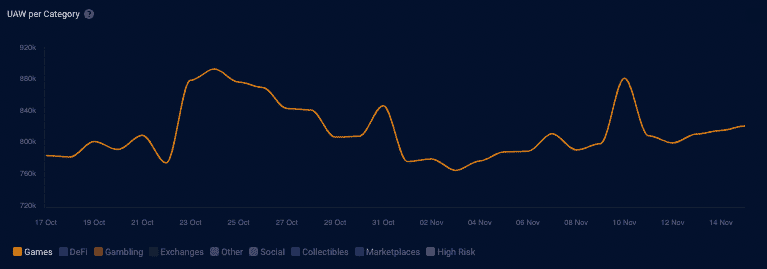
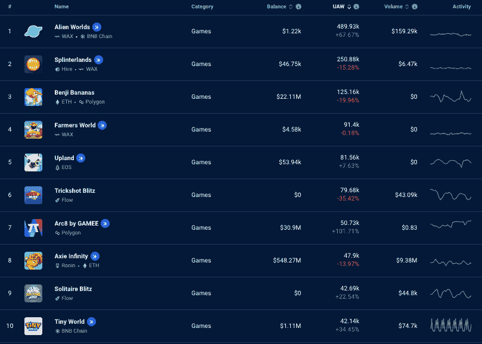
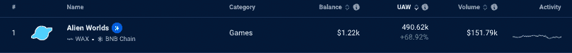
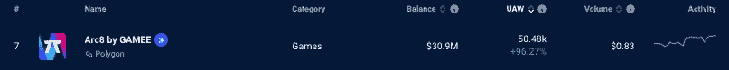
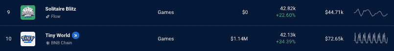

# 区块链游戏几乎没有受到 FTX 事件的影响

> 原文：<https://web.archive.org/web/https://dappradar.com/blog/blockchain-games-barely-impacted-by-ftx-fallout>

## 随着游戏产业受到 FTX 事件的影响，游戏使用率飙升

在过去的几天里寻找积极的迹象是困难的，但是区块链奥运会显示了对 FTX 和阿拉米达崩溃的最高水平的抵抗。在写作方面，领先的游戏每天有超过 80 万用户使用 dapps。

### 突出

*   游戏玩家每天仍有超过 80 万 UAW 进入区块链应用程序
*   顶级游戏似乎可以抵抗 FTX 和阿拉米达的崩溃所带来的任何影响
*   在过去的 24 小时里，外星世界和分裂大陆记录了将近 50 万 UAW 人
*   点击此处阅读正在进行的关于哪些 dapps 不受 FTX 辐射影响的分析。

从侧面看，大多数旁观者会认为密码行业刚刚内爆到一个意味着没有回头路的水平。然而，事实上，前景要光明得多。当游戏玩家继续玩并在 DappRadar 跟踪的[去中心化应用程序中找到用途时，完全去中心化和真正定义](https://web.archive.org/web/20230103204716/https://dappradar.com/rankings/category/games)的争论一如既往地强烈。

Source: [DappRadar](https://web.archive.org/web/20230103204716/https://dappradar.com/industry-overview)

事实上，在当前的熊市周期中，[区块链游戏显示了最高水平的阻力](https://web.archive.org/web/20230103204716/https://dappradar.com/reports)。此外，数字显示，dapps 正在被使用，区块链科技可以给终端用户提供的不仅仅是投机性的象征性投资。 [Dapps 正在成为新的应用](https://web.archive.org/web/20230103204716/https://dappradar.com/rankings)，这正是 DappRadar 所期待的。

## FTX 崩溃并不有趣

那些从[游戏](https://web.archive.org/web/20230103204716/https://dappradar.com/rankings/category/games)或 [NFT](https://web.archive.org/web/20230103204716/https://dappradar.com/nft) 的角度进入加密空间的人可能甚至不关心阿拉米达和 FTX 中央交易所的崩溃。潜在地，他们需要找出谁是山姆·班克曼·弗里德，以及[为什么阿拉米达和 FTX 的崩溃如此重要](https://web.archive.org/web/20230103204716/https://dappradar.com/blog/on-the-safe-side-which-dapps-escaped-the-ftx-crypto-contagion)。

他们为什么要这么做？除非他们的代币在 FTX 持有，这是不太可能的，因为大多数区块链游戏都有内部市场和玩家下注选项，这意味着将代币放在区块链的钱包里是至关重要的。可以说，游戏玩家学到了严酷的教训——不是你的钥匙，不是你的密码，甚至没有意识到这一点。

## 游戏玩家会继续玩下去

数字不会说谎，当这个世界正忙于分解一个秘密的亿万富翁逃亡的故事时，游戏玩家正在做他们最擅长的事情——玩游戏，赚取奖励，并为区块链的大规模采用建立门户。

下面我们来看一下区块链奥运会的[七天数据，按照连接到 dapp 的唯一活跃钱包的数量进行排名。这些数字是一周接一周的，所以它表示七天内的增减。50%的游戏显示出使用量的积极上升，而其他游戏显示出轻微的下降趋势，这在查看周环比数据时是非常标准的。](https://web.archive.org/web/20230103204716/https://dappradar.com/rankings/category/games)

另一个强有力的论点是，在代币贬值的时候玩区块链游戏更有意义，因为今天收集的任何东西都可以在以后价格更有利的时候兑换。

## 人们在玩什么？

与上周相比，Web3 游戏领域的许多大公司与他们的 dapps 互动的独特活动钱包(UAW)的数量都有所增加。

经常高居 [DappRadar 游戏排行榜榜首的](https://web.archive.org/web/20230103204716/https://dappradar.com/rankings/category/games)，与前一周相比增加了将近 69%的无人机。过去七天有 490，620 架无人机连接到外星世界。

总体而言，休闲手机游戏本周表现不错。GAMEE 的和 [Arc8 都增加了他们在 UAW 的联系。GAMEE 为 Arc8 提供的 UAW 连接上升了 96.27%，达到 50，480。](https://web.archive.org/web/20230103204716/https://dappradar.com/polygon/games/arc8-by-gamee-1)

这些统计数据只显示了一周的数据，所以我们没有足够的信息来说明 FTX 发生的事情不会影响到任何一家 dapps。此外，在这个时候，看到区块链工业的许多部门仍在运作、成长和创造，令人振奋。

你可以在这里阅读我们正在进行的关于哪些 dapps 不受 FTX 辐射影响的分析。

## 建筑工人继续建造

Web3 中的每个人都以这样或那样的方式受到 FTX 事件的影响。至少，人们对该行业的信心将会动摇，他们会想知道这些事件会导致什么。

幸运的是，Star Atlas 首席执行官迈克尔·瓦格纳(Michael Wagner)将目光放得很远。即使他的游戏建立在索拉纳的基础上，他仍然相信网络是他的平台成长的最佳场所。与此同时，Web3 游戏和娱乐行业的另一个巨头沙盒刚刚宣布了另一项合作伙伴关系，承诺帮助该平台增长。

## 随身携带您的 Web3 之旅

使用 DappRadar 移动应用程序，再也不会错过 Web3。查看最受欢迎的 dapps 的性能，并关注您投资组合中的 NFT。您在 DappRadar 上的帐户会与我们的移动应用程序同步，这样您很快就可以选择实时接收提醒。

[Download the DappRadar app now](https://web.archive.org/web/20230103204716/https://dappradar.app.link/blog)[<picture></picture>](https://web.archive.org/web/20230103204716/https://play.google.com/store/apps/details?id=com.portfolio.dappradar)

***以上不构成投资建议。此处给出的信息仅供参考。请行使尽职调查，做你的研究。作者持有多种加密货币的头寸，包括 BTC、瑞士法郎和雷达。***

 NewsletterUnsubscribe at any time. [T&Cs](https://web.archive.org/web/20230103204716/https://dappradar.com/terms) and [Privacy Policy](https://web.archive.org/web/20230103204716/https://dappradar.com/privacy-policy)