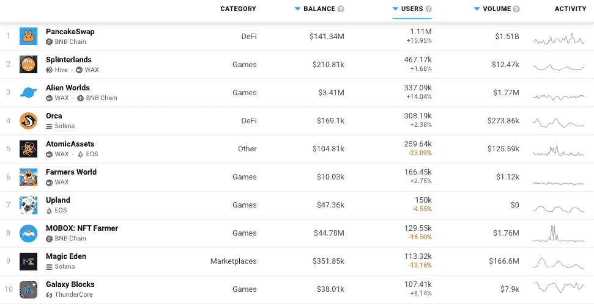

# 随着密码市场跳水，区块链游戏蓬勃发展

> 原文：<https://web.archive.org/web/https://dappradar.com/blog/blockchain-games-thrive-as-crypto-markets-dive>

## 在过去的七天里，130 万 UAW 人连接到了游戏

尽管过去一周加密货币价格暴跌，但区块链游戏继续蓬勃发展。当市场变红时，超过 130 万个活跃钱包连接到一款区块链游戏，这表明了对玩赚游戏的明显兴趣，并证明了现在向区块链和 Web3 用户提供的效用。

在 DappRadar 上排名前十的 dapps 中，有六个是游戏类的。他们总共看到超过 130 万个钱包连接到游戏平台。Splinterlands 几乎没有对崩溃做出反应，并保留了令人印象深刻的每周近 50 万钱包连接的数字，甚至略有增加。[《异形世界》的活跃度上升了 14%](https://web.archive.org/web/20220705001300/https://dappradar.com/multichain/games/alien-worlds),而《蜡像区块链》农业游戏[农民世界](https://web.archive.org/web/20220705001300/https://dappradar.com/wax/games/farmers-world)在过去的七天里有超过 166，000 个活跃钱包。

高地和 [Mobox](https://web.archive.org/web/20220705001300/https://dappradar.com/binance-smart-chain/games/mobox-nft-farmer) 的活动略有下降，但没什么可担心的，总体而言，所有游戏都保持了良好的表现，而 BTC 和瑞士联邦理工学院的价值从 11 月的高点下跌了近 50%。

## DeFi 活动呢？

两个 DeFi dapps 在列表中脱颖而出，但这是理解 dapp 类别的细微差别最重要的地方。当市场变红时，投资者的大部分价值被锁定或储存在这里。在价格开始下跌的同时，越来越多的钱包连接在一起，这可能意味着一些事情。首先，所有这些钱包前往平台，从各种头寸中提取资金，并试图尽可能多地节省价值。或者，他们可以将他们的资产换成 T2 稳定的货币，比如 USDC T3。

另一方面，在动荡时期关注高风险交易的投资者可能会加入进来，充分利用套利和更广泛的机会。然而，可以肯定地说，机会主义者将是少数，试图保存价值的人将是大多数。因此，最好让尘埃落定，然后再更仔细地分析 DeFi dapps，以便更好地评估资金流。

## 游戏在低收费的区块链蓬勃发展

看看哪些区块链最常用的 dapps 在上运行也很有趣。顺着列表往下看，以太坊无处可寻。相反，就用户而言，[蜡，BNB 链，和索拉纳](https://web.archive.org/web/20220705001300/https://dappradar.com/rankings)占主导地位。所有这些区块链都比以太坊更便宜，更快，并且已经成为业内一些最常用的 dapp 游戏的家园。现在，随着我们进入熊市，这些 dapps 继续推动区块链的使用，并保持分散应用的前景乐观。

最新的[4 月 DappRadar 行业报告](/web/20220705001300/https://dappradar.com/blog/dapp-industry-report-april-2022/)指出，区块链游戏驱动了超过 50%的区块链应用程序使用。在最近的价格暴跌中，预计 dapp 的使用也可能会减少。相反，我们看到的是相反的情况。随着代币持有者蹲下身子，为即将到来的加密冬天做准备，他们有大量的游戏、社交和健身应用可供探索。可以说，代币持有者比以往任何时候都更有用。与 2018 年不同，用户现在更有准备，受教育程度更高，更有弹性，更重要的是，比以往任何时候都更有信心区块链和加密货币将继续存在。

 NewsletterUnsubscribe at any time. [T&Cs](https://web.archive.org/web/20220705001300/https://dappradar.com/terms) and [Privacy Policy](https://web.archive.org/web/20220705001300/https://dappradar.com/privacy-policy)

***以上不构成投资建议。此处给出的信息仅供参考。请行使尽职调查，做你的研究。作者持有多种加密货币的头寸，包括 BTC、瑞士法郎和雷达。***