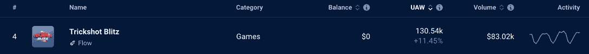
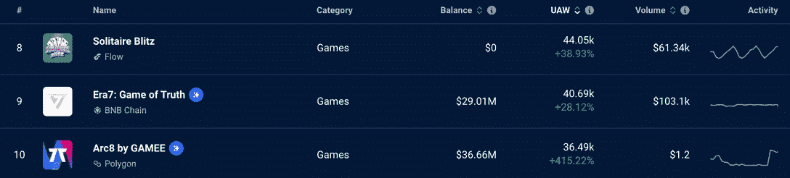
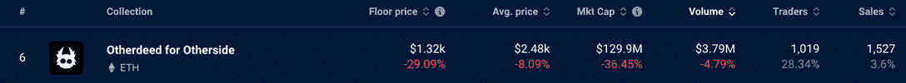
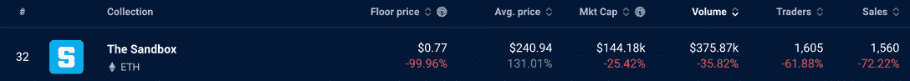

# 尽管 FTX 密码危机，区块链游戏 Dapps 仍在建设

> 原文：<https://web.archive.org/web/https://dappradar.com/blog/blockchain-gaming-dapps-still-building-despite-ftx-crypto-crisis>

## DappRadar 数据显示，在混乱的一周，游戏 dapps 吸引了更多的用户

对 Web3 行业来说，上周是糟糕的一周。FTX 危机的连锁反应不仅限于集中交易。密码价格暴跌，对 NFT 市场的信心也动摇了。专家们甚至担心索拉纳·区块链可能会失败，而 FTX 是其主要的资金支持者。但是 Web3 是一个很大的行业，有很多 dapps 仍在建设，仍在吸引用户。

**亮点**

*   FTX 是一个集中的交易所，本周陷入动荡，因为有消息称客户争相提取资金，该平台的本土标志 FTT 下跌。
*   *锁定索拉纳区块链的总价值下跌 66.6%，至 3.4777 亿美元。本地令牌 SOL 损失了 53%的价值，验证器节点的数量也大幅下降。*
*   尽管存在这些问题，DappRadar 的数据显示，大量游戏 dapps 的用户数量正在上升，这证明了 Web3 生态系统不仅仅是加密和金融。

[Explore Gaming Data](https://web.archive.org/web/20221128045543/https://dappradar.com/rankings/category/games)

## 建筑商将继续建造

Web3 中的每个人都以这样或那样的方式受到了本周 FTX 事件的影响。至少，人们对该行业的信心将会动摇，他们会想知道这些事件会导致什么。

幸运的是，像 Star Atlas 首席执行官迈克尔·瓦格纳这样的人把目光放得很远。即使他的游戏是建立在索拉纳的基础上，他显然仍然相信网络是他的平台成长的最佳场所。

> 我的心永远和索拉纳在一起。[https://t.co/oOSrvY2aK3](https://web.archive.org/web/20221128045543/https://t.co/oOSrvY2aK3)
> 
> — SW4²6N3R (@at_mwagner) [November 9, 2022](https://web.archive.org/web/20221128045543/https://twitter.com/at_mwagner/status/1590413101467586560?ref_src=twsrc%5Etfw)

Michael Wagner is sticking with Solana

Star Atlas 的联合创始人巴勃罗·基罗加(Pablo Quiroga)在自己的帖子中加倍表达了对瓦格纳的支持。这条来自 Web3 gaming 最有前途的平台之一的消息表明，他们并没有被 FTX 发生的事情所动摇。

> 通用，索拉纳。逆风中产生赢家。保持冷静和专注。👁✊️👁
> 
> — ST𝝠RS𝝠P𝝠 (@pabloiquiroga) [November 10, 2022](https://web.archive.org/web/20221128045543/https://twitter.com/pabloiquiroga/status/1590631885230993409?ref_src=twsrc%5Etfw)

Data source: [DappRadar](https://web.archive.org/web/20221128045543/https://dappradar.com/rankings/category/games)

Trickshot Blitz 是一款受欢迎的基于池的游戏，其 dapp 连接的无人机数量增加了 11.45%。超过 130，000 个钱包连接到游戏。你可以阅读[如何玩并赢得 Trickshot Blitz](https://web.archive.org/web/20221128045543/https://dappradar.com/blog/how-to-play-trickshot-blitz) 并开始自己玩。

Data source: [DappRadar](https://web.archive.org/web/20221128045543/https://dappradar.com/rankings/category/games)

一般来说，休闲手机游戏本周表现不错。[纸牌闪电战](https://web.archive.org/web/20221128045543/https://dappradar.com/flow/games/solitaire-blitz)、 [Era7:真相游戏](https://web.archive.org/web/20221128045543/https://dappradar.com/binance-smart-chain/games/era7-game-of-truth)和 GAMEE 的[arc 8](https://web.archive.org/web/20221128045543/https://dappradar.com/polygon/games/arc8-by-gamee-1)在 UAW 的联系都有所增加。GAMEE 为 Arc8 提供的 UAW 连接数增长了 415.22%，达到 36，490。

Data source: [DappRadar](https://web.archive.org/web/20221128045543/https://dappradar.com/rankings/category/games)

这些统计数据只显示了一周的数据，所以我们没有足够的信息来明确地说没有一个 dapps 会受到 FTX 事件的影响。但是在 Web3 中，一周是一段很长的时间，正如我们从过去几天的事件中看到的那样。因此，看到该行业的许多部门仍在运营、增长和创造，令人振奋。

## 元宇宙将继续扩张

尽管市场动荡，但不仅仅是游戏和建筑商在继续前进。用户仍在交易元宇宙土地，因为他们寻找便宜货，而加密价格下降。

购买和出售另一方土地的收藏家和粉丝的数量每周都在上升。本周交易他方房地产的人数增加了 28.34%，达到 1，019 人。销量也上升了 3.6%，达到 1527 辆。

以美元计算，底价和均价、市值和交易量都下降了。这在一定程度上是 ETH 价值下降的结果。另一边的土地价格是用以太坊加密货币计算的。因为价格下降了，土地的美元价值也下降了。

Data source: [DappRadar](https://web.archive.org/web/20221128045543/https://dappradar.com/rankings/category/games)

在过去的七天里，沙盒的房地产和游戏内物品的买卖达到了 375，870 美元。人们仍然对成为虚拟世界的一部分感兴趣，并在今天将自己置于一个良好的位置，以备游戏在未来变得更加流行。

Data source: [DappRadar](https://web.archive.org/web/20221128045543/https://dappradar.com/rankings/category/games)

看上面图表中的数据，它看起来像一片灰暗的红色海洋，但有两个情有可原的因素。首先，与另一方的交易一样，所有密码价格在过去几天大幅下跌，因此市值(以美元衡量)似乎已经下降。

其次，沙盒游戏刚刚完成了第三季，所以在这个平台的短暂平静期，交易者和销售数量会下降是很自然的。

我们在过去一周所看到的无疑对 Web3 行业是不利的。但这也是在货币和金融的阴影之外，该领域其他领域发展的机会。如果创作者能够创造出人们除了盈利以外还想访问的空间，我们可以看到他们成长为可持续和真正有用的平台。

## 随身携带您的 Web3 之旅

使用 DappRadar 移动应用程序，再也不会错过 Web3。查看最受欢迎的 dapps 的性能，并关注您投资组合中的 NFT。您在 DappRadar 上的帐户会与我们的移动应用程序同步，这样您很快就可以选择实时接收提醒。

[Download the DappRadar app now](https://web.archive.org/web/20221128045543/https://dappradar.app.link/blog)[<picture></picture>](https://web.archive.org/web/20221128045543/https://play.google.com/store/apps/details?id=com.portfolio.dappradar)