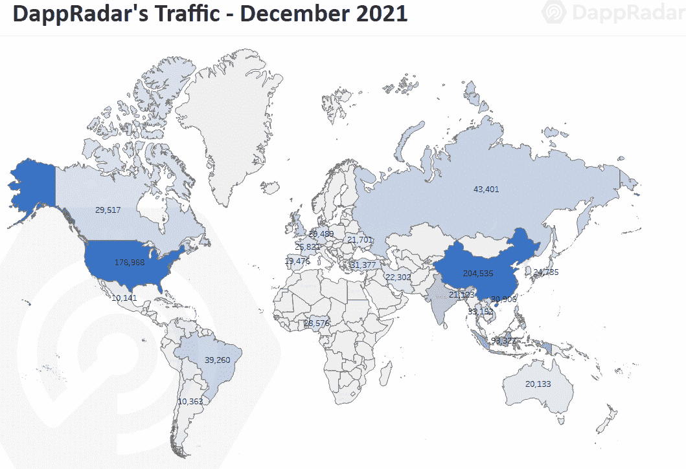
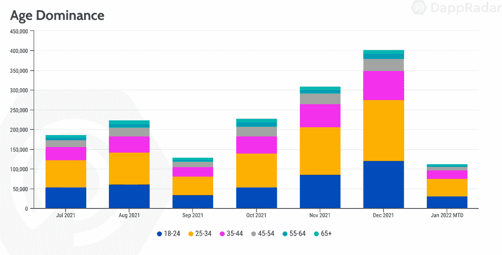
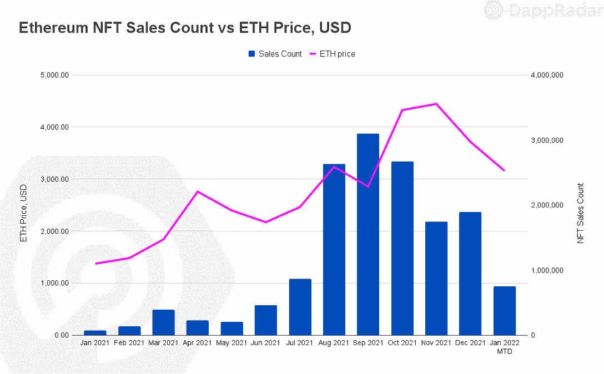
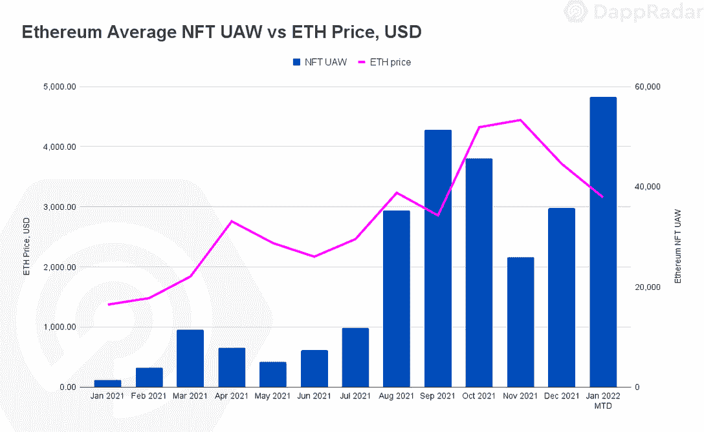
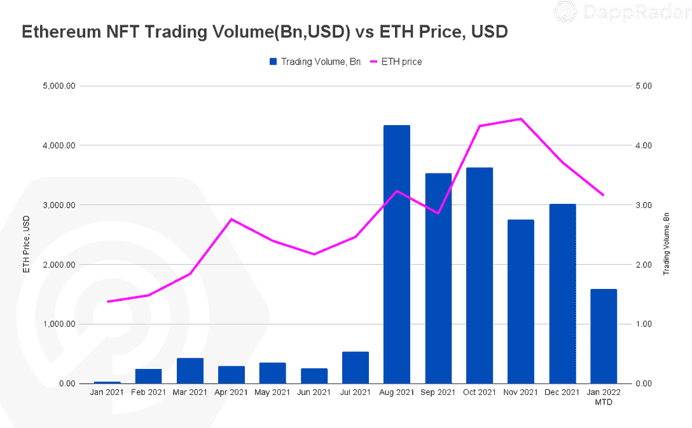
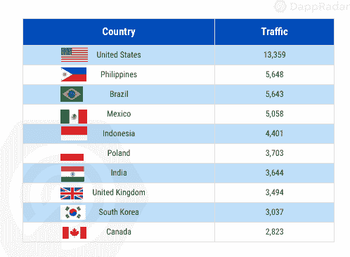
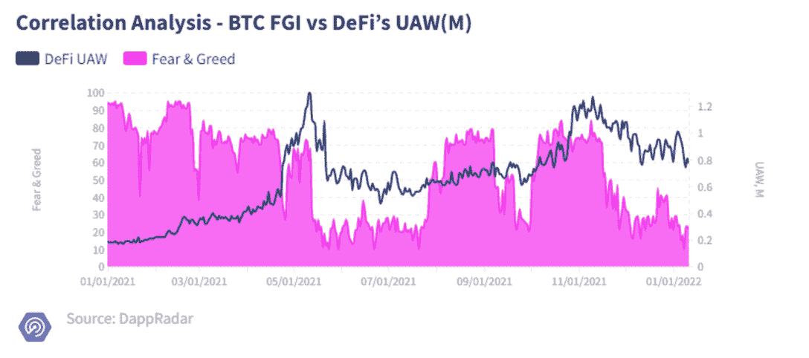
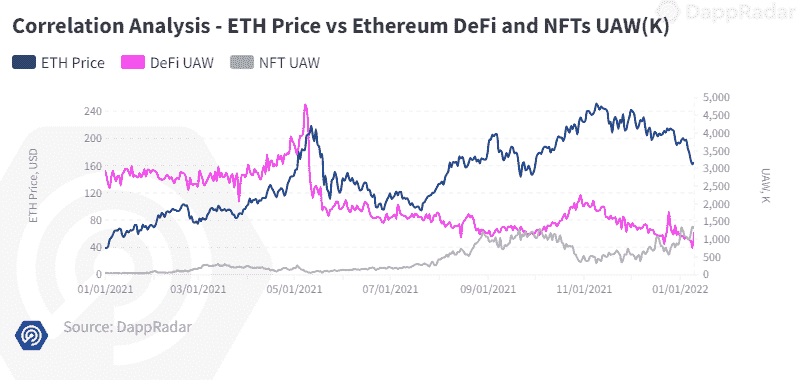
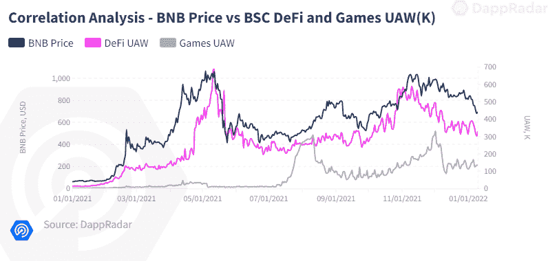
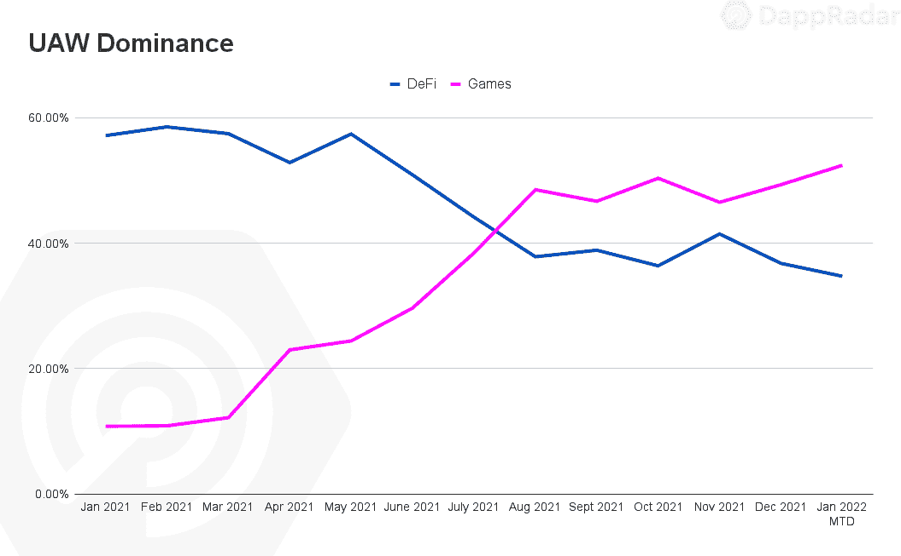

# 区块链用户行为报告——NFTs 和游戏对全球加密趋势不太敏感

> 原文：<https://web.archive.org/web/https://dappradar.com/blog/blockchain-user-behavior-report-nfts-games-less-sensitive-to-global-crypto-trends>

## 关于即将到来的一年，最新的区块链行为模式告诉了我们什么

**以下报告属于区块链用户行为报告新系列。DappRadar 的一系列报告旨在为用户提供区块链行业的不同视角，将传统的行为金融分析与区块链度量和指标相结合。该文件从区块链行业的角度分析了趋势，并确定了 DeFi、NFT 和游戏领域的模式。**

2021 年，区块链观众人数大幅增长。在这个不断发展的空间中，基本类别的趋势迎来了一批新的个人。同样，全球 Dapp 商店 DappRadar 在过去一年中的流量增长了 1028%，根据 2021 年底的数据，现在每月的访问量接近 140 万次。考虑到这些受众，我们试图确定去年最后一部分最关键的行为模式，这些模式可能会在 2022 年开始变得重要。

通过分析不同的指标，我们旨在了解区块链行业在过去几个月中的主要模式和趋势，同时尝试确定区块链协议的主要用户，这些用户支持最近围绕行业内最重要的类别形成的叙述。

在这份报告中，我们分析了全球趋势，包括人口统计和连通性分析、宏观指标和链上指标，以根据行为模式确定 2022 年的显著趋势。

## 关键要点

*   非金融交易几乎没有受到加密货币下跌的影响；自 2021 年第三季度以来，交易数量持续增长，而连接至以太坊 NFT dapps 的 UAW 增长了 43%。
*   另一方面，DeFi 中的使用与加密货币明显相关，当观察到 ETH、SOL、AVAX 和 LUNA 的历史高点时，每天有超过 125 万 UAW 连接到 DeFi dapps，而在最近的熊市趋势中，则低至 80 万 UAW。
*   尽管最近 cryptos 出现了负面趋势，但区块链游戏仍继续被广泛使用。游戏占行业使用量的 52%，这加大了与 DeFi dapps 的使用量差距。
*   中国现在是流量的领导者，与 2021 年 11 月相比增长了 166%。2021 年，美国在流量方面占据主导地位。

## 目录

*   [亚洲足迹在整个行业变得越来越明显](https://web.archive.org/web/20221109054510/https://dappradar.com/blog/blockchain-user-behavior-report-nfts-games-less-sensitive-to-global-crypto-trends/#The-Asian-footprint-is-becoming-increasingly-visible-across-the-industry)
    *   游戏的好消息:千禧一代和新生代主宰了区块链的生活
*   [NFT 和游戏被证明比 DeFi 更能抵御加密货币](https://web.archive.org/web/20221109054510/https://dappradar.com/blog/blockchain-user-behavior-report-nfts-games-less-sensitive-to-global-crypto-trends/#NFTs-and-games-prove-to-be-more-resistant-to-cryptocurrencies-than-DeFi)
    *   [尽管加密数据下滑，NFT 指标仍保持飙升](https://web.archive.org/web/20221109054510/http://nft-metrics-keep-soaring-despite-the-crypto-slump/)
    *   【DeFi 和宏观指标之间的强相关性
    *   [区块链游戏采用保持稳定](https://web.archive.org/web/20221109054510/https://dappradar.com/blog/blockchain-user-behavior-report-nfts-games-less-sensitive-to-global-crypto-trends/#Blockchain-game-adoption-remains-steady)
*   [结论](https://web.archive.org/web/20221109054510/https://dappradar.com/blog/blockchain-user-behavior-report-nfts-games-less-sensitive-to-global-crypto-trends/#Conclusion)

## 在整个行业，亚洲的足迹正变得越来越明显

截至 2021 年底，dapp 行业吸引了超过 250 万个每日独立活跃钱包(UAW)。这一使用水平比去年增长了 707%。该行业的快速增长是由不同的兴趣波维持的，主要源于 NFT 和游戏。

通过分析来自 DappRadar 12 月 140 万访客的流量，我们看到了基于当前人口统计分析的令人兴奋的趋势，这可能会与我们去年看到的不同地塑造该行业。

首先，中国现在是拥有最广泛用户基础的国家。他们拥有超过 204，000 名用户，比 11 月份的注册人数增加了 166%。来自印度尼西亚和印度的流量值得一提，因为这两个国家在过去的一个月里流量增加了一倍多。整体而言，亚洲市场继续扩大其在行业中的影响力。亚洲地区对区块链奥运会有着浓厚的兴趣，也有举办非功能性赛事的潜力，因此无疑是一个需要密切关注的地区。

美国不再是主要的交通来源，现在仅次于亚洲。尽管如此，美国的流量增长了 38%，拥有超过 175，000 名用户，它仍然是 NFT 收藏品最重要的市场。

英国、俄罗斯、菲律宾和巴西输给了印度，但仍吸引着观众。来自这四个国家的流量超过 168，000 个用户，平均增长约 30%，其中俄罗斯的增长最为显著。

### 游戏的好消息:千禧一代和新生代主宰了区块链

继续进行人口统计分析，我们关注年龄范围，以获得更多关于对区块链感兴趣的观众的信息。新生代(18-24 岁)涉足这一领域的速度继续加快。去年 12 月，DappRadar 的流量中有 30%来自这个年龄段的用户，而在 2021 年的大部分时间里，他们的出现率徘徊在 26%左右。千禧一代的主导地位也遵循同样的路线，占流量的 38%，略高于去年大部分时间观察到的 36%。

另一方面，最明显的下降是在 45 至 54 岁的人群中，这一比例从 2021 年 1 月的 11.5%下降到 12 月的 7%。随着千禧一代对 NFT 和游戏等类别表现出浓厚的兴趣，这两个类别的未来都很光明。

在分析首选连接设备时，会出现另一个令人兴奋的指标。尽管由于推出了 RADAR token 而接待了相当多的访客，但用户仍然有大约 53%的时间通过移动设备进行连接。虽然大多数用户出于安全原因更喜欢使用桌面版本的钱包，但桌面设备只带来了 46%的流量。这可能会导致一个至关重要的行为趋势，随着今年区块链奥运会的到来，这一趋势可能会变得更加重要。这一趋势需要密切关注，因为移动钱包(如 Ronin)和移动区块链游戏预计将在 2022 年实现巨大飞跃。

## 事实证明，NFT 和游戏比 DeFi 更能抵御加密货币

在过去的一年里，最重要的区块链指标在 dapp 的三个主要类别中爆发 DeFi 中的 TVL、NFT 中的交易量和游戏中的使用量，人们感觉市场终于准备起飞了。尽管如此，最新的 COVID 飙升、美联储即将加息的意图以及哈萨克斯坦的天然气问题等宏观经济事件影响了近五分之一的比特币开采活动。加密货币市场发现自己再次陷入周期性熊市趋势。

本节分析了相关的区块链宏观指标，如主要加密货币的价格、以太坊的天然气价格或比特币的恐惧和贪婪指数如何影响连锁指标。宏观指标对区块链消费者的行为有多重要？

### 尽管加密数据下滑，NFT 指标仍保持飙升

在 2021 年第三季度，NFTs 产生了 107 亿美元的交易。在 2022 年的前十天，第四季度 119 亿美元的季度已经看起来很强劲。另一方面，自去年 11 月达到 4878 美元的历史高点以来，ETH 的价格一直未能找到支撑，截至本文撰写之时已下跌近 30%。尽管加密货币周期波动较大，但 NFT 保持着停滞不前的积极趋势。

不仅 NFT 在以太坊的销售额增加了，而且连接到 NFT dapp(收藏品和市场)的 UAW 的数量也增加了。自去年 12 月以来，平均有 46，800 个 UAW 连接到以太坊 NFT dapp，比第三季度的数字高出 43%。

尽管宏观指标不佳，但非正规金融机构在元宇宙和先玩后赚叙事中扮演的不可否认的角色主要促成了积极的连锁指标。此外，已建立的项目不断满足其各自的项目目标，在此过程中增强其社区的前景。再加上永无止境的名人和大品牌进入该领域，NFT 看起来一如既往地坚实。

此外，对完全可互操作的元宇宙的研究只支持 NFT。社区正在团结起来，不同的社区驱动的替代方案，如最近推出的 looks rare market place(T1)已经加强了 NFT 的市场。由于这种资产的前景无可否认地强大，个人可能会将加密货币的负面趋势视为买入机会，因为基础资产的价值，在这种情况下，以太，会降低 NFT 的实际价格。尽管这种资产的价格有所下降，但以美元计算的交易量保持了这一速度。

最后，将 NFT 视为收藏品，美国仍然是最活跃的地区。到目前为止，美国领先于 NFT，巴西和墨西哥位列前四。对体育、时尚和名人的巨大兴趣在地球的那一边转化为对 NFT 空间越来越大的兴趣。

### DeFi 和宏观指标之间的强相关性

尽管落后于区块链游戏和 NFTs，DeFi 空间的价值在 2021 年底达到了历史最高水平。在包括有吸引力的流动性挖掘项目在内的大量强大替代方案的推动下，这一类别的竞争规模显著扩大。然而，没有其他垂直行业比 DeFi 受加密货币的影响更大，因此将宏观指标与 DeFi 的链上指标结合起来可能会提供一些关于行为趋势和模式的线索。

虽然相应的基础资产对这些区块链中锁定的总价值(TVL)有很大影响，但其用途却不会。将比特币的恐惧和贪婪指数(FGI)等宏观指标与行业使用水平相关联，表明 DeFi 严重依赖加密模式。值得注意的是，FGI 是一种广泛用于加密货币交易的分析工具，用于测量市场情绪，范围从 0 到 100，从非常恐惧(0)到非常贪婪(100)。

以下两个图表显示了 FGI、整个行业中测得的 UAW 数量和仅连接到 DeFi dapps 的 UAW 数量之间的相关性。与整个 dapp 行业相比，这两个变量之间没有明显的相关性。如前所述，NFT 的行为独立于加密货币，并受其宏观趋势(效用、成熟度、用例等)的影响。).区块链奥运会也是如此。然而，在 DeFi 中，情况就不同了，在 DeFi 中，用法和价值观紧密相连。

详细观察 FGI 和 DeFi 用户之间的相关性，我们可以看到 DeFi 的使用量如何在 11 月达到 125 万 UAW 的历史最高水平，分别与 AVAX、SOL 和 LUNA 的历史最高水平保持一致。随着年底市场降温，使用量再次降至 100 万 UAW 以下。

当分析 TVL 的三种主要区块链及其底层本地加密货币时，也会发生类似的情况。从以太坊开始，ETH 的价格并没有像预期的那样与 NFTs 的使用相关。如前所述，非功能性测试的使用取决于其他外部因素。而另一方面，可以利用 DeFi 中的用法绘制一些模式，因为它与其基础令牌的价格存在轻微但可见的相关性。

在 BSC 上，这种情况类似于游戏和 DeFi 中的用法，以及它们各自与 BNB 价格的关系。与 BSC DeFi dapps 相关的 UAW 遵循与 BNB 价格相似的轨迹。再次显示了 DeFi 与其原生加密货币成本之间的相关性。同时，游戏的使用与 BNB 的价格无关。虽然 BSC 游戏依赖于游戏的原生令牌，但它们更多地从微观角度表现，例如，技能或珠宝等特定令牌只会影响其主机 dapp 的使用。

最后一个例子是 Solana，其基础资产 SOL 的价格在生态系统中使用 DeFi dapps 时再次拥有坚定的发言权。相比之下，NFTs 在该网络中的使用再次证明了 DeFi 中的用户行为严重依赖于加密货币市场。

### 区块链游戏的采用保持稳定

DeFi 和 NFT 遵循两条不同的路径。就 DeFi 而言，宏观经济指标在该类别的使用中发挥着重要作用。而非上市公司似乎更加独立，他们的宏观事件(回顾微观经济事件)独立地影响着他们的市场。同样的情况也适用于区块链奥运会。

去年，我们见证了区块链游戏的快速增长和采用，这要归功于像“为了挣钱而玩”或“元宇宙”这样的故事。就像在 NFTs 中一样，这些趋势从外部影响他们的用户和他们的行为。在这种情况下，围绕这两个故事的积极情绪使人们想参与区块链游戏。

2021 年夏天，我们看到游戏整合成为使用最多的 dapp 类别，超过了 DeFi。在第三季度的大部分时间里，直到第四季度中期，这两种类型的 dapp 在整个行业中都占据着主导地位。几乎占整个行业使用量的 90%。然而，在加密货币的负面趋势中，DeFi 的使用开始减少。自 11 月以来，游戏和 DeFi 之间的使用差距越来越大，游戏现在占行业活动的 52.4%，而 DeFi 的使用优势已降至 34.7%。相比之下，游戏和 DeFi 分别占行业使用活跃度的 46.5%和 41.4%。

毫无疑问，区块链游戏每个月都吸引了更多的用户，极大地扩大了玩家基础。随着广泛预期的游戏赚取和 GameFi 选项将于 2022 年到来，我们可以预计游戏类别将在 2022 年继续推动该行业的使用。

## 结论

行为模式很有洞察力，有助于描绘未来几个月可能塑造行业的趋势。人口统计分析揭示了人们对亚洲市场日益增长的兴趣。他们对游戏和 NFT 的兴趣明显增加。年龄和设备分析也有助于监控短期内的潜在需求。

此外，结合宏观指标和链上指标也可以提供行为模式。在这种情况下，我们可以独立于以一般方式影响行业的因素，如全球加密货币趋势和其他相关指标，来观察 NFT 和游戏的行为。NFTs 和区块链游戏在 2021 年都表现强劲，而且这一趋势似乎将持续下去。尤其是当考虑到即将到来的项目发布和两端的潜在用例时。虽然加密货币的价格本质上是不稳定的，但区块链游戏和非加密货币的采用、数量和使用只会不断增加。观察这两个市场的到期是否会对其标的价格产生敏感性，将是一件有趣的事情。

与此同时，在加密货币波动的支持下，DeFi 将继续反弹。不应将它与空间的光复相混淆。毫无疑问，与一年前相比，DeFi 的前景更加完整和成熟，但与同行相比，它面临着几个更重大的挑战。除了宏观指标、法规的负担，还有来自传统受众的阻力。领养会起到一定作用。

 NewsletterUnsubscribe at any time. [T&Cs](https://web.archive.org/web/20221109054510/https://dappradar.com/terms) and [Privacy Policy](https://web.archive.org/web/20221109054510/https://dappradar.com/privacy-policy)