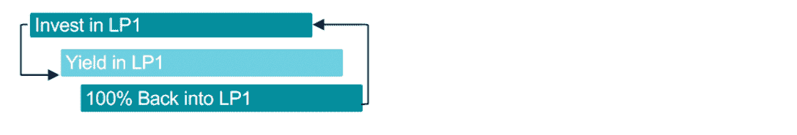
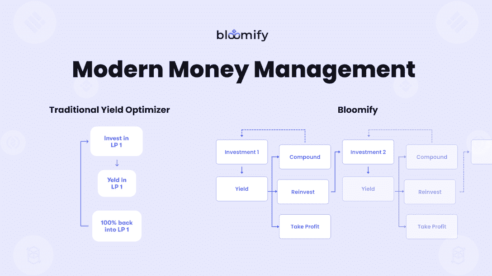
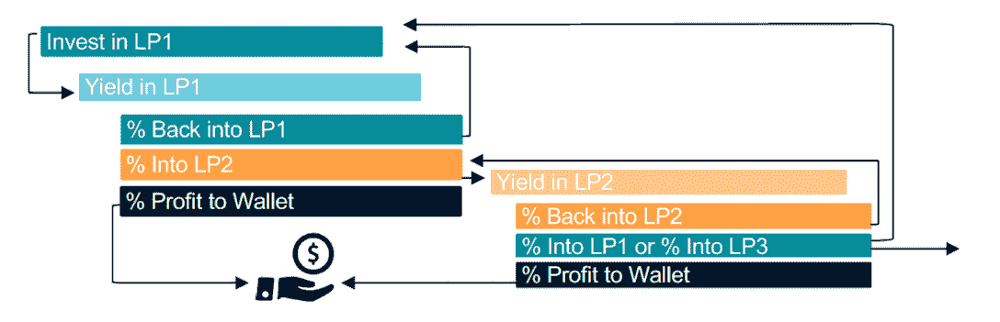
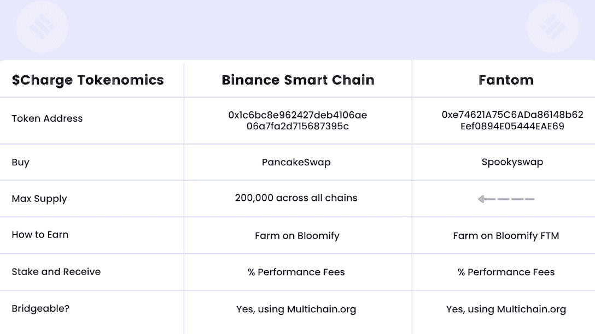
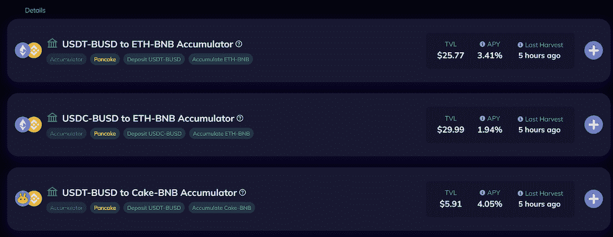
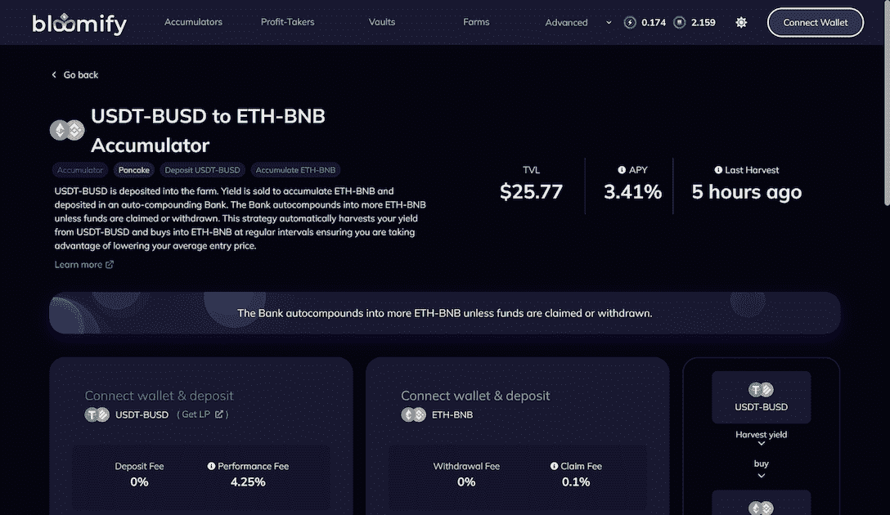

# Bloomify:简化复杂的定义策略

> 原文：<https://web.archive.org/web/https://dappradar.com/blog/bloomify-complex-defi-strategies-made-easy>

## 使用 Bloomify 释放 DeFi 潜力的终极指南

**Bloomify 是一款独特的 DeFi yield 优化程序，允许用户通过各种策略进行下注。Bloomify 与传统收益率优化器的不同之处在于，它允许用户从易于使用的预设选项中进行选择，这些选项侧重于累积、获利或包括多协议定制在内的更高级策略。这为用户提供了更高水平的灵活性和敏捷性。**

**内容**:

*   [什么是 Bloomify？](https://web.archive.org/web/20221128112053/https://dappradar.com/blog/bloomify-complex-defi-strategies-made-easy/#what)
*   [为什么 Bloomify 独一无二？](https://web.archive.org/web/20221128112053/https://dappradar.com/blog/bloomify-complex-defi-strategies-made-easy/#why)
*   [传统 vs. Bloomify](https://web.archive.org/web/20221128112053/https://dappradar.com/blog/bloomify-complex-defi-strategies-made-easy/#vs)
*   [Bloomify 的 tokenomics 解释了](https://web.archive.org/web/20221128112053/https://dappradar.com/blog/bloomify-complex-defi-strategies-made-easy/#token)
*   [如何开始使用 Bloomify？](https://web.archive.org/web/20221128112053/https://dappradar.com/blog/bloomify-complex-defi-strategies-made-easy/#how)
*   使用 Bloomify 需要付费吗？

[分散金融(DeFi)](https://web.archive.org/web/20221128112053/https://dappradar.com/defi) 是一项突破性的技术，允许任何人通过互联网连接使用金融服务，而无需获得批准。值得注意的是，赌注、产量农业、流动性开采和其他 DeFi 产品极大地丰富了用户可用的金融工具。

然而，随着 DeFi 用户的成熟，他们需要更灵活、更可控的投资工具和平台来应对更复杂的投资需求。这也是 [Bloomify](https://web.archive.org/web/20221128112053/https://bit.ly/3V9rJyY) 出现的原因。

## 什么是 Bloomify？

[Bloomify](https://web.archive.org/web/20221128112053/https://bit.ly/3V9rJyY) 是下一代 DeFi yield 优化平台。它使用户能够执行复杂的 DeFi 策略，并构建灵活的 DeFi 资产组合。那么 Bloomify 是如何授权用户做到这一点的呢？

简而言之，它允许用户选择(并最终创建自己的)多层获利和再投资策略，包括流动性池(LP)、农场等。在后面的章节中，我们将描述 Bloomify 的多层获利回吐和再投资策略是如何工作的。

对于那些不熟悉 DeFi 的人，你可以阅读 [DappRadar 的分步指南，了解如何开始使用 DeFi。](/web/20221128112053/https://dappradar.com/blog/what-is-defi-and-how-can-i-save-money-with-it/)

## 为什么 Bloomify 是独一无二的？

Bloomify 允许用户投资多层策略，而不是简单的自动复利。这是什么意思？

Bloomify 平台让用户能够从流动资金池(LP)中提取一定比例的收益作为利润放回钱包，将一部分再投资到该 LP，然后将剩余部分存入另一个农场或不同的 LP。

在上述机制的执行过程中，有两个重要的角色在发挥作用:累积者和获利者。这些功能可以帮助用户积累利润，取出这样的“闲钱”，自动复合成更多的代币。整个过程是完全自动化的，并分摊天然气成本。

多亏了 Bloomify，用户现在可以控制如何分配他们的回报，从而实现更多样化的投资策略。此外，一旦建立了复杂的策略，用户就可以随心所欲地运行它们。它再次显示了 Bloomify DeFi 平台的用户友好性和灵活性。

[Check out Bloomify](https://web.archive.org/web/20221128112053/https://bit.ly/3V9rJyY)

## 传统与 Bloomify

传统的收益优化者通过投资代币或 LP 来赚取利润。之后，他们将 100%的本金和复利再投资到初始投资中，如下所示。

这种不灵活的策略阻止了用户从他们的投资中自由获取利润。再者，用户一次只能投资一个代币或 LP。然而，值得注意的是，负责任的获利回吐保持了生态系统的健康，并激励用户明智地投资。

是什么让 Bloomify 从其他 DeFi 平台中脱颖而出？Bloomify 上的累加器和获利者等创新的 DeFi 产品可以在很大程度上拉平用户的学习曲线，同时提高他们的收入效率。

[Experience Bloomify now](https://web.archive.org/web/20221128112053/https://bit.ly/3V9rJyY)

累加器是一个帮助用户将他们的“闲钱”(利润)转化为更多收益的功能。在用户存入他们的 LP1 代币之后，累加器将使用来自 LP1 的收益来累加 LP2。然后累积的 LP2 定期自动复利，帮助用户在不使用新鲜资金的情况下，在奖励的 LP 中获得一个位置。

另一个简化用户 DeFi 体验的特征是获利者。简而言之，他们自动从 LP 中取出收益，放入银行的稳定 LP 中。从那里开始，它自动组合成更多的马厩。这类似于银行的定期存款，保护资金，同时为用户提供稳定的回报。

此外，由于先进的策略，Bloomify 为 DeFi 体验带来了极大的自由和灵活性。具体来说，该功能允许用户按照定制的百分比分割投资利润，例如将利润返还给他们的钱包，并重新投资于初始令牌或 LP。此外，它还允许用户将他们获得的利润投资到第二个令牌或 LP 中。

最重要的是，Bloomify 允许用户决定投资周期，允许他们根据自己的喜好选择何时以及多久运行一次他们的策略。系统将用户的策略打包成“块”。

这样，用户可以自定义这些策略块的重复次数，而不只是让它们在一个闭环中运行。此外，如下图所示，用户可以将该机制应用于多个项目和投资产品。

## Bloomify 的记号经济学解释说

Bloomify tokenomics 拥有双令牌经济、收费和静态。Charge 是一个平台代币，所有连锁店限量供应 20 万个。用户可以持有充电代币，并将其作为赌注，以赚取平台收入的一部分。

Static 是一个实用程序令牌，最大供应量为 529，028.67。用户可以在高级策略上支付折扣费用，这些策略通常由具有更多 DeFi 经验的用户设定。

用户可以通过在 [Bloomify](https://web.archive.org/web/20221128112053/https://bit.ly/3V9rJyY) 上耕作来赚取充电代币。此外，用户可以下注来获得静态令牌，这是目前获得静态令牌的唯一方法。

这两个令牌都可以直接从 PancakeSwap 和 SpookySwap 获得。下图直观地概述了 Bloomify 的 tokenomics。

## 如何开始使用 Bloomify？

要开始体验 Bloomify 的功能，用户必须导航到 [Bloomify 网站](https://web.archive.org/web/20221128112053/https://bit.ly/3V9rJyY)并点击“连接钱包”。在选择策略之前，用户应该注意不同的资产、平台和每个平台上的盈利标签。然后，用户可以调整滑块来改变利润，重新投资到最初的农场，和/或将利润分成另一个农场。

有关详细说明和常见问题，用户可以在本页找到更多有关如何使用 Bloomify [的信息。此外，用户可以通过](https://web.archive.org/web/20221128112053/https://docs.bloomify.co/intro/bloomify/bloomify-how-to/advanced-strategies/create-+-run-strategy) [Telegram](https://web.archive.org/web/20221128112053/https://t.me/bloomify_community) 和 [Discord](https://web.archive.org/web/20221128112053/https://discord.com/invite/TDFHtWj7b5) 联系 Bloomify 团队获得进一步支持。

## 使用 Bloomify 需要付费吗？

由于 Bloomify 是在区块链上运行的应用程序，因此交易时会向这些区块链支付汽油费。这包括批准代币、创建合同、批准交易等。这些是使用链上的本地令牌支付的标准成本(BSC 使用 BNB，Fantom 使用 FTM)，并且汽油成本根据网络的流量而变化。

除了在 Bloomify 上参与策略，该平台还向用户收取绩效费，约为 4.25%。但是，这可能因具体条件而异。最后，用户存款不收手续费，但提现要收 0.1%的手续费。

希望更深入了解 Bloomify DeFi 体验的用户也可以访问以下频道。

[网站](https://web.archive.org/web/20221128112053/https://bit.ly/3V9rJyY)

[白皮书](https://web.archive.org/web/20221128112053/https://www.bloomify.co/bloomify_whitepaper.pdf)

[文档页面](https://web.archive.org/web/20221128112053/https://docs.bloomify.co/intro/bloomify)

[推特](https://web.archive.org/web/20221128112053/https://twitter.com/BloomifyApp)

[电报](https://web.archive.org/web/20221128112053/https://t.me/bloomify_community)

[不和](https://web.archive.org/web/20221128112053/https://discord.com/invite/TDFHtWj7b5)

[Youtube](https://web.archive.org/web/20221128112053/https://www.youtube.com/channel/UCi60sDOAOOMS7UrXLrsuk_Q/featured)

**免责声明** —这是一篇赞助文章。DappRadar 不认可本页面上的任何内容或产品。DappRadar 旨在提供准确的信息，但读者应该在采取行动之前总是自己做研究。DappRadar 的文章不能被认为是投资建议。