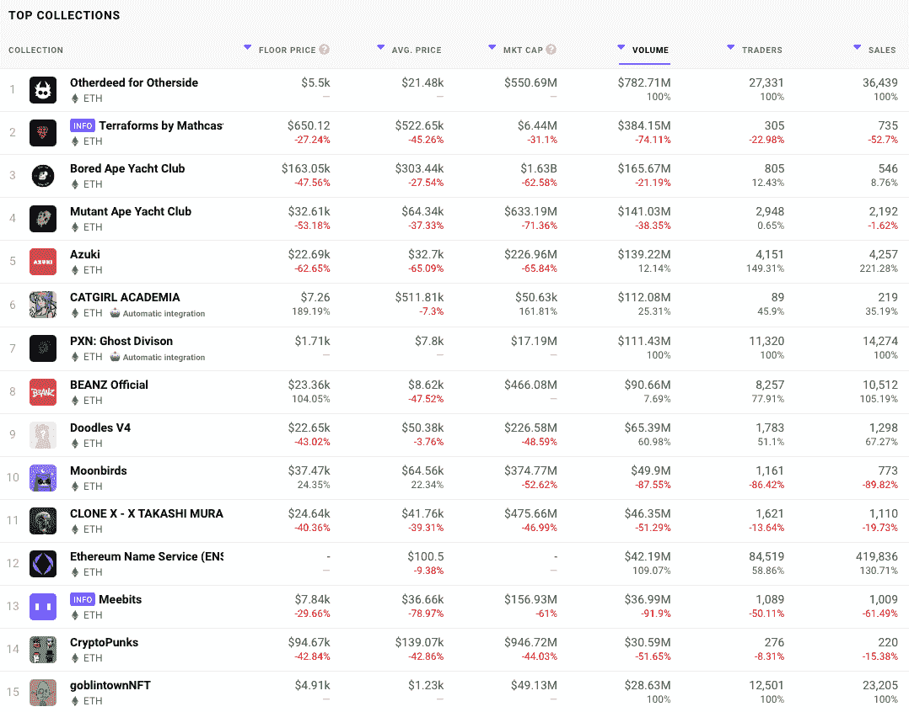
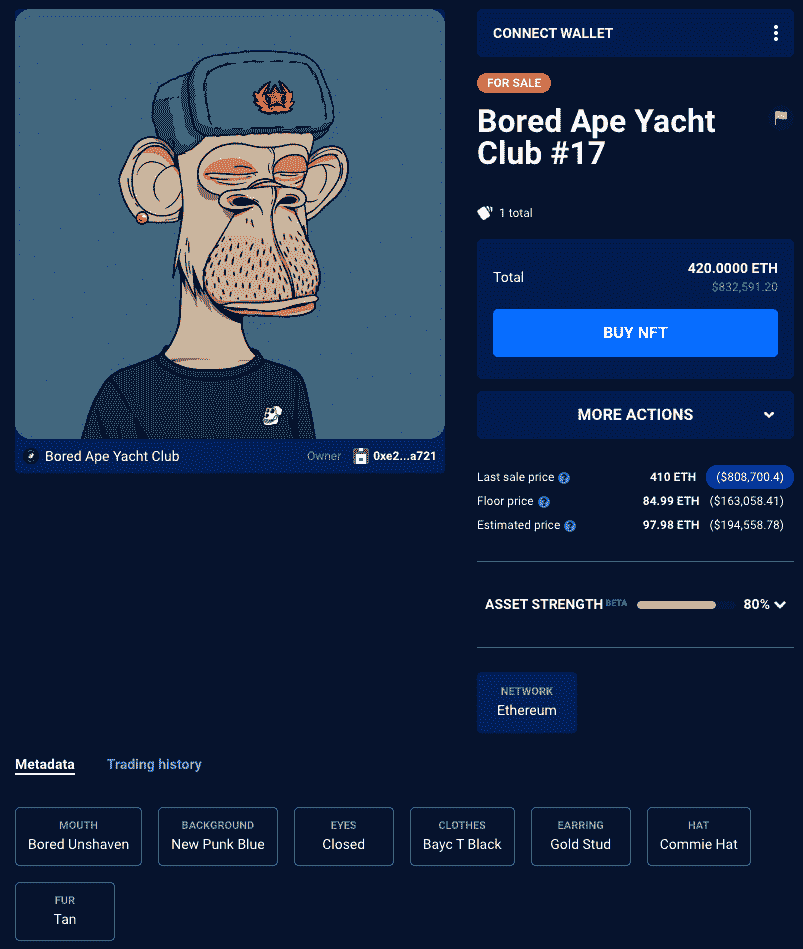
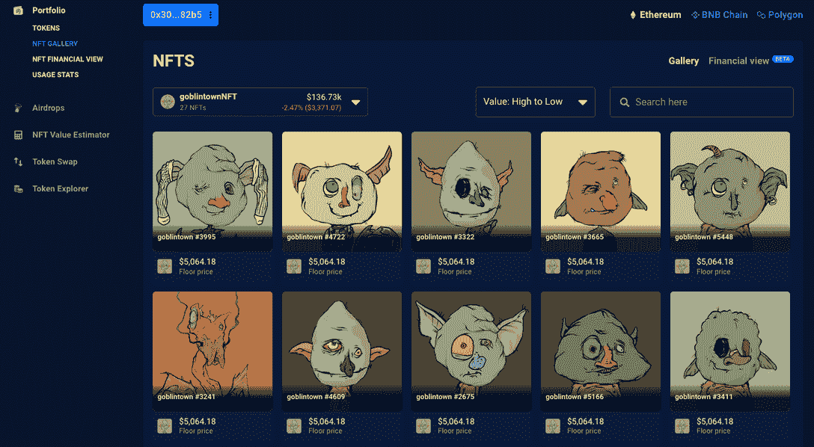

# 由于哥布林镇激增，蓝筹股 NFT 收藏价值损失 50%

> 原文：<https://web.archive.org/web/https://dappradar.com/blog/blue-chip-nft-collections-loose-50-value-as-goblin-town-surge>

## 由于新货抢尽风头，知名系列缩水 50%

CryptoPunks、Bored Ape Yacht Club (BAYC)和 Doodles 等蓝筹 NFT 收藏在过去 30 天里市值蒸发了近一半，而 Goblin Town WTF 等免费收藏则席卷了排行榜。所谓的蓝筹 NFT 数据显示，关键指标、底价和市值在过去一个月有所下降。

随着市场继续波动，一些蓝筹股 NFT 藏品的底价和市值出现下滑，一些最知名的藏品价值减半。[关键的以太坊 NFT 项目](https://web.archive.org/web/20220705004458/https://dappradar.com/nft/collections)如 CryptoPunks、BAYC、变种人猿游艇俱乐部(MAYC)和[月鸟在过去 30 天里都下跌了](https://web.archive.org/web/20220705004458/https://dappradar.com/ethereum/collectibles/moonbirds)大约 50%。

要记住的一件事是，以太坊的 NFT 几乎总是以 ETH 定价，以太坊的价值在过去 30 天里下跌了 28%以上。这意味着，除非卖家改变价格，以应对以美元计价的 ETH 价格下跌，否则这些藏品的有机价值将下降近 30%。

## 蓝筹 NFT 收藏

MAYC 受到的冲击最大，截至发稿时，该市的最低房价已下跌逾 53%，至 3 万美元左右。最受欢迎的无聊猿游艇俱乐部下降了 47%至 163，000 美元，T2 的神秘朋克俱乐部下降了 42%至 95，000 美元。过去一个月上涨的一个系列是 Moonbirds，上涨了近 25%，写作时的底价约为 37，000 美元。

尽管 Moonbirds 的底价上涨，但其市值却下降了 52%，至 3.74 亿美元。其他人的写作也出现了大幅下降，损失最大的是 MAYC 系列，下降了 71%以上，至 6.33 亿美元以下，而 BAYC 和 CryptoPunks 分别下降了 62%和 44%。

尽管数量下降，但这些蓝筹藏品仍在过去 30 天的 NFT 顶级拍卖中占据主导地位，其中最贵的是 5 月 5 日以 410 ETH 的价格售出的 [BAYC NFT，在拍卖当天价值约 120 万美元，现在价值略高于 80 万美元。](https://web.archive.org/web/20220705004458/https://dappradar.com/hub/assets/eth/0xbc4ca0eda7647a8ab7c2061c2e118a18a936f13d/17)

## WTF 是妖精镇

虽然这些蓝筹股藏品能够驾驭市场动荡，并在很大程度上保持价值，但新的藏品源源不断地涌入，让渴望收藏的人免费造币。当然，还有汽油费要付，但在写作时大约是 50 美元。

一个不知道从哪里冒出来的系列，几乎没有营销、宣传，甚至没有影响者的参与，就是[哥布林镇](https://web.archive.org/web/20220705004458/https://dappradar.com/nft)。这 9999 个地精头像的收藏于 5 月 22 日落下，已经超过了近 5000 美元的底价，在过去一周内价值一再翻倍。

[哥布林镇目前是过去 30 天内交易量第 15 大的 NFT 系列](/web/20220705004458/https://dappradar.com/blog/what-is-goblin-town/)，市值超过 4900 万美元，底价为 4910 美元。它骄傲地坐落在村上[、维友 V2 和许多其他知名收藏之上。对于一个通过告诉买家“没有路线图”而推出的系列来说，这还不错。没有不和。没有效用。”](https://web.archive.org/web/20220705004458/https://dappradar.com/nft)

自推出以来，最高销售额是为可以说是最稀有的妖精，一个名为[Crustybutt Da Goblin King](https://web.archive.org/web/20220705004458/https://dappradar.com/hub/assets/eth/0xbce3781ae7ca1a5e050bd9c4c77369867ebc307e/8995)、**T3 的一对一妖精，售价为 69.42 ETH，5 月 5 日约为 13 万美元。[看看买家的钱包](https://web.archive.org/web/20220705004458/https://dappradar.com/hub/wallet/eth/0x304d85e7041061666cc94a9ebf67750dcfe782b5/nfts/1/goblintownnft)发现了 27 个地精镇 NFT 的健康收藏，写作时总价值约为 136，000 美元。**

## NFT 继续令人惊讶

哥布林镇收藏显示，虽然加密价格可能会下降，一些投资者可能会抛售，但人们对非加密技术有强烈的兴趣来盈利。这些收藏品流行的性质有时令人困惑，因为在营销方面投资很少的项目可以迅速抓住买家的想象力。

随着人们从 NFT 收藏中寻找实用工具，STEPN 等 dapps 和 Lympo 等传统应用找到了合适的市场，赚钱热潮也受到了沉重打击。尽管广受欢迎的“移动赚钱”NFT 游戏(占其中国用户的 5%)因遵守中国法规而被禁止在 app store 中使用，但 [STEPN](/web/20220705004458/https://dappradar.com/blog/what-is-move-to-earn/) 的创始人表示，此举不会对公司的财务产生实质性影响。与此同时，在 ICO 时代率先提出“移动挣钱”理念的公司[开始重新露面](https://web.archive.org/web/20220705004458/https://app.lympo.io/)，并在对“移动挣钱”的新兴趣中重建他们的团队。

 NewsletterUnsubscribe at any time. [T&Cs](https://web.archive.org/web/20220705004458/https://dappradar.com/terms) and [Privacy Policy](https://web.archive.org/web/20220705004458/https://dappradar.com/privacy-policy)

***以上不构成投资建议。此处给出的信息仅供参考。请行使尽职调查，做你的研究。作者持有多种加密货币的头寸，包括 BTC、瑞士法郎和雷达。***

[<picture></picture>](https://web.archive.org/web/20220705004458/https://dappradar.com/blog/what-are-non-fungible-tokens-nfts)[<picture></picture>](https://web.archive.org/web/20220705004458/https://dappradar.com/nft/marketplaces)[<picture></picture>](https://web.archive.org/web/20220705004458/https://dappradar.com/nft/sales)