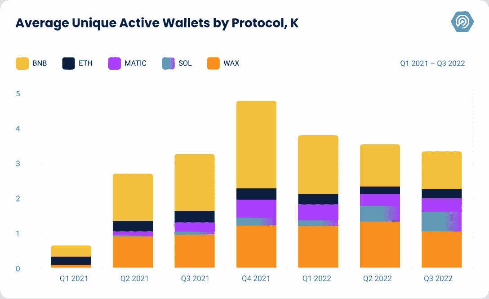
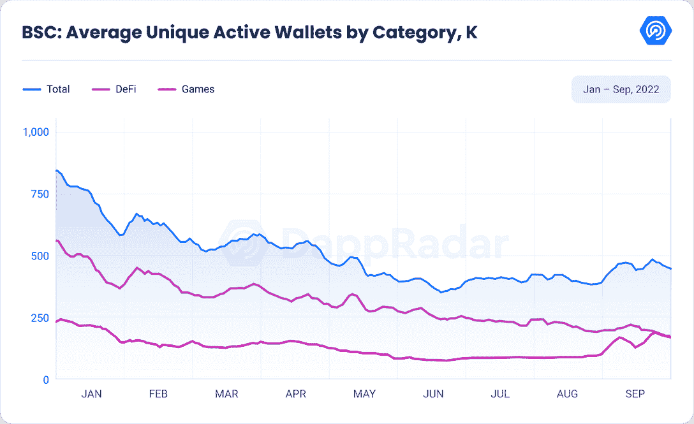
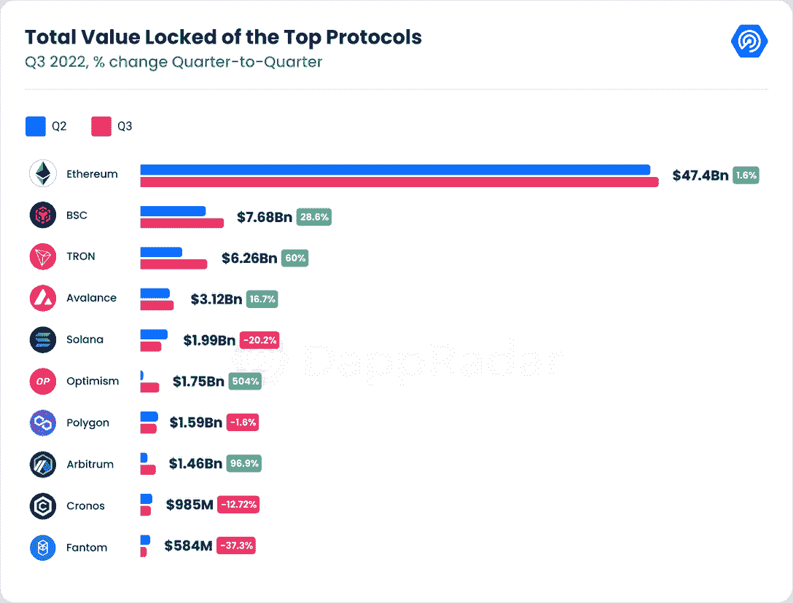
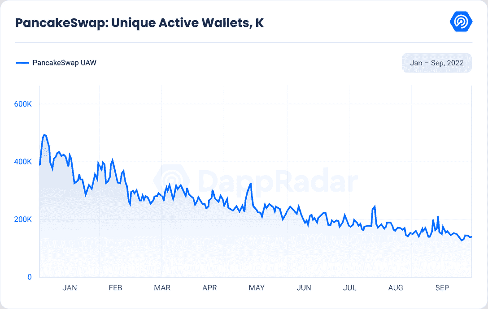
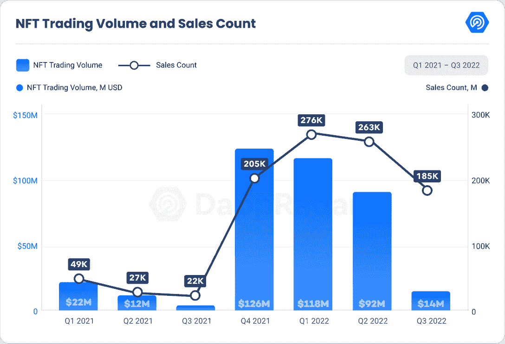
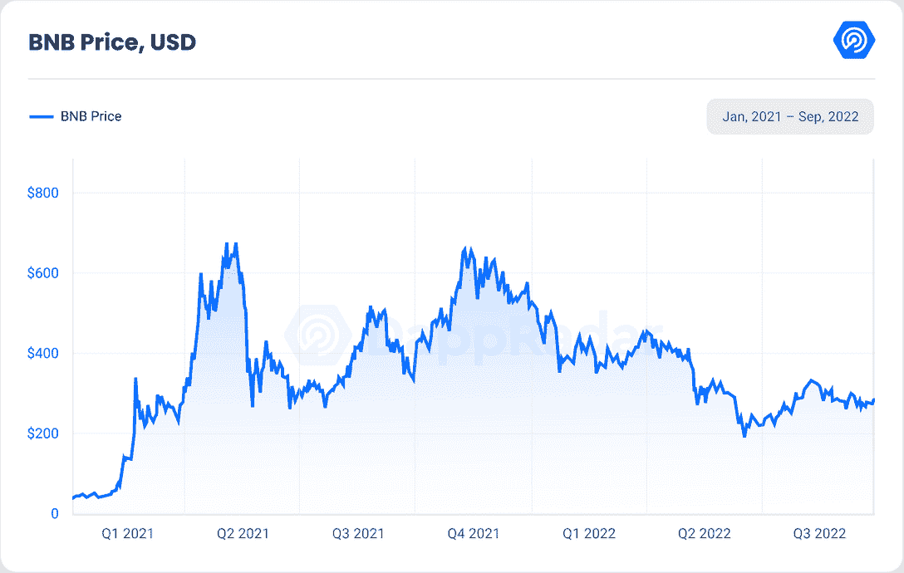

# BNB 连锁报告 2022 年第三季度

> 原文：<https://web.archive.org/web/https://dappradar.com/blog/bnb-chain-report-q3-2022>

## BNB 连锁店平均拥有 427，134 台 UAW，占所有 UAW 的 20.26%，是最活跃的区块链之一。

2022 年第三季度对 BNB 连锁店来说是一个伟大的季度，就总价值锁定(TVL)而言，它仍然是区块链最大的 DeFi 之一，仅次于以太坊。BNB 也是一个流行的链，本季度它成为最受欢迎的协议，在平均每日唯一活跃钱包活动(UAW)方面，超过了 WAX。

[PancakeSwap](https://web.archive.org/web/20221130144730/https://dappradar.com/multichain/defi/pancakeswap) 仍然是 BNB 连锁店最常用的 DeFi dapp，每日 UAW 超过 16.7 万，是 BNB 成功的一个重要原因。BNB 曾经领先的游戏，如 [MOBOX](https://web.archive.org/web/20221130144730/https://dappradar.com/binance-smart-chain/games/mobox-nft-farmer) 和 [BombCrypto、](https://web.archive.org/web/20221130144730/https://dappradar.com/binance-smart-chain/games/bomb-crypto)继续走下坡路。这些 dapps 已经被 BNB 最受欢迎的游戏 [Era7](https://web.archive.org/web/20221130144730/https://dappradar.com/binance-smart-chain/games/era7-game-of-truth) 和 [Tiny World](https://web.archive.org/web/20221130144730/https://dappradar.com/binance-smart-chain/games/tiny-world) 所取代，前者日均无人机数量为 23625 架，后者是本季度增长最快的游戏，在 UAW 增长了 800%。

在这份报告中，我们分析了 2022 年第三季度 BNB 链条的在链数据。

# **关键要点**

*   2022 年 10 月 10 日，币安交易所现货日均成交量为 144.6 亿美元，期货日均成交量为 479.7 亿美元。
*   BNB 链是最活跃的区块链，平均 427，134 UAW，占所有无人机的 20.26%。
*   第三季度，BNB 是第二大 DeFi 连锁店，TVL 为 76 亿美元，比 Q2 增长 28.67%。
*   博彩 UAW 比 Q2 增长了 2%，但仍比 2021 年第三季度的高点下降了 33%。
*   Q2 2022 年的 NFT 交易量比 2021 年第三季度增长了 232%，尽管自 Q2 2022 年以来下降了 84%。
*   PancakeSwap 仍然是 BNB 使用最多的 dapp，第三季度日均 UAW 超过 167，000 次。
*   《小小世界》是本季度增长最快的游戏，增长超过 800%。
*   自 7 月初以来，BNB 的价格已经上涨了 30.8%，并显示出复苏的迹象。

## **目录**

*   [BNB 链上最高的钱包活跃度](https://web.archive.org/web/20221130144730/https://dappradar.com/blog/bnb-chain-report-q3-2022/#Highest-wallet-activity-on-the-BNB-Chain-)
*   [DeFi 显示出复苏迹象，与 Q2 相比增长了 28.67%](https://web.archive.org/web/20221130144730/https://dappradar.com/blog/bnb-chain-report-q3-2022/#DeFi-shows-signs-of-recovery-with-a-28.67%-increase-from-Q2)
*   [煎饼互换仍然是最常用的 dapp](https://web.archive.org/web/20221130144730/https://dappradar.com/blog/bnb-chain-report-q3-2022/#PancakeSwap-still-is-the-most-used-dapp)
*   [BNB NFT 连锁店本季度交易量下降](https://web.archive.org/web/20221130144730/https://dappradar.com/blog/bnb-chain-report-q3-2022/#BNB-Chain-NFT-trading-volumes-are-down-this-quarter)
*   [BNB 链家领先最多场次](https://web.archive.org/web/20221130144730/https://dappradar.com/blog/bnb-chain-report-q3-2022/#BNB-Chain-leads-with-the-most-number-of-games)
*   [BNB 代币展望](https://web.archive.org/web/20221130144730/https://dappradar.com/blog/bnb-chain-report-q3-2022/#BNB-token-outlook)
*   [结论](https://web.archive.org/web/20221130144730/https://dappradar.com/blog/bnb-chain-report-q3-2022/#Conclusion)

## BNB 链条上最高的钱包活动

在 2022 年第三季度，BNB 连锁店已经超过了 WAX，并且拥有最多的平均每日唯一活跃钱包(UAW)。连锁店达到 427，134 UAW，这意味着与 Q2 相比减少了 8%。就年度业绩而言，与 2021 年第三季度相比，下降了 34%。

DeFi 在第三季度仍然是 BNB 链上最受欢迎的垂直市场，平均每天有 215，405 次 UAW。紧随其后的是拥有 116，210 个 UAW 的游戏，而 NFT 仍然只是一小部分，只有 6，732 个 UAW。

自上个季度以来，DeFi 和 NFT 市场分别下降了 28%和 38%。游戏是唯一增长 2%的细分市场。年度同比表现也呈同样趋势。游戏相关无人机下降了 33%，DeFi 下降了 47%，NFT 下降了 68.78%。

## DeFi 显示出复苏的迹象，来自 Q2 的销售额增长了 28.67%

在本季度，BNB 连锁店仍然是第二大 DeFi 连锁店，TVL 为 76 亿美元。这比 Q2 增长了 28.67%。

DeFi 去年飙升至新的高度，但今年早些时候 Terra 崩溃的影响仍然影响着该部门的年度业绩。比 2021 年第三季度下降了 93%。

尽管 TVL 的年度业绩有所下降，但 BNB 连锁店仍设法获得了相对于其他区块链连锁店的市场份额。第三季度，BNB 链家在 DeFi 生态系统中的 TVL 排名第二，市场份额为 10.55%，比年初的 6.6%增长了约 60%。当 TVL 流向其他 L1 如 BNB 链时，Terra 区块链的崩溃部分地促成了优势的增加。

![Top_5_DeFi_Dapps_Dominance_in_BNB_Total_Value_Locked[1]](img/faece713c353cc5def040cb07c91926d.png)

BNB 连锁店拥有超过 300 个 dapps 的新兴 DeFi 生态系统。 [PancakeSwap](https://web.archive.org/web/20221130144730/https://dappradar.com/multichain/defi/pancakeswap) 是 BNB 连锁店中最大的 DeFi dapp，在 TVL 占有大约 68.2%(41 亿美元)的份额。紧随其后的是拥有 16.3%(9.95 亿美元)份额的[金星](https://web.archive.org/web/20221130144730/https://dappradar.com/binance-smart-chain/defi/venus-protocol)，以及拥有 8.7%(5.3 亿美元)份额的[羊驼金融](https://web.archive.org/web/20221130144730/https://dappradar.com/binance-smart-chain/defi/alpaca-finance)。最后两个名额由 [BiSwap](https://web.archive.org/web/20221130144730/https://dappradar.com/binance-smart-chain/defi/biswap) 和 [Tranchess](https://web.archive.org/web/20221130144730/https://dappradar.com/binance-smart-chain/defi/tranchess-protocol) 占据，分别占 5.4%(3.28 亿美元)和 1.5%(8900 万美元)。

总的来说，自今年年初以来，DeFi 变得非常有竞争力，许多 dapps 都在努力填补 Terra 崩溃留下的空白。

## PancakeSwap 仍然是最常用的 dapp

BNB 链的相对成功归功于 PancakeSwap 的表现，PancakeSwap 是第三季度使用最多的 dapp，拥有超过 167，000 架无人机。其他以日均 UAW 计算的热门 dapps 还有[1 inch Network](https://web.archive.org/web/20221130144730/https://dappradar.com/multichain/defi/1inch-network)(5681)[ApeSwap](https://web.archive.org/web/20221130144730/https://dappradar.com/multichain/defi/apeswap)(3164)[auto shark Finance](https://web.archive.org/web/20221130144730/https://dappradar.com/multichain/defi/autoshark-finance)(1693)[Mdex](https://web.archive.org/web/20221130144730/https://dappradar.com/multichain/defi/mdex)(113)。可以看出，PancakeSwap 的统治地位几乎是无可匹敌的。

在过去的几个月里，PancakeSwap 对其 tokenomics 模型进行了许多调整。特别是，在其令牌组学模型的第二个版本中，PancakeSwap 批准了一项将蛋糕数量限制在 7.5 亿的提议。目前，蛋糕是通货膨胀的，但最终目标是使其排放中性或通货紧缩。假设当前的排放率保持不变，在最大 7.5 亿蛋糕供应耗尽之前，将有大约三年的跑道。

此外，DEX 通过以加权投票、增加农场产量和增加初始农场产品(“IFO”)分配的形式支持锁定蛋糕的其他使用情形，增强了其原生蛋糕令牌的效用。

## BNB 连锁店 NFT 的交易量本季度有所下降

BNB 币的贬值极大地影响了 BNB 非金融交易市场的交易量。

与上一季度相比，BNB 链上的 NFT 交易量下降了 84%(1480 万美元)，但仍比 2021 年第三季度增长了 232%。不过，Q2 的销售额仅下降了 30%，但却比上一年增长了 714%。

当我们看到独特交易者的数量时，它比上一季度减少了 45% (66，696 ),但仍比 2021 年第三季度增加了 16%。

## BNB 连锁店以最多的游戏数量领先

BNB 连锁拥有业内最广泛的区块链游戏生态系统之一，并以 36.6%的市场份额主导着该行业。Web3 游戏的第二大两个网络是以太坊和多边形，分别占 20.2%和 11.8%。这三个区块链生态系统占据了 GameFi 市场近 70%的份额。

区块链游戏也是 BNB 第二重要的垂直行业，占所有链上活动的 34.35%。

本季度， [Era7 Games of Truth](https://web.archive.org/web/20221130144730/https://dappradar.com/binance-smart-chain/games/era7-game-of-truth) 继续保持增长，来自 Q2 的收入增长了 199%。这使得 dapp 目前成为 BNB 链上玩得最多的游戏，在第三季度平均每天有超过 23，625 个独特的活动钱包。Era7:游戏真相是一个 NFT 的贸易卡游戏灵感来自炉石和魔法:聚会。

排在第二位的是 2022 年第三季度日均无人机数量为 21，327 架的 X 世界运动会，比上一季度增长 62%。之后我们有[小世界](https://web.archive.org/web/20221130144730/https://dappradar.com/binance-smart-chain/games/tiny-world)，这个季度的顶级游戏玩家。它比上一季度增长了 814%，2022 年第三季度的日均 UAW 为 11，364。微小世界背后的团队希望创造一个结合 NFT，DeFi 和游戏的游戏体验。

![Dominance_of_the_Top_5_Games_on_BNB_Chain[1]](img/e46a3b6b065d044b227114cc49b869cd.png)

MOBOX: NFT 农民和炸弹加密本季度表现不佳。这两个 dapps 在上个季度分别减少了 66%和 89%的每日唯一活跃钱包。

## BNB 代币展望

支持币安区块链网络的令牌本季度增长了 30%。7 月 1 日，象征性价格是 217 美元，而 9 月 30 日是 281 美元。

CoinGecko 的数据显示，总体而言，BNB 的表现好于其他大多数比特币兄弟，仅比 2021 年 5 月创下的 686 美元的历史高点下跌了 60%。

领先的博彩和元宇宙代币，如沙子、马纳、AXS 和 ENJ，都比峰值下跌了 90%以上。

## 结论

而 TVL 和 DeFi 的交易活动自年初以来已明显下降。我们的指标表明，并非一切都是悲观的。在经济衰退中幸存下来的项目继续改善他们的平台，并利用这个机会考虑如何实现更可持续的增长。

就用户指标和交易量而言，BNB 连锁是最具活力的 DeFi 生态系统之一。通过提供快速的吞吐量和低廉的交易成本，BNB 链处于有利地位，吸引新的 DeFi 协议建立在链上，从而吸引更多的网络用户。虽然牛市期间高收益的日子已经过去，但目前的市场环境或许更适合更可持续的未来。