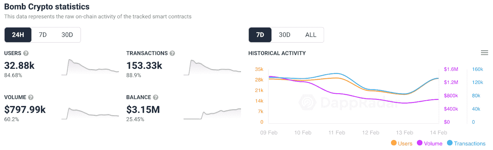

# 炸弹加密在一月接管 BSC 游戏

> 原文：<https://web.archive.org/web/https://dappradar.com/blog/bomb-crypto-takes-over-bsc-gaming-in-january>

## 竞争对手 MOBOX 努力跟上

**炸弹加密已经成为币安智能链上增长最快的项目之一。根据最新的 DappRadar 和区块链游戏联盟报告，仅在 2022 年 1 月，该游戏就吸引了平均接近 40，000 个每日唯一活跃钱包。与去年 12 月相比，增长了 19%。**

上升的势头帮助 [Bomb Crypto](https://web.archive.org/web/20221006030559/https://dappradar.com/binance-smart-chain/games/bomb-crypto) 在过去一个月 DappRadar 上追踪的所有[币安智能链](https://web.archive.org/web/20221006030559/https://dappradar.com/rankings/protocol/binance-smart-chain)游戏 dapps 中稳居榜首。更何况，炸弹加密和亚军 Mobox 处理的交易量相差惊人。与《T4》的 MOBOX: NFT 农夫相比，这款受炸弹人启发的游戏吸引了 458%的交易量。

仅在过去 24 小时内，炸弹加密就吸引了 32，880 个不同的活动钱包，将其性能提升了 84%。更重要的是，该游戏产生了近 80 万美元的交易量。这意味着投弹手游戏吸引了更多玩家在游戏内外花钱和交易价值。

## 炸弹加密模型是如何工作的？

炸弹加密已经采取了成功的游戏赚取模式，并将其推向了一个新的水平。虽然游戏的基础并没有带来任何革命性的东西，但这个想法、游戏性和设计已经吸引了全世界玩家的注意。

像大多数“玩即赚”的区块链游戏一样，“炸弹加密”严重依赖于它的原生令牌 [BCOIN](https://web.archive.org/web/20221006030559/https://dappradar.com/hub/token/bsc/BCOIN/BNB?from=0x00e1656e45f18ec6747f5a8496fd39b50b38396d) 。BCOIN 是玩家在游戏中成功完成冒险后获得的奖励。然而，BCOIN 也是该平台的主要经济推动者。该令牌允许玩家购买英雄和房屋，从而提高他们在游戏中的表现。

结合我们大多数人童年时玩过的炸弹人游戏的熟悉设计，该平台将从玩到赚的模式应用到经典体验中。这似乎是理科状元的成功秘诀。

要了解更多关于 2022 年初区块链游戏格局的信息，[请查看完整的 DappRadar 和区块链游戏联盟报告](https://web.archive.org/web/20221006030559/https://dappradar.com/blog/dappradar-x-bga-blockchain-games-report-january)。此外，你可以在[推特](https://web.archive.org/web/20221006030559/https://twitter.com/dappradar)上关注 DappRadar，并加入我们的 [Discord](https://web.archive.org/web/20221006030559/https://discord.gg/4ybbssrHkm) 社区，首先了解最新的区块链游戏新闻。

 NewsletterUnsubscribe at any time. [T&Cs](https://web.archive.org/web/20221006030559/https://dappradar.com/terms) and [Privacy Policy](https://web.archive.org/web/20221006030559/https://dappradar.com/privacy-policy)