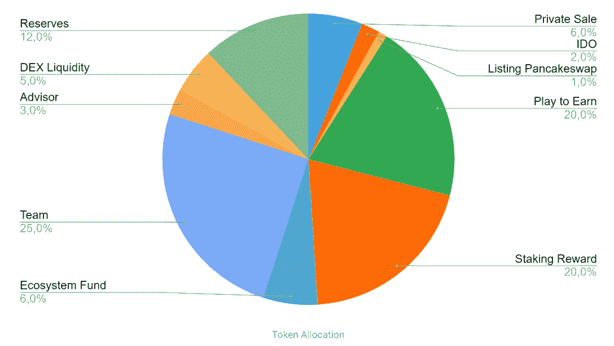
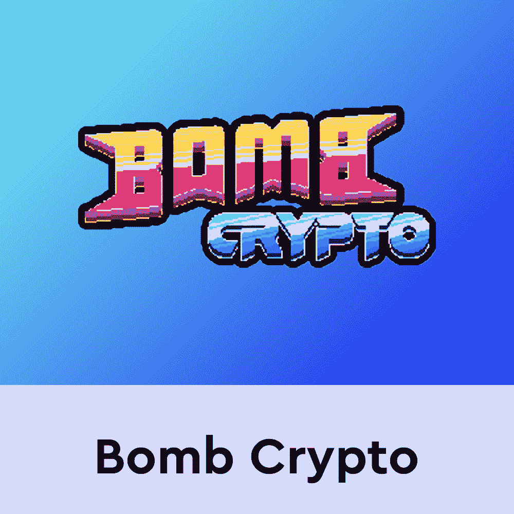
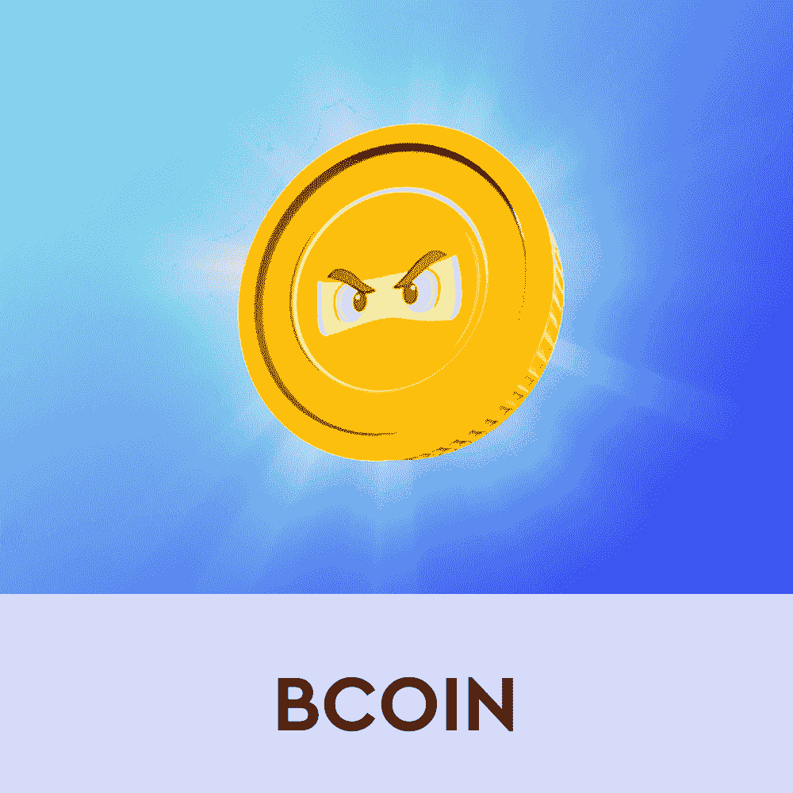
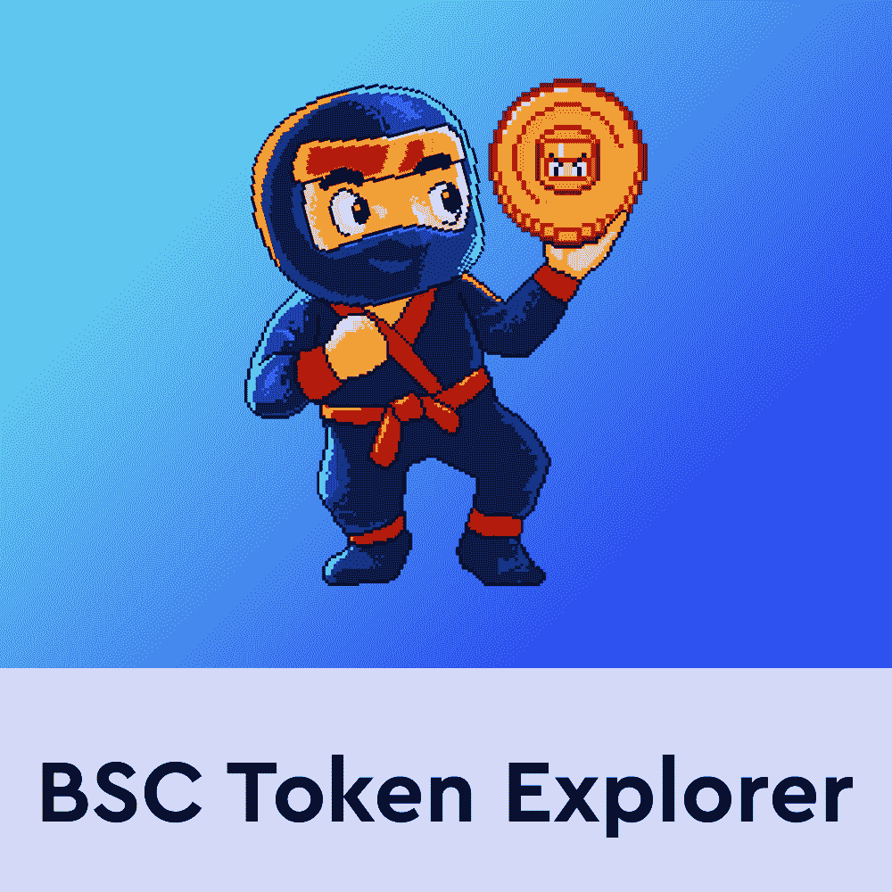

# 炸弹密码的解释

> 原文：<https://web.archive.org/web/https://dappradar.com/blog/bomb-cryptos-bcoin-explained>

## 了解有关 BCOIN 的一切信息

**炸弹加密已经成为 BNB 智能链上最成功的游戏之一，这要归功于它的“玩即赚”机制和本地代币 BCOIN。自 2022 年初以来，Bomb Crypto 一直是 DappRadar 跟踪的全区块链游戏赚取领域的顶级表现者。**

[Bomb Crypto](https://web.archive.org/web/20221007164501/https://dappradar.com/binance-smart-chain/games/bomb-crypto) 采用了成功的先玩后赚模式，并将其推向了新的高度。虽然游戏的基础并没有带来任何革命性的东西，但这个想法、游戏性和设计已经吸引了全世界玩家的注意。

这款融入了 NFT 元素的战斗游戏让玩家管理一群炸弹英雄，这些英雄被编程为寻找炸弹和与怪物战斗。这是一个受经典炸弹人游戏启发的游戏，但是有很多闲置的机械。在炸弹加密中，玩家还可以买一栋房子，它带有游戏内的好处，如能量再生。未来的更新将允许用户自定义他们的炸弹加密主页。

[https://web.archive.org/web/20221007164501if_/https://www.youtube.com/embed/Al2tiJDkOS4?feature=oembed](https://web.archive.org/web/20221007164501if_/https://www.youtube.com/embed/Al2tiJDkOS4?feature=oembed)

## 什么是 BCOIN？

像大多数“玩即赚”的区块链游戏一样,“炸弹加密”非常依赖于它的本地令牌 BCOIN。这是玩家在游戏中成功完成冒险后获得的货币。玩家通关的 bosses 和关卡越多，他们就能获得越多的金币。然而，代币也充当平台上的主要经济促进者。它允许玩家购买英雄和房屋，从而提高他们在游戏中的表现。

BCOIN 总共有 100，000，000 枚代币。大部分供应分配给“玩即赚”奖励池和赌注奖励池。这是游戏经济的一个重要方面，因为游戏赚取奖励是玩家加入炸弹加密社区的主要动机。

由于 BCOIN 是一种 BEP-20 代币，您可以通过 [DappRadar 代币交换服务](https://web.archive.org/web/20221007164501/https://dappradar.com/hub/token/bsc/BCOIN/BNB?from=0x00e1656e45f18ec6747f5a8496fd39b50b38396d)轻松获得。一旦您的钱包中有了 BCOIN，您就可以开始下注并赚取更多代币作为被动收入。除了被动收入之外，下注 BCOIN 代币还可以增强游戏中的炸弹加密英雄。简单地去[炸弹加密 dapp](https://web.archive.org/web/20221007164501/https://dappradar.com/binance-smart-chain/games/bomb-crypto) 了解更多。

DappRadar 将继续监控炸弹密码，因为它将进入 BSC 游戏空间。如果你想了解更多关于炸弹加密和 BCOIN 令牌，请查看下面的链接。此外，你可以在[推特](https://web.archive.org/web/20221007164501/https://twitter.com/dappradar)上关注 DappRadar，抢先获得最新的区块链博彩新闻。

[<picture></picture>](https://web.archive.org/web/20221007164501/https://dappradar.com/binance-smart-chain/games/bomb-crypto)[<picture></picture>](https://web.archive.org/web/20221007164501/https://dappradar.com/hub/token/bsc/BCOIN/BNB?from=0x00e1656e45f18ec6747f5a8496fd39b50b38396d)[<picture></picture>](https://web.archive.org/web/20221007164501/https://dappradar.com/hub/tokens/bsc/all/1) NewsletterUnsubscribe at any time. [T&Cs](https://web.archive.org/web/20221007164501/https://dappradar.com/terms) and [Privacy Policy](https://web.archive.org/web/20221007164501/https://dappradar.com/privacy-policy)