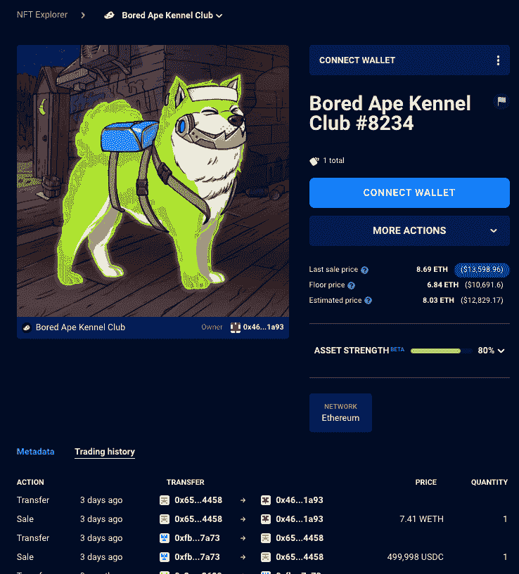
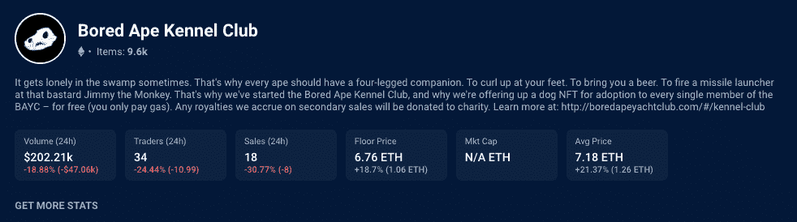
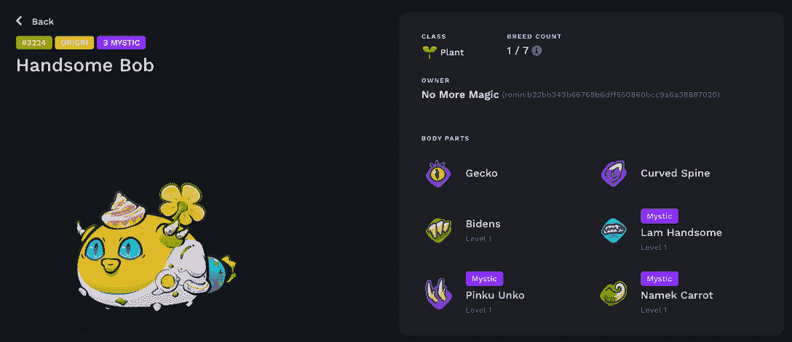
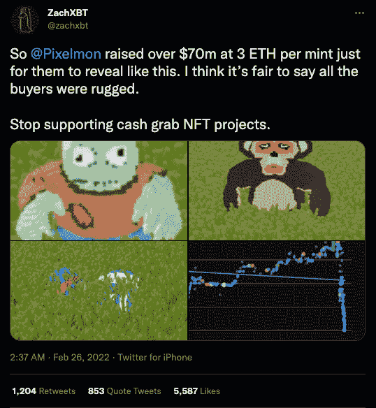

# 50 万美元的 Bored Ape Kennel Club 蓝筹 NFT 折扣–NFT 十大亮点

> 原文：<https://web.archive.org/web/https://dappradar.com/blog/bored-ape-kennel-club-for-500k-blue-chip-nft-discounts-top-10-nft-highlights>

## 查看 8 月 14 日至 21 日之间的 NFT 销售亮点排名

上周第二高成交价的令人惊讶的出现是[无聊猿养狗俱乐部#8234](https://web.archive.org/web/20220926002324/https://dappradar.com/hub/assets/eth/0xba30e5f9bb24caa003e9f2f0497ad287fdf95623/8234) ，成交价高达 50 万美元。值得注意的是，这是自交易开始以来 BAKC NFT 的最高价值出售。然而，对这种交易有一些怀疑，对此进行了解释，并且值得记住的是 DappRadar 只跟踪链上数据。

随着每周的趋势， [CryptoPunks 和 BAYC 主导了过去七天的最高价值销售](https://web.archive.org/web/20220926002324/https://dappradar.com/nft/sales),因为投机者继续逢低买入并抢购打折的蓝筹股 NFT。[前一周最高价值的 NFT 拍卖会](https://web.archive.org/web/20220926002324/https://dappradar.com/nft/sales)为 [Bored Ape 游艇俱乐部#5383](https://web.archive.org/web/20220926002324/https://dappradar.com/hub/assets/eth/0xbc4ca0eda7647a8ab7c2061c2e118a18a936f13d/5383) 以 146 万美元成交。有趣的是，BAYC #5383 与说唱传奇人物阿姆拥有的 [BAYC 有许多相同的特征，可能是有人试图猜测。](https://web.archive.org/web/20220926002324/https://twitter.com/Eminem)

## BAKC 的神秘案件#8234

上下文是使用链上数据进行报告的一切，BAKC 的案例需要一些解释。深入探究也很重要，因为 NFT 无聊猿养狗俱乐部以如此高的价格出售意味着这是迄今为止[最昂贵的 BAKC NFT 拍卖会](https://web.archive.org/web/20220926002324/https://dappradar.com/hub/assets/eth/0xba30e5f9bb24caa003e9f2f0497ad287fdf95623/8234)。

*Source:* [*DappRadar NFT Explorer*](https://web.archive.org/web/20220926002324/https://dappradar.com/hub/assets/eth/0xba30e5f9bb24caa003e9f2f0497ad287fdf95623/8234)

三天前，[这个钱包](https://web.archive.org/web/20220926002324/https://etherscan.io/address/0x2e450dc14ac85239172880d905a2ba56000f2692)用 50 万美元资助了一个新钱包，然后用这笔钱买了 BAKC，并在 OpenSea 上支付了 1.3 万美元的 USDC 费用。紧接着，他们以 7.414 ETH 的价格从[这个钱包](https://web.archive.org/web/20220926002324/https://etherscan.io/address/0x65a7ecc83f6197e936016b954ca50e30c74b4458)卖给了[这个钱包](https://web.archive.org/web/20220926002324/https://etherscan.io/address/0x464b5e6ae4c548efdae7530756c180021a4e1a93)。

假设买家花了 13000 美元的开放海域费来刺激人们对他们的 NFT 或更广泛的收藏的兴趣，这并不完全不合情理。另一个原因可能是逃税，因为突出显示的一项交易显示，该人用新钱包购买，然后亏本出售。如果是这样的话，[那么这个钱包就是故事的主要钱包](https://web.archive.org/web/20220926002324/https://dappradar.com/hub/wallet/eth/0x65a7ecc83f6197e936016b954ca50e30c74b4458)。然而，[那个钱包是空的](https://web.archive.org/web/20220926002324/https://dappradar.com/hub/wallet/eth/0x65a7ecc83f6197e936016b954ca50e30c74b4458/nfts)。

[在当前持有人](https://web.archive.org/web/20220926002324/https://dappradar.com/hub/wallet/eth/0x464b5e6ae4c548efdae7530756c180021a4e1a93)的钱包里，我们看到了大量的[高价值非金融资产](https://web.archive.org/web/20220926002324/https://dappradar.com/hub/wallet/eth/0x464b5e6ae4c548efdae7530756c180021a4e1a93)，所以也有可能这个人创建了一个账户网络，模拟对收藏的兴趣，以提升价值并出售他们账户中的其他资产。有趣的是，这笔交易可能是[将 BAKC NFTs 的平均销售价格](https://web.archive.org/web/20220926002324/https://dappradar.com/hub/nft-explorer/collection/bored-ape-kennel-club/sales-activity?period=week&order-by=priceInFiat)分别拉高 [18.7%和](https://web.archive.org/web/20220926002324/https://dappradar.com/hub/nft-explorer/collection/bored-ape-kennel-club/sales-activity?period=week&order-by=priceInFiat)21.3%的原因。

**

*Source: [DappRadar](https://web.archive.org/web/20220926002324/https://dappradar.com/hub/nft-explorer)*

## 帅哥

我们还看到了新起源游戏的 Axie，称为帅鲍勃易手，售价为 84.16 WETH，或约 143，000 美元。这次拍卖是 NFT 第 59 次最昂贵的拍卖，格雷戈里爵士去年以 369 WETH，约合 819，000 美元的价格仍然保持着冠军的头衔。

## 凯文复出了吗？

一次有趣的拍卖是 ENS 域名 kevin.eth 的拍卖，价格为 40 WETH，约合 7.5 万美元。凯文这个名字与大约六个月前 Pixelmon 透露的[失败的 NFT 系列中的一个角色有关。凯文成为了失败的大使，其形象在社交媒体上传播，供所有人欣赏和嘲笑，此前买家与 3 ETH 分手，以从平淡无奇的系列中铸造 NFT。](https://web.archive.org/web/20220926002324/https://twitter.com/zachxbt/status/1497370216690503687?ref_src=twsrc%5Etfw%7Ctwcamp%5Etweetembed%7Ctwterm%5E1497370216690503687%7Ctwgr%5E50ea2a3a7d5f440b79680eb2c7a84baa7f59dc2b%7Ctwcon%5Es1_&ref_url=https%3A%2F%2Fwww.highsnobiety.com%2Fp%2Fpixelmon-nft-project-kevin-meme%2F)

cryptoverse 是一个奇怪的地方，这次 kevin.eth ENS 的销售让人们怀疑是否有人计划劫持 kevin 并从失败中推出另一个系列。当然，也可能只是一个叫凯文的人想在 ENS 注册中保护自己的名字。

## 查看 NFT 销售亮点列表

1.  [无聊猿犬舍俱乐部# 8234](https://web.archive.org/web/20220926002324/https://dappradar.com/hub/assets/eth/0xba30e5f9bb24caa003e9f2f0497ad287fdf95623/8234)-500.99 万美元/ 499.99 美元 USDC-[买家钱包](https://web.archive.org/web/20220926002324/https://dappradar.com/hub/wallet/eth/0x464b5e6ae4c548efdae7530756c180021a4e1a93)
2.  [other side # 25415](https://web.archive.org/web/20220926002324/https://dappradar.com/hub/assets/eth/0x34d85c9cdeb23fa97cb08333b511ac86e1c4e258/25415)的其他契约——348.31 万美元/183 WETH——[买家钱包](https://web.archive.org/web/20220926002324/https://dappradar.com/hub/wallet/eth/0xb0de41cf75e0396f859384d5f34e8d6f0b41e994)
3.  [Axie Infinity 帅 Bob](https://web.archive.org/web/20220926002324/https://marketplace.axieinfinity.com/axie/3224/)-$ 143.1k/84.16 WETH-[买家钱包](https://web.archive.org/web/20220926002324/https://dappradar.com/nft/sales/4)
4.  [证明集体](https://web.archive.org/web/20220926002324/https://dappradar.com/hub/assets/eth/0x08d7c0242953446436f34b4c78fe9da38c73668d/436)–$ 115.71k/61.9 ETH——[买家钱包](https://web.archive.org/web/20220926002324/https://dappradar.com/hub/wallet/eth/0x1bef464495c716dffd064be548ef190ad92720dc)
5.  双生火焰 5 号。莉娜&艾玛买家钱包
6.  [Ringers # 951](https://web.archive.org/web/20220926002324/https://dappradar.com/hub/assets/eth/0xa7d8d9ef8d8ce8992df33d8b8cf4aebabd5bd270/13000951)-83.74 万美元/44 ETH-[买家钱包](https://web.archive.org/web/20220926002324/https://dappradar.com/hub/wallet/eth/0xa12cea84eb9e6dceecd125de27cf2e9701104956)
7.  [志那都红豆# 2239](https://web.archive.org/web/20220926002324/https://dappradar.com/hub/assets/eth/0xed5af388653567af2f388e6224dc7c4b3241c544/2239)–81.14 万美元/50 WETH—[买家的钱包](https://web.archive.org/web/20220926002324/https://dappradar.com/hub/wallet/eth/0x04d7c2ee4cdbac9a0fc46d3e35e79aba5cca471d)
8.  [Kevin . eth](https://web.archive.org/web/20220926002324/https://dappradar.com/hub/assets/eth/0x57f1887a8bf19b14fc0df6fd9b2acc9af147ea85/24742661538997726148852154260789832125935544698972868952733156210971803065841)–$ 75.09k/40 WETH——[买家钱包](https://web.archive.org/web/20220926002324/https://dappradar.com/hub/wallet/eth/0x7ca4687ca8f0c0faf74c53caf394fce3d541dd61)
9.  [Doodle # 6049](https://web.archive.org/web/20220926002324/https://dappradar.com/hub/assets/eth/0x8a90cab2b38dba80c64b7734e58ee1db38b8992e/6049)–$ 58.57k/31 ETH——[买家钱包](https://web.archive.org/web/20220926002324/https://dappradar.com/hub/wallet/eth/0xe4855ea1e26865247d412c0891184b535e2fb849)
10.  [CloneX # 16752](https://web.archive.org/web/20220926002324/https://dappradar.com/hub/assets/eth/0x49cf6f5d44e70224e2e23fdcdd2c053f30ada28b/3780)-56.76 万美元/30 ETH-[买家钱包](https://web.archive.org/web/20220926002324/https://dappradar.com/hub/wallet/eth/0x909ca91a0d359f93d5c10ac66e44bc75edc969fe)

NFT 创作者应该保留终生版税吗？

[https://web.archive.org/web/20220926002324if_/https://www.youtube.com/embed/bZkSZ1jqoDI?feature=oembed](https://web.archive.org/web/20220926002324if_/https://www.youtube.com/embed/bZkSZ1jqoDI?feature=oembed)

## 元宇宙滑坡

在熊市中遭受损失的一类 NFT 资产是元宇宙地产。例如，如果我们回溯到 2022 年 1 月，受欢迎的元宇宙平台沙盒中的特定地块以大约 30，000 美元的价格易手，但自那以来[已经损失了 90%的价值](https://web.archive.org/web/20220926002324/https://dappradar.com/blog/metaverse-meltdown-top-metaverse-lands-lose-91-value)。只有一个地块进入了本周十大销售榜，那就是广受欢迎的宇迦实验室作品《另一边》。

2021 年 10 月 28 日，当脸书宣布更名为 Meta 时，全世界都在关注。已经站稳脚跟的基于区块链的元宇宙项目开始感受到这种爱。此外，世界开始对一个融入 NFT 的元宇宙所能带来的机遇感兴趣。

在大肆宣传中，随着对世界的期望越来越高，投机者[潜入领先平台抢购 NFT 土地](https://web.archive.org/web/20220926002324/https://dappradar.com/blog/top-10-best-metaverse-virtual-worlds-with-land-nfts/)，最终在元宇宙生活、工作和娱乐。从一个角度来看，这个想法是可靠的，因为如果数百万人最终在这些平台上，[他们将需要土地](https://web.archive.org/web/20220926002324/https://dappradar.com/blog/top-10-best-metaverse-virtual-worlds-with-land-nfts/)。类似于现实世界。

然而，[的炒作一直是短命的](https://web.archive.org/web/20220926002324/https://dappradar.com/blog/metaverse-meltdown-top-metaverse-lands-lose-91-value)，随着人们慢慢停止对土地的关注和投机， [NFT 土地在领先平台](https://web.archive.org/web/20220926002324/https://dappradar.com/blog/top-10-best-metaverse-virtual-worlds-with-land-nfts/)的平均价格下降了 95%之多。当然，还有以太下降值的[重要细微差别要考虑](https://web.archive.org/web/20220926002324/https://dappradar.com/blog/metaverse-meltdown-top-metaverse-lands-lose-91-value)。

[<picture></picture>](https://web.archive.org/web/20220926002324/https://dappradar.com/blog/what-are-non-fungible-tokens-nfts)[<picture></picture>](https://web.archive.org/web/20220926002324/https://dappradar.com/nft/marketplaces)[<picture></picture>](https://web.archive.org/web/20220926002324/https://dappradar.com/nft/sales)

***以上不构成投资建议。此处给出的信息仅供参考。请行使尽职调查，做你的研究。作者持有多种加密货币的头寸，包括 BTC、瑞士法郎和雷达。***

 NewsletterUnsubscribe at any time. [T&Cs](https://web.archive.org/web/20220926002324/https://dappradar.com/terms) and [Privacy Policy](https://web.archive.org/web/20220926002324/https://dappradar.com/privacy-policy)