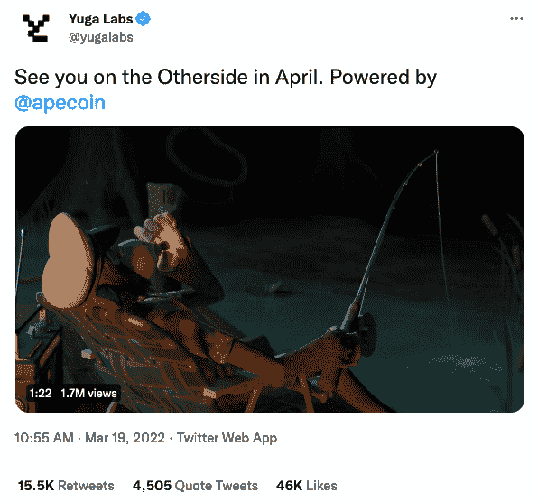
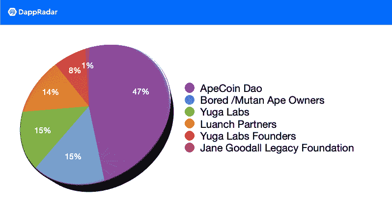

# 无聊的猿猴元宇宙来了:另一边见

> 原文：<https://web.archive.org/web/https://dappradar.com/blog/bored-ape-metaverse-is-here-see-you-on-the-otherside>

## 宇迦实验室为即将到来的 NFT 游戏世界戏弄伙伴关系和互操作性

无聊猿游艇俱乐部(BAYC)的创始人宇迦实验室发布了一个预告，展示了它的元宇宙计划。该预告片增加了人们的猜测，即由 Animoca Brands 提供支持的宇迦 3D 游戏正在进行中。ApeCoin 上线后不久就推出了预告片。然而，它没能把硬币带到月球上。

自 BAYC 首次在底价上击败 CryptoPunk NFTs 以来，三个月已经过去了。BAYC 当时的底价是 53.9 ETH，CryptoPunk 是 52.69 ETH。然而，几乎三个月后，这两件杰出的 NFT 收藏被 BAYC 的创始人宇迦实验室拥有。

三月，NFT 球场见证了无聊猿游艇俱乐部成为中心舞台。收购 CryptoPunk 的消息公开后，备受期待的 ApeCoin 的空投也很快跟上。10 亿枚 ApeCoins 被投给了几组接收者，无聊的猿和变异猿 NFT 主人排队领取部分宝藏。而这仅仅是 BAYC 商业帝国的开始。3 月 19 日，宇迦实验室发布了一个短视频，宣布其元宇宙将有 CryptoPunks，Cool Cats 和其他蓝筹 NFTs 项目加入。

## 预告以蓝筹股 NFT 系列为特色

在预告片中，一个会飞的生物带着无聊的猿猴开始了一场意想不到的冒险。当然，他露出了不感兴趣的表情。此外，视频继续与其他蓝筹股 NFT 集合的外观。从下面的截图中，我们可以看到[变种人猿游艇俱乐部，酷猫，女人世界](https://web.archive.org/web/20230104050033/https://twitter.com/stew_eth/status/1505026129853394947)，CrypToadz 朋克， [Meebits](https://web.archive.org/web/20230104050033/https://opensea.io/assets/0x7bd29408f11d2bfc23c34f18275bbf23bb716bc7/16550) ，CrypToadz。

预告片发布两天后，Animoca Brands 转发了宇迦实验室最初的声明。加上那些蓝筹 NFT 的客串出场，这个动作增加了 Animoca 支持的 3D BAYC 游戏将会发生的猜想。显然，游戏将包括所有其他种类的 NFT 集合，呼应互用性的概念[也见于例如 WorldWideWebb](https://web.archive.org/web/20230104050033/https://dappradar.com/ethereum/collectibles/worldwide-webb-land) 。

## 阿彭斯 by 阿彭斯道

ApeCoin 将成为更广泛的 BAYC 生态系统中的公用事业和治理标志。值得一提的是，ApeCoin 是由 ApeCoin DAO 推出的，而不是由宇迦实验室或无聊的 Ape 游艇俱乐部推出的。

正如我们从下面的饼状图中看到的，帮助推出 ApeCoin 的风险资本总共获得了 14%的分配。Andreessen Horowitz 和 Animoca 品牌就属于这一类接受者。然而，许多人指出，这些象征性的持股可能会让 Andreessen Horowitz 和 Animoca 对 ApeCoin DAO 产生重大影响，尽管该集团本来就是分散的。

Sources: Yuga Labs and ApeCoin DAO

ApeCoin DAO 已经招募了加密社区的名人加入其董事会。Reddit 联合创始人亚历克西斯·奥哈尼安和 FTX 的艾米·吴榜上有名。他们将提供六个月的帮助，之后硬币持有者将投票选出任期一年的新董事会成员。然后，希望我们能对社区是会员驱动还是风投驱动有一个更清晰的认识。

虽然预告片暗示了 BAYC 的未来，但这并没有给 ApeCoin 的增长带来任何动力。根据 DappRadar token tracker 的数据，截至本文撰写之时，市值排名第 48 位的加密货币下跌 7.33%，至 10.24 美元。

关于最新的 BAYC NFT 收藏量、底价和最高销售额，[查看 DappRadar 上的 NFT 追踪工具](https://web.archive.org/web/20230104050033/https://dappradar.com/ethereum/collectibles/bored-ape-yacht-club)。