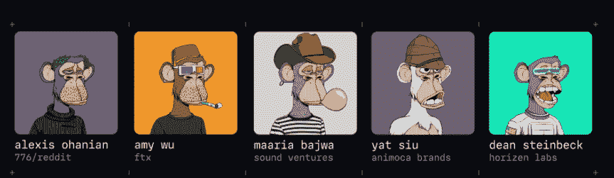
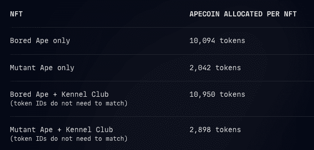
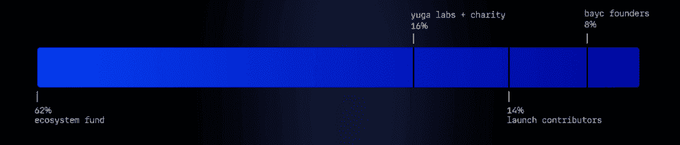
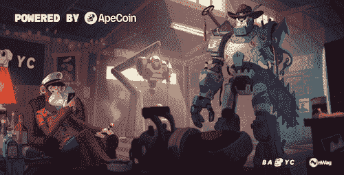
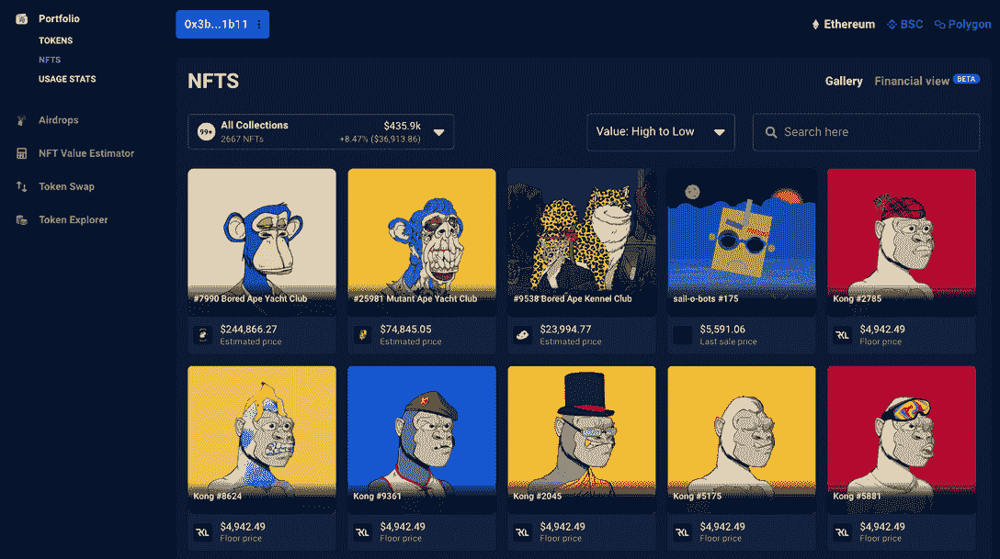

# 无聊猿游艇俱乐部推出 ApeCoin 与猿令牌空投

> 原文：<https://web.archive.org/web/https://dappradar.com/blog/bored-ape-yacht-club-launch-apecoin-with-ape-token-airdrop>

## ApeCoin 归 BAYC 社区 NFT 持有者所有

**Premium NFT 精选 Bored Ape 游艇俱乐部今天宣布推出其本土 ApeCoin 以及象征性空投。猿空投将前往无聊猿和突变猿持有人，如果他们也持有无聊猿养狗俱乐部 NFT 将得到推动。**

几个月来，一直有传言称，无聊猿游艇俱乐部(Bored Ape Yacht Club)社区即将推出一个代币。在上周收购了 CryptoPunks 和 Meebits 之后，该团队现在宣布了他们的 APE token。总共 62%的 ApeCoin 供应流向 ApeCoin 社区。然而，从美国东部时间 3 月 17 日上午 8:30 开始，只有 15%的人可以申请。

ApeCoin 由 ApeCoin DAO 拥有和运营，这是一个分散化的组织，每个令牌持有者都可以对生态系统基金的治理和使用进行投票。持有 ApeCoin 是成为 ApeCoin 道会员的唯一要求。DAO 由 Ape 基金会提供支持，成立该基金会是为了充当 ApeCoin 的法律管家，并管理 ApeCoin DAO 社区做出的决定。该团队包括 Reddit 的 Alexis Ohanian 和 Animoca Brands 的 Yat Siu。

代币将于美国东部时间 2022 年 3 月 17 日上午 8:30 开始通过申领页面分配给会员。为了确保 ApeCoin 向 BAYC 和 MAYC·NFT 持有者的公平发行，分配是根据每批 NFT 之间的底价差异确定的，大约是在令牌申领发行的前一个月(02/07/22 到 03/08/22)。每只[无聊猿或变异猿 NFT](https://web.archive.org/web/20220930085519/https://dappradar.com/ethereum/collectibles/bored-ape-yacht-club) 都有一个同伴无聊猿 NFT 狗舍俱乐部，将能够要求得到下面指定数量的硬币。

查看 Etherscan 上的[代币合约地址，我们可以看到代币最有可能在 Huobi、Gemini 和 FTX 开始交易，因为流动性提供商 Wintermute 今天早上开始添加资金。在书写时，全部 1，000，000，000 个代币中的几乎 2500 万个已经被分散。](https://web.archive.org/web/20220930085519/https://etherscan.io/token/0x4d224452801aced8b2f0aebe155379bb5d594381)

ApeCoin 的总供应量永久固定在 10 亿代币，加上智能合约不暴露任何代币燃烧能力，所以总供应量永远不会减少。除非代币被转移到烧录地址。

此外，项目贡献者的一部分令牌最初将被锁定。根据下面的图表，锁定的令牌将在四年内解锁，从 2022 年 3 月 17 日发布日开始。持有分配给道国库和资源的代币的钱包可以在这里查看。

## ApeCoin 是什么？

ApeCoin 是一个 ERC-20 治理和公用设施令牌，在 APE 生态系统中使用，以增强去中心化社区的能力。作为生态系统的开源协议层，ApeCoin 有几个用途:

1.  ApeCoin 是生态系统的治理令牌，允许 ApeCoin 持有者参与 ApeCoin DAO。

2.  ApeCoin 是生态系统的公用令牌，为所有参与者提供了一种共享和开放的货币，可以在没有集中中介的情况下使用。

3.  ApeCoin 提供了对生态系统某些部分的访问，这些部分在其他情况下是不可用的，例如独家游戏、商品、活动和服务。

4.  ApeCoin 是第三方开发者通过将 APE 整合到服务、游戏和其他项目中来参与生态系统的工具。

[<picture></picture>](https://web.archive.org/web/20220930085519/https://dappradar.com/blog/what-are-non-fungible-tokens-nfts)[<picture></picture>](https://web.archive.org/web/20220930085519/https://dappradar.com/nft/marketplaces)[<picture></picture>](https://web.archive.org/web/20220930085519/https://dappradar.com/nft/sales)

## 玩石磊香蕉赚取硬币

有趣的是，第四点在今天已经出现了，Animoca Brands 宣布将其广受欢迎的手机游戏 Benji Bananas 转变为一款游戏赚钱的游戏。Benji Bananas 从游戏到赚钱游戏的转变始于 3 月 17 日美国东部时间晚上 9 点开始的第一版 Benji Bananas 会员通行证的销售。班吉通行证是一种 NFT，允许所有者通过玩班吉香蕉赚取独特的代币，这些代币可以兑换成硬币。

此外，Animoca Brands 还[在推特上发布了一个预告](https://web.archive.org/web/20220930085519/https://twitter.com/animocabrands/status/1504324197467947008),称他们将在与 BAYC 合作的[秘密项目](https://web.archive.org/web/20220930085519/https://somethingisbrewing.xyz/)中采用 ApeCoin。nWayPlay 发布了进一步的[公告，他们公布了他们目前与 BAYC 合作开发的 ApeCoin 驱动游戏的预告图。](https://web.archive.org/web/20220930085519/https://twitter.com/nWayPlayNFT/status/1504230958374875136/photo/1)

## 在 DappRadar 上可视化和评估 NFTs

使用[DappRadar Portfolio Tracker](https://web.archive.org/web/20220930085519/https://dappradar.com/hub/wallet)用户可以轻松跟踪他们在以太坊、BNB 链和多边形上的所有加密和非加密交易。只需[输入钱包地址](https://web.archive.org/web/20220930085519/https://dappradar.com/hub/wallet)，你就可以出发了！此外，输入任何钱包地址挖掘和[探索著名或有影响的钱包](https://web.archive.org/web/20220930085519/https://dappradar.com/blog/celebrity-wallets-a-dive-into-crypto-hollywood)。

[<picture></picture>](https://web.archive.org/web/20220930085519/https://dappradar.com/hub/wallet/eth/0x3becf83939f34311b6bee143197872d877501b11/nfts)

***以上不构成投资建议。此处给出的信息仅供参考。请行使尽职调查，做你的研究。作者持有多种加密货币的头寸，包括 BTC、ETH 和 RADAR。***

 NewsletterUnsubscribe at any time. [T&Cs](https://web.archive.org/web/20220930085519/https://dappradar.com/terms) and [Privacy Policy](https://web.archive.org/web/20220930085519/https://dappradar.com/privacy-policy)