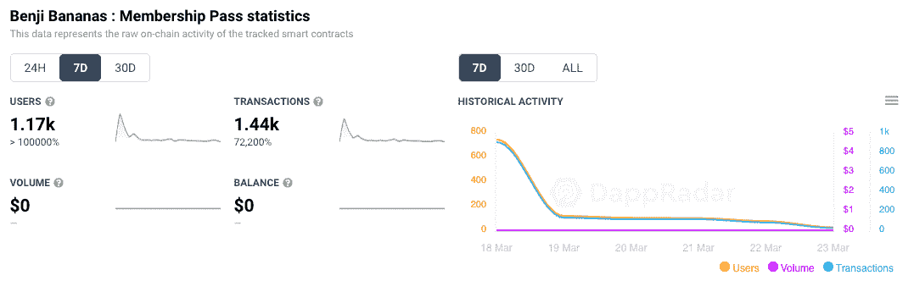
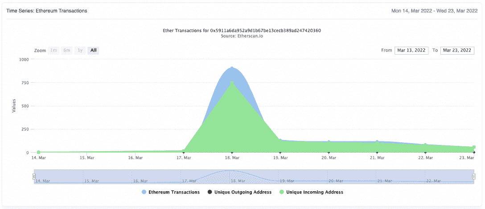
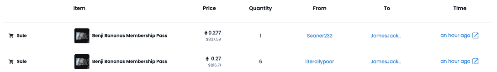
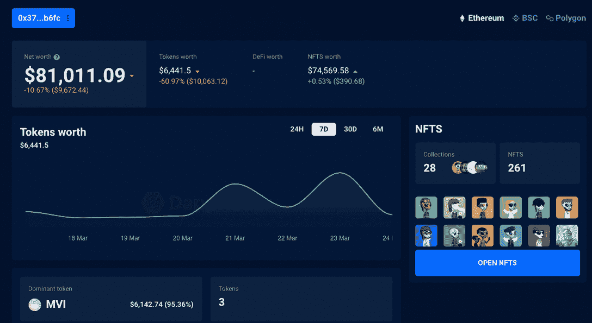
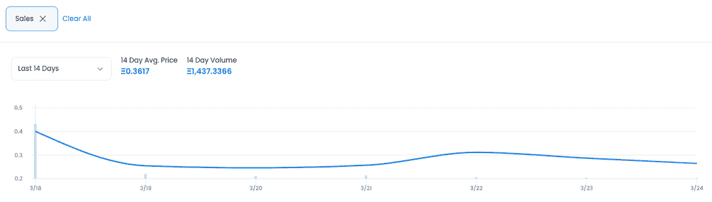

# 无聊的猿猴在石基香蕉上玩耍赚钱

> 原文：<https://web.archive.org/web/https://dappradar.com/blog/bored-apes-play-to-earn-ape-on-benji-bananas>

## 石基香蕉的会员证正在被抢购一空！

Animoca Brands 最近转型的手机游戏《班吉香蕉》的会员通行证现已售罄。会员通行证很受欢迎，因为这可以让玩家获得一枚独特的硬币，以后他们可以用它来换取猿类代币。二级市场交易正在升温，因为玩家们试图找到赚取迄今为止最受关注的 2022 年令牌之一的方法。

Animoca Brands 上周庆祝 Bored Ape 游艇俱乐部 APE token 的发布，将它的一款手机游戏转变为玩家赚取 Ape 的游戏。通过购买班吉香蕉的 NFT 会员通行证，玩家可以获得一枚独特的硬币，稍后他们可以用它来兑换 APE。

人们对获得 APE 感到兴奋，但他们首先需要购买 APE 代币，以 25 APE，或大约 330 美元购买会员通行证。为了进一步刺激代币，APE 在到达后的 24 小时内出现了显著增长，[从 7.40 美元增长 132%，达到 17.17 美元](https://web.archive.org/web/20221006032040/https://dappradar.com/hub/token/eth/APE_1?from=0x209c1808febf6c1ab7c65764bb61ad67d3923fcc)。

截至发稿时，已有 1，170 个独特的活动钱包连接起来尝试购买会员通行证，产生了超过 1，400 笔交易。当然，那些对投资有敏锐眼光的人试图捞到不止一张通行证。然后，他们会把通行证拿到二级市场，试图榨取利润。

这种兴趣在 3 月 18 日达到顶峰，有 906 笔以太坊交易，就在 APE 开始向 MAYC、BAYC 和 BAKC·NFT 的持有者空投后一天。此外，APE 出现在几个流行的集中交易平台上，引起了很多关注。投资者注意到，猿令牌与目前最著名的 NFT 收藏有关联。更有趣的是，分散交易主导了早期交易。

Source: [Etherscan](https://web.archive.org/web/20221006032040/https://etherscan.io/address/0x5911a6da952a9d1b67be13cecb389ad247420360#analytics)

## 二级市场会员通行证

第一波会员通行证售罄，人们已经开始尝试在 Opensea 上出售。在撰写本文时，我们看到同一位买家以每张约 800 美元的价格抢购了两张通票，这表明投资者认为通票的价格尚未达到其全部潜力。或者，玩家希望通过使用多种设备收获尽可能多的猿。对于无聊猿游艇俱乐部 NFT 家族和宇迦实验室来说，这些都是好兆头。

使用 [DappRadar 投资组合追踪器](https://web.archive.org/web/20221006032040/https://dappradar.com/hub/wallet/eth/0x376a34d31b57fa40288b850e3dc4095188e1b6fc)，我们可以深入钱包，揭示一些有趣的发现。这个钱包里有超过 81，000 美元的加密和 NFT 资产，其中近 75，000 美元是通过 NFTs 积累的。更有趣的是，在钱包里的所有 [261 张 NFT 中](https://web.archive.org/web/20221006032040/https://dappradar.com/hub/wallet/eth/0x376a34d31b57fa40288b850e3dc4095188e1b6fc/nfts)拥有者没有 BAYC、MAYC 或 BAKC NFT。这位特殊的投资者似乎错过了购买任何 BAYC 和他们的附属 NFTs，所以没有理由通过试图获得几个 Benjios Bananas 会员通行证来获得潜在的未来收益。

14 天的平均销售价格现在是 0.3 ETH，约合 900 美元。三倍于发行时会员通行证的价格。截至发稿时，交易量已达 14.373 亿瑞士法郎，约合 430 万美元。

这一趋势可能会继续增长，因为 Animoca Brands 也[在推特上发布了一个预告](https://web.archive.org/web/20221006032040/https://twitter.com/animocabrands/status/1504324197467947008)，称他们将在与 BAYC 合作的[秘密游戏项目](https://web.archive.org/web/20221006032040/https://somethingisbrewing.xyz/)中采用 ApeCoin。nWayPlay 发布了进一步的[公告，他们公布了一款游戏的预告图，该游戏目前正与 BAYC 合作开发，将采用 ApeCoin。](https://web.archive.org/web/20221006032040/https://twitter.com/nWayPlayNFT/status/1504230958374875136/photo/1)

围绕 APE 令牌的大肆宣传是显而易见的。投资者热衷于参与一个项目和 NFT 收藏[现在超出了他们的财务能力](https://web.archive.org/web/20221006032040/https://dappradar.com/hub/token/eth/APE_1?from=0x209c1808febf6c1ab7c65764bb61ad67d3923fcc)，并且可能对宇迦实验室的未来抱有很大的信心，因为这个令人印象深刻的团队继续扩大并代表了 NFTs 和数字所有权的前沿。

 NewsletterUnsubscribe at any time. [T&Cs](https://web.archive.org/web/20221006032040/https://dappradar.com/terms) and [Privacy Policy](https://web.archive.org/web/20221006032040/https://dappradar.com/privacy-policy)

***以上不构成投资建议。此处给出的信息仅供参考。请行使尽职调查，做你的研究。作者持有多种加密货币的头寸，包括 BTC、瑞士法郎和雷达。***