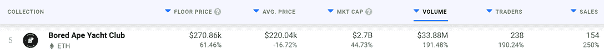
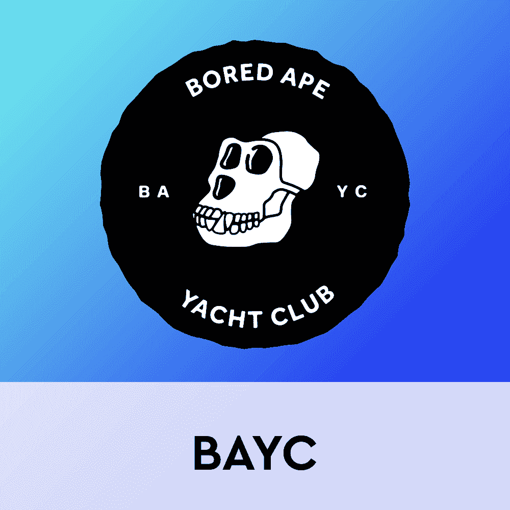
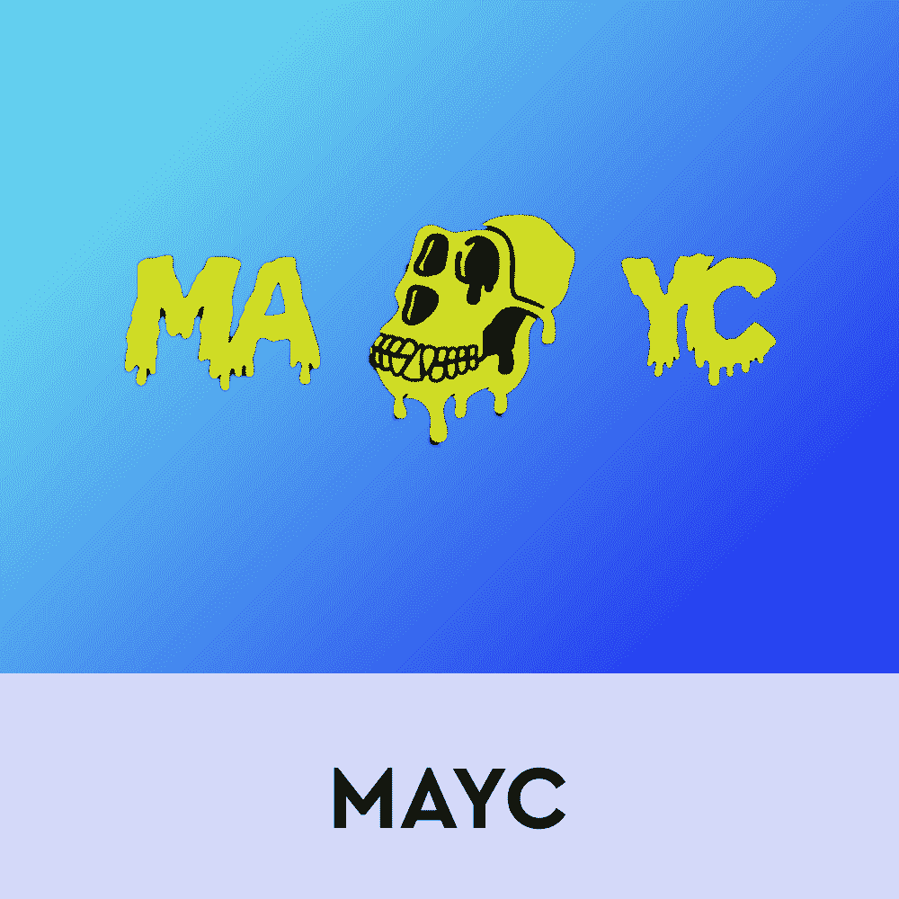
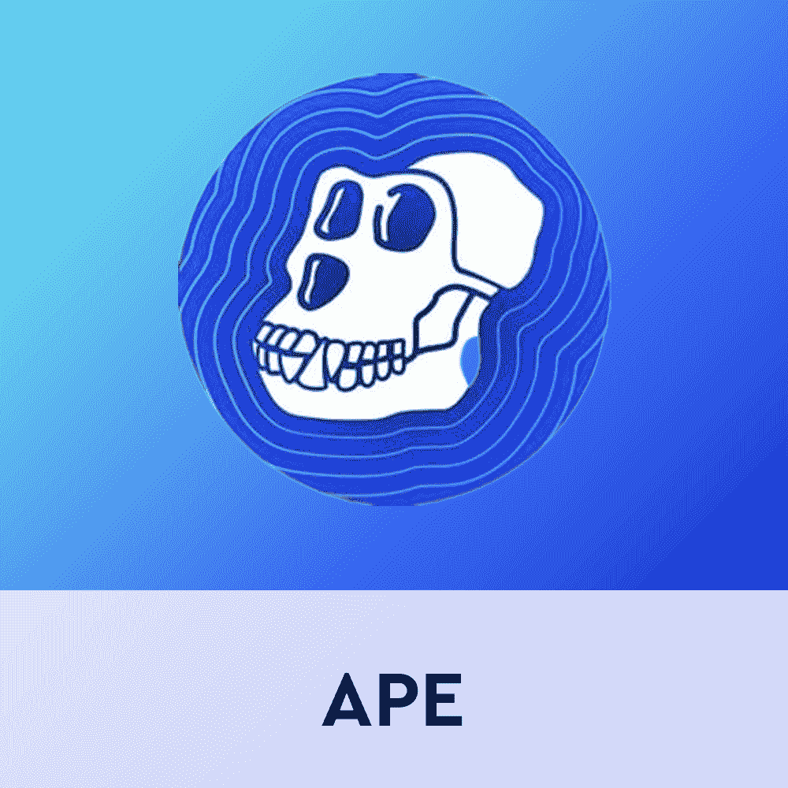

# 无聊！无聊的猿蓬勃发展，在猿令牌炒作

> 原文：<https://web.archive.org/web/https://dappradar.com/blog/boring-bored-apes-booming-amidst-ape-token-hype>

## 本周 NFT 前 10 名的转会包括 9 名贝茨和 1 名 MAYC

无聊猿的推出在 NFT 爱好者中引起了巨大的轰动。宇迦实验室收藏完全接管了排名，占据了所有十个位置。过去七天中最昂贵的拍卖是对[**BAYC # 3250**](https://web.archive.org/web/20220930101123/https://dappradar.com/hub/assets/eth/0xbc4ca0eda7647a8ab7c2061c2e118a18a936f13d/3250)**的拍卖，它以 250 ETH 的价格转手，约合 720，430 美元。**

3 月 17 日，随着新的本土生态系统标志 APE 的出现，BAYC 和 MAYC 的粉丝们欣喜若狂。根据[公告](https://web.archive.org/web/20220930101123/https://dappradar.com/blog/bored-ape-yacht-club-launch-apecoin-with-ape-token-airdrop)，每只百无聊赖的猿猴授予收集者 10094 枚猿猴代币。此外，每只突变猿携带了 2042 枚猿币。在你的钱包里放一个无聊的 NFT 猿人养狗俱乐部会增加空投的额外收获。

空投引起的兴奋和炒作浪潮推动了 BAYC 的销售。从过去七天的 NFT 十大销售额来看，无聊的猿迷是最活跃的交易者。看看购买这些鲨鱼的收藏者的钱包，他们中的许多人仍然持有至少一部分他们收到的空投猿令牌。

例如， [nobody.eth](https://web.archive.org/web/20220930101123/https://dappradar.com/hub/wallet/eth/0x7eb413211a9de1cd2fe8b8bb6055636c43f7d206?utm_source=rankings&utm_medium=nft&utm_campaign=nft_sales) *上周购买了三个最卖座的 BAYC NFTs，在过去几天里总共获得了 234，534 个[猿代币](https://web.archive.org/web/20220930101123/https://dappradar.com/hub/token/eth/APE?from=0x4d224452801aced8b2f0aebe155379bb5d594381&selectedWallet=portfolio)。在撰写本报告时，他们仍持有近五分之一的空投物资，价值超过 50 万美元。

[https://web.archive.org/web/20220930101123if_/https://www.youtube.com/embed/jYIKQcC7nvQ?feature=oembed](https://web.archive.org/web/20220930101123if_/https://www.youtube.com/embed/jYIKQcC7nvQ?feature=oembed)

## NFT 销售额前十名

1.  [Bored Ape 游艇俱乐部# 3250](https://web.archive.org/web/20220930101123/https://dappradar.com/hub/assets/eth/0xbc4ca0eda7647a8ab7c2061c2e118a18a936f13d/3250)-720，430 美元/250 ETH-[买家的钱包](https://web.archive.org/web/20220930101123/https://dappradar.com/hub/wallet/eth/0x4499af76f65c4f0179c4ada6dd07995ae9881732?utm_source=rankings&utm_medium=nft&utm_campaign=nft_sales)
2.  [Bored Ape 游艇俱乐部# 9135](https://web.archive.org/web/20220930101123/https://dappradar.com/hub/assets/eth/0xbc4ca0eda7647a8ab7c2061c2e118a18a936f13d/9135)-599，890 美元/216.69 WETH-[买家钱包](https://web.archive.org/web/20220930101123/https://dappradar.com/hub/wallet/eth/0x7eb413211a9de1cd2fe8b8bb6055636c43f7d206?utm_source=rankings&utm_medium=nft&utm_campaign=nft_sales) *
3.  [Bored Ape 游艇俱乐部# 5552](https://web.archive.org/web/20220930101123/https://dappradar.com/hub/assets/eth/0xbc4ca0eda7647a8ab7c2061c2e118a18a936f13d/5552)-551，730 美元/188 ETH-[买家的钱包](https://web.archive.org/web/20220930101123/https://dappradar.com/hub/wallet/eth/0x0b2fdead94377d212daf54576859c5a5b2d43945?utm_source=rankings&utm_medium=nft&utm_campaign=nft_sales)
4.  [Bored Ape 游艇俱乐部# 4435](https://web.archive.org/web/20220930101123/https://dappradar.com/hub/assets/eth/0xbc4ca0eda7647a8ab7c2061c2e118a18a936f13d/4435)-529，850 美元/188 ETH-[买家钱包](https://web.archive.org/web/20220930101123/https://dappradar.com/hub/wallet/eth/0x7eb413211a9de1cd2fe8b8bb6055636c43f7d206?utm_source=rankings&utm_medium=nft&utm_campaign=nft_sales) *
5.  [Bored Ape 游艇俱乐部# 6016](https://web.archive.org/web/20220930101123/https://dappradar.com/hub/assets/eth/0xbc4ca0eda7647a8ab7c2061c2e118a18a936f13d/6016)-522，490 美元/189 ETH-[买家的钱包](https://web.archive.org/web/20220930101123/https://dappradar.com/hub/wallet/eth/0x020ca66c30bec2c4fe3861a94e4db4a498a35872?utm_source=rankings&utm_medium=nft&utm_campaign=nft_sales)
6.  [Bored Ape 游艇俱乐部# 1289](https://web.archive.org/web/20220930101123/https://dappradar.com/hub/assets/eth/0xbc4ca0eda7647a8ab7c2061c2e118a18a936f13d/1289)-512，140 美元/180 ETH-[买家的钱包](https://web.archive.org/web/20220930101123/https://dappradar.com/hub/wallet/eth/0x4918fc71bd92f262c4d2f73804fa805de8602743?utm_source=rankings&utm_medium=nft&utm_campaign=nft_sales)
7.  [Bored Ape 游艇俱乐部# 9955](https://web.archive.org/web/20220930101123/https://dappradar.com/hub/assets/eth/0xbc4ca0eda7647a8ab7c2061c2e118a18a936f13d/9955)-503，550 美元/180 ETH-[买家的钱包](https://web.archive.org/web/20220930101123/https://dappradar.com/hub/wallet/eth/0x5a07d48c586682658fe39c4326f0d1dabfa08055?utm_source=rankings&utm_medium=nft&utm_campaign=nft_sales)
8.  [Bored Ape 游艇俱乐部# 8429](https://web.archive.org/web/20220930101123/https://dappradar.com/hub/assets/eth/0xbc4ca0eda7647a8ab7c2061c2e118a18a936f13d/8429)-500，560 美元/170 ETH-[买家钱包](https://web.archive.org/web/20220930101123/https://dappradar.com/hub/wallet/eth/0x7eb413211a9de1cd2fe8b8bb6055636c43f7d206?utm_source=rankings&utm_medium=nft&utm_campaign=nft_sales) *
9.  [Bored Ape 游艇俱乐部# 9212](https://web.archive.org/web/20220930101123/https://dappradar.com/hub/assets/eth/0xbc4ca0eda7647a8ab7c2061c2e118a18a936f13d/9212)-483，680 美元/170 ETH-[买家的钱包](https://web.archive.org/web/20220930101123/https://dappradar.com/hub/wallet/eth/0x4918fc71bd92f262c4d2f73804fa805de8602743?utm_source=rankings&utm_medium=nft&utm_campaign=nft_sales)
10.  [变种人猿游艇俱乐部# 28046](https://web.archive.org/web/20220930101123/https://dappradar.com/hub/assets/eth/0x60e4d786628fea6478f785a6d7e704777c86a7c6/28046)-472，780 美元/169 ETH-[买家的钱包](https://web.archive.org/web/20220930101123/https://dappradar.com/hub/wallet/eth/0x4c8ff4e357c6626749559184c7877bdbc4d6815e?utm_source=rankings&utm_medium=nft&utm_campaign=nft_sales)

## 无聊猿底价暴涨，宇迦实验室继续推动

票房最高的无聊猿现在卖 250 多 ETH。不过，藏品的地板价格也在上涨。根据 DappRadar 的数据，在过去的七天里，Bored Ape 游艇俱乐部的藏品在交易量和估价上都有所上升。

BAYC NFTs 的底价上涨了 60%以上，而该系列在过去一周产生了超过 3300 万美元的交易量。继 APE token 空投之后，NFT 社区再次被宇迦实验室的基础项目所吸引。你可以在 DappRadar 查看所有 NFT 系列的底价。

重要的是，最近几周，BAYC 和 MAYC 品牌背后的公司一直处于 NFT 新闻的最前沿。除了最近引起收藏家注意的大型 APE 空投之外，宇迦实验室也进行了一次大的收购行动。该公司购买了 CryptoPunks 和 Meebits 系列的版权。从这个意义上说，宇迦实验室已经巩固了其作为该领域顶级玩家之一的地位。

无聊的猿人和密码朋克经常争夺每周十大 NFT 销量排行榜的头把交椅。现在，这些集合是同一个生态系统的一部分，这为未来的协作和互操作性提供了有趣的机会。尽管如此，猿空投现在已经把注意力转移回无聊猿和突变猿。

要了解更多关于无聊猿和新猿令牌，请查看下面的链接。此外，你还可以在 Twitter 上关注 DappRadar，抢先获得最新的 NFT 新闻。

[<picture></picture>](https://web.archive.org/web/20220930101123/https://dappradar.com/ethereum/collectibles/bored-ape-yacht-club)[<picture></picture>](https://web.archive.org/web/20220930101123/https://dappradar.com/ethereum/collectibles/mutant-ape-yacht-club)[<picture></picture>](https://web.archive.org/web/20220930101123/https://dappradar.com/hub/token/eth/APE?from=0x4d224452801aced8b2f0aebe155379bb5d594381&selectedWallet=portfolio) NewsletterUnsubscribe at any time. [T&Cs](https://web.archive.org/web/20220930101123/https://dappradar.com/terms) and [Privacy Policy](https://web.archive.org/web/20220930101123/https://dappradar.com/privacy-policy)