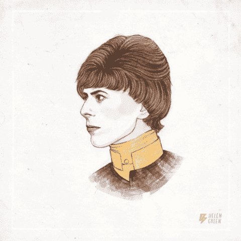
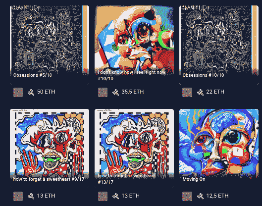
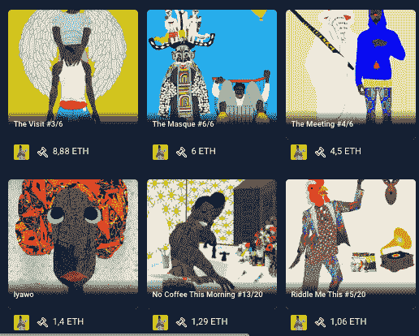
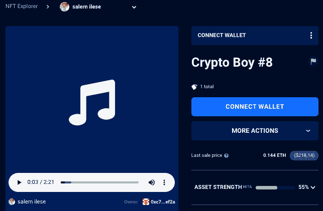

# OpenSea 上的 Bowie NFTs

> 原文：<https://web.archive.org/web/https://dappradar.com/blog/bowie-nfts-on-opensea>

## 开创性的魅力摇滚传奇在区块链永垂不朽。

9 月 13 日，一些世界领先的密码艺术家与大卫·鲍依遗产公司联手，将这位偶像的遗产带到了 OpenSea。该系列名为“区块链上的鲍伊” **，由创意执行官兼艺术家经理安德鲁·d·凯勒(Andrew D. Keller)和华金·阿克里奇(Joaquin Acrich)的 Web3 公司“我们热爱艺术”领导。**

大卫·鲍依是有史以来最具影响力和开创性的音乐艺术家之一。他的遗产超越了音乐，极大地影响了流行文化。透露后，NFT 的销售将展出鲍伊启发的原创作品，由 FEWOCiOUS，Glam Beckett，Defaced，乔纳森·沃尔夫，杰克，Lirona，PussyRiot 的 Nadya Tolokonnikova，Osinachi 和 Young & Slick。

使用 NFT 探索者查看市场上最热门的 NFT 系列！

[<picture></picture>](https://web.archive.org/web/20221004020425/https://dappradar.com/hub/nft-explorer)

**Source:** David Bowie GIF by [Helen Green](https://web.archive.org/web/20221004020425/https://helengreenillustration.com/filter/v/David-Bowie) GIPHY

鲍伊的遗孀伊曼是 CARE 的全球倡导者，这是一个人道主义组织，将从鲍伊的 NFT 系列销售中获得所有收益。这不是我们第一次看到音乐偶像将 NFT 用于慈善目的，[麦当娜](https://web.archive.org/web/20221004020425/https://dappradar.com/hub/wallet/eth/0x8ea95Bdc5cDddC0b7EbAd841F0c1f2cA6168b6a9)在 [OpenSea](https://web.archive.org/web/20221004020425/https://dappradar.com/multichain/marketplaces/opensea) 上推出了她的[创作之母 NFT 系列](https://web.archive.org/web/20221004020425/https://dappradar.com/blog/does-madonna-giving-birth-to-mechanical-centipedes-end-the-bear-market)，由[beepple](https://web.archive.org/web/20221004020425/https://dappradar.com/hub/wallet/eth/0xc6b0562605d35ee710138402b878ffe6f2e23807)制作，销售所得直接用于支持儿童的活动。

<https://web.archive.org/web/20221004020425im_/https://wp.dappradar.com/wp-content/uploads/2022/09/dappradar.com-bowie-nfts-on-opensea-untitled.mp4>

**Source:** The first NFT in the “Mother of Nature” collection on [OpenSea](https://web.archive.org/web/20221004020425/https://dappradar.com/multichain/marketplaces/opensea) 

## 鲍伊·NFT 系列背后的艺术家是谁？

即将推出的系列被认为是独一无二的，因为它将是几位艺术家创作过程的结果，每一位艺术家都有自己独特的风格。其中最著名的名字是维克多·朗罗伊，他更为人所知的名字是 [FEWOCiOUS](https://web.archive.org/web/20221004020425/https://dappradar.com/hub/nft-explorer/collection/fewocious) ，一位年轻的酷儿数码艺术家，用艺术作为一种替代的日志形式，以及一种在一个不支持他的家庭中成长的方式。

[<picture></picture>](https://web.archive.org/web/20221004020425/https://dappradar.com/hub/nft-explorer/collection/fewocious)

另一个有趣的名字是 [Osinachi。](https://web.archive.org/web/20221004020425/https://dappradar.com/hub/nft-explorer/collection/osinachi-art)他是一位年轻成功的尼日利亚数字艺术家，也是第一位将其作品作为 NFT 作品在欧洲佳士得拍卖行进行数字拍卖的非洲艺术家。

[<picture></picture>](https://web.archive.org/web/20221004020425/https://dappradar.com/hub/nft-explorer/collection/osinachi-art)

## NFT 是如何改变音乐的？

创意人员和音乐人多年来一直抱怨财富分配不公。NFTs 可以将权力放回到创作者手中，大牌艺术家已经开始加入进来。[、阿姆](https://web.archive.org/web/20221004020425/https://dappradar.com/hub/wallet/eth/0x79f261f483b7cef4f995c1f8a0f46f88450423e3)、唐·迪亚波罗、Wkend、Aphex Twin、列昂之王、[史努比·道格、](https://web.archive.org/web/20221004020425/https://dappradar.com/hub/wallet/eth/0xce90a7949bb78892f159f428d0dc23a8e3584d75)等等已经首映了他们自己的 [NFT 系列](https://web.archive.org/web/20221004020425/https://dappradar.com/hub/nft-explorer?search=Young%2520%2526%2520S)，而且[名单还在继续增长](https://web.archive.org/web/20221004020425/https://dappradar.com/nft)。

## 慈善和音乐 NFTs

通过 NFTs 的慈善事业可以以多种方式进行。Pussy Riot 的 Nadya Tolokonnikova 也是参与鲍伊·NFT 收藏的艺术家之一，他创建了一个分散的组织 [UkraineDAO](https://web.archive.org/web/20221004020425/https://dappradar.com/hub/assets/eth/0xbde011221b42426b96fecedabb46090301e5047a/1) 来帮助乌克兰战争的受害者。

Tolokonnikova 还合作了 Salem Ilese 的 NFT 下降“加密男孩”，作为 NFT 支持妇女的生殖自由。它在 NFT 音乐市场上展示了她的作品。

[<picture></picture>](https://web.archive.org/web/20221004020425/https://dappradar.com/hub/assets/eth/0x1237d87468dc6f31f5043cc28313de95db89229c/340282366920938463463374607431768211464)

## 随身携带您的 Web3 之旅

有了 DappRadar 移动应用程序，再也不要错过 Web3。查看最受欢迎的 dapps 的性能，并关注您投资组合中的 NFT。您在 DappRadar 上的帐户与我们的移动应用程序同步，很快您就可以选择实时接收提醒！

[<picture></picture>](https://web.archive.org/web/20221004020425/https://play.google.com/store/apps/details?id=com.portfolio.dappradar)[Download for Android](https://web.archive.org/web/20221004020425/https://play.google.com/store/apps/details?id=com.portfolio.dappradar)