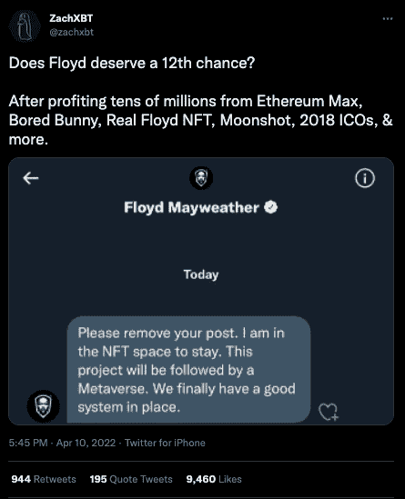
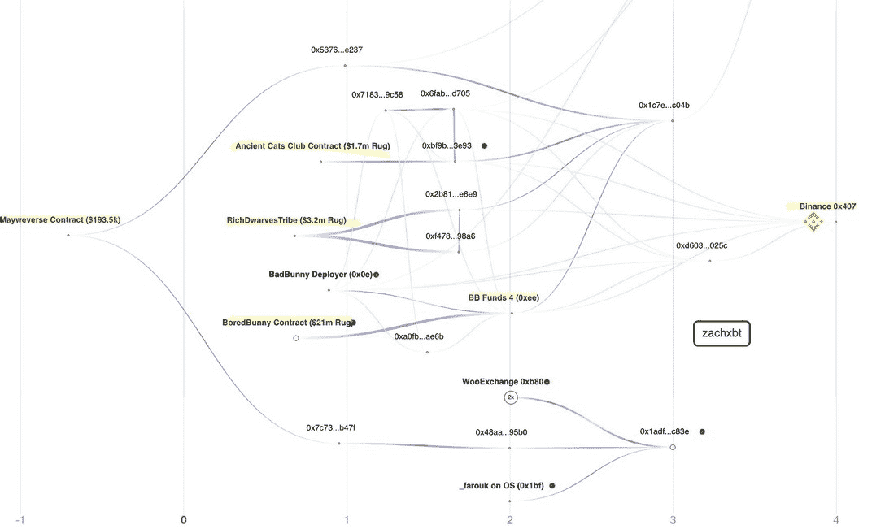
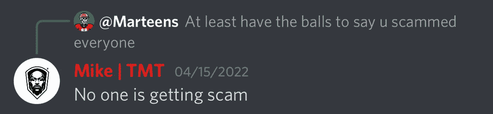
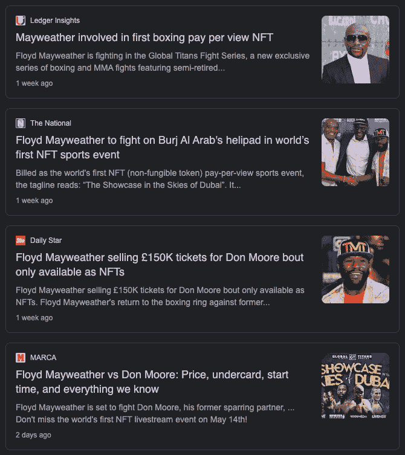

# 拳击传奇弗洛伊德·梅威瑟再次宣传 NFT 骗局

> 原文：<https://web.archive.org/web/https://dappradar.com/blog/boxing-legend-floyd-mayweather-promotes-nft-scam-again>

## 梅威瑟有 NFT 拉地毯游戏的前科

拳击传奇人物弗洛伊德·梅威瑟再次被抓到在他的社交媒体渠道上推广一个骗局 NFT 项目。一些投资者仍然不知道他的古怪行为，因为他的新项目 Mayweverse 背后的匿名团队已经带着近 20 万美元的收益消失了。

梅威瑟在 [NFT 拉地毯游戏](/web/20221007192016/https://dappradar.com/blog/auction-house-sothebys-rugged-by-cryptopunk-collector/)中有前科，曾借用他的名字并从以太坊 Max、无聊兔子、皇家弗洛伊德 NFT、Moonshot 等项目中获利数千万。所有这些现在都有接近于零的值，自 mint 以来没有来自开发团队的更新。他的最新项目 Mayverse 于 4 月 13 日启动，仅筹集了不到 20 万美元。开发团队现在已经带着钱消失了，让梅威瑟再一次推广非常不可靠的项目。

有一种观点认为，弗洛伊德·梅威瑟不知何故被骗支持了这些项目。也许他对 NFT 空间的了解很少？然而，他重复行为的本质表明并非如此。另一件要记住的事情是，在任何运动中，梅威瑟是有史以来最赚钱的付费节目之一。

## 许多痛苦和球迷空手而归

Twitter 观察员 ZachXBT 一头扎了进去，收到了梅威瑟发来的一条私人信息，如上图所示，他将最新出轨事件背后的开发团队与另外三起丑闻联系了起来。事情是这样的。

4 月 21 日，就在铸币 8 天后，Mayweverse NFT 汇款的收入被转移到了两个钱包里。区块链侦探 willing 在推特上提供的图表显示了资金的流向。有趣的是，梅威瑟支持的其他项目中牵连的一些相同的钱包出现了。

造币厂结束后，拥有超过 16000 名粉丝的 Mayweverse[的官方推特页面](https://web.archive.org/web/20221007192016/https://twitter.com/Mayweverse)[发布了一条推特](https://web.archive.org/web/20221007192016/https://twitter.com/Mayweverse)。他们要求人们加入 Discord 频道以获得进一步的更新，并表示大揭露将很快发生。值得一提的是，这是该账户发出的最后一条推文。

转到官方的不和，我们看到更多的痛苦，因为[成员反复要求更新](https://web.archive.org/web/20221007192016/https://twitter.com/zachxbt/status/1522222309943267329/photo/2)没有回应。一些持有者也有权获得签名手套，而两名持有者应该赢得 5 月 14 日弗洛伊德即将到来的比赛的全包旅行，但没有消息。然而，梅威瑟回应了一些人的愤怒消息，称他们没有被骗。这个回复的简单措辞似乎表明在键盘后面的不是梅威瑟，而是 T2。

在推出 [Mayweverse](https://web.archive.org/web/20221007192016/https://twitter.com/Mayweverse) 之前，这位半退休的拳击手删除了他所有关于另一个 NFT 项目 [RealFloydNFT](https://web.archive.org/web/20221007192016/https://twitter.com/RealFloydNFT) 的推文。他之前放弃了这个项目。令人惊讶的是，该项目的团队[甚至不知道关于 Mayweverse 的](https://web.archive.org/web/20221007192016/https://twitter.com/zachxbt/status/1522222342029688832/photo/1)。

## 弗洛伊德翻转了剧本

在这一切之中，如果你现在搜索弗洛伊德·梅威瑟的 NFT 新闻，许多人会惊讶地发现他并没有保持低调。一点也不，因为他将主要参与为半退役标志性运动员举办的一系列高调活动，将 NFT 作为门票和奖励工具。弗洛伊德·梅威瑟正在参加全球泰坦格斗系列赛，这是一个新的拳击和 MMA 格斗系列赛，以半退休的图标为特色。该项目的 NFTs 专家来自 MintGate，该公司还与 Bored Ape 游艇俱乐部合作。

门票将通过 [NFT 市场 Rarible](https://web.archive.org/web/20221007192016/https://dappradar.com/multichain/marketplaces/rarible) 购买，并以 NFTs 的形式出售，从而提供一个在线平台，持票者可以在那里找到独家内容并观看比赛的直播。该项目还希望通过收集门票作为 NFT 来构建一个奖励计划。这大概是两个幸运的 Mayweverse NFT 持有者应该获得的战斗。祝下次好运。

## 我们学到了什么

任何成长阶段都伴随着炒作。随着炒作而来的是机会主义者，在他们的背后，我们发现在一个每周媒体头条都充斥着 NFT 百万美元销售额的世界里，热切的参与者。对一些人来说，潜在的盈利甚至致富的机会实在是太大了，难以抗拒。

事实证明，名人代言是一个危险的工具，被项目用来吸引人们，同时利用个人品牌的力量。可以说，人们是根据倡导者来判断项目的。梅威瑟的案例表明，虽然我们中的一些人对他的前科了如指掌，但其他人却不知道。

这进一步证明，尽管 Web3 令人兴奋且充满机遇，但它也伴随着新进入者不应低估的相关风险。此外，当前的非正规教育氛围比 12 个月前更有教养。这里有更多的教育和指导内容，以及多种分析 NFT 市场、销售和前景的工具[。此外，](https://web.archive.org/web/20221007192016/https://dappradar.com/nft)[以太坊在这个炒作周期的大部分时间里主导了 NFT 的景观](/web/20221007192016/https://dappradar.com/blog/dapp-industry-report-april-2022/)，[但数据显示](/web/20221007192016/https://dappradar.com/blog/magic-eden-solana-help-get-nfts-back-on-track/)更多的泡沫可能正在其他网络上形成。

NFT 主要参与者宇迦实验室最近的善举为其最近的[另一边土地销售退还了数百万失败的天然气交易费，为其他认真对待长寿的项目提供了一个基准。与此同时，对土地购买者的强制性 KYC 程序表明他们愿意在监管框架内工作。它们再次为其他项目在未来如何吸引眼球奠定了基础。](/web/20221007192016/https://dappradar.com/blog/otherside-bored-ape-top-nft-sales/)

 NewsletterUnsubscribe at any time. [T&Cs](https://web.archive.org/web/20221007192016/https://dappradar.com/terms) and [Privacy Policy](https://web.archive.org/web/20221007192016/https://dappradar.com/privacy-policy)

***以上不构成投资建议。此处给出的信息仅供参考。请行使尽职调查，做你的研究。作者持有多种加密货币的头寸，包括 BTC、瑞士法郎和雷达。***