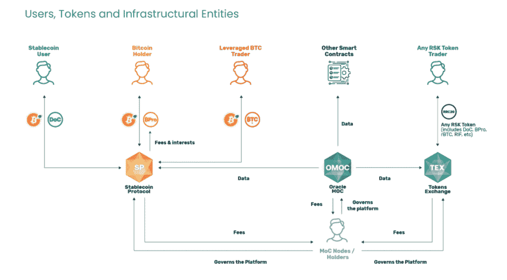
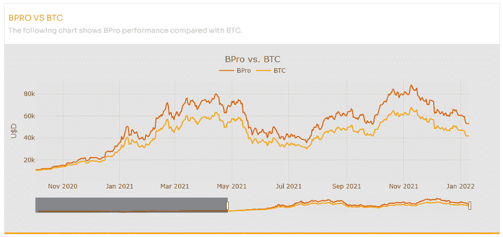
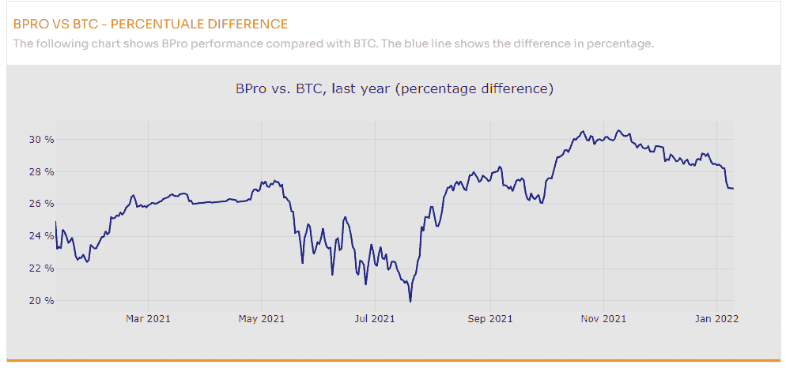

# 认识一下 BPro，这个比特币代币让你获得被动收入

> 原文：<https://web.archive.org/web/https://dappradar.com/blog/bpro-bitcoin-token-earns-passive-income-rsk-blockchain-money-on-chain>

## RSK 区块链链币生态系统的部分资金

**Money on Chain 是 RSK 区块链之上的一个强大的 DeFi 协议，它允许在没有交易对手风险的情况下使用比特币进行分散金融，BPro 是其中的一部分。这种令牌在过去两年中持续胜过比特币，这是一种 HODL 和收入令牌，允许用户提高比特币的性能，同时保留对其私钥的完全控制权。**

Money on Chain 完全是为了将比特币带入主流，让比特币持有者赚取头寸租金，获得自由杠杆。这一切都是为了给比特币生态系统带来 DeFi。[金钱链](https://web.archive.org/web/20221209061331/https://moneyonchain.com/)建立在 RSK 之上，这是一个基于比特币区块链之上的 EVM 兼容的第二层解决方案。更重要的是，它已经证明了自己是比特币之上的一个强大的 DeFi 生态系统，经受住了极端的市场形势，如 2020 年 3 月 20 日的 BTC 闪电崩盘。

在 Chain 上写钱的时候，stablecoin 生态系统的 TVL 是 5650 万美元。这是一个提供 DoC stablecoin、杠杆机制和 hodl 令牌的生态系统，所有这些都由比特币支持。hodl 令牌被称为 BPro，允许令牌持有者在完全控制其私钥的同时继续堆叠 sat。Money on Chain 可以抵抗审查，因为用户不需要遵守任何 KYC 程序。

[<picture></picture>](https://web.archive.org/web/20221209061331/https://moneyonchain.com/bpro-hodl-earn-token/)

## Hodl 和 earn

BPro 给用户的是被动收入结合自由杠杆，这使得 BPro 的价格增加，甚至更多，当比特币的价格上涨时。BPro 代币持有人也可以每天获得 MoC 代币，只需通过 [MoC 流动性挖掘计划](https://web.archive.org/web/20221209061331/http://www.moneyonchain.com/liquiditymining)持有代币即可。因为用户对他们的资产拥有完全的所有权，他们可以随时切换回 BTC。只需兑现智能合约或在二级市场上出售代币。

[链上的钱和他们的 BPro 存在于 RSK 区块链](https://web.archive.org/web/20221209061331/https://alpha.moneyonchain.com/)。这个生态系统是 EVM 兼容的，因此你可以简单地使用 Metamask 与 RSK dapp 互动。

BPro 生态系统的设计方式使其始终优于比特币(BTC)，历史表现为+26.6%，在上一次牛市中的峰值为+30%。BPro 的整个经济利用 RSK 区块链，这意味着所有的代币都是 ERC20 代币。BPro 有三种方式为令牌持有者创造价值:

1.  与美元挂钩的稳定货币 DoC 的持有者为 BPro 提供了杠杆，使 BPro 始终保持领先地位。
2.  它通过 rBTC 赚取收入，rBTC 是与比特币挂钩的 RSK 版 BTC。这来自从事 BTC 杠杆操作的交易员。BTCx(杠杆化比特币持有头寸)支付的利息 100%进入 BPro，为代币增值。
3.  第三，BPro 从连锁(MOC)协议费用中获得一份收入。用户支付费用的 20%进入 BPro，例如用于发行或赎回 BPro 令牌。BPro 向 Chain 支付其价值的 0.25%，每周扣除。

Source: Money on Chain

## BPro 历史上表现优于比特币

将他们的 BTC 移动到 RSK 区块链的用户已经收到 r BTC。然后他们需要将 rBTC 换成 BPro。BPro 带来的额外效用和利益创造了更多价值。那些这样做的人，历史上看到他们的持有量在比特币利润的基础上增加了 26.6%。

尽管 BPro 和 BTC 一起行动，BPro 对 BTC 的优势并不总是一样的。在 20%和 30%之间有波动，在 BTC 之上的 26%似乎是标准。这强调了人们看到了持有 BPro 和赚取被动收入的价值，但也表明市场趋势影响需求，就像任何其他令牌一样。

## 将 RSK 添加到元蒙版

那些对链上的钱和 BPro 令牌感兴趣的人需要熟悉 RSK。开始使用 RSK 需要你有一个钱包。因为 RSK 是 EVM 兼容的，我们可以使用元掩码浏览器扩展。我们假设你已经有了，如果你没有请从官方网站:【http://metamask.io/】T2 或者按照[这个指南](https://web.archive.org/web/20221209061331/https://developers.rsk.co/guides/quickstart/browser/)安装。现在让我们继续，因为您已经在浏览器中安装了 Metamask。

*   网络名称:RSK 主网
*   RPC URL:https://public-node.rsk.co
*   链条编号:30
*   象征:RBTC
*   街区探险家:[https://explorer.rsk.co](https://web.archive.org/web/20221209061331/https://explorer.rsk.co/)

您还可以使用 RIF (RSK 基础设施框架)的这款工具轻松地将 RSK 网络上的自定义令牌添加到您的元掩码钱包中:[https://metamask-landing.rifos.org/](https://web.archive.org/web/20221209061331/https://metamask-landing.rifos.org/)

现在你已经准备好与 RSK 互动，并使用链上的[钱。你也可以](https://web.archive.org/web/20221209061331/https://dappradar.com/rsk/defi/money-on-chain)[在这里](https://web.archive.org/web/20221209061331/https://dappradar.com/blog/tag/rsk)了解更多关于 RSK 的信息，或者在[的 DappRadar 排名](https://web.archive.org/web/20221209061331/https://dappradar.com/rankings/protocol/rsk)中深入更广阔的 RSK 生态系统。