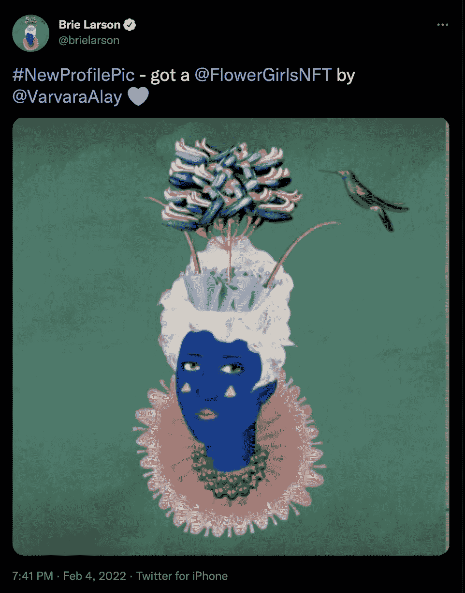

# 布丽·拉尔森以花童购买加入 NFT 空间

> 原文：<https://web.archive.org/web/https://dappradar.com/blog/brie-larson-joins-the-nft-space-with-flower-girls-purchase>

## 这位女演员专注于女性主题系列

因饰演惊奇队长而出名的布丽·拉尔森，也加入了这股跳上 NFT 炒作列车的名人浪潮。这位女演员最近宣布她现在是花童社区的一员。

拉森几天前以 0.725 ETH，或大约 2200 美元购买了 424 号花童。自从[官方宣布](https://web.archive.org/web/20221215001752/https://twitter.com/brielarson/status/1489655405084954625?s=21)，卖花女#424 已经被转移到一个不同的钱包。然而，最初购买它的帐户在 OpenSea 上被称为 Briethereum。布里塞勒姆还举办了两场[花童艺术节](https://web.archive.org/web/20221215001752/https://dappradar.com/hub/wallet/eth/0x421f5f9b1fe219f0b27e7d827ee0c2ebb98ba975/nfts/1/the-flower-girls)。

此外，[布丽·拉尔森](https://web.archive.org/web/20221215001752/https://dappradar.com/hub/wallet/eth/0x421f5f9b1fe219f0b27e7d827ee0c2ebb98ba975/nfts)似乎将重点放在以女性为中心的系列上。除了卖花女，拉森还拥有一辆[妇女与武器 NFT](https://web.archive.org/web/20221215001752/https://dappradar.com/hub/wallet/eth/0x421f5f9b1fe219f0b27e7d827ee0c2ebb98ba975/nfts/1/women-and-weapons) 和一辆 [1989 姐妹 NFT](https://web.archive.org/web/20221215001752/https://dappradar.com/hub/wallet/eth/0x421f5f9b1fe219f0b27e7d827ee0c2ebb98ba975/nfts/1/1-989-sisters) 。

在撰写本文时，[布丽·拉尔森的 NFT 投资组合](https://web.archive.org/web/20221215001752/https://dappradar.com/hub/wallet/eth/0x421f5f9b1fe219f0b27e7d827ee0c2ebb98ba975/nfts/1)价值约 13.000 美元。然而，由于她现在透露了对这一领域的兴趣，我们希望看到她的 NFT 投资组合在规模和价值上有所增长。

## 布丽·拉尔森没有使用月工资

有趣的是，布丽·拉尔森自己购买了 NFT。与她的许多名人同事不同，拉森没有求助于加密礼宾公司的服务。例如，[格温妮丝·帕特洛](https://web.archive.org/web/20221215001752/https://dappradar.com/blog/eva-longoria-and-gwyneth-paltrow-enter-the-nft-space/)和[吉米·法伦](https://web.archive.org/web/20221215001752/https://dappradar.com/blog/bored-apes-talk-of-the-town-celebrities-join-hype/)认为在 Moonpay 的帮助下进入 NFT 空间更好。

然而，布丽·拉尔森是直接从她的私人钱包里购物的。这是一个好迹象，因为它表明越来越多的名人愿意深入这个领域，了解 NFT 交易是如何运作的。此外，拉森亲自参与购买表明她真的相信她所购买的项目。

DappRadar 将继续关注布丽·拉尔森的 NFT 冒险，你也可以通过方便的[名人钱包](https://web.archive.org/web/20221215001752/https://dappradar.com/blog/celebrity-wallets-a-dive-into-crypto-hollywood)页面做到这一点。浏览已验证的名人钱包列表，看看贵宾们收集了什么。你也可以去投资组合跟踪器，看看你自己的钱包或者跟踪[布丽·拉尔森的钱包](https://web.archive.org/web/20221215001752/https://dappradar.com/hub/wallet/eth/0x421f5f9b1fe219f0b27e7d827ee0c2ebb98ba975)。

此外，你可以在 Twitter 上关注 DappRadar，了解最新的 NFT 名人新闻，并加入我们的 T2 不和社区。

 NewsletterUnsubscribe at any time. [T&Cs](https://web.archive.org/web/20221215001752/https://dappradar.com/terms) and [Privacy Policy](https://web.archive.org/web/20221215001752/https://dappradar.com/privacy-policy)