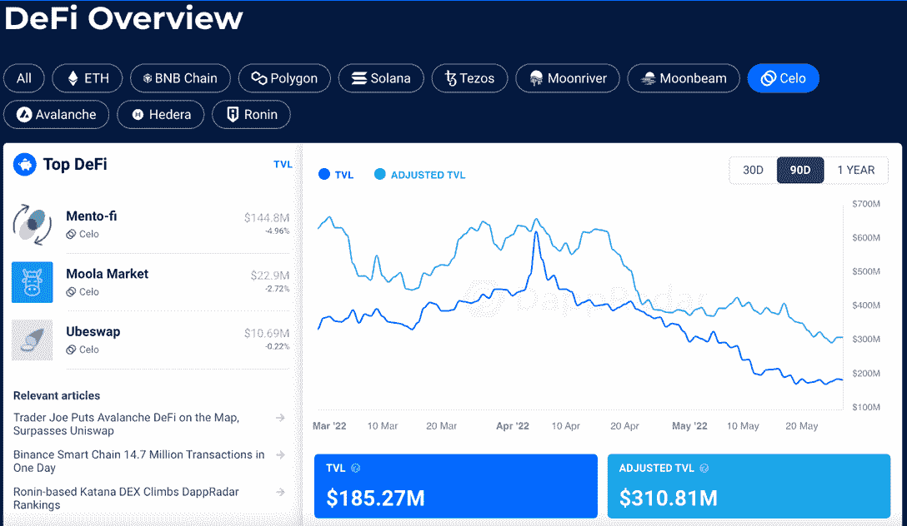
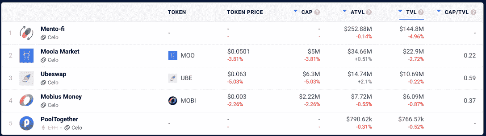
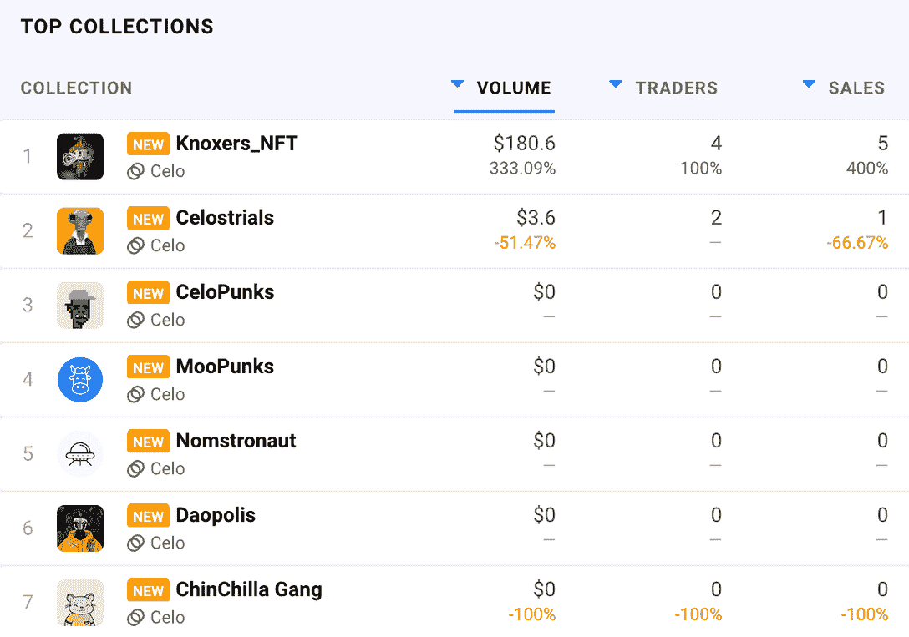

# 在 Celo 上浏览 NFT 收藏和 DeFi TVL 数据

> 原文：<https://web.archive.org/web/https://dappradar.com/blog/browse-through-nft-collections-and-defi-tvl-data-on-celo>

## DappRadar 现在跟踪 Celo 区块链号上的全套 dapps

**DappRadar 在 Celo 区块链的 DeFi dapps 上增加了总值锁定(TVL)的跟踪功能。此外，用户现在还可以在 Celo 上浏览 NFT 的收藏、市场和顶级销售。这有助于您更好地了解网络上的 DeFi 情况**。**此外，它让你深入了解最热门的 NFT 时装系列的表现。**

Celo 在更广泛的 DappRadar 生态系统中的更深入整合将 [DeFi dapps](https://web.archive.org/web/20220630215158/https://dappradar.com/rankings/protocol/celo/category/defi) 和 [NFT 系列](https://web.archive.org/web/20220630215158/https://dappradar.com/nft)置于聚光灯下。现在用户可以从七个区块链中[分析 TVL，包括 Celo。](https://web.archive.org/web/20220630215158/https://dappradar.com/defi/protocol/celo)

## Celo 上的 DeFi TVL 数据

锁定总价值或 TVL 是 DeFi 领域最重要的指标之一。它让用户更好地了解在任何给定的网络上锁定了多少资金。了解链条上锁定的美元价值可以让用户得出更明智的结论，做出更好的决策。

在撰写本文时，DappRadar 跟踪 Celo 上的五个专用 DeFi dapps，您可以在这里找到。TVL 反映了有多少价值被注入 DeFi dapps，也可以表明他们的受欢迎程度和整体吸引力。在 DeFi 排名中，用户现在可以分析 TVL、本地令牌并更详细地探索 Celo dapps。

## Celo NFTs 和市场

除了增强的 DeFi 分析之外，DappRadar 现在还提供了对 Celo 上的 NFT 生态系统的深入研究。随着 NFTs 在 2021 年崛起，更多的收藏和项目探索替代链。Celo 拥有一个不断发展的 NFT 项目和市场生态系统。

通过新的集成，用户可以浏览所有基于 Celo 的 NFT 项目、过去 24 小时、7 天和 30 天内 NFT 销售额最高的项目，以及表现最佳的 NFT 市场。你可以在这里找到所有这些信息。

NFT 排名页面向用户提供了与任何给定项目互动的交易者数量、吸引的交易量以及登记的销售数量等信息。

DappRadar 在过去的 24 个月里有了巨大的发展，从一个跟踪少数几个网络和他们的 Dapp 的网站发展到全球的 Dapp 商店。我们向世界介绍了我们的 RADAR token，这是一个具有不断扩展的功能、token swap 和 explorer 的投资组合管理器，而且还具有深入的 NFT、DeFi 和 TVL 跟踪功能。此外，DappRadar 还提供行业领先的评估工具和报告，帮助[进一步指导社区](https://web.archive.org/web/20220630215158/https://dappradar.com/token/governance)。

随着我们继续建设未来的 dapp 商店，我们邀请社区参与、贡献并与我们一起建设[它](https://web.archive.org/web/20220630215158/https://dappradar.com/token/governance)。

 NewsletterUnsubscribe at any time. [T&Cs](https://web.archive.org/web/20220630215158/https://dappradar.com/terms) and [Privacy Policy](https://web.archive.org/web/20220630215158/https://dappradar.com/privacy-policy)