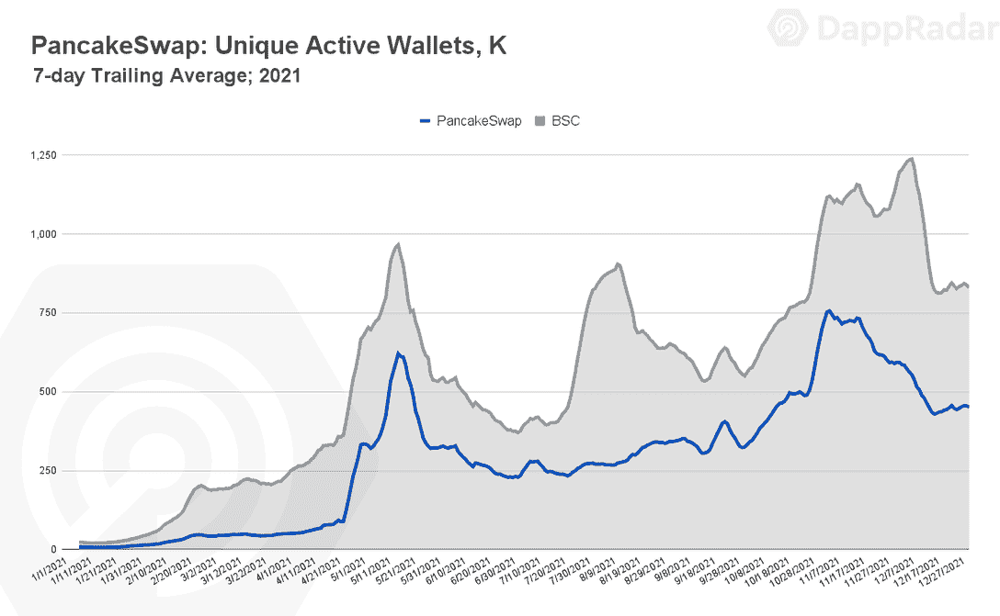
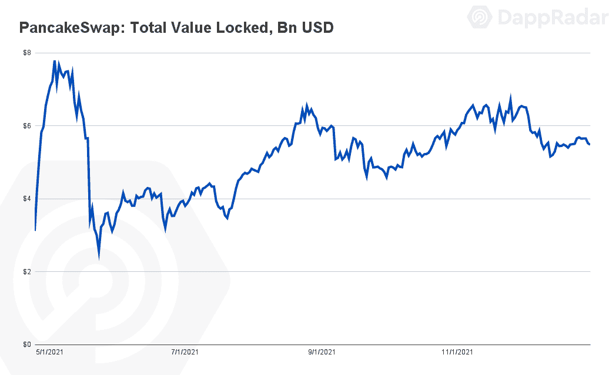
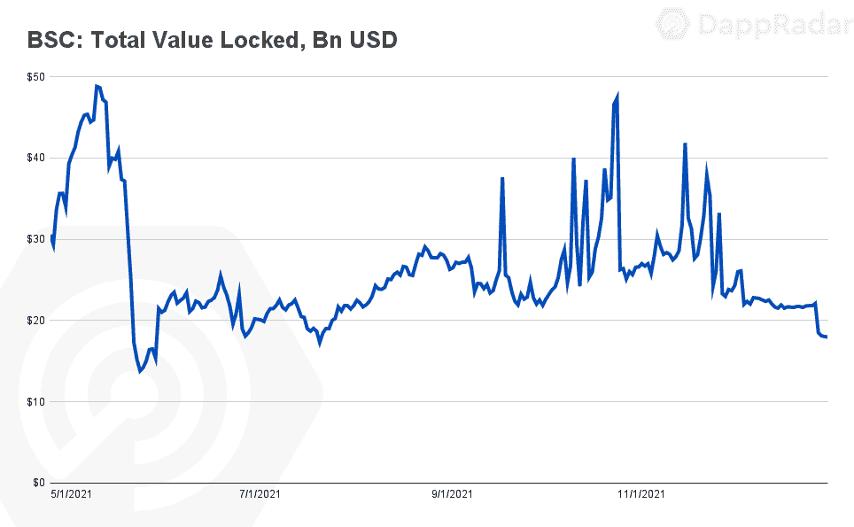
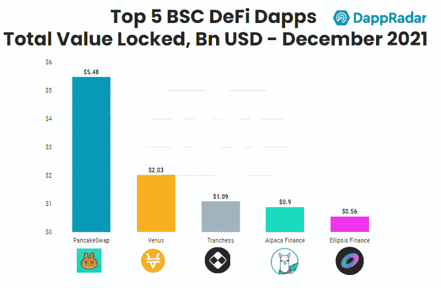
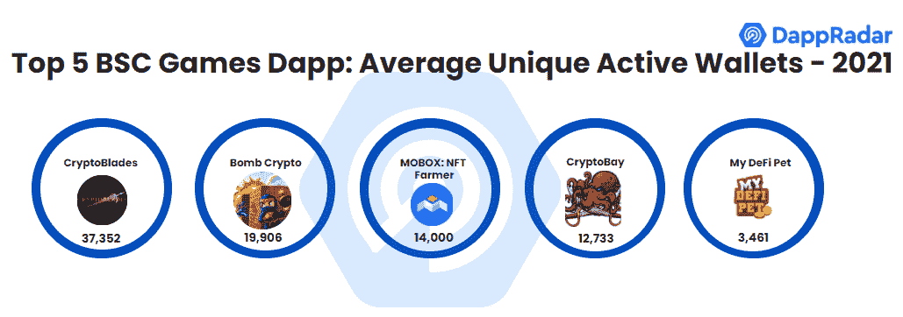
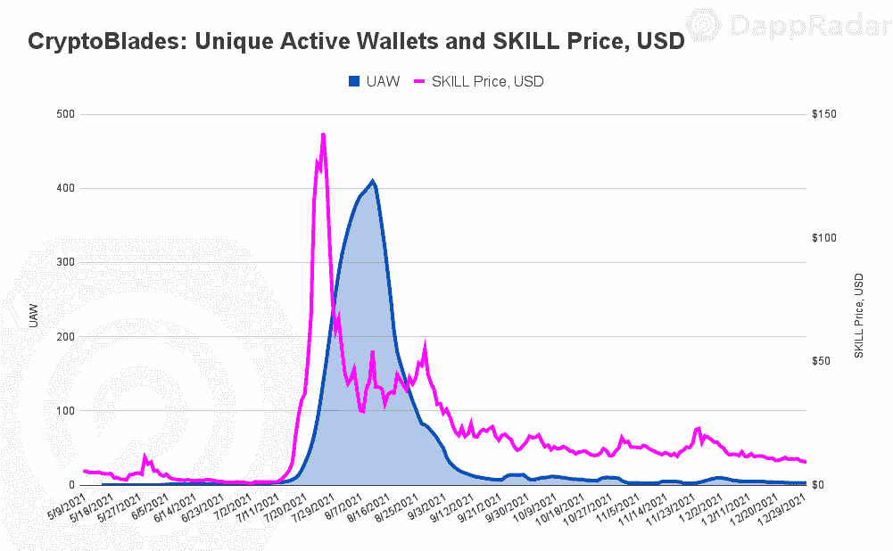
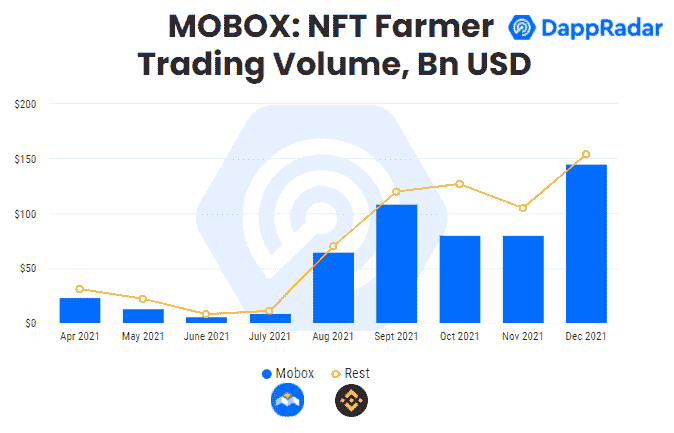
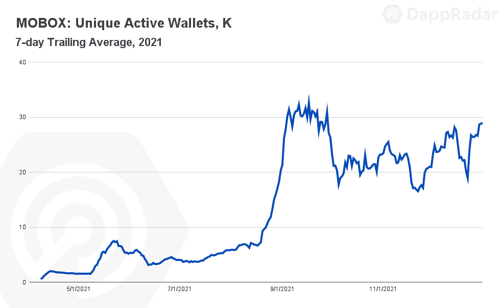

# 2021 年平衡计分卡报告——一年回顾

> 原文：<https://web.archive.org/web/https://dappradar.com/blog/bsc-report-2021-a-year-in-review>

## BSC 使自己成为表现最好的区块链之一

**去年是该行业的关键时期，DeFi、NFTs 和 Games 展示了他们的真正潜力，在各自的指标上达到了历史最高水平。DeFi 发现智能合约锁定的价值比以往任何时候都多，NFT 交易量飙升，游戏成为最活跃的产品类别。尽管目前市场低迷，但 2021 年对整个行业和币安智能链来说都是不平凡的一年。**

2021 年，平均每天有超过 50 万个独立活动钱包(UAW) [连接到 BSC dapp](https://web.archive.org/web/20230117190725/https://dappradar.com/rankings/protocol/binance-smart-chain) ，这一数字随着时间的推移而显著增长。币安智能链负责 35%的 dapp 活动，这要归功于完整的 DeFi dapps 套件以及网络内游戏类别的最终崛起。就 DeFi 而言，BSC 巩固了其作为第二大区块链的地位(以锁定的总价值计)(TVL)。

此外，BSC 事实上的自动做市商 [PancakeSwap](https://web.archive.org/web/20230117190725/https://dappradar.com/binance-smart-chain/defi/pancakeswap) 成为业内基于链上活动使用最多的 dapp，年底有超过 546，000 个日常钱包连接到 dapp。同样， [Mobox 巩固了作为一个可靠的 GameFi 参考](https://web.archive.org/web/20230117190725/https://dappradar.com/binance-smart-chain/games/mobox-nft-farmer)，成为基于玩家数量的[十大区块链游戏](https://web.archive.org/web/20230117190725/https://dappradar.com/rankings/category/games)。

## 关键要点

*   941，000 UAW 在第四季度连接到 BSC2021 年 35%的区块链钱包与网络互动
*   PancakeSwap 成为业内使用最多的 dappDeFi dapp 在第四季度平均每天吸引超过 500，000 UAW，在 TVL 达到 54.8 亿美元，相当于网络指标的 35%，约为行业的 2%
*   游戏的重要性在 BSC 上显著增长，占网络活动的 20%；GameFi 和游戏赚钱 dapps Mobox 和 BombCrypto 成为玩家数量排名前十的区块链游戏
*   Mobox 已成为业内最受欢迎的游戏之一，GameFi dapp 在第四季度平均每天吸引超过 27，000 个 UAW，同时在 NFT 创造了 5.31 亿美元的销售额。

## 目录

*   [2021 年 35%的区块链钱包与 BSC 互动](https://web.archive.org/web/20230117190725/https://dappradar.com/blog/bsc-report-2021-a-year-in-review/#35%-of-blockchain-wallets-interacted-with-BSC-in-2021)
*   [PancakeSwap——BSC 皇冠上的宝石](https://web.archive.org/web/20230117190725/https://dappradar.com/blog/bsc-report-2021-a-year-in-review/#PancakeSwap---BSC's-crown-jewel)
*   [2021 年，BSC 的 DeFi dapps 在 TVL 持有 180 亿美元](https://web.archive.org/web/20230117190725/https://dappradar.com/blog/bsc-report-2021-a-year-in-review/#BSC’s-DeFi-dapps-held-$18B-in-TVL-in-2021)
*   [GameFi dapps 推进 BSC 的游戏场景](https://web.archive.org/web/20230117190725/https://dappradar.com/blog/bsc-report-2021-a-year-in-review/#GameFi-dapps-propel-BSC's-game-scene)
*   一个成熟的 GameFi 玩家
*   [NFT 空间的提升空间](https://web.archive.org/web/20230117190725/http://room-for-improvement-in-the-nft-space/)
*   [前方道路](https://web.archive.org/web/20230117190725/https://dappradar.com/blog/bsc-report-2021-a-year-in-review/#Road-ahead)

## 2021 年 35%的区块链钱包与 BSC 互动

币安智能连锁在 2021 年整体表现稳健。从使用情况来看，BSC 每个季度的受众都在不断增加。去年平均每天约有 536，000 UAW 连接到 BSC dapp，占该行业活动的 35%。BSC 设法与不断扩大的 dapp 行业保持同步，因为在第四季度，该网络平均每日 UAW 达到 941，000，保持了其在该行业三分之一以上钱包中的主导地位。

在这一年的大部分时间里，DeFi dapps 在币安品牌的区块链占据了主导地位。在 2021 年，大约 75%的网络活动源自这一类别，落后于 PancakeSwap、 [Venus](https://web.archive.org/web/20230117190725/https://dappradar.com/binance-smart-chain/defi/venus) 和 [ApeSwap](https://web.archive.org/web/20230117190725/https://dappradar.com/binance-smart-chain/defi/apeswap) 等 dapps。同样，随着时间的推移，游戏的存在变得越来越明显。[游戏 dapps](https://web.archive.org/web/20230117190725/https://dappradar.com/rankings/protocol/binance-smart-chain/category/games) 在 2021 年平均贡献了 BSC 20%的使用量，在第四季度增长到 25%。这些活动趋势与行业基准一致，其中游戏类别产生了 52%的 dapps 活动。

## PancakeSwap–BSC 皇冠上的宝石

毫无疑问，PancakeSwap 是 BSC 生态系统中最重要的贡献者。根据链上活动，AMM 在 2021 年成为全行业使用最多的 dapp。去年全年，平均每天约有 288，000 UAW 人连接到 DeFi dapp，11 月达到 671，000 UAW 的峰值。 [PancakeSwap 催化了超过一半的网络活动](https://web.archive.org/web/20230117190725/https://dappradar.com/binance-smart-chain/defi/pancakeswap)，对 BSC 在 DeFi 领域的地位至关重要。

就 TVL 而言，PancakeSwap 还领导着 BSC 生态系统。DeFi dapp 截止 2021 年锁定了 54.8 亿美元，相当于网络指标的 35%，约为行业 TVL 的 2%。

除了其 DeFi 功能(包括大量的农业代币和自动复利赌注池)之外， [PancakeSwap 还在其平台中集成了 NFTs](/web/20230117190725/https://dappradar.com/blog/pancake-bunnies-storm-nft-charts/) 。dapp 推出了两个 NFT 系列，煎饼兔子和 PancakeSwap，这两个系列在 2021 年[创造了超过 5000 万美元的销售额。尽管销量仍远低于 NFT 其他市场，但 BSC 领先的 dapp 仍有增长潜力。](/web/20230117190725/https://dappradar.com/blog/tag/pancake-bunnies/)

## 2021 年，BSC 的 DeFi dapps 在 TVL 持有 180 亿美元

就 TVL 而言，BSC 巩固为[第二大区块链，在这方面仅落后于以太坊。2021 年底，BSC 持有 180 亿美元，占行业总额的 11%。](https://web.archive.org/web/20230117190725/https://dappradar.com/defi/protocol/binance-smart-chain)

除了 PancakeSwap 之外，BSC 上的 DeFi 由不同的交换、聚合器和借贷协议表示。多链模式为 BSC 提供了所需的推动力，因为像[1 英寸](https://web.archive.org/web/20230117190725/https://dappradar.com/binance-smart-chain/defi/1inch-network)和[多链](https://web.archive.org/web/20230117190725/https://multichain.org/)这样的几个 dapps 将其功能扩展到了币安网络。同样，BSC 本地的 dapps 如 ApeSwap 和 [OpenOcean](https://web.archive.org/web/20230117190725/https://dappradar.com/multichain/defi/openocean) 也将其功能扩展到网络之外。

2021 年增长显著的一个 DeFi dapp 是[羊驼金融](https://web.archive.org/web/20230117190725/https://dappradar.com/binance-smart-chain/defi/alpaca-finance)，这是 BSC 上领先的杠杆和贷款协议之一。尽管没有令人瞠目结舌的用户指标(2021 年 12 月约为 5800 UAW)，羊驼队在年底的 TVL 方面是第三大 dapp，锁定了近 9 亿美元。羊驼这样的小动物证明 [BSC DeFi dapps 依赖于复杂的特征](https://web.archive.org/web/20230117190725/https://dappradar.com/rankings/protocol/binance-smart-chain/category/defi)给有经验的交易者。

作为一个整体，DeFi 领域的竞争越来越激烈。新的 dapp 替代方案出现在[不同的协议中](https://web.archive.org/web/20230117190725/https://dappradar.com/rankings),为 DeFi 用户提供了多种选择来优化他们的资本。虽然 PancakeSwap 是一个明显的参照物，但今年看到羊驼、金星和 ApeSwap 等 dapps 的发展将是有趣的。

## GameFi dapps 推动 BSC 的游戏场景

BSC 上的[游戏类别在 2021 年大幅提升。去年推出的大量区块链游戏，提高了网络和整个行业的使用率。公平地说，2021 年，DeFi 或 GameFi 的游戏化成为币安品牌网络的重要组成部分。](https://web.archive.org/web/20230117190725/https://dappradar.com/rankings/protocol/binance-smart-chain/category/games)

几个 BSC dapps 在 BSC 的游戏场景中脱颖而出。GameFi dapp，Mobox ，巩固为网络生态系统中的顶级 dapp 之一。第二个是 [BombCrypto](/web/20230117190725/https://dappradar.com/blog/play-to-earn-bomb-crypto-blasts-its-way-to-top-of-the-charts/) ，这是一个玩到赚的 dapp 游戏，玩家通过战斗获得游戏的货币 BCOIN，并成为区块链最常玩的十大游戏之一。BombCrypto 于第四季度推出，在此期间平均每天吸引超过 21，900 次 UAW。值得关注的是，BombCrypto，一个区块链驱动的炸弹人克隆体，是否会成为游戏类别中真正的竞争者，并实现长期保留其玩家。

虽然特定的游戏 dapps 在币安网络中蓬勃发展，但其他人却没有获得同样程度的成功。去年引起整个行业关注的一款游戏 dapp 是 [CryptoBlades](/web/20230117190725/https://dappradar.com/blog/cryptoblades-shoot-past-half-a-million-active-wallets/) 。CryptoBlades 是 BSC 上推出的一款战斗游戏，玩家可以在 PVE 战斗中获得经验并获得游戏中的货币技能。玩家可以在同一个平台上下注他们的技能，增加 DeFi 组件。

在第三季度， [CryptoBlades 一度成为整个行业中仅次于 Axie Infinity 和 Alien Worlds 的三大热门游戏之一。8 月，游戏 dapp 达到顶峰，每天有超过 406，000 UAW 连接到游戏 dapp。然而，几周后，随着技能价值的急剧下降，游戏开始失去玩家。](/web/20230117190725/https://dappradar.com/blog/gamefi-platform-cryptoblades-makes-a-comeback/)

类似的情况也发生在了 CryptoBay 的身上，这是一款以玩为赚的 dapp 游戏，在 9 月份成为了第二大 BSC 游戏。CryptoBay 开始吸引成千上万的日常用户，直到该游戏的本地令牌珍珠的[价格暴跌。](/web/20230117190725/https://dappradar.com/blog/explained-cryptobays-pearl-token/)

总而言之，BSC 游戏为网络提供了一个最诱人的机会。第三大热门游戏《异形世界》在 BSC 中推出任务，推动了该链的活动，CryptoBlades 将试图在 2022 年征服其观众。如果 BombCrypto、[、X-World Games](/web/20230117190725/https://dappradar.com/blog/x-world-games-and-its-xwg-token/) 和其他公司可以跟随 Mobox 的步伐，BSC 将慢慢变得不那么依赖 DeFi，而更多地参与到游戏赚钱的叙事中。

## 一个成熟的游戏玩家

毫无疑问，Mobox 不仅成为币安网络中最成熟的游戏 dapp，而且成为 GameFi 趋势的恰当参照。 [Mobox 允许玩家下注流动性代币](/web/20230117190725/https://dappradar.com/blog/gamefi-platform-mobox-ends-year-with-a-bang/)以获得产量代币作为钥匙或 MBOX 形式的奖励。这些令牌可以解锁在 MOBOX 平台中用作游戏角色或赌注资产的 NFT。

在游戏机制中包含非功能性游戏对于当前非功能性游戏蓬勃发展的行业来说是个好兆头。作为一个市场，mobox 一直是 BSC 中疲软的 NFT 市场的亮点。Mobox NFTs 在 2021 年创收 5.31 亿美元，囤积了全网 79%的交易量。

此外，随着时间的推移，2021 年 Mobox 获得了更多的玩家，以平均每天 27，000 个 UAW 连接到 dapp 来结束这一年。截至发稿时，这一数字增长了 2%，表明 Mobox 在留住用户方面取得了成功。

与 PancakeSwap 一样，Mobox 可以被认为是币安生态系统中最重要的 dapps 之一。游戏 dapp 由 [MBOX](/web/20230117190725/https://dappradar.com/blog/binance-smart-chain-growing-as-play-to-earn-games-platform/) 管理，通过去中心化的力量给予社区对平台未来的发言权。此外，Mobox 正在围绕元宇宙的故事进行建设，这是为 GameFi dapp 描绘光明未来的另一个迹象。

## NFT 空间的改进空间

虽然 DeFi 和游戏在 2021 年蓬勃发展，但 BSC 上的 [NFTs 的性能在 Mobox 之外似乎停滞不前。尽管链上指标不包括币安市场的特色，没有一个市场真正产生了影响。](https://web.archive.org/web/20230117190725/https://dappradar.com/nft/protocol/binance-smart-chain) [BSC 全年在 NFT 的销售额为 6.7 亿美元，](https://web.archive.org/web/20230117190725/https://dappradar.com/nft/protocol/binance-smart-chain)如前所述，其中 80%来自 Mobox。

同行区块链的收藏品和游戏项目享有相当大的成功，创造了记录的数量。在某个时候， [BSC 将需要 NFTs 来支持其增长](https://web.archive.org/web/20230117190725/https://dappradar.com/nft/protocol/binance-smart-chain)。这种支持可能来自与 DeFi 的交集，羊驼、[面包店](/web/20230117190725/https://dappradar.com/blog/what-is-bakeryswap-and-how-does-it-work/)或 PancakeSwap 本身可能会引发该类别的兴趣。还有，NFTs 和游戏有本质的联系。

积极的一面是，BSC 并不缺乏选择。不同的 DeFi 和游戏 dapps 可以随时获得牵引力。此外，有可能出现一个新颖的市场，如 [Rarible](/web/20230117190725/https://dappradar.com/blog/rarible-moves-to-tezos-and-pushes-for-carbon-neutrality/) 或 [Hic-et Nunc](/web/20230117190725/https://dappradar.com/blog/hic-et-nunc-volume-shoots-up-as-xtz-increases-in-value/) ，它们可以抓住将于 2022 年进入 NFT 市场的观众。

## 前方道路

毫无疑问，BSC 在 2021 年取得了重大进展。该网络成为业内最常用的区块链之一，并在一套完整的定义应用程序的帮助下成为 TVL 的第二大协议。尽管如此，值得注意的是 DeFi 的竞争越来越激烈；看看 BSC 是否能在 TVL 排名中保持第二的位置，或者更好地挑战以太坊的 DeFi 统治地位，这将是很有趣的。

[在游戏类别中，](https://web.archive.org/web/20230117190725/https://dappradar.com/rankings/protocol/binance-smart-chain/category/games) BSC 的产品成为业内最完整的产品之一。本地游戏 dapps Mobox 和 BombCrypto 成为最受欢迎的区块链游戏。利用低交易费用和快速处理时间的优势，BSC 是举办区块链奥运会的可靠网络。

随着行业变得更加成熟，对等网络将争夺 TVL 和用户的份额。PancakeSwap 和 Mobox 等 Dapps 提供了重要的网络支持，但 NFTs 和 marketplaces 仍是有待改进的领域。BSC 在 2022 年如何发展将是一件有趣的事情。

 NewsletterUnsubscribe at any time. [T&Cs](https://web.archive.org/web/20230117190725/https://dappradar.com/terms) and [Privacy Policy](https://web.archive.org/web/20230117190725/https://dappradar.com/privacy-policy)