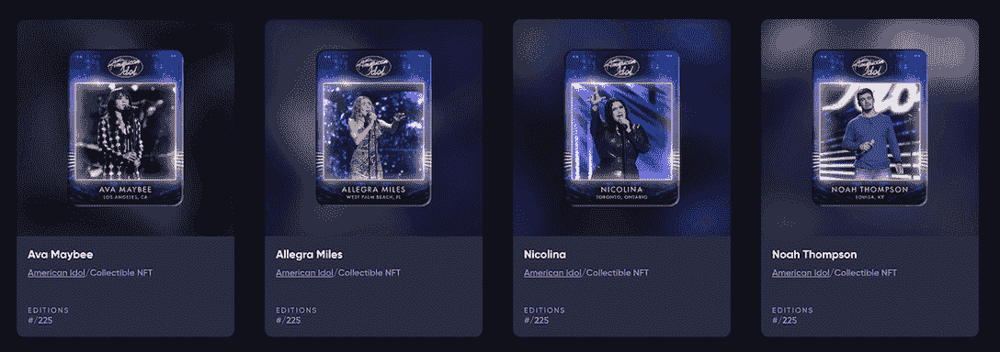

# 与西塔 NFT 建立强大的社区和粉丝基础

> 原文：<https://web.archive.org/web/https://dappradar.com/blog/build-a-strong-community-and-fan-base-with-theta-nft>

## Theta 网络是一个分散的视频流和传输网络

θNFT 旨在通过不可替代的代币实现更有吸引力和更有价值的互动，帮助品牌建立一个强大的社区。最近，西塔 NFT 与美国偶像合作，发布了该节目的第一个 NFT 系列。

**总结**

*   在娱乐业中，Theta NFTs 对社区建设特别有用。
*   西塔 NFT 可以为美国偶像的粉丝提供独特的观看节目的体验。
*   **随着 Web3 时代的到来，Theta NFTs 致力于帮助品牌将其社区建设提升到一个新的水平。**

社区建设已经成为现代社会中品牌吸引顾客的重要活动之一。在一个社区中，成员、客户或粉丝分享某些目标和价值观，或者只是崇拜同一个偶像。例如，一个社区可以是切尔西足球俱乐部的观众，K-Pop 组合 Black Pink 的粉丝群，或者是古驰的常客。

在 Web 2.0 的背景下，社区建设通过社交媒体管理进行。可惜这还是一个单向的互动，粉丝参与的可能性有限。但是在 Web3 时代，由于不可替代的令牌，事情发生了变化。NFTs 可以为品牌提供一种独特和吸引人的方式来与他们的追随者建立联系，并创造一种更具参与性的内容消费体验。

通过[提供强大的去中心化基础设施、工具和平台](https://web.archive.org/web/20221129150111/https://dappradar.com/blog/theta-network-an-essential-infrastructure-for-metaverse-video-technology)，Theta ( [THETA](https://web.archive.org/web/20221129150111/https://dappradar.com/hub/token/eth/THETA?from=0x3883f5e181fccaf8410fa61e12b59bad963fb645) )站在了商业社区的最前沿。最近，受欢迎的真人秀节目《美国偶像》与 Theta 合作推出了第一个 NFT 系列，以庆祝第 20 季。

## 西塔·NFT 让美国偶像的观众参与进来

Theta 是一家基础设施提供商，利用区块链技术创建了第一个分散式视频流和传输网络。经过多年的稳步发展，Theta 已经发展成为一个包罗万象的生态系统，Theta NFTs 在改变娱乐业务模式方面发挥着关键作用。

让我们看看 Theta 与美国偶像的合作关系，看看 Theta NFTa 如何帮助形成一个更加忠诚和参与的社区。

美国偶像在 Theta 网络上推出 NFT 作为选手的交易卡包。每包都随机挑选了第 20 季美国偶像前 14 名选手。

在《美国偶像 NFT》开播之前，粉丝参与节目的唯一方式就是观看。也许他们会发一条短信或推文，但仅此而已。然而，现在美国偶像选手的旅程可以与他们的粉丝联系在一起。美国偶像 NFTs 的持有者也将开始为期五周的比赛，他们的奖金取决于他们的 NFTs 上的参赛者能走多远。这创造了更加复杂的用户体验。

## 西塔 NFT 如何惠及品牌社区

多年来，媒体和娱乐业一直在尝试新的想法来提高其社区的参与度和忠诚度。Twitch 的小费机制和 Patreon 的订阅模式是两个成功的尝试。然而，在这些模式中缺少了一个社区应该提供的包容性。

有了θNFT，这个问题可以从根本上得到改善。Theta NFT 的使命是奖励粉丝为支持他们喜爱的品牌和内容而花费的所有时间甚至金钱。但是，更重要的是，它可以永久记录区块链上粉丝和社区成员的共同记忆和经历。

这就是为什么这么多有远见的大腕选择与 Theta 合作，为他们的粉丝策划互动社区体验。其中包括凯蒂佩里，狄昂·华薇克，世界扑克巡回赛，价格是正确的。

随着网络 3 时代的到来，品牌将面对更加成熟的受众，他们以目标为导向，追求价值。通过传统社交媒体进行社区管理不足以满足这些受众。Theta 邀请您更深入地了解社区的力量，这种力量正在破坏并潜在地培育娱乐企业、品牌和消费者更具参与性和互动性的生态系统的未来模式。

关于 Theta 的更多信息:

[网站](https://web.archive.org/web/20221129150111/https://www.thetatoken.org/)
[Theta.tv](https://web.archive.org/web/20221129150111/https://www.theta.tv/)
[不和](https://web.archive.org/web/20221129150111/https://discord.com/invite/vCXJd5YKDt)
[推特](https://web.archive.org/web/20221129150111/https://twitter.com/Theta_Network)